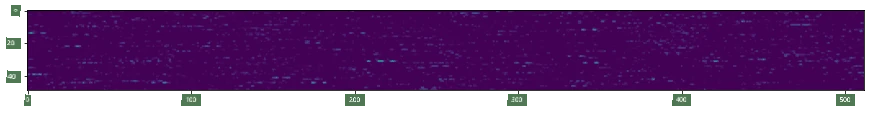
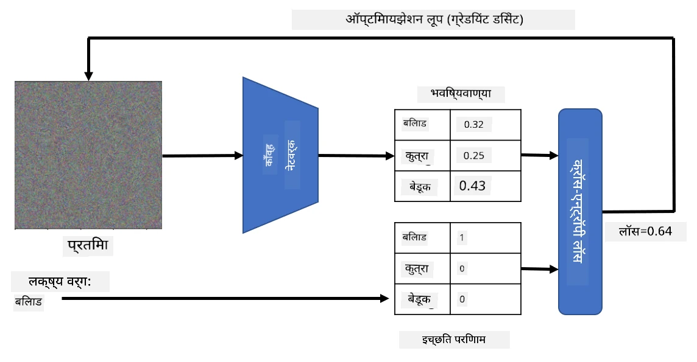

# पूर्व-प्रशिक्षित नेटवर्क्स आणि ट्रान्सफर लर्निंग

CNNs प्रशिक्षण देणे वेळखाऊ असते आणि त्यासाठी मोठ्या प्रमाणात डेटा आवश्यक असतो. मात्र, नेटवर्कला प्रतिमांमधून नमुने काढण्यासाठी वापरता येणारे सर्वोत्तम लो-लेव्हल फिल्टर्स शिकण्यात बराच वेळ जातो. एक नैसर्गिक प्रश्न निर्माण होतो - आपण एका डेटासेटवर प्रशिक्षित केलेल्या न्यूरल नेटवर्कचा वापर करून वेगळ्या प्रतिमा वर्गीकृत करण्यासाठी पूर्ण प्रशिक्षण प्रक्रिया न करता ते कसे अनुकूल करू शकतो?

## [पूर्व-व्याख्यान क्विझ](https://ff-quizzes.netlify.app/en/ai/quiz/15)

ही पद्धत **ट्रान्सफर लर्निंग** म्हणून ओळखली जाते, कारण आपण एका न्यूरल नेटवर्क मॉडेलमधून दुसऱ्या मॉडेलमध्ये काही ज्ञान हस्तांतरित करतो. ट्रान्सफर लर्निंगमध्ये, आपण सामान्यतः पूर्व-प्रशिक्षित मॉडेलसह सुरुवात करतो, जे मोठ्या प्रतिमा डेटासेटवर, जसे की **ImageNet**, प्रशिक्षित केले गेले आहे. ही मॉडेल्स आधीच सामान्य प्रतिमांमधून विविध वैशिष्ट्ये काढण्यात चांगले काम करू शकतात, आणि अनेक प्रकरणांमध्ये, काढलेल्या वैशिष्ट्यांवर आधारित वर्गीकर्ता तयार करणे चांगले परिणाम देऊ शकते.

> ✅ ट्रान्सफर लर्निंग हा शब्द इतर शैक्षणिक क्षेत्रांमध्ये देखील आढळतो, जसे की शिक्षण. याचा अर्थ एका क्षेत्रातील ज्ञान घेऊन ते दुसऱ्या क्षेत्रात लागू करणे.

## पूर्व-प्रशिक्षित मॉडेल्स वैशिष्ट्ये काढण्यासाठी

आम्ही मागील विभागात चर्चा केलेल्या कॉनव्होल्यूशनल नेटवर्क्समध्ये अनेक स्तर असतात, ज्यामध्ये प्रत्येक स्तर प्रतिमेतून काही वैशिष्ट्ये काढण्याचे काम करतो, लो-लेव्हल पिक्सेल संयोजनांपासून (जसे की आडव्या/उभ्या रेषा किंवा स्ट्रोक) ते उच्च-स्तरीय वैशिष्ट्यांचे संयोजन, ज्याचा संबंध ज्वालाच्या डोळ्यासारख्या गोष्टींशी असतो. जर आपण सामान्य आणि विविध प्रतिमांच्या मोठ्या डेटासेटवर CNN प्रशिक्षित केले, तर नेटवर्कने ती सामान्य वैशिष्ट्ये काढणे शिकले पाहिजे.

Keras आणि PyTorch मध्ये काही सामान्य आर्किटेक्चर्ससाठी पूर्व-प्रशिक्षित न्यूरल नेटवर्क वेट्स सहजपणे लोड करण्यासाठी फंक्शन्स आहेत, ज्यातील बहुतेक ImageNet प्रतिमांवर प्रशिक्षित केले गेले आहेत. सर्वात जास्त वापरले जाणारे मॉडेल्स [CNN Architectures](../07-ConvNets/CNN_Architectures.md) पृष्ठावर वर्णन केले आहेत. विशेषतः, तुम्ही खालीलपैकी एक विचार करू शकता:

* **VGG-16/VGG-19** हे तुलनेने सोपे मॉडेल्स आहेत जे चांगली अचूकता देतात. ट्रान्सफर लर्निंग कसे कार्य करते हे पाहण्यासाठी VGG वापरणे चांगला पर्याय असतो.
* **ResNet** ही मॉडेल्सची एक श्रेणी आहे जी Microsoft Research ने 2015 मध्ये प्रस्तावित केली होती. त्यामध्ये अधिक स्तर आहेत, त्यामुळे अधिक संसाधने लागतात.
* **MobileNet** ही कमी आकाराची मॉडेल्सची श्रेणी आहे, जी मोबाइल डिव्हाइससाठी योग्य आहे. जर तुमच्याकडे संसाधने कमी असतील आणि तुम्ही थोडी अचूकता गमावण्यास तयार असाल तर त्यांचा वापर करा.

VGG-16 नेटवर्कद्वारे मांजराच्या प्रतिमेतून काढलेली नमुना वैशिष्ट्ये येथे आहेत:

## मांजरे विरुद्ध कुत्रे डेटासेट

या उदाहरणात, आपण [Cats and Dogs](https://www.microsoft.com/download/details.aspx?id=54765&WT.mc_id=academic-77998-cacaste) डेटासेट वापरणार आहोत, जे वास्तविक जीवनातील प्रतिमा वर्गीकरण परिस्थितीशी खूप जवळ आहे.

## ✍️ व्यायाम: ट्रान्सफर लर्निंग

संबंधित नोटबुक्समध्ये ट्रान्सफर लर्निंग प्रत्यक्षात कसे कार्य करते ते पाहूया:

* [Transfer Learning - PyTorch](TransferLearningPyTorch.ipynb)
* [Transfer Learning - TensorFlow](TransferLearningTF.ipynb)

## अड्व्हर्सेरियल मांजराचे व्हिज्युअलायझेशन

पूर्व-प्रशिक्षित न्यूरल नेटवर्कमध्ये त्याच्या *मेंदूत* विविध नमुने असतात, ज्यामध्ये **आदर्श मांजर** (तसेच आदर्श कुत्रा, आदर्श झेब्रा, इ.) यांची संकल्पना असते. हे प्रतिमेचे **व्हिज्युअलायझेशन** करणे मनोरंजक ठरेल. मात्र, हे सोपे नाही, कारण नमुने नेटवर्क वेट्समध्ये विखुरलेले असतात आणि त्याचप्रमाणे ते एक श्रेणीबद्ध संरचनेत आयोजित केलेले असतात.

आपण एक पद्धत वापरू शकतो, जिथे आपण एका रँडम प्रतिमेसह सुरुवात करतो आणि नंतर **ग्रेडियंट डिसेंट ऑप्टिमायझेशन** तंत्र वापरून ती प्रतिमा समायोजित करण्याचा प्रयत्न करतो, ज्यामुळे नेटवर्कला वाटते की ती मांजर आहे.

मात्र, जर आपण असे केले, तर आपल्याला रँडम नॉइजसारखे काहीतरी मिळेल. कारण *नेटवर्कला वाटावे की इनपुट प्रतिमा मांजर आहे असे करण्याचे अनेक मार्ग आहेत*, ज्यामध्ये काही दृश्यदृष्ट्या अर्थपूर्ण नाहीत. जरी त्या प्रतिमांमध्ये मांजरीसाठी विशिष्ट नमुने असले तरी, त्यांना दृश्यदृष्ट्या वेगळे करण्यासाठी काहीही बंधन नाही.

परिणाम सुधारण्यासाठी, आपण लॉस फंक्शनमध्ये आणखी एक टर्म जोडू शकतो, ज्याला **व्हेरिएशन लॉस** म्हणतात. हे एक मेट्रिक आहे जे प्रतिमेचे शेजारी असलेले पिक्सेल किती समान आहेत हे दर्शवते. व्हेरिएशन लॉस कमी केल्याने प्रतिमा गुळगुळीत होते आणि नॉइज दूर होते - त्यामुळे अधिक दृश्यदृष्ट्या आकर्षक नमुने उलगडतात. येथे अशा "आदर्श" प्रतिमांचे उदाहरण आहे, ज्यांना उच्च संभाव्यतेसह मांजर आणि झेब्रा म्हणून वर्गीकृत केले जाते:

 | 
-----|-----
 *आदर्श मांजर* | *आदर्श झेब्रा*

समान पद्धत वापरून तथाकथित **अड्व्हर्सेरियल हल्ले** न्यूरल नेटवर्कवर करता येतात. समजा आपण न्यूरल नेटवर्कला मूर्ख बनवायचे आहे आणि कुत्र्याला मांजरासारखे बनवायचे आहे. जर आपण कुत्र्याची प्रतिमा घेतली, जी नेटवर्कद्वारे कुत्रा म्हणून ओळखली जाते, तर आपण ती थोडीशी समायोजित करू शकतो, ग्रेडियंट डिसेंट ऑप्टिमायझेशन वापरून, जोपर्यंत नेटवर्क ती मांजर म्हणून वर्गीकृत करत नाही:

 | 
-----|-----
*कुत्र्याची मूळ प्रतिमा* | *कुत्र्याची प्रतिमा जी मांजर म्हणून वर्गीकृत केली जाते*

वरील परिणाम पुनरुत्पादित करण्यासाठी कोड खालील नोटबुकमध्ये पहा:

* [Ideal and Adversarial Cat - TensorFlow](AdversarialCat_TF.ipynb)

## निष्कर्ष

ट्रान्सफर लर्निंग वापरून, तुम्ही कस्टम ऑब्जेक्ट वर्गीकरण कार्यासाठी जलदपणे वर्गीकर्ता तयार करू शकता आणि उच्च अचूकता प्राप्त करू शकता. तुम्ही पाहू शकता की आपण आता सोडवत असलेल्या अधिक जटिल कार्यांसाठी उच्च संगणकीय शक्ती आवश्यक आहे आणि CPU वर सहजपणे सोडवता येत नाही. पुढील युनिटमध्ये, आम्ही कमी संगणकीय संसाधने वापरून समान मॉडेल प्रशिक्षण देण्यासाठी अधिक हलकी अंमलबजावणी वापरण्याचा प्रयत्न करू, ज्यामुळे अचूकता थोडी कमी होते.

## 🚀 आव्हान

सहायक नोटबुक्समध्ये, प्रशिक्षण डेटा थोडासा समान असताना ट्रान्सफर ज्ञान कसे चांगले कार्य करते याबद्दल तळाशी काही टिपा आहेत (कदाचित प्राण्यांचा नवीन प्रकार). पूर्णपणे नवीन प्रकारच्या प्रतिमांसह काही प्रयोग करा आणि तुमचे ट्रान्सफर ज्ञान मॉडेल्स किती चांगले किंवा वाईट कार्य करतात ते पाहा.

## [व्याख्यानानंतरचा क्विझ](https://ff-quizzes.netlify.app/en/ai/quiz/16)

## पुनरावलोकन आणि स्व-अभ्यास

[TrainingTricks.md](TrainingTricks.md) वाचा आणि तुमच्या मॉडेल्स प्रशिक्षण देण्याच्या इतर पद्धतींबद्दलचे ज्ञान वाढवा.

## [असाइनमेंट](lab/README.md)

या प्रयोगशाळेत, आपण वास्तविक जीवनातील [Oxford-IIIT](https://www.robots.ox.ac.uk/~vgg/data/pets/) पाळीव प्राणी डेटासेट वापरणार आहोत ज्यामध्ये मांजरे आणि कुत्र्यांच्या 35 जाती आहेत, आणि आपण ट्रान्सफर लर्निंग वर्गीकर्ता तयार करू.

---

