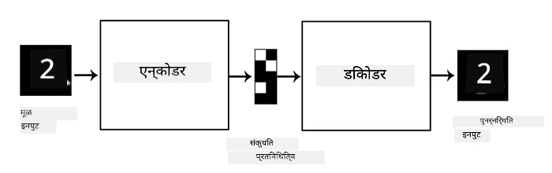
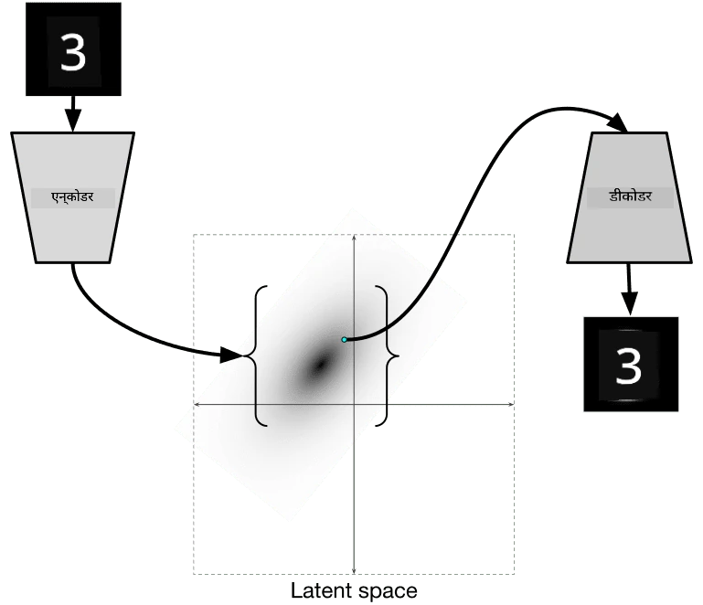

# ऑटोएन्कोडर्स

जेव्हा CNNs प्रशिक्षण दिले जाते, तेव्हा एक समस्या म्हणजे आपल्याला मोठ्या प्रमाणात लेबल केलेल्या डेटाची आवश्यकता असते. प्रतिमेच्या वर्गीकरणाच्या बाबतीत, आपल्याला प्रतिमा वेगवेगळ्या वर्गांमध्ये विभागाव्या लागतात, जे एक मॅन्युअल काम आहे.

## [पूर्व-व्याख्यान प्रश्नमंजुषा](https://ff-quizzes.netlify.app/en/ai/quiz/17)

तथापि, कदाचित आपल्याला कच्चा (लेबल नसलेला) डेटा CNN फीचर एक्स्ट्रॅक्टर्ससाठी प्रशिक्षण देण्यासाठी वापरायचा असेल, ज्याला **स्वयं-पर्यवेक्षित शिक्षण** म्हणतात. लेबल्सच्या ऐवजी, आम्ही प्रशिक्षण प्रतिमा नेटवर्क इनपुट आणि आउटपुट म्हणून वापरू. **ऑटोएन्कोडर** ची मुख्य कल्पना अशी आहे की आपल्याकडे एक **एन्कोडर नेटवर्क** असेल जे इनपुट प्रतिमेला काही **लॅटेंट स्पेस** मध्ये रूपांतरित करते (सामान्यतः हे काही लहान आकाराच्या व्हेक्टरसारखे असते), आणि नंतर **डिकोडर नेटवर्क**, ज्याचे उद्दिष्ट मूळ प्रतिमा पुन्हा तयार करणे असेल.

> ✅ [ऑटोएन्कोडर](https://wikipedia.org/wiki/Autoencoder) म्हणजे "एक प्रकारचे कृत्रिम न्यूरल नेटवर्क जे लेबल नसलेल्या डेटाचे कार्यक्षम कोडिंग शिकण्यासाठी वापरले जाते."

आम्ही ऑटोएन्कोडरला मूळ प्रतिमेतील माहिती अचूक पुनर्रचना करण्यासाठी शक्य तितकी माहिती कॅप्चर करण्यासाठी प्रशिक्षण देत असल्याने, नेटवर्क इनपुट प्रतिमांचे सर्वोत्तम **एम्बेडिंग** शोधण्याचा प्रयत्न करते.

> प्रतिमा [Keras ब्लॉग](https://blog.keras.io/building-autoencoders-in-keras.html) मधून

## ऑटोएन्कोडर्स वापरण्याचे परिदृश्य

मूळ प्रतिमा पुन्हा तयार करणे स्वतःमध्ये फारसे उपयुक्त वाटत नसले तरी, काही परिदृश्ये आहेत जिथे ऑटोएन्कोडर्स विशेषतः उपयुक्त आहेत:

* **प्रतिमांचे परिमाण कमी करणे** किंवा **प्रतिमा एम्बेडिंग प्रशिक्षण देणे**. सामान्यतः ऑटोएन्कोडर्स PCA पेक्षा चांगले परिणाम देतात, कारण ते प्रतिमांच्या स्थानिक स्वरूप आणि श्रेणीबद्ध वैशिष्ट्यांचा विचार करतात.
* **डिनॉइजिंग**, म्हणजे प्रतिमेतून आवाज काढून टाकणे. कारण आवाजात बरेच निरुपयोगी माहिती असते, ऑटोएन्कोडर त्याला तुलनेने लहान लॅटेंट स्पेसमध्ये बसवू शकत नाही, आणि त्यामुळे तो प्रतिमेचा फक्त महत्त्वाचा भाग कॅप्चर करतो. डिनॉइझर्स प्रशिक्षण देताना, आम्ही मूळ प्रतिमांपासून सुरुवात करतो आणि कृत्रिमरित्या जोडलेल्या आवाजासह प्रतिमा ऑटोएन्कोडरच्या इनपुट म्हणून वापरतो.
* **सुपर-रिझोल्यूशन**, प्रतिमेचे रिझोल्यूशन वाढवणे. आम्ही उच्च-रिझोल्यूशन प्रतिमांपासून सुरुवात करतो आणि कमी रिझोल्यूशन असलेल्या प्रतिमेला ऑटोएन्कोडर इनपुट म्हणून वापरतो.
* **जनरेटिव्ह मॉडेल्स**. एकदा ऑटोएन्कोडर प्रशिक्षण दिल्यानंतर, डिकोडर भाग यादृच्छिक लॅटेंट व्हेक्टरपासून नवीन वस्तू तयार करण्यासाठी वापरला जाऊ शकतो.

## व्हेरिएशनल ऑटोएन्कोडर्स (VAE)

पारंपरिक ऑटोएन्कोडर्स इनपुट डेटाचे परिमाण कमी करतात, इनपुट प्रतिमांचे महत्त्वाचे वैशिष्ट्य शोधतात. तथापि, लॅटेंट व्हेक्टर अनेकदा फारसा अर्थपूर्ण नसतो. दुसऱ्या शब्दांत, MNIST डेटासेटचा उदाहरण म्हणून विचार करता, वेगवेगळ्या लॅटेंट व्हेक्टरशी कोणते अंक संबंधित आहेत हे शोधणे सोपे काम नाही, कारण जवळचे लॅटेंट व्हेक्टर अनिवार्यपणे समान अंकाशी संबंधित नसतात.

दुसरीकडे, *जनरेटिव्ह* मॉडेल्स प्रशिक्षण देण्यासाठी लॅटेंट स्पेसची काही समज असणे चांगले आहे. ही कल्पना आपल्याला **व्हेरिएशनल ऑटो-एन्कोडर** (VAE) कडे घेऊन जाते.

VAE हा ऑटोएन्कोडर आहे जो लॅटेंट पॅरामीटर्सचा *सांख्यिकीय वितरण* अंदाज लावण्यास शिकतो, ज्याला **लॅटेंट वितरण** म्हणतात. उदाहरणार्थ, आपल्याला लॅटेंट व्हेक्टर सामान्यतः zmean आणि zsigma (दोन्ही म्हणजे काही परिमाण d असलेल्या व्हेक्टर) सह वितरित होण्याची इच्छा असू शकते. VAE मधील एन्कोडर हे पॅरामीटर्स अंदाज लावण्यास शिकतो, आणि नंतर डिकोडर या वितरणातून यादृच्छिक व्हेक्टर घेऊन वस्तू पुन्हा तयार करतो.

सारांश:

 * इनपुट व्हेक्टरमधून, आम्ही `z_mean` आणि `z_log_sigma` अंदाज लावतो (प्रत्यक्ष मानक विचलनाचा अंदाज लावण्याऐवजी, आम्ही त्याचा लॉगरिदम अंदाज लावतो)
 * आम्ही वितरण N(zmean,exp(zlog\_sigma)) मधून `sample` व्हेक्टर घेतो
 * डिकोडर `sample` इनपुट व्हेक्टर म्हणून वापरून मूळ प्रतिमा डिकोड करण्याचा प्रयत्न करतो

 

> प्रतिमा [या ब्लॉग पोस्ट](https://ijdykeman.github.io/ml/2016/12/21/cvae.html) मधून, लेखक: इसाक डायकमन

व्हेरिएशनल ऑटो-एन्कोडर्स एक जटिल लॉस फंक्शन वापरतात ज्यामध्ये दोन भाग असतात:

* **पुनर्रचना लॉस** हे लॉस फंक्शन आहे जे पुनर्रचित प्रतिमा लक्ष्याच्या किती जवळ आहे हे दर्शवते (हे Mean Squared Error किंवा MSE असू शकते). हे सामान्य ऑटोएन्कोडर्समध्ये वापरल्या जाणाऱ्या लॉस फंक्शनसारखेच आहे.
* **KL लॉस**, जे सुनिश्चित करते की लॅटेंट व्हेरिएबल वितरण सामान्य वितरणाच्या जवळ राहते. हे [कुलबॅक-लिब्लर डायव्हर्जन्स](https://www.countbayesie.com/blog/2017/5/9/kullback-leibler-divergence-explained) च्या संकल्पनेवर आधारित आहे - दोन सांख्यिकीय वितरण किती समान आहेत हे अंदाज लावण्यासाठी एक मेट्रिक.

VAE चे एक महत्त्वाचे फायदे म्हणजे नवीन प्रतिमा तुलनेने सोप्या पद्धतीने तयार करणे शक्य होते, कारण आपल्याला लॅटेंट व्हेक्टर कशा वितरणातून नमुना घ्यायचा आहे हे माहित असते. उदाहरणार्थ, जर आपण MNIST वर 2D लॅटेंट व्हेक्टरसह VAE प्रशिक्षण दिले, तर आपण लॅटेंट व्हेक्टरच्या घटकांमध्ये बदल करून वेगवेगळे अंक मिळवू शकतो:

> प्रतिमा [दिमित्री सोश्निकोव्ह](http://soshnikov.com) यांच्याकडून

लक्ष द्या की प्रतिमा एकमेकांमध्ये मिसळतात, कारण आपण लॅटेंट पॅरामीटर स्पेसच्या वेगवेगळ्या भागांमधून लॅटेंट व्हेक्टर मिळवायला सुरुवात करतो. आपण या स्पेसला 2D मध्ये देखील व्हिज्युअलाइझ करू शकतो:

 

> प्रतिमा [दिमित्री सोश्निकोव्ह](http://soshnikov.com) यांच्याकडून

## ✍️ सराव: ऑटोएन्कोडर्स

ऑटोएन्कोडर्सबद्दल अधिक जाणून घ्या या संबंधित नोटबुक्समध्ये:

* [TensorFlow मध्ये ऑटोएन्कोडर्स](AutoencodersTF.ipynb)
* [PyTorch मध्ये ऑटोएन्कोडर्स](AutoEncodersPyTorch.ipynb)

## ऑटोएन्कोडर्सची वैशिष्ट्ये

* **डेटा विशिष्ट** - ते फक्त त्या प्रकारच्या प्रतिमांवर चांगले कार्य करतात ज्यावर त्यांना प्रशिक्षण दिले गेले आहे. उदाहरणार्थ, जर आपण फुलांवर सुपर-रिझोल्यूशन नेटवर्क प्रशिक्षण दिले, तर ते पोर्ट्रेट्सवर चांगले कार्य करणार नाही. कारण नेटवर्क प्रशिक्षण डेटासेटमधून शिकलेल्या वैशिष्ट्यांमधून सूक्ष्म तपशील घेऊन उच्च रिझोल्यूशन प्रतिमा तयार करू शकते.
* **लॉसी** - पुनर्रचित प्रतिमा मूळ प्रतिमेसारखी नसते. लॉसचे स्वरूप प्रशिक्षणादरम्यान वापरल्या जाणाऱ्या *लॉस फंक्शन* ने परिभाषित केले जाते.
* **लेबल नसलेल्या डेटावर कार्य करते**

## [व्याख्यानानंतरची प्रश्नमंजुषा](https://ff-quizzes.netlify.app/en/ai/quiz/18)

## निष्कर्ष

या धड्यात, तुम्ही AI वैज्ञानिकांसाठी उपलब्ध असलेल्या विविध प्रकारच्या ऑटोएन्कोडर्सबद्दल शिकले. तुम्ही त्यांना कसे तयार करायचे आणि प्रतिमा पुन्हा तयार करण्यासाठी कसे वापरायचे हे शिकले. तुम्ही VAE बद्दल देखील शिकले आणि नवीन प्रतिमा तयार करण्यासाठी त्याचा कसा उपयोग करायचा हे शिकले.

## 🚀 आव्हान

या धड्यात, तुम्ही प्रतिमांसाठी ऑटोएन्कोडर्स वापरण्याबद्दल शिकले. पण ते संगीतासाठी देखील वापरले जाऊ शकतात! Magenta प्रकल्पाचा [MusicVAE](https://magenta.tensorflow.org/music-vae) प्रकल्प पहा, जो संगीत पुन्हा तयार करण्यासाठी शिकण्यासाठी ऑटोएन्कोडर्स वापरतो. या लायब्ररीसह काही [प्रयोग](https://colab.research.google.com/github/magenta/magenta-demos/blob/master/colab-notebooks/Multitrack_MusicVAE.ipynb) करा आणि तुम्ही काय तयार करू शकता ते पहा.

## [व्याख्यानानंतरची प्रश्नमंजुषा](https://ff-quizzes.netlify.app/en/ai/quiz/16)

## पुनरावलोकन आणि स्व-अभ्यास

संदर्भासाठी, ऑटोएन्कोडर्सबद्दल अधिक वाचा या संसाधनांमध्ये:

* [Keras मध्ये ऑटोएन्कोडर्स तयार करणे](https://blog.keras.io/building-autoencoders-in-keras.html)
* [NeuroHive वर ब्लॉग पोस्ट](https://neurohive.io/ru/osnovy-data-science/variacionnyj-avtojenkoder-vae/)
* [व्हेरिएशनल ऑटोएन्कोडर्स समजावून सांगितले](https://kvfrans.com/variational-autoencoders-explained/)
* [कंडिशनल व्हेरिएशनल ऑटोएन्कोडर्स](https://ijdykeman.github.io/ml/2016/12/21/cvae.html)

## असाइनमेंट

[TensorFlow वापरून या नोटबुकच्या](AutoencodersTF.ipynb) शेवटी तुम्हाला एक 'टास्क' सापडेल - याचा तुमच्या असाइनमेंटसाठी उपयोग करा.

---

