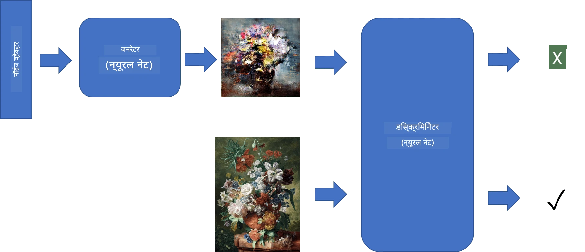
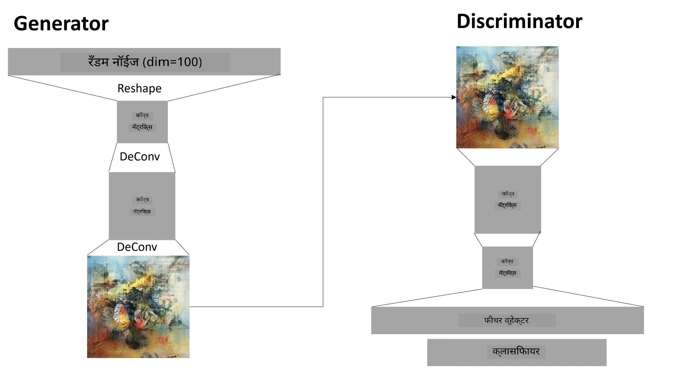

# जनरेटिव अड्व्हर्सेरियल नेटवर्क्स

मागील विभागात आपण **जनरेटिव मॉडेल्स** म्हणजेच प्रशिक्षण डेटासेटमधील प्रतिमांसारख्या नवीन प्रतिमा तयार करू शकणाऱ्या मॉडेल्सबद्दल शिकले. VAE हे जनरेटिव मॉडेलचे एक चांगले उदाहरण होते.

## [पूर्व-व्याख्यान प्रश्नमंजूषा](https://ff-quizzes.netlify.app/en/ai/quiz/19)

तथापि, जर आपण काही खरोखरच अर्थपूर्ण तयार करण्याचा प्रयत्न केला, जसे की योग्य रिझोल्यूशनवर एक चित्र, VAE वापरून, तर आपल्याला दिसेल की प्रशिक्षण चांगल्या प्रकारे जमत नाही. या उपयोगासाठी, आपल्याला जनरेटिव मॉडेल्ससाठी विशेषतः लक्ष्यित केलेल्या दुसऱ्या आर्किटेक्चरबद्दल शिकावे लागेल - **जनरेटिव अड्व्हर्सेरियल नेटवर्क्स**, किंवा GANs.

GAN ची मुख्य कल्पना म्हणजे दोन न्यूरल नेटवर्क्स असणे जे एकमेकांविरुद्ध प्रशिक्षित केले जातील:

> प्रतिमा [Dmitry Soshnikov](http://soshnikov.com) यांच्याकडून

> ✅ थोडीशी शब्दावली:
> * **जनरेटर** हे एक नेटवर्क आहे जे काही रँडम व्हेक्टर घेतं आणि त्याचा परिणाम म्हणून प्रतिमा तयार करतं.
> * **डिस्क्रिमिनेटर** हे एक नेटवर्क आहे जे प्रतिमा घेतं आणि ती प्रशिक्षण डेटासेटमधील वास्तविक प्रतिमा आहे की जनरेटरने तयार केलेली आहे हे सांगते. हे मूलत: एक प्रतिमा वर्गीकरण करणारे आहे.

### डिस्क्रिमिनेटर

डिस्क्रिमिनेटरची आर्किटेक्चर सामान्य प्रतिमा वर्गीकरण नेटवर्कपासून वेगळी नाही. सर्वात सोप्या प्रकरणात, ते पूर्णपणे कनेक्टेड वर्गीकरण करणारे असू शकते, परंतु बहुधा ते [कॉनव्होल्यूशनल नेटवर्क](../07-ConvNets/README.md) असेल.

> ✅ कॉनव्होल्यूशनल नेटवर्क्सवर आधारित GAN ला [DCGAN](https://arxiv.org/pdf/1511.06434.pdf) म्हणतात.

एक CNN डिस्क्रिमिनेटरमध्ये खालील स्तर असतात: अनेक कॉनव्होल्यूशन्स+पूलिंग्स (स्पेशियल साइज कमी करत), आणि एक किंवा अधिक पूर्णपणे कनेक्टेड स्तर जे "फीचर व्हेक्टर" तयार करतात, अंतिम बायनरी वर्गीकरण करणारे.

> ✅ 'पूलिंग' म्हणजे प्रतिमेचा आकार कमी करण्याची तंत्र. "पूलिंग स्तर डेटा परिमाण कमी करतात, एका स्तरातील न्यूरॉन क्लस्टर्सचे आउटपुट पुढील स्तरातील एका न्यूरॉनमध्ये एकत्र करून." - [स्रोत](https://wikipedia.org/wiki/Convolutional_neural_network#Pooling_layers)

### जनरेटर

जनरेटर थोडा अधिक क्लिष्ट आहे. तुम्ही त्याला उलट्या डिस्क्रिमिनेटरप्रमाणे विचार करू शकता. लेटेंट व्हेक्टरपासून (फीचर व्हेक्टरच्या जागी), त्यात आवश्यक आकार/आकारात रूपांतर करण्यासाठी एक पूर्णपणे कनेक्टेड स्तर असतो, त्यानंतर डी-कॉनव्होल्यूशन्स+अपस्केलिंग. हे [ऑटोएन्कोडर](../09-Autoencoders/README.md) च्या *डिकोडर* भागासारखे आहे.

> ✅ कारण कॉनव्होल्यूशन स्तर प्रतिमेतून रेषीय फिल्टर म्हणून अंमलात आणला जातो, डी-कॉनव्होल्यूशन मूलत: कॉनव्होल्यूशनसारखेच आहे आणि त्याच स्तर लॉजिक वापरून अंमलात आणले जाऊ शकते.

> प्रतिमा [Dmitry Soshnikov](http://soshnikov.com) यांच्याकडून

### GAN चे प्रशिक्षण

GANs ला **अड्व्हर्सेरियल** म्हणतात कारण जनरेटर आणि डिस्क्रिमिनेटरमध्ये सतत स्पर्धा असते. या स्पर्धेदरम्यान, जनरेटर आणि डिस्क्रिमिनेटर दोन्ही सुधारतात, त्यामुळे नेटवर्क चांगल्या आणि चांगल्या प्रतिमा तयार करायला शिकते.

प्रशिक्षण दोन टप्प्यांमध्ये होते:

* **डिस्क्रिमिनेटरचे प्रशिक्षण**. हे कार्य अगदी सोपे आहे: आम्ही जनरेटरद्वारे प्रतिमांचा एक बॅच तयार करतो, त्यांना 0 लेबल देतो, जे बनावट प्रतिमेसाठी उभे आहे, आणि इनपुट डेटासेटमधून प्रतिमांचा एक बॅच घेतो (लेबल 1, वास्तविक प्रतिमा). आम्हाला काही *डिस्क्रिमिनेटर लॉस* मिळते आणि बॅकप्रॉप करतो.
* **जनरेटरचे प्रशिक्षण**. हे थोडे अधिक क्लिष्ट आहे, कारण आम्हाला जनरेटरसाठी अपेक्षित आउटपुट थेट माहित नाही. आम्ही जनरेटरनंतर डिस्क्रिमिनेटर असलेल्या संपूर्ण GAN नेटवर्कला काही रँडम व्हेक्टरसह फीड करतो आणि परिणाम 1 (वास्तविक प्रतिमांना अनुरूप) असावा अशी अपेक्षा करतो. आम्ही डिस्क्रिमिनेटरचे पॅरामीटर्स फ्रीज करतो (या टप्प्यावर आम्हाला ते प्रशिक्षित करायचे नाही) आणि बॅकप्रॉप करतो.

या प्रक्रियेदरम्यान, जनरेटर आणि डिस्क्रिमिनेटर लॉस दोन्ही लक्षणीयरीत्या खाली जात नाहीत. आदर्श परिस्थितीत, ते दोलायमान असावेत, जे दोन्ही नेटवर्क्स त्यांच्या कार्यक्षमतेत सुधारणा करत असल्याचे दर्शवते.

## ✍️ सराव: GANs

* [TensorFlow/Keras मध्ये GAN नोटबुक](GANTF.ipynb)
* [PyTorch मध्ये GAN नोटबुक](GANPyTorch.ipynb)

### GAN प्रशिक्षणातील समस्या

GANs विशेषतः प्रशिक्षण देण्यासाठी कठीण असल्याचे ओळखले जातात. येथे काही समस्या आहेत:

* **मोड कोलॅप्स**. याचा अर्थ जनरेटर एक यशस्वी प्रतिमा तयार करायला शिकतो जी जनरेटरला फसवते, आणि विविध प्रकारच्या प्रतिमा तयार करत नाही.
* **हायपरपॅरामीटर्ससाठी संवेदनशीलता**. अनेकदा तुम्हाला दिसेल की GAN अजिबात जमत नाही, आणि नंतर अचानक शिक्षण दर कमी झाल्यामुळे जमतं.
* जनरेटर आणि डिस्क्रिमिनेटरमध्ये **संतुलन** ठेवणे. अनेक प्रकरणांमध्ये डिस्क्रिमिनेटर लॉस तुलनेने लवकर शून्यावर जाऊ शकतो, ज्यामुळे जनरेटरला पुढे प्रशिक्षण देणे अशक्य होते. यावर मात करण्यासाठी, आपण जनरेटर आणि डिस्क्रिमिनेटरसाठी वेगवेगळे शिक्षण दर सेट करण्याचा प्रयत्न करू शकतो, किंवा लॉस आधीच खूप कमी असल्यास डिस्क्रिमिनेटर प्रशिक्षण वगळू शकतो.
* **उच्च रिझोल्यूशनसाठी प्रशिक्षण**. ऑटोएन्कोडर्ससह समान समस्येचे प्रतिबिंब, ही समस्या ट्रिगर होते कारण कॉनव्होल्यूशनल नेटवर्कच्या खूप स्तरांचे पुनर्रचना केल्यामुळे आर्टिफॅक्ट्स तयार होतात. ही समस्या सामान्यतः **प्रोग्रेसिव ग्रोइंग** वापरून सोडवली जाते, जेव्हा प्रथम काही स्तर कमी-रिझोल्यूशन प्रतिमांवर प्रशिक्षित केले जातात, आणि नंतर स्तर "अनब्लॉक" किंवा जोडले जातात. आणखी एक उपाय म्हणजे स्तरांमध्ये अतिरिक्त कनेक्शन जोडणे आणि एकाच वेळी अनेक रिझोल्यूशन्सवर प्रशिक्षण देणे - यासाठी [मल्टी-स्केल ग्रेडियंट GANs पेपर](https://arxiv.org/abs/1903.06048) तपासा.

## शैली हस्तांतरण

GANs हे कलात्मक प्रतिमा तयार करण्याचा एक उत्कृष्ट मार्ग आहे. आणखी एक मनोरंजक तंत्र म्हणजे **शैली हस्तांतरण**, जे एक **सामग्री प्रतिमा** घेतं आणि ती वेगळ्या शैलीत पुन्हा काढते, **शैली प्रतिमा** मधून फिल्टर्स लागू करते.

हे कार्य कसे करते ते खालीलप्रमाणे आहे:
* आपण रँडम नॉईज प्रतिमेसह प्रारंभ करतो (किंवा सामग्री प्रतिमेसह, परंतु समजण्यासाठी रँडम नॉईजपासून प्रारंभ करणे सोपे आहे)
* आमचे लक्ष्य असे प्रतिमा तयार करणे असेल, जे सामग्री प्रतिमा आणि शैली प्रतिमेच्या जवळ असेल. हे दोन लॉस फंक्शन्सद्वारे निश्चित केले जाईल:
   - **सामग्री लॉस** सध्याच्या प्रतिमा आणि सामग्री प्रतिमेतून CNN द्वारे काही स्तरांवर काढलेल्या वैशिष्ट्यांवर आधारित गणना केली जाते.
   - **शैली लॉस** सध्याच्या प्रतिमा आणि शैली प्रतिमेमध्ये हुशारीने ग्रॅम मॅट्रिसेस वापरून गणना केली जाते (अधिक तपशीलांसाठी [उदाहरण नोटबुक](StyleTransfer.ipynb) पहा).
* प्रतिमा गुळगुळीत करण्यासाठी आणि नॉईज काढण्यासाठी, आम्ही **व्हेरिएशन लॉस** देखील सादर करतो, जो शेजारील पिक्सेलमधील सरासरी अंतर गणतो.
* मुख्य ऑप्टिमायझेशन लूप सध्याच्या प्रतिमेला समायोजित करतो, एकूण लॉस कमी करण्यासाठी ग्रेडियंट डिसेंट (किंवा काही अन्य ऑप्टिमायझेशन अल्गोरिदम) वापरतो, जो सर्व तीन लॉसचे वजन केलेले एकत्रित आहे.

## ✍️ उदाहरण: [शैली हस्तांतरण](StyleTransfer.ipynb)

## [व्याख्यानानंतर प्रश्नमंजूषा](https://ff-quizzes.netlify.app/en/ai/quiz/20)

## निष्कर्ष

या धड्यात, तुम्ही GANs आणि त्यांना कसे प्रशिक्षित करायचे ते शिकले. तुम्ही या प्रकारच्या न्यूरल नेटवर्कला सामोरे जाऊ शकणाऱ्या विशेष आव्हानांबद्दल आणि त्यावर मात करण्यासाठी काही रणनीतींबद्दल देखील शिकले.

## 🚀 आव्हान

[शैली हस्तांतरण नोटबुक](StyleTransfer.ipynb) तुमच्या स्वतःच्या प्रतिमांसह चालवा.

## पुनरावलोकन आणि स्व-अभ्यास

संदर्भासाठी, या संसाधनांमध्ये GANs बद्दल अधिक वाचा:

* Marco Pasini, [10 Lessons I Learned Training GANs for one Year](https://towardsdatascience.com/10-lessons-i-learned-training-generative-adversarial-networks-gans-for-a-year-c9071159628)
* [StyleGAN](https://en.wikipedia.org/wiki/StyleGAN), एक *de facto* GAN आर्किटेक्चर विचारात घ्या
* [Creating Generative Art using GANs on Azure ML](https://soshnikov.com/scienceart/creating-generative-art-using-gan-on-azureml/)

## असाइनमेंट

या धड्याशी संबंधित दोन नोटबुक्सपैकी एक पुन्हा पहा आणि GAN तुमच्या स्वतःच्या प्रतिमांवर पुन्हा प्रशिक्षित करा. तुम्ही काय तयार करू शकता?

---

