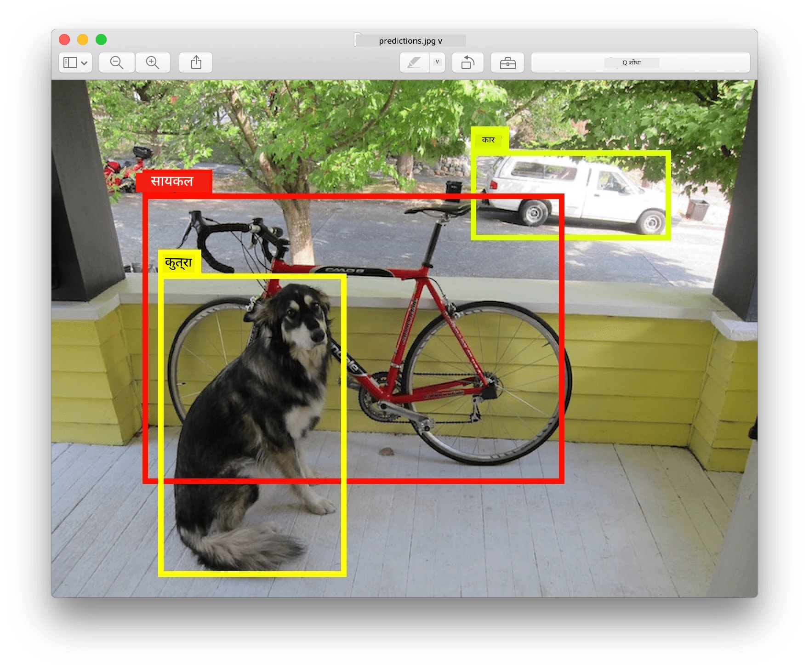
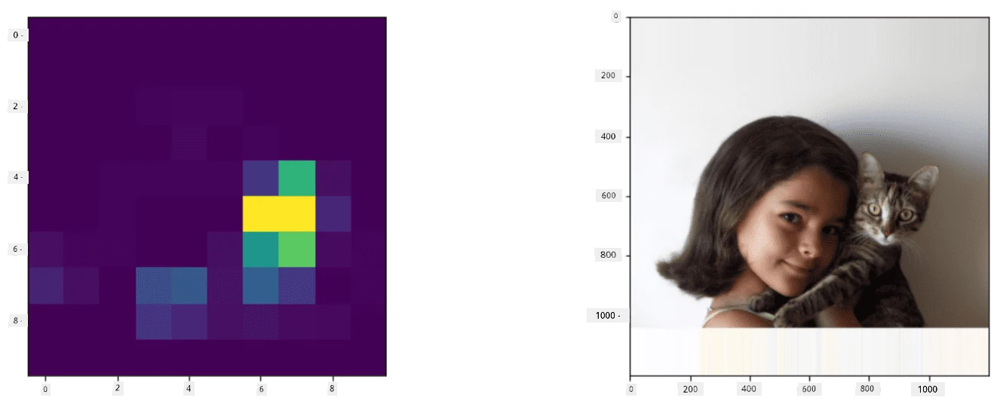
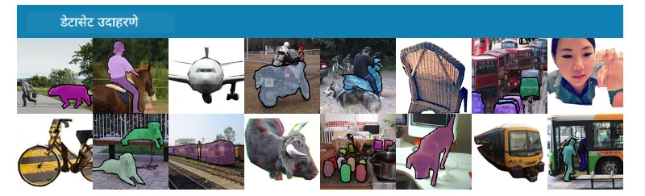
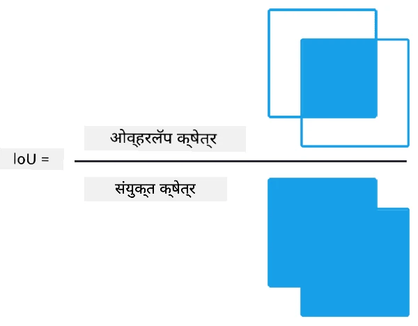
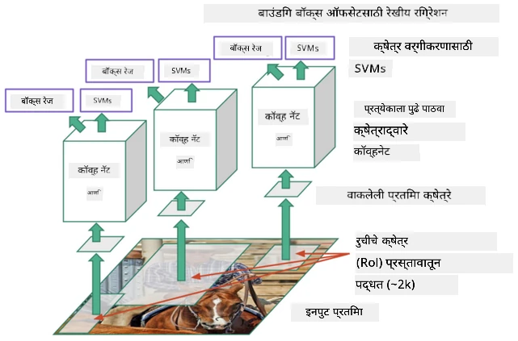
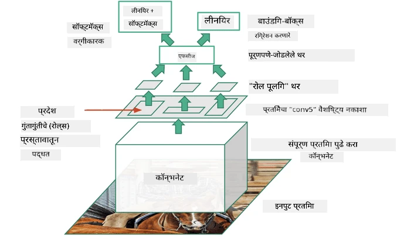
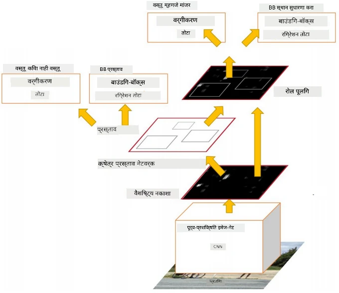
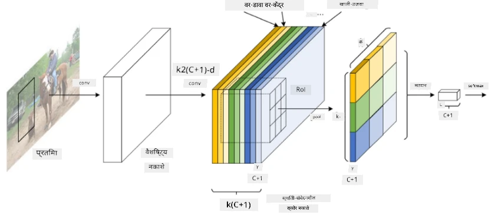
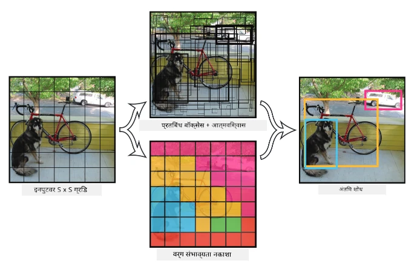

# ऑब्जेक्ट डिटेक्शन

आतापर्यंत आपण ज्या इमेज क्लासिफिकेशन मॉडेल्सवर काम केले आहे, त्या एका प्रतिमेवर प्रक्रिया करून एक वर्गीय निकाल देतात, जसे की MNIST समस्येमध्ये 'संख्या' वर्ग. परंतु, अनेक वेळा आपल्याला फक्त हे जाणून घ्यायचे नसते की प्रतिमेत वस्तू आहेत, तर आपल्याला त्यांच्या अचूक स्थानाचा अंदाज लावायचा असतो. **ऑब्जेक्ट डिटेक्शन** याच उद्देशासाठी आहे.

## [पूर्व-व्याख्यान क्विझ](https://ff-quizzes.netlify.app/en/ai/quiz/21)

> प्रतिमा [YOLO v2 वेबसाइट](https://pjreddie.com/darknet/yolov2/) वरून

## ऑब्जेक्ट डिटेक्शनसाठी एक साधा दृष्टिकोन

समजा आपल्याला एका प्रतिमेत मांजर शोधायचे आहे, तर ऑब्जेक्ट डिटेक्शनसाठी एक साधा दृष्टिकोन असा असू शकतो:

1. प्रतिमेला अनेक टाइल्समध्ये विभागा.
2. प्रत्येक टाइलवर इमेज क्लासिफिकेशन चालवा.
3. ज्या टाइल्समध्ये पुरेसे उच्च सक्रियता दिसते, त्या टाइल्समध्ये संबंधित वस्तू असल्याचे मानले जाऊ शकते.

> *प्रतिमा [व्यायाम नोटबुक](ObjectDetection-TF.ipynb) मधून*

तथापि, हा दृष्टिकोन आदर्श नाही, कारण तो वस्तूच्या बॉक्सचे स्थान अचूकपणे शोधण्यास सक्षम नाही. अधिक अचूक स्थानासाठी, आपल्याला **रेग्रेशन** वापरून बॉक्सच्या समन्वयांचा अंदाज लावावा लागतो - आणि त्यासाठी विशिष्ट डेटासेट्स आवश्यक असतात.

## ऑब्जेक्ट डिटेक्शनसाठी रेग्रेशन

[हा ब्लॉग पोस्ट](https://towardsdatascience.com/object-detection-with-neural-networks-a4e2c46b4491) आकार शोधण्यासाठी एक उत्तम सुरुवात आहे.

## ऑब्जेक्ट डिटेक्शनसाठी डेटासेट्स

या कार्यासाठी तुम्हाला खालील डेटासेट्स सापडू शकतात:

* [PASCAL VOC](http://host.robots.ox.ac.uk/pascal/VOC/) - 20 वर्ग
* [COCO](http://cocodataset.org/#home) - कॉमन ऑब्जेक्ट्स इन कॉन्टेक्स्ट. 80 वर्ग, बॉक्सेस आणि सेगमेंटेशन मास्क

## ऑब्जेक्ट डिटेक्शन मेट्रिक्स

### इंटरसेक्शन ओव्हर युनियन

इमेज क्लासिफिकेशनसाठी अल्गोरिदम किती चांगले कार्य करते हे मोजणे सोपे आहे, परंतु ऑब्जेक्ट डिटेक्शनसाठी आपल्याला वर्गाची अचूकता आणि बॉक्सच्या स्थानाची अचूकता दोन्ही मोजावी लागते. यासाठी **इंटरसेक्शन ओव्हर युनियन** (IoU) वापरले जाते, जे दोन बॉक्सेस (किंवा दोन क्षेत्रे) किती चांगले ओव्हरलॅप होतात हे मोजते.

> *[IoU वर उत्कृष्ट ब्लॉग पोस्ट](https://pyimagesearch.com/2016/11/07/intersection-over-union-iou-for-object-detection/) मधून आकृती 2*

संकल्पना सोपी आहे - दोन आकृत्यांच्या ओव्हरलॅप क्षेत्राला त्यांच्या युनियन क्षेत्राने विभाजित करतो. दोन समान क्षेत्रांसाठी, IoU 1 असेल, तर पूर्णपणे वेगळ्या क्षेत्रांसाठी ते 0 असेल. अन्यथा, ते 0 ते 1 दरम्यान बदलते. आपण सामान्यतः फक्त त्या बॉक्सेस विचारात घेतो ज्यांचे IoU विशिष्ट मूल्यापेक्षा जास्त आहे.

### सरासरी अचूकता (Average Precision)

समजा आपल्याला $C$ वर्गातील वस्तू किती चांगल्या प्रकारे ओळखल्या जातात हे मोजायचे आहे. यासाठी **सरासरी अचूकता** मेट्रिक्स वापरली जाते, जी खालीलप्रमाणे गणली जाते:

1. प्रिसिजन-रिकॉल वक्र अचूकता दर्शवते जी डिटेक्शन थ्रेशोल्ड मूल्यावर (0 ते 1) अवलंबून असते.
2. थ्रेशोल्डनुसार, प्रतिमेत अधिक किंवा कमी वस्तू शोधल्या जातील, आणि प्रिसिजन व रिकॉलचे वेगवेगळे मूल्य मिळेल.
3. वक्र खालीलप्रमाणे दिसेल:

> *[NeuroWorkshop](http://github.com/shwars/NeuroWorkshop) मधून प्रतिमा*

$C$ वर्गासाठी सरासरी अचूकता म्हणजे या वक्राखालील क्षेत्र. अधिक अचूकपणे, रिकॉल अक्ष 10 भागांमध्ये विभागली जाते, आणि प्रिसिजन सर्व बिंदूंवर सरासरी केली जाते:

$$
AP = {1\over11}\sum_{i=0}^{10}\mbox{Precision}(\mbox{Recall}={i\over10})
$$

### AP आणि IoU

आपण फक्त त्या डिटेक्शन विचारात घेतो ज्यांचे IoU विशिष्ट मूल्यापेक्षा जास्त आहे. उदाहरणार्थ, PASCAL VOC डेटासेटमध्ये सामान्यतः $\mbox{IoU Threshold} = 0.5$ मानले जाते, तर COCO मध्ये AP वेगवेगळ्या $\mbox{IoU Threshold}$ मूल्यांसाठी मोजले जाते.

> *[NeuroWorkshop](http://github.com/shwars/NeuroWorkshop) मधून प्रतिमा*

### मीन सरासरी अचूकता - mAP

ऑब्जेक्ट डिटेक्शनसाठी मुख्य मेट्रिक **मीन सरासरी अचूकता** किंवा **mAP** आहे. हे सर्व वर्गांमध्ये सरासरी अचूकतेचे मूल्य आहे, आणि कधीकधी $\mbox{IoU Threshold}$ वर देखील सरासरी केली जाते. **mAP** कसे गणले जाते याचे अधिक तपशीलवार वर्णन [या ब्लॉग पोस्टमध्ये](https://medium.com/@timothycarlen/understanding-the-map-evaluation-metric-for-object-detection-a07fe6962cf3) आणि [कोड नमुन्यांसह येथे](https://gist.github.com/tarlen5/008809c3decf19313de216b9208f3734) दिले आहे.

## ऑब्जेक्ट डिटेक्शनसाठी विविध दृष्टिकोन

ऑब्जेक्ट डिटेक्शन अल्गोरिदम्सचे दोन मुख्य प्रकार आहेत:

* **Region Proposal Networks** (R-CNN, Fast R-CNN, Faster R-CNN). मुख्य कल्पना म्हणजे **Regions of Interests** (ROI) तयार करणे आणि त्यावर CNN चालवणे, जास्तीत जास्त सक्रियता शोधण्यासाठी. हे साध्या दृष्टिकोनासारखे आहे, परंतु ROIs अधिक हुशारीने तयार केले जातात. अशा पद्धतींचा मुख्य तोटा म्हणजे त्या हळू असतात, कारण प्रतिमेवर CNN क्लासिफायरचे अनेक पासेस आवश्यक असतात.
* **One-pass** (YOLO, SSD, RetinaNet) पद्धती. या आर्किटेक्चरमध्ये नेटवर्क एकाच वेळी वर्ग आणि ROIs अंदाज लावण्यासाठी डिझाइन केले जाते.

### R-CNN: Region-Based CNN

[R-CNN](http://islab.ulsan.ac.kr/files/announcement/513/rcnn_pami.pdf) [Selective Search](http://www.huppelen.nl/publications/selectiveSearchDraft.pdf) वापरते ROI क्षेत्रांची संरचना तयार करण्यासाठी, जी नंतर CNN फीचर एक्स्ट्रॅक्टर्स आणि SVM-क्लासिफायर्सद्वारे वस्तूचा वर्ग निश्चित करण्यासाठी आणि *बॉक्स* समन्वय निश्चित करण्यासाठी रेषीय रेग्रेशनद्वारे प्रक्रिया केली जाते. [अधिकृत पेपर](https://arxiv.org/pdf/1506.01497v1.pdf)

> *van de Sande et al. ICCV’11 मधून प्रतिमा*

> *[या ब्लॉग](https://towardsdatascience.com/r-cnn-fast-r-cnn-faster-r-cnn-yolo-object-detection-algorithms-36d53571365e) मधून प्रतिमा*

### F-RCNN - Fast R-CNN

हा दृष्टिकोन R-CNN सारखाच आहे, परंतु क्षेत्रे कॉन्व्होल्यूशन लेयर्स लागू केल्यानंतर निश्चित केली जातात.

> प्रतिमा [अधिकृत पेपर](https://www.cv-foundation.org/openaccess/content_iccv_2015/papers/Girshick_Fast_R-CNN_ICCV_2015_paper.pdf), [arXiv](https://arxiv.org/pdf/1504.08083.pdf), 2015 मधून

### Faster R-CNN

या दृष्टिकोनाची मुख्य कल्पना म्हणजे ROIs अंदाज लावण्यासाठी न्यूरल नेटवर्क वापरणे - ज्याला *Region Proposal Network* म्हणतात. [पेपर](https://arxiv.org/pdf/1506.01497.pdf), 2016

> प्रतिमा [अधिकृत पेपर](https://arxiv.org/pdf/1506.01497.pdf) मधून

### R-FCN: Region-Based Fully Convolutional Network

हा अल्गोरिदम Faster R-CNN पेक्षा अधिक वेगवान आहे. मुख्य कल्पना खालीलप्रमाणे आहे:

1. ResNet-101 वापरून फीचर्स काढणे.
2. फीचर्स **Position-Sensitive Score Map** द्वारे प्रक्रिया केली जातात. $C$ वर्गातील प्रत्येक वस्तू $k\times k$ क्षेत्रांमध्ये विभागली जाते, आणि वस्तूंचे भाग अंदाज लावण्यासाठी प्रशिक्षण दिले जाते.
3. $k\times k$ क्षेत्रांमधील प्रत्येक भागासाठी सर्व नेटवर्क्स वस्तू वर्गांसाठी मतदान करतात, आणि जास्तीत जास्त मत असलेला वर्ग निवडला जातो.

> प्रतिमा [अधिकृत पेपर](https://arxiv.org/abs/1605.06409) मधून

### YOLO - You Only Look Once

YOLO हा एक रिअलटाइम वन-पास अल्गोरिदम आहे. मुख्य कल्पना खालीलप्रमाणे आहे:

 * प्रतिमा $S\times S$ क्षेत्रांमध्ये विभागली जाते.
 * प्रत्येक क्षेत्रासाठी, **CNN** $n$ शक्य वस्तू, *बॉक्स* समन्वय आणि *कॉन्फिडन्स*=*प्रोबॅबिलिटी* * IoU अंदाज लावते.

 

> प्रतिमा [अधिकृत पेपर](https://arxiv.org/abs/1506.02640) मधून

### इतर अल्गोरिदम्स

* RetinaNet: [अधिकृत पेपर](https://arxiv.org/abs/1708.02002)
   - [Torchvision मधील PyTorch अंमलबजावणी](https://pytorch.org/vision/stable/_modules/torchvision/models/detection/retinanet.html)
   - [Keras अंमलबजावणी](https://github.com/fizyr/keras-retinanet)
   - [RetinaNet सह ऑब्जेक्ट डिटेक्शन](https://keras.io/examples/vision/retinanet/) Keras नमुन्यांमध्ये
* SSD (Single Shot Detector): [अधिकृत पेपर](https://arxiv.org/abs/1512.02325)

## ✍️ व्यायाम: ऑब्जेक्ट डिटेक्शन

खालील नोटबुकमध्ये तुमचे शिक्षण सुरू ठेवा:

[ObjectDetection.ipynb](ObjectDetection.ipynb)

## निष्कर्ष

या धड्यात तुम्ही ऑब्जेक्ट डिटेक्शन कसे साध्य करता येते याचे विविध मार्गांचा झपाट्याने आढावा घेतला!

## 🚀 आव्हान

या लेख आणि नोटबुक्स वाचा आणि YOLO स्वतः वापरून पहा:

* [YOLO वर चांगला ब्लॉग पोस्ट](https://www.analyticsvidhya.com/blog/2018/12/practical-guide-object-detection-yolo-framewor-python/)
 * [अधिकृत साइट](https://pjreddie.com/darknet/yolo/)
 * YOLO: [Keras अंमलबजावणी](https://github.com/experiencor/keras-yolo2), [स्टेप-बाय-स्टेप नोटबुक](https://github.com/experiencor/basic-yolo-keras/blob/master/Yolo%20Step-by-Step.ipynb)
 * YOLO v2: [Keras अंमलबजावणी](https://github.com/experiencor/keras-yolo2), [स्टेप-बाय-स्टेप नोटबुक](https://github.com/experiencor/keras-yolo2/blob/master/Yolo%20Step-by-Step.ipynb)

## [व्याख्यानानंतर क्विझ](https://ff-quizzes.netlify.app/en/ai/quiz/22)

## पुनरावलोकन आणि स्व-अभ्यास

* [ऑब्जेक्ट डिटेक्शन](https://tjmachinelearning.com/lectures/1718/obj/) निखिल सरदाना यांच्याकडून
* [ऑब्जेक्ट डिटेक्शन अल्गोरिदम्सची चांगली तुलना](https://lilianweng.github.io/lil-log/2018/12/27/object-detection-part-4.html)
* [ऑब्जेक्ट डिटेक्शनसाठी डीप लर्निंग अल्गोरिदम्सचा आढावा](https://medium.com/comet-app/review-of-deep-learning-algorithms-for-object-detection-c1f3d437b852)
* [ऑब्जेक्ट डिटेक्शन अल्गोरिदम्ससाठी स्टेप-बाय-स्टेप परिचय](https://www.analyticsvidhya.com/blog/2018/10/a-step-by-step-introduction-to-the-basic-object-detection-algorithms-part-1/)
* [Python मध्ये Faster R-CNN अंमलबजावणीसाठी ऑब्जेक्ट डिटेक्शन](https://www.analyticsvidhya.com/blog/2018/11/implementation-faster-r-cnn-python-object-detection/)

## [असाइनमेंट: ऑब्जेक्ट डिटेक्शन](lab/README.md)

---

