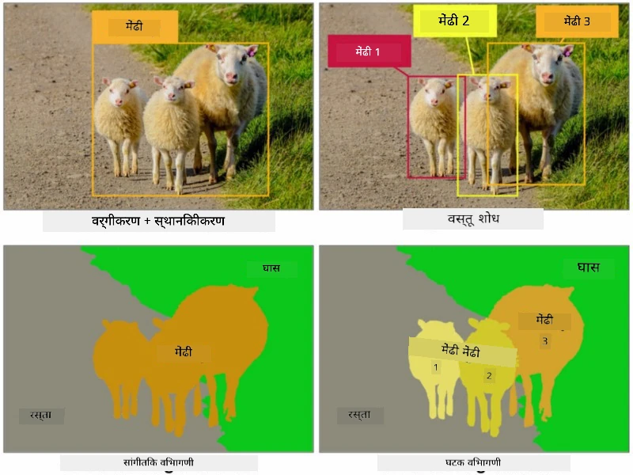
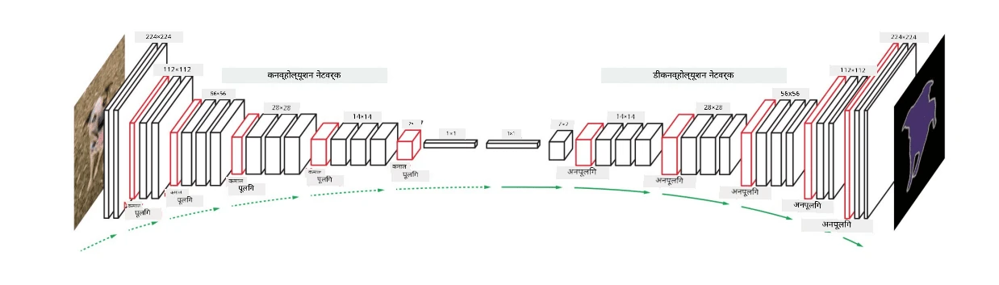

# विभागणी

आम्ही यापूर्वी ऑब्जेक्ट डिटेक्शनबद्दल शिकले आहे, ज्यामुळे आम्हाला प्रतिमेमध्ये वस्तूंचे स्थान शोधता येते आणि त्यांच्या *bounding boxes* ची भविष्यवाणी करता येते. परंतु, काही कार्यांसाठी आपल्याला फक्त bounding boxes पुरेसे नसून वस्तूंचे अधिक अचूक स्थान आवश्यक असते. या कार्याला **विभागणी** म्हणतात.

## [पूर्व-व्याख्यान प्रश्नमंजूषा](https://ff-quizzes.netlify.app/en/ai/quiz/23)

विभागणीला **पिक्सेल वर्गीकरण** म्हणून पाहिले जाऊ शकते, जिथे प्रतिमेतील **प्रत्येक** पिक्सेलसाठी त्याचा वर्ग (*background* हा वर्गांपैकी एक आहे) भविष्यवाणी करणे आवश्यक आहे. विभागणीसाठी दोन मुख्य अल्गोरिदम आहेत:

* **सामान्य विभागणी (Semantic segmentation)** फक्त पिक्सेलचा वर्ग सांगते आणि समान वर्गातील वेगवेगळ्या वस्तूंमध्ये फरक करत नाही.
* **इन्स्टन्स विभागणी (Instance segmentation)** वर्गांना वेगवेगळ्या उदाहरणांमध्ये विभागते.

उदाहरणार्थ, इन्स्टन्स विभागणीसाठी या मेंढ्या वेगवेगळ्या वस्तू आहेत, परंतु सामान्य विभागणीसाठी सर्व मेंढ्या एकाच वर्गाने दर्शविल्या जातात.

> प्रतिमा [या ब्लॉग पोस्टमधून](https://nirmalamurali.medium.com/image-classification-vs-semantic-segmentation-vs-instance-segmentation-625c33a08d50)

विभागणीसाठी वेगवेगळ्या न्यूरल आर्किटेक्चर आहेत, परंतु त्यांची रचना सारखीच असते. एका प्रकारे, हे तुम्ही यापूर्वी शिकलेल्या ऑटोएन्कोडरप्रमाणेच आहे, परंतु मूळ प्रतिमा डीकोड करण्याऐवजी, आपले लक्ष्य **मास्क** डीकोड करणे आहे. त्यामुळे, विभागणी नेटवर्कमध्ये खालील भाग असतात:

* **एन्कोडर** इनपुट प्रतिमेतून वैशिष्ट्ये काढतो.
* **डीकोडर** त्या वैशिष्ट्यांना **मास्क प्रतिमेमध्ये** रूपांतरित करतो, ज्याचा आकार आणि चॅनेलची संख्या वर्गांच्या संख्येशी संबंधित असते.

> प्रतिमा [या प्रकाशनातून](https://arxiv.org/pdf/2001.05566.pdf)

विभागणीसाठी वापरल्या जाणाऱ्या लॉस फंक्शनचा विशेष उल्लेख करणे आवश्यक आहे. पारंपरिक ऑटोएन्कोडर वापरताना, आपल्याला दोन प्रतिमांमधील समानता मोजावी लागते आणि त्यासाठी आपण mean square error (MSE) वापरू शकतो. विभागणीमध्ये, लक्ष्य मास्क प्रतिमेतील प्रत्येक पिक्सेल वर्ग क्रमांकाचे प्रतिनिधित्व करते (तिसऱ्या परिमाणावर एक-हॉट-एन्कोड केलेले), त्यामुळे वर्गीकरणासाठी विशिष्ट लॉस फंक्शन्स वापरणे आवश्यक आहे - क्रॉस-एंट्रॉपी लॉस, सर्व पिक्सेल्सवर सरासरी घेतलेले. जर मास्क बायनरी असेल - **बायनरी क्रॉस-एंट्रॉपी लॉस** (BCE) वापरला जातो.

> ✅ एक-हॉट एन्कोडिंग ही वर्ग लेबलला वर्गांच्या संख्येइतक्या लांबीच्या व्हेक्टरमध्ये एन्कोड करण्याची पद्धत आहे. [या लेखात](https://datagy.io/sklearn-one-hot-encode/) या तंत्राबद्दल अधिक जाणून घ्या.

## वैद्यकीय प्रतिमांसाठी विभागणी

या धड्यात, आपण विभागणी प्रत्यक्षात पाहू, जिथे नेटवर्कला वैद्यकीय प्रतिमांवर मानवी नेवी (म्हणजेच मोल्स) ओळखण्यासाठी प्रशिक्षण दिले जाईल. आम्ही <a href="https://www.fc.up.pt/addi/ph2%20database.html">PH2 डेटाबेस</a> वापरणार आहोत, जो डर्मोस्कोपी प्रतिमांचा स्रोत आहे. या डेटासेटमध्ये तीन वर्गांच्या 200 प्रतिमा आहेत: सामान्य नेव्हस, असामान्य नेव्हस, आणि मेलानोमा. सर्व प्रतिमांमध्ये नेव्हसची रूपरेषा असलेला **मास्क** देखील समाविष्ट आहे.

> ✅ ही तंत्र वैद्यकीय प्रतिमांसाठी विशेषतः योग्य आहे, परंतु तुम्ही इतर कोणत्या वास्तविक-जगातील अनुप्रयोगांची कल्पना करू शकता?

> प्रतिमा PH2 डेटाबेसमधून

आम्ही मॉडेलला त्याच्या पार्श्वभूमीपासून कोणताही नेव्हस विभागण्यासाठी प्रशिक्षण देऊ.

## ✍️ सराव: सामान्य विभागणी

खालील नोटबुक उघडा, वेगवेगळ्या सामान्य विभागणी आर्किटेक्चरबद्दल अधिक जाणून घ्या, त्यांच्यासोबत काम करण्याचा सराव करा आणि त्यांना प्रत्यक्षात पाहा.

* [सामान्य विभागणी PyTorch](SemanticSegmentationPytorch.ipynb)
* [सामान्य विभागणी TensorFlow](SemanticSegmentationTF.ipynb)

## [व्याख्यानानंतरची प्रश्नमंजूषा](https://ff-quizzes.netlify.app/en/ai/quiz/24)

## निष्कर्ष

विभागणी ही प्रतिमा वर्गीकरणासाठी एक अत्यंत शक्तिशाली तंत्र आहे, जी bounding boxes च्या पलीकडे जाऊन पिक्सेल-स्तरीय वर्गीकरण करते. हे वैद्यकीय प्रतिमांसह इतर अनेक अनुप्रयोगांमध्ये वापरले जाते.

## 🚀 आव्हान

शरीर विभागणी ही लोकांच्या प्रतिमांसह आपण करू शकणाऱ्या सामान्य कार्यांपैकी एक आहे. आणखी महत्त्वाची कार्ये म्हणजे **स्नायू शोधणे** आणि **स्थिती शोधणे**. [OpenPose](https://github.com/CMU-Perceptual-Computing-Lab/openpose) लायब्ररी वापरून स्थिती शोधणे कसे वापरले जाऊ शकते ते पाहा.

## पुनरावलोकन आणि स्व-अभ्यास

[विकिपीडिया लेख](https://wikipedia.org/wiki/Image_segmentation) या तंत्राच्या विविध अनुप्रयोगांचे चांगले विहंगावलोकन देते. या क्षेत्रातील इन्स्टन्स विभागणी आणि पॅनोप्टिक विभागणीच्या उपडोमेनबद्दल स्वतः अधिक जाणून घ्या.

## [असाइनमेंट](lab/README.md)

या प्रयोगशाळेत, [Segmentation Full Body MADS Dataset](https://www.kaggle.com/datasets/tapakah68/segmentation-full-body-mads-dataset) वापरून **मानवी शरीर विभागणी** करण्याचा प्रयत्न करा.

---

