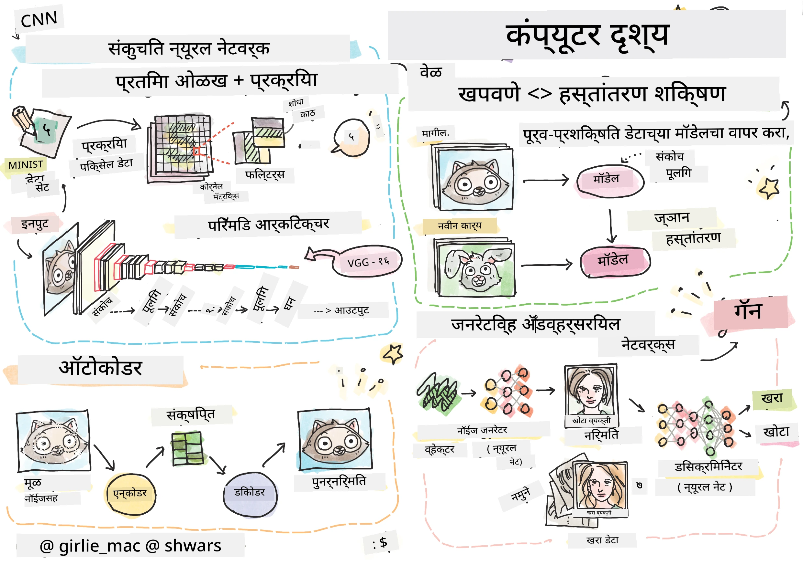

# संगणकीय दृष्टिकोन

या विभागात आपण शिकणार आहोत:

* [संगणकीय दृष्टिकोन आणि OpenCV ची ओळख](06-IntroCV/README.md)
* [कन्फ्युलेशनल न्यूरल नेटवर्क्स](07-ConvNets/README.md)
* [पूर्व-प्रशिक्षित नेटवर्क्स आणि ट्रान्सफर लर्निंग](08-TransferLearning/README.md) 
* [ऑटोएन्कोडर्स](09-Autoencoders/README.md)
* [जनरेटिव्ह अॅडव्हर्सेरियल नेटवर्क्स](10-GANs/README.md)
* [ऑब्जेक्ट डिटेक्शन](11-ObjectDetection/README.md)
* [सेमॅंटिक सेग्मेंटेशन](12-Segmentation/README.md)

**अस्वीकरण**:  
हा दस्तऐवज AI भाषांतर सेवा [Co-op Translator](https://github.com/Azure/co-op-translator) वापरून भाषांतरित करण्यात आला आहे. आम्ही अचूकतेसाठी प्रयत्नशील असलो तरी कृपया लक्षात ठेवा की स्वयंचलित भाषांतरांमध्ये त्रुटी किंवा अचूकतेचा अभाव असू शकतो. मूळ भाषेतील दस्तऐवज हा अधिकृत स्रोत मानला जावा. महत्त्वाच्या माहितीसाठी व्यावसायिक मानवी भाषांतराची शिफारस केली जाते. या भाषांतराचा वापर करून उद्भवलेल्या कोणत्याही गैरसमज किंवा चुकीच्या अर्थासाठी आम्ही जबाबदार राहणार नाही.