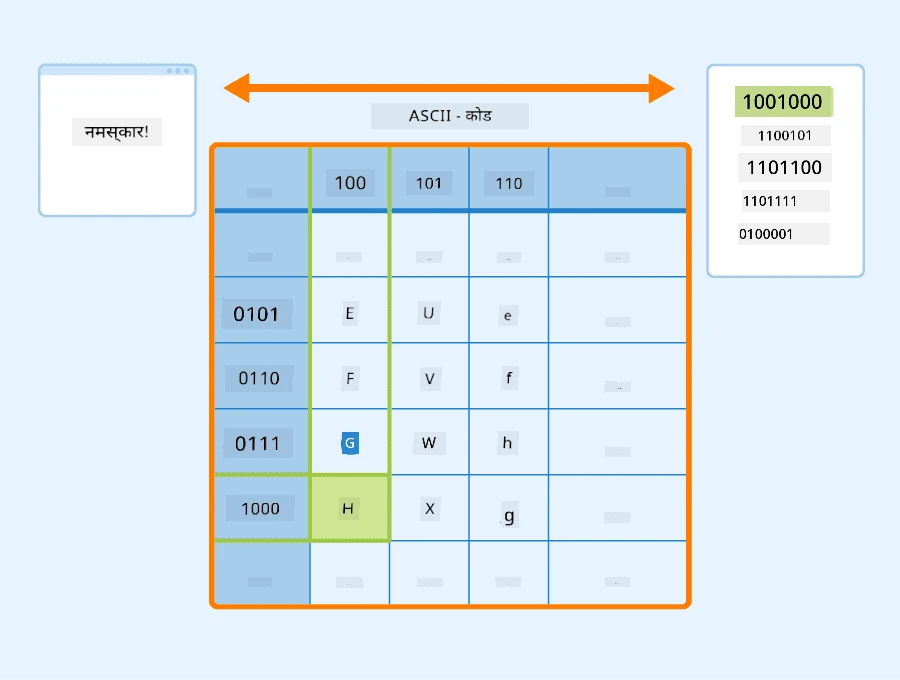
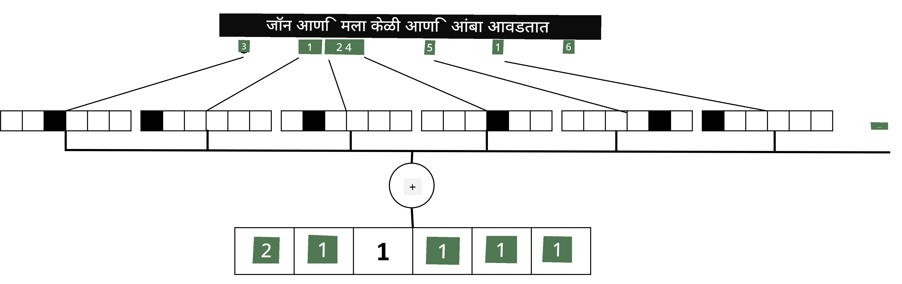

# टेक्स्टला टेन्सर्समध्ये दर्शवणे

## [पूर्व-व्याख्यान प्रश्नमंजुषा](https://ff-quizzes.netlify.app/en/ai/quiz/25)

## टेक्स्ट वर्गीकरण

या विभागाच्या पहिल्या भागात, आपण **टेक्स्ट वर्गीकरण** कार्यावर लक्ष केंद्रित करू. आपण [AG News](https://www.kaggle.com/amananandrai/ag-news-classification-dataset) डेटासेट वापरणार आहोत, ज्यामध्ये खालीलप्रमाणे बातम्या आहेत:

* श्रेणी: विज्ञान/तंत्रज्ञान
* शीर्षक: Ky. कंपनीला पेप्टाइड्सचा अभ्यास करण्यासाठी अनुदान मिळाले (AP)
* मजकूर: AP - लुईव्हिल विद्यापीठातील रसायनशास्त्र संशोधकाने स्थापन केलेल्या कंपनीला विकसित करण्यासाठी अनुदान मिळाले...

आपले उद्दिष्ट टेक्स्टच्या आधारे बातमी आयटमला एका श्रेणीत वर्गीकृत करणे असेल.

## टेक्स्टचे प्रतिनिधित्व

जर आपल्याला न्यूरल नेटवर्कसह नैसर्गिक भाषा प्रक्रिया (NLP) कार्ये सोडवायची असतील, तर आपल्याला टेक्स्टला टेन्सर्समध्ये दर्शविण्याचा काहीतरी मार्ग आवश्यक आहे. संगणक आधीच ASCII किंवा UTF-8 सारख्या एन्कोडिंगचा वापर करून स्क्रीनवरील फॉन्ट्ससाठी नकाशा असलेल्या क्रमांकांमध्ये टेक्स्ट वर्ण दर्शवतात.

> [प्रतिमा स्रोत](https://www.seobility.net/en/wiki/ASCII)

मानव म्हणून, आपल्याला प्रत्येक अक्षर **काय दर्शवते** हे समजते आणि सर्व वर्ण एकत्र येऊन वाक्याचे शब्द कसे तयार करतात हे समजते. परंतु, संगणक स्वतःच असे समजत नाहीत, आणि न्यूरल नेटवर्कला प्रशिक्षणादरम्यान अर्थ शिकावा लागतो.

म्हणूनच, टेक्स्टचे प्रतिनिधित्व करताना आपण वेगवेगळ्या पद्धती वापरू शकतो:

* **अक्षर-स्तरीय प्रतिनिधित्व**, ज्यामध्ये आपण प्रत्येक अक्षराला क्रमांक म्हणून विचार करून टेक्स्ट दर्शवतो. जर आपल्याकडे *C* वेगवेगळे अक्षरे असतील, तर *Hello* शब्द 5x*C* टेन्सरने दर्शवला जाईल. प्रत्येक अक्षर एक-हॉट एन्कोडिंगमध्ये टेन्सर स्तंभाशी संबंधित असेल.
* **शब्द-स्तरीय प्रतिनिधित्व**, ज्यामध्ये आपण आपल्या टेक्स्टमधील सर्व शब्दांचे **शब्दकोश** तयार करतो आणि नंतर एक-हॉट एन्कोडिंग वापरून शब्द दर्शवतो. ही पद्धत काहीशी चांगली आहे, कारण प्रत्येक अक्षर स्वतःला फारसा अर्थ देत नाही, आणि उच्च-स्तरीय अर्थपूर्ण संकल्पना - शब्द - वापरून आपण न्यूरल नेटवर्कसाठी कार्य सोपे करतो. परंतु, मोठ्या शब्दकोश आकारामुळे, आपल्याला उच्च-आयामी विरळ टेन्सर्स हाताळावे लागतात.

प्रतिनिधित्व कोणतेही असो, आपल्याला प्रथम टेक्स्टला **टोकन्स**च्या अनुक्रमात रूपांतरित करावे लागते, एक टोकन अक्षर, शब्द किंवा कधी कधी शब्दाचा भाग असतो. नंतर, आपण **शब्दकोश** वापरून टोकनला क्रमांकात रूपांतरित करतो, आणि हा क्रमांक एक-हॉट एन्कोडिंग वापरून न्यूरल नेटवर्कमध्ये दिला जाऊ शकतो.

## एन-ग्राम्स

नैसर्गिक भाषेत, शब्दांचा अचूक अर्थ फक्त संदर्भातच ठरवता येतो. उदाहरणार्थ, *न्यूरल नेटवर्क* आणि *फिशिंग नेटवर्क* यांचे अर्थ पूर्णपणे वेगळे आहेत. याचा विचार करण्याचा एक मार्ग म्हणजे आपल्या मॉडेलला शब्दांच्या जोड्यांवर आधारित करणे आणि शब्द जोड्यांना स्वतंत्र शब्दकोश टोकन्स म्हणून विचार करणे. अशा प्रकारे, *I like to go fishing* वाक्य खालील टोकन्सच्या अनुक्रमाने दर्शवले जाईल: *I like*, *like to*, *to go*, *go fishing*. या पद्धतीचा एक समस्या म्हणजे शब्दकोशाचा आकार लक्षणीय वाढतो, आणि *go fishing* आणि *go shopping* सारख्या संयोजनांना वेगळ्या टोकन्सने दर्शवले जाते, ज्यांना समान क्रियापद असूनही कोणताही अर्थपूर्ण समानता नसते.

काही प्रकरणांमध्ये, आपण त्रि-ग्राम्स -- तीन शब्दांच्या संयोजनांचा विचार करू शकतो. त्यामुळे ही पद्धत **एन-ग्राम्स** म्हणून ओळखली जाते. तसेच, अक्षर-स्तरीय प्रतिनिधित्वासह एन-ग्राम्स वापरणे अर्थपूर्ण ठरते, ज्यामुळे एन-ग्राम्स वेगवेगळ्या अक्षरसमूहाशी साधारणपणे संबंधित असतात.

## बॅग-ऑफ-वर्ड्स आणि TF/IDF

टेक्स्ट वर्गीकरणासारखी कार्ये सोडवताना, आपल्याला टेक्स्ट एका निश्चित-आकाराच्या व्हेक्टरने दर्शवता यायला हवे, ज्याचा वापर अंतिम घन वर्गीकर्त्यासाठी इनपुट म्हणून केला जाईल. हे करण्याचा एक सोपा मार्ग म्हणजे सर्व वैयक्तिक शब्दांचे प्रतिनिधित्व एकत्र करणे, उदा. त्यांना जोडणे. जर आपण प्रत्येक शब्दाचे एक-हॉट एन्कोडिंग जोडले, तर आपल्याला वारंवारतेचा व्हेक्टर मिळेल, जो दर्शवतो की प्रत्येक शब्द टेक्स्टमध्ये किती वेळा दिसतो. टेक्स्टचे असे प्रतिनिधित्व **बॅग ऑफ वर्ड्स** (BoW) म्हणून ओळखले जाते.

> लेखकाने तयार केलेली प्रतिमा

BoW मूलत: कोणते शब्द टेक्स्टमध्ये दिसतात आणि कोणत्या प्रमाणात हे दर्शवते, जे टेक्स्ट कशाबद्दल आहे याचे चांगले संकेत असू शकते. उदाहरणार्थ, राजकारणावरील बातमी लेखात *president* आणि *country* सारखे शब्द असण्याची शक्यता आहे, तर वैज्ञानिक प्रकाशनात *collider*, *discovered* इत्यादी शब्द असतील. त्यामुळे, शब्द वारंवारता अनेक प्रकरणांमध्ये टेक्स्टच्या सामग्रीचा चांगला संकेत असू शकतो.

BoW चा एक समस्या म्हणजे काही सामान्य शब्द, जसे *and*, *is* इत्यादी, बहुतेक टेक्स्टमध्ये दिसतात आणि त्यांची वारंवारता सर्वाधिक असते, ज्यामुळे खरोखर महत्त्वाचे शब्द झाकले जातात. आपण या शब्दांचे महत्त्व कमी करू शकतो जर आपण संपूर्ण दस्तऐवज संग्रहात शब्द किती वेळा दिसतात याचा विचार केला. हीच मुख्य कल्पना TF/IDF पद्धतीमागे आहे, जी या धड्याशी संलग्न नोटबुक्समध्ये अधिक तपशीलवार कव्हर केली आहे.

तथापि, या पद्धती टेक्स्टचा **अर्थ** पूर्णपणे विचारात घेऊ शकत नाहीत. हे करण्यासाठी आपल्याला अधिक शक्तिशाली न्यूरल नेटवर्क मॉडेल्सची आवश्यकता आहे, ज्याबद्दल आपण या विभागात नंतर चर्चा करू.

## ✍️ सराव: टेक्स्टचे प्रतिनिधित्व

खालील नोटबुक्समध्ये आपले शिक्षण सुरू ठेवा:

* [PyTorch सह टेक्स्टचे प्रतिनिधित्व](TextRepresentationPyTorch.ipynb)
* [TensorFlow सह टेक्स्टचे प्रतिनिधित्व](TextRepresentationTF.ipynb)

## निष्कर्ष

आतापर्यंत, आपण वेगवेगळ्या शब्दांना वारंवारतेचे वजन देण्याच्या तंत्रांचा अभ्यास केला आहे. तथापि, ते अर्थ किंवा क्रम दर्शवू शकत नाहीत. प्रसिद्ध भाषाशास्त्रज्ञ जे. आर. फर्थ यांनी 1935 मध्ये म्हटल्याप्रमाणे, "शब्दाचा संपूर्ण अर्थ नेहमीच संदर्भात्मक असतो, आणि संदर्भाशिवाय अर्थाचा अभ्यास गंभीरपणे घेतला जाऊ शकत नाही." आपण या अभ्यासक्रमात नंतर टेक्स्टमधून संदर्भात्मक माहिती कशी मिळवायची ते शिकू.

## 🚀 आव्हान

बॅग-ऑफ-वर्ड्स आणि वेगवेगळ्या डेटा मॉडेल्स वापरून काही इतर सराव करा. आपण या [Kaggle स्पर्धेने](https://www.kaggle.com/competitions/word2vec-nlp-tutorial/overview/part-1-for-beginners-bag-of-words) प्रेरित होऊ शकता.

## [व्याख्यानानंतरची प्रश्नमंजुषा](https://ff-quizzes.netlify.app/en/ai/quiz/26)

## पुनरावलोकन आणि स्व-अभ्यास

[Microsoft Learn](https://docs.microsoft.com/learn/modules/intro-natural-language-processing-pytorch/?WT.mc_id=academic-77998-cacaste) वर टेक्स्ट एम्बेडिंग्स आणि बॅग-ऑफ-वर्ड्स तंत्रांचा सराव करा.

## [असाइनमेंट: नोटबुक्स](assignment.md)

---

