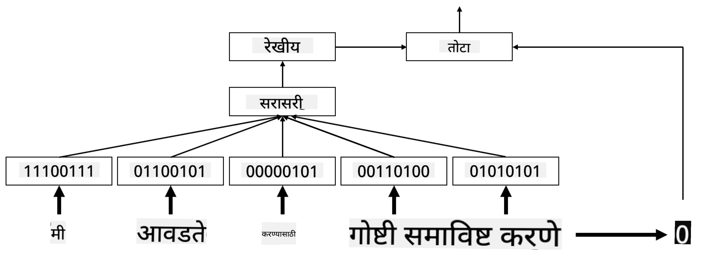

<!--
CO_OP_TRANSLATOR_METADATA:
{
  "original_hash": "e40b47ac3fd48f71304ede1474e66293",
  "translation_date": "2025-08-26T08:15:34+00:00",
  "source_file": "lessons/5-NLP/14-Embeddings/README.md",
  "language_code": "mr"
}
-->
# एम्बेडिंग्ज

## [पूर्व-व्याख्यान प्रश्नमंजुषा](https://red-field-0a6ddfd03.1.azurestaticapps.net/quiz/114)

जेव्हा आपण BoW किंवा TF/IDF आधारित वर्गीकरण करणारे मॉडेल्स प्रशिक्षण देतो, तेव्हा आपण `vocab_size` लांबीच्या उच्च-आयामी बॅग-ऑफ-वर्ड्स वेक्टरवर काम करतो आणि कमी-आयामी स्थानिक प्रतिनिधित्व वेक्टरला स्पष्टपणे विरळ वन-हॉट प्रतिनिधित्वात रूपांतरित करतो. मात्र, हे वन-हॉट प्रतिनिधित्व स्मृती-कार्यक्षम नाही. याशिवाय, प्रत्येक शब्द स्वतंत्रपणे हाताळला जातो, म्हणजेच वन-हॉट एन्कोड केलेले वेक्टर शब्दांमधील कोणतेही अर्थपूर्ण साम्य व्यक्त करत नाहीत.

**एम्बेडिंग** ही कल्पना म्हणजे शब्दांना कमी-आयामी घन वेक्टरद्वारे दर्शविणे, जे काही प्रमाणात शब्दाचा अर्थपूर्ण अर्थ प्रतिबिंबित करतात. आपण नंतर कसे अर्थपूर्ण शब्द एम्बेडिंग्ज तयार करायचे ते चर्चा करू, पण सध्या आपण एम्बेडिंग्जकडे शब्द वेक्टरची आयाम कमी करण्याचा एक मार्ग म्हणून पाहू.

तर, एम्बेडिंग लेयर एक शब्द इनपुट म्हणून घेईल आणि निर्दिष्ट `embedding_size` चा आउटपुट वेक्टर तयार करेल. एका अर्थाने, हे `Linear` लेयरसारखेच आहे, पण वन-हॉट एन्कोड केलेला वेक्टर घेण्याऐवजी, ते शब्द क्रमांक इनपुट म्हणून घेऊ शकेल, ज्यामुळे मोठे वन-हॉट-एन्कोडेड वेक्टर तयार करण्याची गरज टाळता येईल.

आपल्या वर्गीकरण नेटवर्कमध्ये पहिल्या लेयर म्हणून एम्बेडिंग लेयर वापरून, आपण बॅग-ऑफ-वर्ड्स मॉडेलऐवजी **एम्बेडिंग बॅग** मॉडेलकडे स्विच करू शकतो, जिथे आपण प्रथम आपल्या मजकुरातील प्रत्येक शब्द त्याच्या संबंधित एम्बेडिंगमध्ये रूपांतरित करतो आणि नंतर त्या सर्व एम्बेडिंग्जवर काही एकत्रित फंक्शन (जसे की `sum`, `average` किंवा `max`) गणना करतो.

> लेखकाने तयार केलेली प्रतिमा

## ✍️ सराव: एम्बेडिंग्ज

खालील नोटबुक्समध्ये तुमचे शिक्षण सुरू ठेवा:
* [PyTorch सह एम्बेडिंग्ज](../../../../../lessons/5-NLP/14-Embeddings/EmbeddingsPyTorch.ipynb)
* [TensorFlow सह एम्बेडिंग्ज](../../../../../lessons/5-NLP/14-Embeddings/EmbeddingsTF.ipynb)

## अर्थपूर्ण एम्बेडिंग्ज: Word2Vec

एम्बेडिंग लेयरने शब्दांना वेक्टर प्रतिनिधित्वात मॅप करायला शिकवले, मात्र, या प्रतिनिधित्वात फारसा अर्थपूर्ण अर्थ नव्हता. असे वेक्टर प्रतिनिधित्व शिकणे चांगले होईल की जिथे समान शब्द किंवा समानार्थी शब्द अशा वेक्टरशी संबंधित असतील जे काही वेक्टर अंतराच्या दृष्टीने एकमेकांच्या जवळ असतील (उदा. युक्लिडियन अंतर).

हे करण्यासाठी, आपल्याला विशिष्ट पद्धतीने मोठ्या मजकूर संग्रहावर आपले एम्बेडिंग मॉडेल पूर्व-प्रशिक्षित करणे आवश्यक आहे. अर्थपूर्ण एम्बेडिंग्ज प्रशिक्षण देण्याचा एक मार्ग [Word2Vec](https://en.wikipedia.org/wiki/Word2vec) म्हणून ओळखला जातो. हे दोन मुख्य आर्किटेक्चर्सवर आधारित आहे, जे शब्दांचे वितरित प्रतिनिधित्व तयार करण्यासाठी वापरले जातात:

 - **सतत बॅग-ऑफ-वर्ड्स** (CBoW) — या आर्किटेक्चरमध्ये, आपण संदर्भातून शब्दाचा अंदाज लावण्यासाठी मॉडेल प्रशिक्षण देतो. दिलेल्या ngram $(W_{-2},W_{-1},W_0,W_1,W_2)$ साठी, मॉडेलचे उद्दिष्ट $(W_{-2},W_{-1},W_1,W_2)$ वरून $W_0$ चा अंदाज लावणे आहे.
 - **सतत स्किप-ग्राम** CBoW च्या उलट आहे. मॉडेल संदर्भातील शब्दांच्या विंडोचा वापर करून सध्याचा शब्द अंदाज लावतो.

CBoW जलद आहे, तर स्किप-ग्राम हळू आहे, पण दुर्मिळ शब्दांचे चांगले प्रतिनिधित्व करते.

> [या पेपरमधून](https://arxiv.org/pdf/1301.3781.pdf) घेतलेली प्रतिमा

Word2Vec पूर्व-प्रशिक्षित एम्बेडिंग्ज (तसेच GloVe सारखी इतर समान मॉडेल्स) न्यूरल नेटवर्क्समधील एम्बेडिंग लेयरच्या जागी देखील वापरली जाऊ शकतात. मात्र, आपल्याला शब्दसंग्रह हाताळावे लागेल, कारण Word2Vec/GloVe पूर्व-प्रशिक्षित करण्यासाठी वापरलेला शब्दसंग्रह आपल्या मजकूर संग्रहातील शब्दसंग्रहापेक्षा वेगळा असण्याची शक्यता आहे. वरील नोटबुक्समध्ये या समस्येचे निराकरण कसे करायचे ते पाहा.

## संदर्भात्मक एम्बेडिंग्ज

Word2Vec सारख्या पारंपरिक पूर्व-प्रशिक्षित एम्बेडिंग्जचे एक महत्त्वाचे मर्यादन म्हणजे शब्द अर्थ अस्पष्टता समस्या. पूर्व-प्रशिक्षित एम्बेडिंग्ज संदर्भातील शब्दांचा काहीसा अर्थ पकडू शकतात, परंतु शब्दाचा प्रत्येक संभाव्य अर्थ त्याच एम्बेडिंगमध्ये एन्कोड केला जातो. यामुळे डाउनस्ट्रीम मॉडेल्समध्ये समस्या निर्माण होऊ शकतात, कारण अनेक शब्द, जसे की 'play', त्यांच्या वापराच्या संदर्भानुसार वेगवेगळे अर्थ दर्शवतात.

उदाहरणार्थ, 'play' या शब्दाचा खालील दोन वाक्यांमध्ये खूप वेगळा अर्थ आहे:

- मी थिएटरमध्ये एक **play** पाहायला गेलो.
- जॉनला त्याच्या मित्रांसोबत **play** करायचे आहे.

वरील पूर्व-प्रशिक्षित एम्बेडिंग्ज 'play' या शब्दाच्या दोन्ही अर्थांचे प्रतिनिधित्व त्याच एम्बेडिंगमध्ये करतात. या मर्यादेवर मात करण्यासाठी, आपल्याला **भाषा मॉडेल** आधारित एम्बेडिंग्ज तयार करणे आवश्यक आहे, जे मोठ्या मजकूर संग्रहावर प्रशिक्षण दिले जाते आणि *जाणते* की शब्द वेगवेगळ्या संदर्भांमध्ये कसे एकत्र ठेवले जाऊ शकतात. संदर्भात्मक एम्बेडिंग्जवर चर्चा करणे या ट्यूटोरियलच्या कक्षेबाहेर आहे, परंतु आपण नंतर भाषेच्या मॉडेल्सबद्दल बोलताना त्यांच्याकडे परत येऊ.

## निष्कर्ष

या धड्यात, तुम्ही TensorFlow आणि PyTorch मध्ये एम्बेडिंग लेयर्स कसे तयार करायचे आणि वापरायचे ते शिकलात, ज्यामुळे शब्दांचे अर्थपूर्ण अर्थ अधिक चांगल्या प्रकारे प्रतिबिंबित होतात.

## 🚀 आव्हान

Word2Vec काही मनोरंजक अनुप्रयोगांसाठी वापरले गेले आहे, ज्यामध्ये गाण्याचे बोल आणि कविता तयार करणे यांचा समावेश आहे. [या लेखावर](https://www.politetype.com/blog/word2vec-color-poems) एक नजर टाका, ज्यामध्ये लेखकाने Word2Vec वापरून कविता कशी तयार केली याचे वर्णन केले आहे. [डॅन शिफमन यांचा हा व्हिडिओ](https://www.youtube.com/watch?v=LSS_bos_TPI&ab_channel=TheCodingTrain) देखील पाहा, ज्यामध्ये या तंत्राची वेगळी व्याख्या दिली आहे. मग हे तंत्र कागलवरून मिळवलेल्या तुमच्या स्वतःच्या मजकूर संग्रहावर लागू करण्याचा प्रयत्न करा.

## [व्याख्यानानंतरची प्रश्नमंजुषा](https://red-field-0a6ddfd03.1.azurestaticapps.net/quiz/214)

## पुनरावलोकन आणि स्व-अभ्यास

Word2Vec वर हा पेपर वाचा: [Efficient Estimation of Word Representations in Vector Space](https://arxiv.org/pdf/1301.3781.pdf)

## [असाइनमेंट: नोटबुक्स](assignment.md)

**अस्वीकरण**:  
हा दस्तऐवज AI भाषांतर सेवा [Co-op Translator](https://github.com/Azure/co-op-translator) चा वापर करून भाषांतरित करण्यात आला आहे. आम्ही अचूकतेसाठी प्रयत्नशील असलो तरी, कृपया लक्षात घ्या की स्वयंचलित भाषांतरांमध्ये त्रुटी किंवा अचूकतेचा अभाव असू शकतो. मूळ भाषेतील मूळ दस्तऐवज हा अधिकृत स्रोत मानला जावा. महत्त्वाच्या माहितीसाठी, व्यावसायिक मानवी भाषांतराची शिफारस केली जाते. या भाषांतराचा वापर केल्यामुळे उद्भवणाऱ्या कोणत्याही गैरसमजुतींसाठी किंवा चुकीच्या अर्थ लावण्यास आम्ही जबाबदार राहणार नाही.