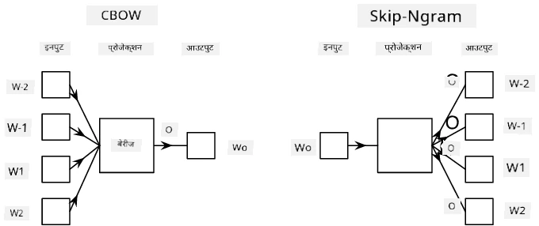

# भाषा मॉडेलिंग

सामान्य अर्थाने एम्बेडिंग्ज, जसे Word2Vec आणि GloVe, हे **भाषा मॉडेलिंग**कडे जाण्याचा पहिला टप्पा आहेत - असे मॉडेल तयार करणे जे काही प्रमाणात भाषेची *समज* (किंवा *प्रतिनिधित्व*) करू शकतात.

## [पूर्व-व्याख्यान प्रश्नमंजुषा](https://ff-quizzes.netlify.app/en/ai/quiz/29)

भाषा मॉडेलिंगमागील मुख्य कल्पना म्हणजे त्यांना लेबल नसलेल्या डेटासेटवर अनसुपरव्हाइज्ड पद्धतीने प्रशिक्षण देणे. हे महत्त्वाचे आहे कारण आपल्याकडे मोठ्या प्रमाणात लेबल नसलेला मजकूर उपलब्ध आहे, तर लेबल असलेल्या मजकुराचे प्रमाण नेहमीच मर्यादित असेल कारण लेबलिंगसाठी लागणाऱ्या प्रयत्नांवर मर्यादा असते. बहुतेक वेळा, आपण असे भाषा मॉडेल तयार करू शकतो जे मजकुरातील **गहाळ शब्दांची भविष्यवाणी** करू शकतात, कारण मजकुरातील एखादा शब्द सहजपणे लपवता येतो आणि तो प्रशिक्षण नमुना म्हणून वापरता येतो.

## एम्बेडिंग्जचे प्रशिक्षण

आमच्या मागील उदाहरणांमध्ये, आम्ही पूर्व-प्रशिक्षित सामान्य अर्थाने एम्बेडिंग्ज वापरल्या, परंतु हे पाहणे मनोरंजक आहे की त्या एम्बेडिंग्ज कशा प्रकारे प्रशिक्षित केल्या जाऊ शकतात. यासाठी काही शक्य कल्पना आहेत:

* **N-Gram** भाषा मॉडेलिंग, जिथे आपण N मागील टोकन पाहून एखाद्या टोकनची भविष्यवाणी करतो (N-gram).
* **कंटिन्युअस बॅग-ऑफ-वर्ड्स** (CBoW), जिथे आपण टोकन अनुक्रमातील मध्यवर्ती टोकन $W_0$ ची भविष्यवाणी करतो $W_{-N}$, ..., $W_N$.
* **स्किप-ग्राम**, जिथे आपण मध्यवर्ती टोकन $W_0$ पासून शेजारील टोकनांचा संच {$W_{-N},\dots, W_{-1}, W_1,\dots, W_N$} ची भविष्यवाणी करतो.

> [या पेपरमधून](https://arxiv.org/pdf/1301.3781.pdf) घेतलेली प्रतिमा

## ✍️ उदाहरण नोटबुक्स: CBoW मॉडेलचे प्रशिक्षण

खालील नोटबुक्समध्ये तुमचे शिक्षण सुरू ठेवा:

* [TensorFlow वापरून CBoW Word2Vec चे प्रशिक्षण](CBoW-TF.ipynb)
* [PyTorch वापरून CBoW Word2Vec चे प्रशिक्षण](CBoW-PyTorch.ipynb)

## निष्कर्ष

मागील धड्यात आपण पाहिले की शब्द एम्बेडिंग्ज जादूसारखे कार्य करतात! आता आपल्याला माहित आहे की शब्द एम्बेडिंग्जचे प्रशिक्षण देणे फारसे क्लिष्ट काम नाही, आणि जर गरज भासली तर आपण विशिष्ट क्षेत्रासाठी मजकुरासाठी स्वतःचे शब्द एम्बेडिंग्ज तयार करू शकतो.

## [व्याख्यानानंतरची प्रश्नमंजुषा](https://ff-quizzes.netlify.app/en/ai/quiz/30)

## पुनरावलोकन आणि स्व-अभ्यास

* [PyTorch च्या अधिकृत भाषा मॉडेलिंग ट्यूटोरियल](https://pytorch.org/tutorials/beginner/nlp/word_embeddings_tutorial.html).
* [TensorFlow च्या अधिकृत Word2Vec मॉडेल प्रशिक्षण ट्यूटोरियल](https://www.TensorFlow.org/tutorials/text/word2vec).
* **gensim** फ्रेमवर्क वापरून काही ओळींच्या कोडमध्ये सर्वसामान्य एम्बेडिंग्ज प्रशिक्षण देण्याचे वर्णन [या दस्तऐवजात](https://pytorch.org/tutorials/beginner/nlp/word_embeddings_tutorial.html).

## 🚀 [असाइनमेंट: स्किप-ग्राम मॉडेलचे प्रशिक्षण](lab/README.md)

प्रयोगशाळेत, आम्ही तुम्हाला या धड्याच्या कोडमध्ये बदल करून CBoW ऐवजी स्किप-ग्राम मॉडेल प्रशिक्षण देण्याचे आव्हान देतो. [तपशील वाचा](lab/README.md)

---

