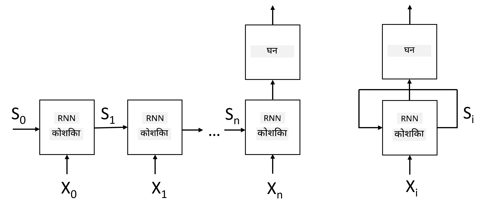
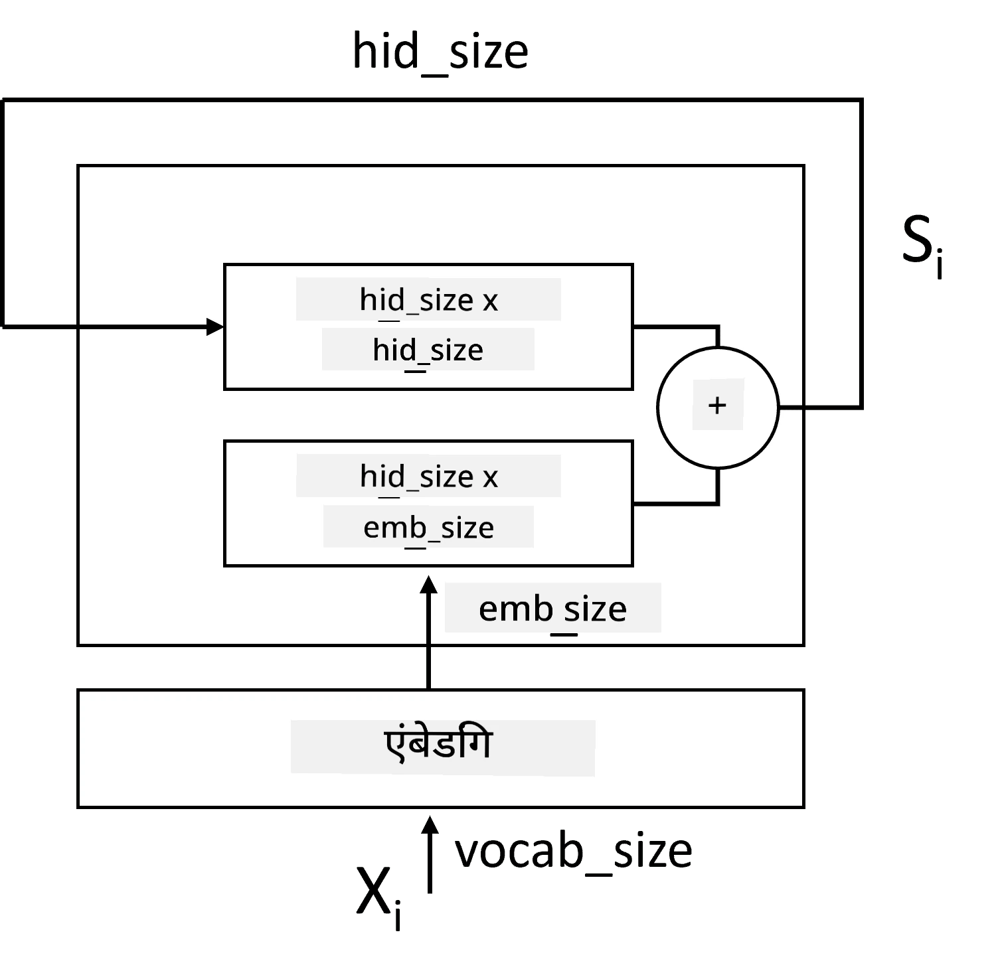
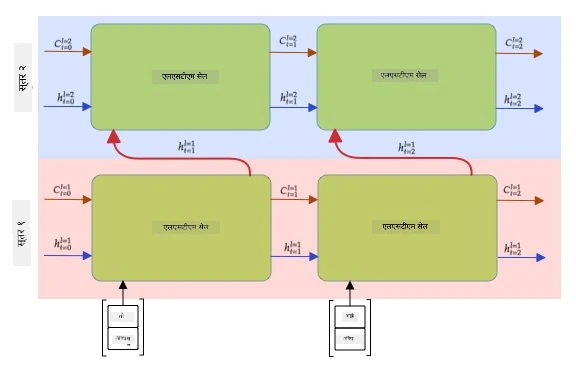

# पुनरावृत्ती तंत्रिका नेटवर्क्स

## [पूर्व-व्याख्यान प्रश्नमंजुषा](https://ff-quizzes.netlify.app/en/ai/quiz/31)

आधीच्या विभागांमध्ये, आपण मजकूराचे समृद्ध अर्थपूर्ण प्रतिनिधित्व आणि एम्बेडिंग्सवर आधारित साधा रेषीय वर्गीकरणकर्ता वापरत होतो. ही रचना वाक्यातील शब्दांचा एकत्रित अर्थ पकडते, परंतु ती शब्दांच्या **क्रम**ाचा विचार करत नाही, कारण एम्बेडिंग्सवरील एकत्रीकरण क्रिया मूळ मजकूरातील ही माहिती काढून टाकते. या मॉडेल्सना शब्दांच्या क्रमाची मांडणी करता येत नसल्यामुळे, ते मजकूर निर्मिती किंवा प्रश्नोत्तरासारख्या अधिक जटिल किंवा संदिग्ध कार्ये सोडवू शकत नाहीत.

मजकूर अनुक्रमाचा अर्थ पकडण्यासाठी, आपल्याला एक वेगळी तंत्रिका नेटवर्क रचना वापरावी लागते, ज्याला **पुनरावृत्ती तंत्रिका नेटवर्क** किंवा RNN म्हणतात. RNN मध्ये, आपण आपले वाक्य नेटवर्कमधून एकावेळी एक चिन्ह पाठवतो, आणि नेटवर्क काही **स्थिती** तयार करते, जी आपण पुढील चिन्हासह पुन्हा नेटवर्कमध्ये पाठवतो.

> लेखकाने तयार केलेले चित्र

X0,...,Xn या इनपुट टोकन अनुक्रम दिल्यास, RNN तंत्रिका नेटवर्क ब्लॉक्सची एक श्रेणी तयार करते आणि बॅकप्रोपोगेशन वापरून ही श्रेणी एंड-टू-एंड प्रशिक्षित करते. प्रत्येक नेटवर्क ब्लॉक (Xi,Si) या जोडीला इनपुट म्हणून घेतो आणि Si+1 परिणाम म्हणून तयार करतो. अंतिम स्थिती Sn किंवा (आउटपुट Yn) रेषीय वर्गीकरणकर्त्यामध्ये जाते जेणेकरून परिणाम तयार होईल. सर्व नेटवर्क ब्लॉक्स समान वजन सामायिक करतात आणि एक बॅकप्रोपोगेशन पास वापरून एंड-टू-एंड प्रशिक्षित केले जातात.

कारण स्थिती वेक्टर S0,...,Sn नेटवर्कमधून पास होतात, त्यामुळे ते शब्दांमधील अनुक्रमिक अवलंबित्व शिकू शकतात. उदाहरणार्थ, जेव्हा *not* हा शब्द अनुक्रमात कुठेतरी दिसतो, तेव्हा ते स्थिती वेक्टरमधील विशिष्ट घटक नकारात्मक करण्यासाठी शिकू शकते, ज्यामुळे नकार तयार होतो.

> ✅ वरील चित्रातील सर्व RNN ब्लॉक्सचे वजन सामायिक असल्यामुळे, तेच चित्र एका ब्लॉक (उजवीकडे) म्हणून दर्शवले जाऊ शकते ज्यामध्ये पुनरावृत्ती फीडबॅक लूप आहे, जो नेटवर्कचा आउटपुट स्थिती पुन्हा इनपुटमध्ये पाठवतो.

## RNN सेलचे रचना

चला पाहूया की एक साधा RNN सेल कसा आयोजित केला जातो. तो मागील स्थिती Si-1 आणि वर्तमान चिन्ह Xi इनपुट म्हणून स्वीकारतो आणि आउटपुट स्थिती Si तयार करतो (आणि, कधीकधी, आम्हाला काही अन्य आउटपुट Yi मध्येही रस असतो, जसे की जनरेटिव्ह नेटवर्क्सच्या बाबतीत).

साध्या RNN सेलमध्ये दोन वजन मॅट्रिसेस असतात: एक इनपुट चिन्ह रूपांतरित करते (त्याला W म्हणूया), आणि दुसरे इनपुट स्थिती रूपांतरित करते (H). या प्रकरणात नेटवर्कचा आउटपुट &sigma;(W&times;Xi+H&times;Si-1+b) म्हणून गणना केला जातो, जिथे &sigma; सक्रियता फंक्शन आहे आणि b अतिरिक्त बायस आहे.

> लेखकाने तयार केलेले चित्र

अनेक प्रकरणांमध्ये, इनपुट टोकन्स RNN मध्ये प्रवेश करण्यापूर्वी एम्बेडिंग लेयरमधून पास होतात जेणेकरून परिमाण कमी होईल. या प्रकरणात, जर इनपुट वेक्टरचे परिमाण *emb_size* असेल, आणि स्थिती वेक्टर *hid_size* असेल - तर W चे आकारमान *emb_size*&times;*hid_size* असेल, आणि H चे आकारमान *hid_size*&times;*hid_size* असेल.

## लांब-आवधी स्मृती (LSTM)

क्लासिकल RNN चे मुख्य समस्या म्हणजे **वॅनिशिंग ग्रेडियंट्स** समस्या. कारण RNN एकाच बॅकप्रोपोगेशन पासमध्ये एंड-टू-एंड प्रशिक्षित केले जातात, त्यामुळे नेटवर्कला पहिल्या स्तरांपर्यंत त्रुटी प्रसारित करण्यात अडचण येते, आणि त्यामुळे नेटवर्क दूरस्थ टोकन्समधील संबंध शिकू शकत नाही. ही समस्या टाळण्यासाठी **स्पष्ट स्थिती व्यवस्थापन** गेट्स वापरून सादर केले जाते. यासाठी दोन प्रसिद्ध रचना आहेत: **लांब-आवधी स्मृती** (LSTM) आणि **गेटेड रिले युनिट** (GRU).

> चित्र स्रोत TBD

LSTM नेटवर्क RNN प्रमाणेच आयोजित केले जाते, परंतु दोन स्थिती स्तर पास केल्या जातात: वास्तविक स्थिती C आणि लपवलेला वेक्टर H. प्रत्येक युनिटमध्ये, लपवलेला वेक्टर Hi इनपुट Xi सह जोडला जातो, आणि ते **गेट्स** वापरून स्थिती C मध्ये काय घडते ते नियंत्रित करतात. प्रत्येक गेट सिग्मॉइड सक्रियतेसह तंत्रिका नेटवर्क आहे (आउटपुट [0,1] श्रेणीत), जेव्हा स्थिती वेक्टरने गुणाकार केले जाते तेव्हा बिटवाइज मास्क म्हणून विचार केला जाऊ शकतो. खालील गेट्स आहेत (चित्रात डावीकडून उजवीकडे):

* **विस्मरण गेट** लपवलेला वेक्टर घेतो आणि वेक्टर C चे कोणते घटक विसरायचे आणि कोणते पास करायचे ते ठरवतो.
* **इनपुट गेट** इनपुट आणि लपवलेल्या वेक्टरमधून काही माहिती घेतो आणि ती स्थितीत घालतो.
* **आउटपुट गेट** स्थितीला *tanh* सक्रियतेसह रेषीय स्तराद्वारे रूपांतरित करते, नंतर नवीन स्थिती Ci+1 तयार करण्यासाठी लपवलेल्या वेक्टर Hi वापरून त्याचे काही घटक निवडतो.

स्थिती C चे घटक काही फ्लॅग्स म्हणून विचार केले जाऊ शकतात जे चालू आणि बंद केले जाऊ शकतात. उदाहरणार्थ, जेव्हा अनुक्रमात *Alice* नाव दिसते, तेव्हा आपण हे गृहीत धरू शकतो की ते एका स्त्री पात्राचा संदर्भ देते, आणि स्थितीत फ्लॅग उचलतो की वाक्यात स्त्रीलिंगी नाम आहे. जेव्हा पुढे *and Tom* वाक्यांश दिसतो, तेव्हा आपण फ्लॅग उचलतो की आपल्याकडे अनेकवचनी नाम आहे. अशा प्रकारे स्थिती हाताळून आपण वाक्य भागांच्या व्याकरणात्मक गुणधर्मांचा मागोवा ठेवू शकतो.

> ✅ LSTM चे अंतर्गत भाग समजून घेण्यासाठी एक उत्कृष्ट संसाधन म्हणजे क्रिस्टोफर ओलाह यांचा [Understanding LSTM Networks](https://colah.github.io/posts/2015-08-Understanding-LSTMs/) हा लेख.

## द्विदिशात्मक आणि बहुस्तरीय RNNs

आपण अशा पुनरावृत्ती नेटवर्क्सबद्दल चर्चा केली आहे जे एका दिशेने कार्य करतात, अनुक्रमाच्या सुरुवातीपासून शेवटापर्यंत. हे नैसर्गिक वाटते, कारण ते आपण वाचतो आणि भाषण ऐकतो त्या पद्धतीसारखे आहे. तथापि, अनेक व्यावहारिक प्रकरणांमध्ये आपल्याला इनपुट अनुक्रमात यादृच्छिक प्रवेश असल्यामुळे, पुनरावृत्ती गणना दोन्ही दिशांनी चालवणे योग्य ठरू शकते. अशा नेटवर्क्सना **द्विदिशात्मक** RNNs म्हणतात. द्विदिशात्मक नेटवर्क हाताळताना, आपल्याला प्रत्येक दिशेसाठी दोन लपवलेले स्थिती वेक्टर आवश्यक असतील.

पुनरावृत्ती नेटवर्क, एकदिशात्मक किंवा द्विदिशात्मक, अनुक्रमातील विशिष्ट नमुने पकडतो आणि त्यांना स्थिती वेक्टरमध्ये संग्रहित करतो किंवा आउटपुटमध्ये पास करतो. जसे की कॉनव्होल्यूशन नेटवर्क्ससह, आपण पहिल्या स्तराद्वारे काढलेल्या कमी-स्तरीय नमुन्यांपासून उच्च-स्तरीय नमुने पकडण्यासाठी पहिल्या स्तरावर आणखी एक पुनरावृत्ती स्तर तयार करू शकतो. यामुळे **बहुस्तरीय RNN** ची संकल्पना तयार होते, ज्यामध्ये दोन किंवा अधिक पुनरावृत्ती नेटवर्क्स असतात, जिथे मागील स्तराचा आउटपुट पुढील स्तराला इनपुट म्हणून पास केला जातो.

*चित्र [या उत्कृष्ट पोस्टमधून](https://towardsdatascience.com/from-a-lstm-cell-to-a-multilayer-lstm-network-with-pytorch-2899eb5696f3) फर्नांडो लोपेझ यांनी*

## ✍️ सराव: एम्बेडिंग्स

पुढील नोटबुक्समध्ये आपले शिक्षण सुरू ठेवा:

* [PyTorch सह RNNs](RNNPyTorch.ipynb)
* [TensorFlow सह RNNs](RNNTF.ipynb)

## निष्कर्ष

या युनिटमध्ये, आपण पाहिले की RNNs अनुक्रम वर्गीकरणासाठी वापरले जाऊ शकतात, परंतु प्रत्यक्षात, ते मजकूर निर्मिती, मशीन अनुवाद, आणि बरेच काही अशा अनेक कार्ये हाताळू शकतात. आपण पुढील युनिटमध्ये ती कार्ये विचारात घेऊ.

## 🚀 आव्हान

LSTMs बद्दल काही साहित्य वाचा आणि त्यांच्या अनुप्रयोगांचा विचार करा:

- [Grid Long Short-Term Memory](https://arxiv.org/pdf/1507.01526v1.pdf)
- [Show, Attend and Tell: Neural Image Caption
Generation with Visual Attention](https://arxiv.org/pdf/1502.03044v2.pdf)

## [व्याख्यानानंतर प्रश्नमंजुषा](https://ff-quizzes.netlify.app/en/ai/quiz/32)

## पुनरावलोकन आणि स्व-अभ्यास

- क्रिस्टोफर ओलाह यांचा [Understanding LSTM Networks](https://colah.github.io/posts/2015-08-Understanding-LSTMs/) हा लेख.

## [असाइनमेंट: नोटबुक्स](assignment.md)

---

