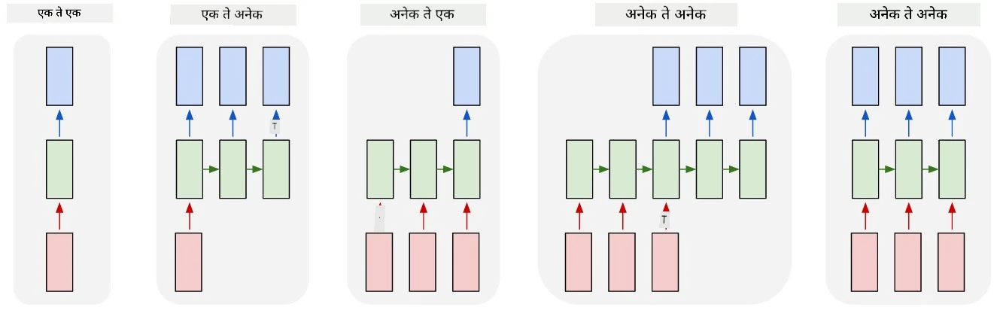
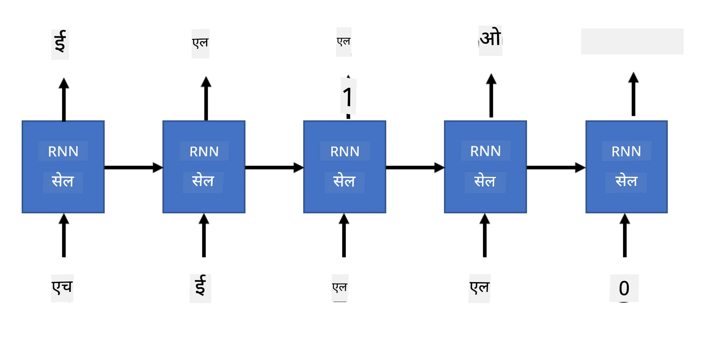

# जनरेटिव नेटवर्क्स

## [पूर्व-व्याख्यान प्रश्नमंजूषा](https://ff-quizzes.netlify.app/en/ai/quiz/33)

रीकरंट न्यूरल नेटवर्क्स (RNNs) आणि त्यांचे गेटेड सेल प्रकार जसे की लाँग शॉर्ट टर्म मेमरी सेल्स (LSTMs) आणि गेटेड रीकरंट युनिट्स (GRUs) भाषेचे मॉडेलिंग करण्यासाठी एक यंत्रणा प्रदान करतात, ज्यामुळे ते शब्दांची क्रमवारी शिकू शकतात आणि अनुक्रमातील पुढील शब्दासाठी अंदाज देऊ शकतात. यामुळे RNNs **जनरेटिव कार्यांसाठी** वापरणे शक्य होते, जसे की सामान्य मजकूर निर्मिती, मशीन अनुवाद, आणि प्रतिमेचे वर्णन तयार करणे.

> ✅ विचार करा की तुम्ही मजकूर पूर्ण करण्यासारख्या जनरेटिव कार्यांमुळे किती वेळा फायदा घेतला आहे. तुमच्या आवडत्या अॅप्लिकेशन्सबद्दल संशोधन करा आणि पाहा की त्यांनी RNNs वापरले आहेत का.

आम्ही मागील युनिटमध्ये चर्चा केलेल्या RNN आर्किटेक्चरमध्ये, प्रत्येक RNN युनिटने पुढील हिडन स्टेट आउटपुट म्हणून तयार केली. मात्र, आम्ही प्रत्येक रीकरंट युनिटला आणखी एक आउटपुट जोडू शकतो, ज्यामुळे आम्हाला **अनुक्रम** आउटपुट करणे शक्य होते (जे मूळ अनुक्रमाच्या लांबीसारखेच आहे). याशिवाय, आम्ही RNN युनिट्स वापरू शकतो जे प्रत्येक टप्प्यावर इनपुट स्वीकारत नाहीत, फक्त काही प्रारंभिक स्टेट वेक्टर घेतात आणि नंतर आउटपुट्सचा अनुक्रम तयार करतात.

यामुळे खालील चित्रात दाखवलेल्या विविध न्यूरल आर्किटेक्चर्स शक्य होतात:



> प्रतिमा ब्लॉग पोस्ट [Unreasonable Effectiveness of Recurrent Neural Networks](http://karpathy.github.io/2015/05/21/rnn-effectiveness/) मधून [Andrej Karpaty](http://karpathy.github.io/) यांनी तयार केलेली.

* **वन-टू-वन** पारंपरिक न्यूरल नेटवर्क आहे ज्यामध्ये एक इनपुट आणि एक आउटपुट असतो.
* **वन-टू-मेनी** एक जनरेटिव आर्किटेक्चर आहे जे एक इनपुट मूल्य स्वीकारते आणि आउटपुट मूल्यांचा अनुक्रम तयार करते. उदाहरणार्थ, जर आम्हाला **प्रतिमा वर्णन** नेटवर्क तयार करायचे असेल जे चित्राचे मजकूर वर्णन तयार करेल, तर आम्ही चित्र इनपुट म्हणून घेऊ शकतो, ते CNN मधून पास करून त्याचा हिडन स्टेट मिळवू शकतो, आणि नंतर रीकरंट चेनने शब्द-प्रत्येक शब्दाने वर्णन तयार करावे.
* **मेनी-टू-वन** मागील युनिटमध्ये वर्णन केलेल्या RNN आर्किटेक्चर्सशी संबंधित आहे, जसे की मजकूर वर्गीकरण.
* **मेनी-टू-मेनी**, किंवा **अनुक्रम-टू-अनुक्रम** अशा कार्यांशी संबंधित आहे जसे की **मशीन अनुवाद**, जिथे पहिला RNN इनपुट अनुक्रमातून सर्व माहिती हिडन स्टेटमध्ये गोळा करतो, आणि दुसरा RNN चेन त्या स्टेटला आउटपुट अनुक्रमात बदलतो.

या युनिटमध्ये, आम्ही मजकूर तयार करण्यासाठी मदत करणाऱ्या साध्या जनरेटिव मॉडेल्सवर लक्ष केंद्रित करू. सोपेपणासाठी, आम्ही कॅरेक्टर-लेव्हल टोकनायझेशन वापरू.

आम्ही या RNN ला टप्प्याटप्प्याने मजकूर तयार करण्यासाठी प्रशिक्षित करू. प्रत्येक टप्प्यावर, आम्ही `nchars` लांबीचा कॅरेक्टर अनुक्रम घेऊ आणि नेटवर्कला प्रत्येक इनपुट कॅरेक्टरसाठी पुढील आउटपुट कॅरेक्टर तयार करण्यास सांगू:



मजकूर तयार करताना (इन्फरन्स दरम्यान), आम्ही काही **प्रॉम्प्ट** पासून सुरुवात करतो, जे RNN सेल्समधून पास होते आणि त्याचा इंटरमीडिएट स्टेट तयार होतो, आणि नंतर त्या स्टेटमधून निर्मिती सुरू होते. आम्ही एकावेळी एक कॅरेक्टर तयार करतो आणि स्टेट आणि तयार केलेला कॅरेक्टर पुढील RNN सेलला पास करतो, जोपर्यंत पुरेसे कॅरेक्टर्स तयार होत नाहीत.


> लेखकाने तयार केलेली प्रतिमा

## ✍️ सराव: जनरेटिव नेटवर्क्स

खालील नोटबुक्समध्ये तुमचे शिक्षण सुरू ठेवा:

* [PyTorch सह जनरेटिव नेटवर्क्स](GenerativePyTorch.ipynb)
* [TensorFlow सह जनरेटिव नेटवर्क्स](GenerativeTF.ipynb)

## सॉफ्ट टेक्स्ट जनरेशन आणि टेम्परेचर

प्रत्येक RNN सेलचे आउटपुट कॅरेक्टर्सचे संभाव्यता वितरण असते. जर आम्ही नेहमीच सर्वाधिक संभाव्यता असलेल्या कॅरेक्टरला पुढील कॅरेक्टर म्हणून घेतले, तर तयार केलेला मजकूर अनेकदा "सायकल" होऊ शकतो, जसे की खालील उदाहरणात:

```
today of the second the company and a second the company ...
```

मात्र, जर आपण पुढील कॅरेक्टरसाठी संभाव्यता वितरण पाहिले, तर असे होऊ शकते की काही उच्च संभाव्यता असलेल्या कॅरेक्टर्समधील फरक फारसा मोठा नाही, उदा. एका कॅरेक्टरची संभाव्यता 0.2 असू शकते, तर दुसऱ्याची 0.19. उदाहरणार्थ, '*play*' अनुक्रमात पुढील कॅरेक्टर स्पेस किंवा **e** (जसे *player* शब्दात) असू शकतो.

यामुळे असे निष्कर्ष निघतो की नेहमीच उच्च संभाव्यता असलेल्या कॅरेक्टरला निवडणे "योग्य" नाही, कारण दुसऱ्या उच्च संभाव्यता असलेल्या कॅरेक्टरला निवडणे देखील अर्थपूर्ण मजकूर तयार करू शकते. नेटवर्क आउटपुटद्वारे दिलेल्या संभाव्यता वितरणातून कॅरेक्टर्स **नमुन्याने** निवडणे अधिक शहाणपणाचे आहे. आम्ही **टेम्परेचर** नावाचा पॅरामीटर वापरू शकतो, जो संभाव्यता वितरण अधिक सपाट करतो, जर आम्हाला अधिक रँडमनेस जोडायचा असेल, किंवा अधिक तीव्र करतो, जर आम्हाला उच्च संभाव्यता असलेल्या कॅरेक्टर्सकडे अधिक झुकायचे असेल.

वरील नोटबुक्समध्ये सॉफ्ट टेक्स्ट जनरेशन कसे अंमलात आणले जाते ते एक्सप्लोर करा.

## निष्कर्ष

मजकूर निर्मिती स्वतःच उपयुक्त असू शकते, परंतु मुख्य फायदे RNNs वापरून काही प्रारंभिक फीचर वेक्टरपासून मजकूर तयार करण्याच्या क्षमतेतून येतात. उदाहरणार्थ, मजकूर निर्मिती मशीन अनुवादाचा भाग म्हणून वापरली जाते (अनुक्रम-टू-अनुक्रम, या प्रकरणात *एन्कोडर* मधून स्टेट वेक्टर वापरून अनुवादित संदेश तयार किंवा *डिकोड* केला जातो), किंवा प्रतिमेचे मजकूर वर्णन तयार करण्यासाठी वापरली जाते (ज्या प्रकरणात फीचर वेक्टर CNN एक्स्ट्रॅक्टरमधून येतो).

## 🚀 आव्हान

या विषयावर Microsoft Learn वर काही धडे घ्या

* [PyTorch](https://docs.microsoft.com/learn/modules/intro-natural-language-processing-pytorch/6-generative-networks/?WT.mc_id=academic-77998-cacaste)/[TensorFlow](https://docs.microsoft.com/learn/modules/intro-natural-language-processing-tensorflow/5-generative-networks/?WT.mc_id=academic-77998-cacaste) सह मजकूर निर्मिती

## [व्याख्यानानंतरची प्रश्नमंजूषा](https://ff-quizzes.netlify.app/en/ai/quiz/34)

## पुनरावलोकन आणि स्व-अभ्यास

तुमचे ज्ञान वाढवण्यासाठी काही लेख येथे दिले आहेत:

* मार्कोव्ह चेन, LSTM आणि GPT-2 सह मजकूर निर्मितीचे विविध दृष्टिकोन: [ब्लॉग पोस्ट](https://towardsdatascience.com/text-generation-gpt-2-lstm-markov-chain-9ea371820e1e)
* [Keras दस्तऐवज](https://keras.io/examples/generative/lstm_character_level_text_generation/) मध्ये मजकूर निर्मितीचे उदाहरण

## [असाइनमेंट](lab/README.md)

आपण कॅरेक्टर-बाय-कॅरेक्टर मजकूर कसा तयार करायचा ते पाहिले आहे. प्रयोगशाळेत, तुम्ही शब्द-स्तरीय मजकूर निर्मिती एक्सप्लोर कराल.

---

