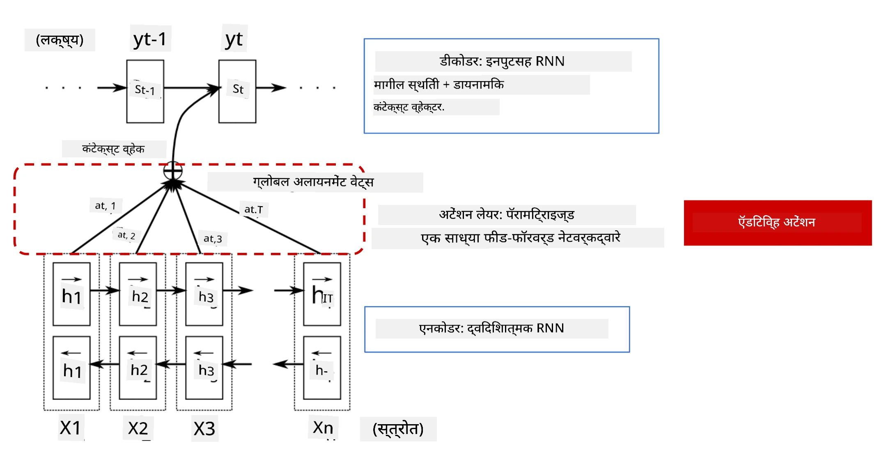
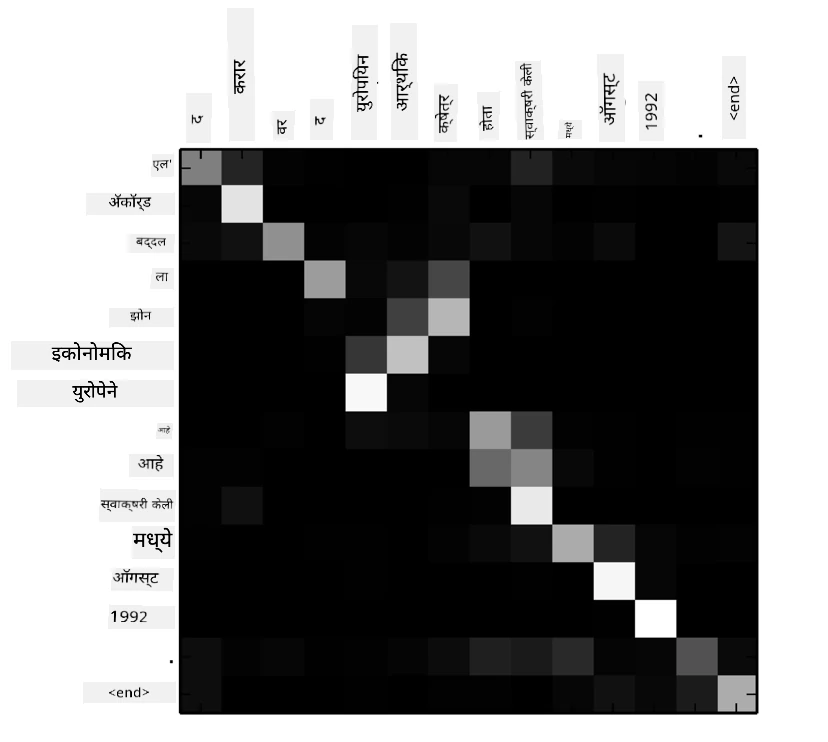
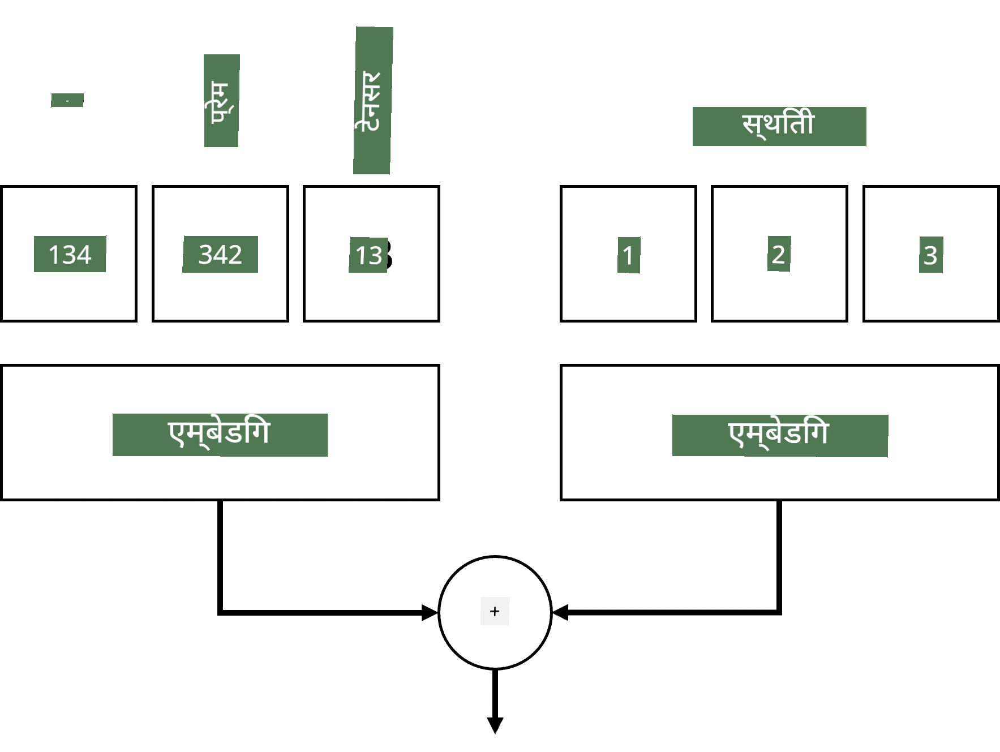
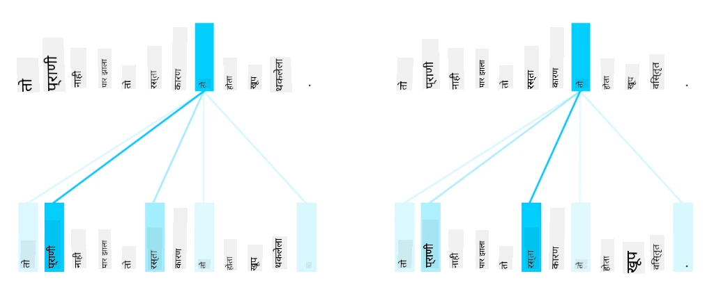
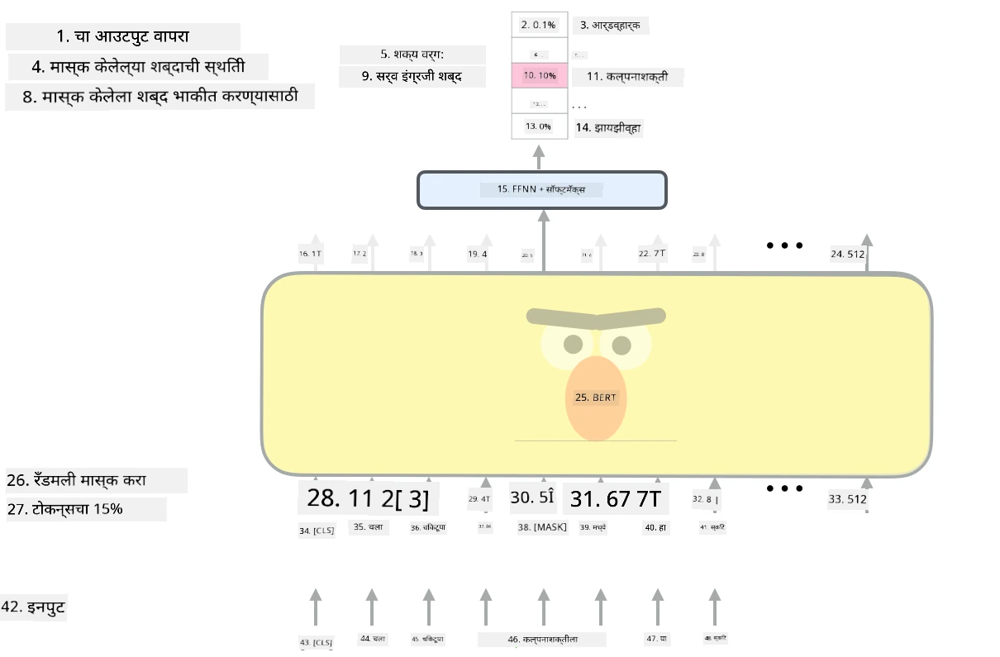

# लक्षवेध यंत्रणा आणि ट्रान्सफॉर्मर्स

## [पूर्व-व्याख्यान प्रश्नमंजुषा](https://ff-quizzes.netlify.app/en/ai/quiz/35)

NLP क्षेत्रातील सर्वात महत्त्वाच्या समस्यांपैकी एक म्हणजे **मशीन भाषांतर**, जे Google Translate सारख्या साधनांच्या मागे असलेले एक महत्त्वाचे कार्य आहे. या विभागात, आपण मशीन भाषांतरावर लक्ष केंद्रित करू, किंवा अधिक सामान्यतः, कोणत्याही *क्रम-ते-क्रम* कार्यावर (ज्याला **वाक्य रूपांतरण** असेही म्हणतात).

RNNs वापरून, क्रम-ते-क्रम दोन पुनरावृत्ती नेटवर्कद्वारे अंमलात आणले जाते, जिथे एक नेटवर्क, **एन्कोडर**, इनपुट क्रम एका लपवलेल्या स्थितीत संकुचित करते, तर दुसरे नेटवर्क, **डिकोडर**, त्या लपवलेल्या स्थितीतून भाषांतरित परिणाम तयार करते. या दृष्टिकोनासह काही समस्या आहेत:

* एन्कोडर नेटवर्कची अंतिम स्थिती वाक्याच्या सुरुवातीचा भाग लक्षात ठेवण्यात अडचण करते, ज्यामुळे लांब वाक्यांसाठी मॉडेलची गुणवत्ता कमी होते.
* क्रमातील सर्व शब्दांचा परिणामावर समान प्रभाव असतो. प्रत्यक्षात, मात्र, इनपुट क्रमातील विशिष्ट शब्दांचा अनुक्रमिक आउटपुटवर इतरांपेक्षा अधिक प्रभाव असतो.

**लक्षवेध यंत्रणा** प्रत्येक इनपुट व्हेक्टरच्या संदर्भात्मक प्रभावाचे वजन प्रत्येक RNN च्या आउटपुट अंदाजावर देण्याचा मार्ग प्रदान करते. हे अंमलात आणण्याचा मार्ग म्हणजे इनपुट RNN च्या मध्यवर्ती स्थिती आणि आउटपुट RNN दरम्यान शॉर्टकट तयार करणे. अशा प्रकारे, आउटपुट चिन्ह yt तयार करताना, आपण सर्व इनपुट लपवलेल्या स्थिती hi विचारात घेऊ, वेगवेगळ्या वजन गुणांक &alpha;t,i सह.

> [Bahdanau et al., 2015](https://arxiv.org/pdf/1409.0473.pdf) मधील अ‍ॅडिटिव्ह लक्षवेध यंत्रणा असलेले एन्कोडर-डिकोडर मॉडेल, [या ब्लॉग पोस्टमधून](https://lilianweng.github.io/lil-log/2018/06/24/attention-attention.html) उद्धृत.

लक्षवेध मॅट्रिक्स {&alpha;i,j} आउटपुट क्रमातील दिलेल्या शब्दाच्या निर्मितीत विशिष्ट इनपुट शब्द किती महत्त्वाची भूमिका बजावतात हे दर्शवेल. खाली अशा मॅट्रिक्सचे उदाहरण दिले आहे:

> [Bahdanau et al., 2015](https://arxiv.org/pdf/1409.0473.pdf) मधील आकृती (Fig.3)

लक्षवेध यंत्रणा NLP मधील सध्याच्या किंवा जवळपासच्या अत्याधुनिक स्थितीसाठी जबाबदार आहेत. लक्षवेध जोडल्याने मॉडेल पॅरामीटर्सची संख्या मोठ्या प्रमाणात वाढते, ज्यामुळे RNNs सह स्केलिंग समस्या निर्माण होतात. RNNs च्या स्केलिंगची एक प्रमुख अडचण म्हणजे मॉडेल्सची पुनरावृत्ती स्वरूपामुळे प्रशिक्षण बॅचिंग आणि समांतरित करणे कठीण होते. RNN मध्ये क्रमातील प्रत्येक घटक क्रमाने प्रक्रिया करणे आवश्यक असते, ज्याचा अर्थ असा की ते सहजपणे समांतरित करता येत नाही.

> [Google च्या ब्लॉग](https://research.googleblog.com/2016/09/a-neural-network-for-machine.html) मधून आकृती

लक्षवेध यंत्रणा आणि या अडचणींचा अवलंब केल्यामुळे आज आपण ओळखत असलेल्या अत्याधुनिक ट्रान्सफॉर्मर मॉडेल्सची निर्मिती झाली, जसे की BERT ते Open-GPT3.

## ट्रान्सफॉर्मर मॉडेल्स

ट्रान्सफॉर्मर्समागील मुख्य कल्पनांपैकी एक म्हणजे RNNs च्या क्रमवार स्वरूप टाळणे आणि प्रशिक्षणादरम्यान समांतरित करता येणारे मॉडेल तयार करणे. हे दोन कल्पना अंमलात आणून साध्य केले जाते:

* स्थानिक एन्कोडिंग
* RNNs (किंवा CNNs) ऐवजी नमुने पकडण्यासाठी स्व-लक्षवेध यंत्रणा वापरणे (म्हणूनच ट्रान्सफॉर्मर्स सादर करणारे पेपर *[Attention is all you need](https://arxiv.org/abs/1706.03762)* असे नाव दिले आहे)

### स्थानिक एन्कोडिंग/एम्बेडिंग

स्थानिक एन्कोडिंगची कल्पना पुढीलप्रमाणे आहे.  
1. RNNs वापरताना, टोकनची सापेक्ष स्थिती पायऱ्यांच्या संख्येद्वारे दर्शविली जाते, आणि म्हणून ती स्पष्टपणे दर्शविण्याची गरज नसते.  
2. मात्र, लक्षवेध वापरण्यास सुरुवात केल्यावर, आपल्याला क्रमातील टोकनच्या सापेक्ष स्थिती माहित असणे आवश्यक आहे.  
3. स्थानिक एन्कोडिंग मिळवण्यासाठी, आपण टोकनच्या क्रमासह क्रमातील टोकनच्या स्थितींचा क्रम (उदा. क्रमांक 0,1, ...) जोडतो.  
4. नंतर आपण टोकन स्थितीला टोकन एम्बेडिंग व्हेक्टरसह मिसळतो. स्थिती (पूर्णांक) व्हेक्टरमध्ये रूपांतरित करण्यासाठी, आपण वेगवेगळ्या पद्धती वापरू शकतो:

* टोकन एम्बेडिंगसारखे ट्रेन करण्यायोग्य एम्बेडिंग. ही पद्धत आपण येथे विचारात घेतो. आम्ही टोकन आणि त्यांच्या स्थितींवर एम्बेडिंग स्तर लागू करतो, परिणामी समान परिमाणांचे एम्बेडिंग व्हेक्टर मिळतात, जे आम्ही नंतर एकत्र जोडतो.
* मूळ पेपरमध्ये प्रस्तावित निश्चित स्थिती एन्कोडिंग फंक्शन.

> लेखकाने तयार केलेली प्रतिमा

स्थानिक एम्बेडिंगसह आपल्याला मिळणारा परिणाम मूळ टोकन आणि त्याची क्रमातील स्थिती दोन्ही एम्बेड करतो.

### मल्टी-हेड स्व-लक्षवेध

पुढे, आपल्याला आपल्या क्रमातील काही नमुने पकडणे आवश्यक आहे. हे करण्यासाठी, ट्रान्सफॉर्मर्स **स्व-लक्षवेध** यंत्रणा वापरतात, जी इनपुट आणि आउटपुट म्हणून समान क्रमावर लागू केलेले लक्षवेध आहे. स्व-लक्षवेध लागू केल्याने आपल्याला वाक्याच्या **संदर्भ** विचारात घेता येतो, आणि कोणते शब्द परस्पर संबंधित आहेत हे पाहता येते. उदाहरणार्थ, हे आपल्याला *it* सारख्या कोरफेरन्सद्वारे संदर्भित केलेले शब्द पाहण्यास अनुमती देते, तसेच संदर्भ विचारात घेण्यास मदत करते:

> [Google ब्लॉग](https://research.googleblog.com/2017/08/transformer-novel-neural-network.html) मधून प्रतिमा

ट्रान्सफॉर्मर्समध्ये, **मल्टी-हेड लक्षवेध** वापरले जाते जेणेकरून नेटवर्कला विविध प्रकारच्या अवलंबित्वे पकडण्याची क्षमता मिळेल, उदा. दीर्घकालीन विरुद्ध अल्पकालीन शब्द संबंध, कोरफेरन्स विरुद्ध इतर काही, इत्यादी.

[TensorFlow Notebook](TransformersTF.ipynb) मध्ये ट्रान्सफॉर्मर स्तरांच्या अंमलबजावणीबद्दल अधिक तपशील आहेत.

### एन्कोडर-डिकोडर लक्षवेध

ट्रान्सफॉर्मर्समध्ये, लक्षवेध दोन ठिकाणी वापरले जाते:

* इनपुट मजकुरातील नमुने पकडण्यासाठी स्व-लक्षवेध वापरणे
* क्रम भाषांतर करण्यासाठी - एन्कोडर आणि डिकोडर दरम्यानचा लक्षवेध स्तर.

एन्कोडर-डिकोडर लक्षवेध RNNs मध्ये वापरलेल्या लक्षवेध यंत्रणेसारखाच आहे, जसा या विभागाच्या सुरुवातीला वर्णन केला आहे. हा अ‍ॅनिमेटेड आकृती एन्कोडर-डिकोडर लक्षवेधाची भूमिका स्पष्ट करते.

प्रत्येक इनपुट स्थिती स्वतंत्रपणे प्रत्येक आउटपुट स्थितीशी नकाशित केली जाते, त्यामुळे ट्रान्सफॉर्मर्स RNNs पेक्षा चांगले समांतरित करू शकतात, ज्यामुळे खूप मोठे आणि अधिक अभिव्यक्तीक्षम भाषा मॉडेल सक्षम होतात. प्रत्येक लक्षवेध हेड शब्दांमधील विविध संबंध शिकण्यासाठी वापरला जाऊ शकतो, ज्यामुळे डाउनस्ट्रीम नैसर्गिक भाषा प्रक्रिया कार्ये सुधारतात.

## BERT

**BERT** (Bidirectional Encoder Representations from Transformers) हे 12 स्तरांसाठी *BERT-base* आणि 24 स्तरांसाठी *BERT-large* असलेले एक मोठे मल्टी-लेयर ट्रान्सफॉर्मर नेटवर्क आहे. मॉडेल प्रथम मोठ्या मजकूर डेटाच्या संग्रहावर (WikiPedia + पुस्तके) असंरचित प्रशिक्षण वापरून (वाक्यातील लपवलेले शब्द अंदाज करणे) पूर्व-प्रशिक्षित केले जाते. पूर्व-प्रशिक्षणादरम्यान मॉडेल महत्त्वपूर्ण स्तरांचा भाषा समज आत्मसात करते, ज्याचा नंतर इतर डेटासेटसह सूक्ष्म-ट्यूनिंगद्वारे लाभ घेतला जाऊ शकतो. या प्रक्रियेला **ट्रान्सफर लर्निंग** म्हणतात.

> प्रतिमा [स्रोत](http://jalammar.github.io/illustrated-bert/)

## ✍️ सराव: ट्रान्सफॉर्मर्स

पुढील नोटबुक्समध्ये आपले शिक्षण सुरू ठेवा:

* [PyTorch मध्ये ट्रान्सफॉर्मर्स](TransformersPyTorch.ipynb)
* [TensorFlow मध्ये ट्रान्सफॉर्मर्स](TransformersTF.ipynb)

## निष्कर्ष

या धड्यात आपण ट्रान्सफॉर्मर्स आणि लक्षवेध यंत्रणांबद्दल शिकले, जे NLP टूलबॉक्समधील आवश्यक साधने आहेत. ट्रान्सफॉर्मर आर्किटेक्चरमध्ये BERT, DistilBERT, BigBird, OpenGPT3 आणि अधिक यासह अनेक प्रकार आहेत, जे सूक्ष्म-ट्यून केले जाऊ शकतात. [HuggingFace पॅकेज](https://github.com/huggingface/) PyTorch आणि TensorFlow सह अनेक आर्किटेक्चर प्रशिक्षणासाठी रिपॉझिटरी प्रदान करते.

## 🚀 आव्हान

## [व्याख्यानानंतरची प्रश्नमंजुषा](https://ff-quizzes.netlify.app/en/ai/quiz/36)

## पुनरावलोकन आणि स्व-अभ्यास

* [ब्लॉग पोस्ट](https://mchromiak.github.io/articles/2017/Sep/12/Transformer-Attention-is-all-you-need/), ट्रान्सफॉर्मर्सवरील क्लासिकल [Attention is all you need](https://arxiv.org/abs/1706.03762) पेपर स्पष्ट करणारी.
* [ब्लॉग पोस्ट्सची मालिका](https://towardsdatascience.com/transformers-explained-visually-part-1-overview-of-functionality-95a6dd460452) ट्रान्सफॉर्मर्सवर, आर्किटेक्चर तपशीलवार स्पष्ट करणारी.

## [असाइनमेंट](assignment.md)

---

