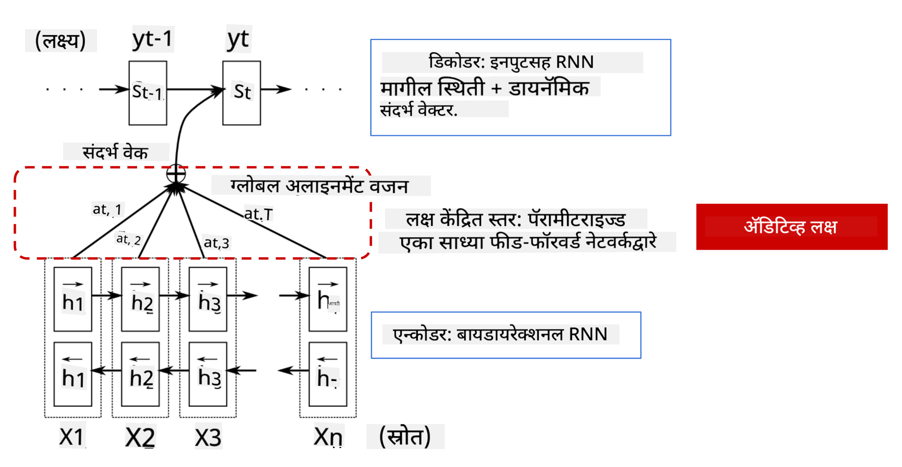

<!--
CO_OP_TRANSLATOR_METADATA:
{
  "original_hash": "7e617f0b8de85a43957a853aba09bfeb",
  "translation_date": "2025-08-26T08:35:57+00:00",
  "source_file": "lessons/5-NLP/18-Transformers/README.md",
  "language_code": "mr"
}
-->
# अटेन्शन मेकॅनिझम्स आणि ट्रान्सफॉर्मर्स

## [पूर्व-व्याख्यान क्विझ](https://red-field-0a6ddfd03.1.azurestaticapps.net/quiz/118)

NLP क्षेत्रातील सर्वात महत्त्वाच्या समस्यांपैकी एक म्हणजे **मशीन ट्रान्सलेशन**, जी Google Translate सारख्या साधनांच्या मागील महत्त्वाची कार्यप्रणाली आहे. या विभागात, आपण मशीन ट्रान्सलेशनवर लक्ष केंद्रित करू, किंवा अधिक सामान्यतः, कोणत्याही *सीक्वेन्स-टू-सीक्वेन्स* कार्यावर (ज्याला **सेंटन्स ट्रान्सडक्शन** असेही म्हणतात).

RNNs च्या मदतीने, सीक्वेन्स-टू-सीक्वेन्स दोन पुनरावृत्ती नेटवर्क्सद्वारे अंमलात आणले जाते, जिथे एक नेटवर्क, **एन्कोडर**, इनपुट सीक्वेन्सला एका हिडन स्टेटमध्ये संकुचित करते, तर दुसरे नेटवर्क, **डिकोडर**, त्या हिडन स्टेटला अनुवादित परिणामामध्ये उलगडते. या दृष्टिकोनासोबत काही समस्या आहेत:

* एन्कोडर नेटवर्कची अंतिम स्थिती वाक्याच्या सुरुवातीचा भाग लक्षात ठेवण्यात अडचण येते, ज्यामुळे लांब वाक्यांसाठी मॉडेलची गुणवत्ता कमी होते.
* सीक्वेन्समधील सर्व शब्दांचा परिणामावर समान प्रभाव असतो. प्रत्यक्षात, मात्र, इनपुट सीक्वेन्समधील विशिष्ट शब्दांचा अनुक्रमिक आउटपुटवर इतरांपेक्षा अधिक प्रभाव असतो.

**अटेन्शन मेकॅनिझम्स** प्रत्येक इनपुट व्हेक्टरच्या संदर्भात्मक प्रभावाचे वजन प्रत्येक आउटपुट प्रेडिक्शनवर देण्याचा एक मार्ग प्रदान करतात. हे अंमलात आणण्याचा मार्ग म्हणजे इनपुट RNN च्या इंटरमीडिएट स्टेट्स आणि आउटपुट RNN दरम्यान शॉर्टकट तयार करणे. अशा प्रकारे, आउटपुट चिन्ह yt तयार करताना, आपण सर्व इनपुट हिडन स्टेट्स hi विचारात घेऊ, वेगवेगळ्या वजन गुणांक αt,i सह.

> [Bahdanau et al., 2015](https://arxiv.org/pdf/1409.0473.pdf) मधील अॅडिटिव्ह अटेन्शन मेकॅनिझमसह एन्कोडर-डिकोडर मॉडेल, [या ब्लॉग पोस्टमधून](https://lilianweng.github.io/lil-log/2018/06/24/attention-attention.html) उद्धृत

अटेन्शन मॅट्रिक्स {αi,j} हे दर्शवेल की इनपुट सीक्वेन्समधील विशिष्ट शब्द आउटपुट सीक्वेन्समधील दिलेल्या शब्दाच्या निर्मितीत किती महत्त्वाचा आहे. खाली अशा मॅट्रिक्सचे एक उदाहरण दिले आहे:

> [Bahdanau et al., 2015](https://arxiv.org/pdf/1409.0473.pdf) (Fig.3) मधील आकृती

अटेन्शन मेकॅनिझम्स NLP मधील सध्याच्या किंवा जवळपासच्या अत्याधुनिक स्थितीसाठी जबाबदार आहेत. मात्र, अटेन्शन जोडल्याने मॉडेल पॅरामीटर्सची संख्या मोठ्या प्रमाणात वाढते, ज्यामुळे RNNs सह स्केलिंग समस्या निर्माण होतात. RNNs च्या स्केलिंगसाठी एक महत्त्वाचे बंधन म्हणजे मॉडेल्सची पुनरावृत्तीशील प्रकृती, ज्यामुळे प्रशिक्षण बॅच करणे आणि पॅरललाइज करणे कठीण होते. RNN मध्ये, सीक्वेन्समधील प्रत्येक घटक क्रमाने प्रक्रिया करणे आवश्यक असते, ज्याचा अर्थ तो सहजपणे पॅरललाइज केला जाऊ शकत नाही.

> [Google च्या ब्लॉग](https://research.googleblog.com/2016/09/a-neural-network-for-machine.html) मधील आकृती

अटेन्शन मेकॅनिझम्सचा अवलंब आणि या बंधनामुळे आज आपण ओळखत असलेल्या आणि वापरत असलेल्या अत्याधुनिक ट्रान्सफॉर्मर मॉडेल्सची निर्मिती झाली, जसे की BERT ते Open-GPT3.

## ट्रान्सफॉर्मर मॉडेल्स

ट्रान्सफॉर्मर्समागील मुख्य कल्पनांपैकी एक म्हणजे RNNs च्या अनुक्रमिक स्वरूपाला टाळणे आणि प्रशिक्षणादरम्यान पॅरललाइज करण्यायोग्य मॉडेल तयार करणे. हे दोन कल्पना अंमलात आणून साध्य केले जाते:

* पोझिशनल एन्कोडिंग
* RNNs (किंवा CNNs) च्या ऐवजी पॅटर्न्स कॅप्चर करण्यासाठी सेल्फ-अटेन्शन मेकॅनिझम वापरणे (म्हणूनच ट्रान्सफॉर्मर्स सादर करणाऱ्या पेपरचे नाव आहे *[Attention is all you need](https://arxiv.org/abs/1706.03762)*)

### पोझिशनल एन्कोडिंग/एम्बेडिंग

पोझिशनल एन्कोडिंगची कल्पना पुढीलप्रमाणे आहे.  
1. RNNs वापरताना, टोकन्सची सापेक्ष स्थिती स्टेप्सच्या संख्येद्वारे दर्शविली जाते, आणि म्हणून ती स्पष्टपणे दर्शविण्याची गरज नाही.  
2. मात्र, अटेन्शनवर स्विच केल्यावर, आपल्याला सीक्वेन्समधील टोकन्सच्या सापेक्ष स्थिती माहित असणे आवश्यक आहे.  
3. पोझिशनल एन्कोडिंग मिळविण्यासाठी, आपण आपल्या टोकन्सच्या सीक्वेन्समध्ये टोकन पोझिशन्सची सीक्वेन्स (उदा., 0,1, ...) जोडतो.  
4. नंतर आपण टोकन पोझिशनला टोकन एम्बेडिंग व्हेक्टरसह मिसळतो. पोझिशन (पूर्णांक) व्हेक्टरमध्ये रूपांतरित करण्यासाठी, आपण वेगवेगळ्या दृष्टिकोनांचा अवलंब करू शकतो:

* टोकन एम्बेडिंगसारखेच ट्रेन करण्यायोग्य एम्बेडिंग. येथे आपण हा दृष्टिकोन विचारात घेतो. आम्ही टोकन्स आणि त्यांच्या पोझिशन्सवर एम्बेडिंग लेयर्स लागू करतो, ज्यामुळे समान परिमाणांचे एम्बेडिंग व्हेक्टर तयार होतात, जे आम्ही नंतर एकत्र करतो.
* मूळ पेपरमध्ये प्रस्तावित निश्चित पोझिशन एन्कोडिंग फंक्शन.

> लेखकाने तयार केलेली प्रतिमा

पोझिशनल एम्बेडिंगसह आपल्याला मिळणारा परिणाम मूळ टोकन आणि त्याच्या सीक्वेन्समधील स्थिती दोन्ही एम्बेड करतो.

### मल्टी-हेड सेल्फ-अटेन्शन

यानंतर, आपल्याला आपल्या सीक्वेन्समधील काही पॅटर्न्स कॅप्चर करणे आवश्यक आहे. हे करण्यासाठी, ट्रान्सफॉर्मर्स **सेल्फ-अटेन्शन** मेकॅनिझम वापरतात, जो इनपुट आणि आउटपुट म्हणून समान सीक्वेन्सवर लागू केलेला अटेन्शन आहे. सेल्फ-अटेन्शन लागू केल्याने आपल्याला वाक्याच्या संदर्भाचा विचार करता येतो आणि कोणते शब्द परस्पर संबंधित आहेत हे पाहता येते. उदाहरणार्थ, हे आपल्याला *it* सारख्या कोरफरन्सेसद्वारे संदर्भित केलेले शब्द पाहण्यास अनुमती देते आणि संदर्भाचा विचार करते:

> [Google ब्लॉग](https://research.googleblog.com/2017/08/transformer-novel-neural-network.html) मधील प्रतिमा

ट्रान्सफॉर्मर्समध्ये, आम्ही **मल्टी-हेड अटेन्शन** वापरतो, ज्यामुळे नेटवर्कला विविध प्रकारच्या अवलंबित्व कॅप्चर करण्याची क्षमता मिळते, उदा. दीर्घकालीन विरुद्ध अल्पकालीन शब्दसंबंध, को-रेफरन्स विरुद्ध इतर काही, इत्यादी.

[TensorFlow Notebook](../../../../../lessons/5-NLP/18-Transformers/TransformersTF.ipynb) मध्ये ट्रान्सफॉर्मर लेयर्सच्या अंमलबजावणीबद्दल अधिक तपशील आहेत.

### एन्कोडर-डिकोडर अटेन्शन

ट्रान्सफॉर्मर्समध्ये, अटेन्शन दोन ठिकाणी वापरले जाते:

* इनपुट मजकुरातील पॅटर्न्स कॅप्चर करण्यासाठी सेल्फ-अटेन्शन वापरून
* सीक्वेन्स ट्रान्सलेशन करण्यासाठी - हे एन्कोडर आणि डिकोडर दरम्यानचे अटेन्शन लेयर आहे.

एन्कोडर-डिकोडर अटेन्शन RNNs मध्ये वापरल्या जाणाऱ्या अटेन्शन मेकॅनिझमसारखेच आहे, जसे की या विभागाच्या सुरुवातीला वर्णन केले आहे. ही अॅनिमेटेड आकृती एन्कोडर-डिकोडर अटेन्शनची भूमिका स्पष्ट करते.

प्रत्येक इनपुट पोझिशन स्वतंत्रपणे प्रत्येक आउटपुट पोझिशनशी मॅप केल्यामुळे, ट्रान्सफॉर्मर्स RNNs पेक्षा चांगले पॅरललाइज करू शकतात, ज्यामुळे खूप मोठे आणि अधिक अभिव्यक्तीक्षम भाषा मॉडेल्स सक्षम होतात. प्रत्येक अटेन्शन हेड वेगवेगळ्या शब्दांमधील संबंध शिकण्यासाठी वापरला जाऊ शकतो, ज्यामुळे नैसर्गिक भाषा प्रक्रिया कार्ये सुधारतात.

## BERT

**BERT** (Bidirectional Encoder Representations from Transformers) हे 12 लेयर्ससाठी *BERT-base* आणि 24 लेयर्ससाठी *BERT-large* असलेले खूप मोठे मल्टी लेयर ट्रान्सफॉर्मर नेटवर्क आहे. मॉडेलला प्रथम मोठ्या मजकूर डेटाच्या संग्रहावर (WikiPedia + पुस्तके) अनसुपरवाइज्ड प्रशिक्षण (वाक्यातील मास्क केलेले शब्द भाकीत करणे) वापरून प्री-ट्रेन केले जाते. प्री-ट्रेनिंग दरम्यान मॉडेल महत्त्वाच्या भाषिक समजुती आत्मसात करते, ज्याचा नंतर इतर डेटासेट्ससह फाइन ट्यूनिंगद्वारे लाभ घेतला जाऊ शकतो. या प्रक्रियेला **ट्रान्सफर लर्निंग** म्हणतात.

> प्रतिमा [स्रोत](http://jalammar.github.io/illustrated-bert/)

## ✍️ सराव: ट्रान्सफॉर्मर्स

खालील नोटबुक्समध्ये तुमचे शिक्षण सुरू ठेवा:

* [PyTorch मधील ट्रान्सफॉर्मर्स](../../../../../lessons/5-NLP/18-Transformers/TransformersPyTorch.ipynb)
* [TensorFlow मधील ट्रान्सफॉर्मर्स](../../../../../lessons/5-NLP/18-Transformers/TransformersTF.ipynb)

## निष्कर्ष

या धड्यात तुम्ही ट्रान्सफॉर्मर्स आणि अटेन्शन मेकॅनिझम्सबद्दल शिकलात, जे NLP टूलबॉक्समधील महत्त्वाचे साधन आहेत. ट्रान्सफॉर्मर आर्किटेक्चर्सच्या अनेक प्रकारांमध्ये BERT, DistilBERT, BigBird, OpenGPT3 आणि अधिक समाविष्ट आहेत, जे फाइन ट्यून केले जाऊ शकतात. [HuggingFace पॅकेज](https://github.com/huggingface/) PyTorch आणि TensorFlow सह या आर्किटेक्चर्सपैकी अनेकांचे प्रशिक्षण घेण्यासाठी रिपॉझिटरी प्रदान करते.

## 🚀 आव्हान

## [व्याख्यानानंतरचा क्विझ](https://red-field-0a6ddfd03.1.azurestaticapps.net/quiz/218)

## पुनरावलोकन आणि स्व-अभ्यास

* [ब्लॉग पोस्ट](https://mchromiak.github.io/articles/2017/Sep/12/Transformer-Attention-is-all-you-need/), ट्रान्सफॉर्मर्सवरील क्लासिकल [Attention is all you need](https://arxiv.org/abs/1706.03762) पेपर स्पष्ट करणारी.
* [ब्लॉग पोस्ट्सची मालिका](https://towardsdatascience.com/transformers-explained-visually-part-1-overview-of-functionality-95a6dd460452), ट्रान्सफॉर्मर्सचे आर्किटेक्चर तपशीलवार स्पष्ट करणारी.

## [असाइनमेंट](assignment.md)

**अस्वीकरण**:  
हा दस्तऐवज AI भाषांतर सेवा [Co-op Translator](https://github.com/Azure/co-op-translator) वापरून भाषांतरित केला गेला आहे. आम्ही अचूकतेसाठी प्रयत्नशील असलो तरी, कृपया लक्षात घ्या की स्वयंचलित भाषांतरांमध्ये त्रुटी किंवा अचूकतेचा अभाव असू शकतो. मूळ भाषेतील मूळ दस्तऐवज हा अधिकृत स्रोत मानला जावा. महत्त्वाच्या माहितीसाठी, व्यावसायिक मानवी भाषांतराची शिफारस केली जाते. या भाषांतराचा वापर करून उद्भवलेल्या कोणत्याही गैरसमज किंवा चुकीच्या अर्थासाठी आम्ही जबाबदार राहणार नाही.