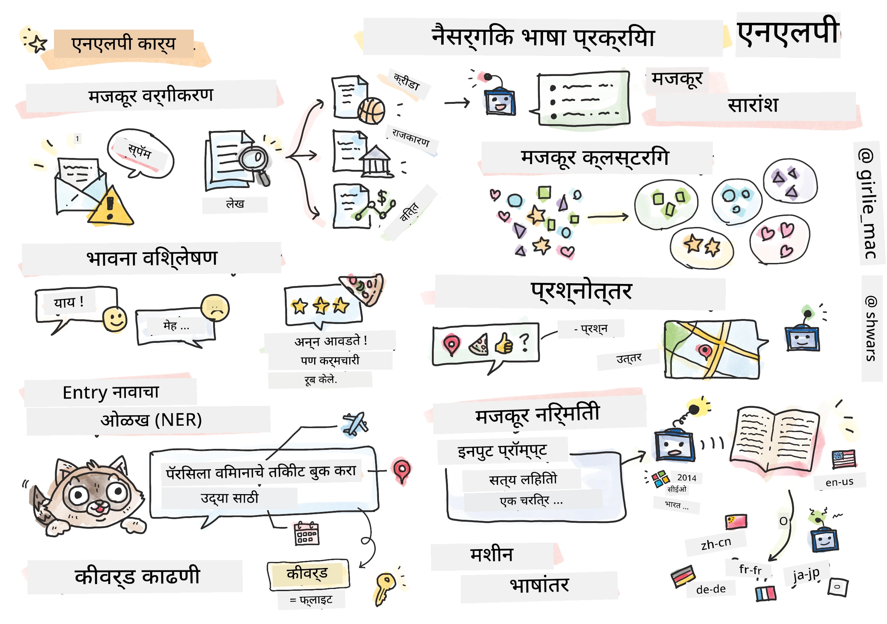

# नैसर्गिक भाषा प्रक्रिया



या विभागात, आपण **नैसर्गिक भाषा प्रक्रिया (NLP)** संबंधित कार्ये हाताळण्यासाठी न्यूरल नेटवर्क्सचा वापर कसा करायचा यावर लक्ष केंद्रित करू. अनेक NLP समस्या आहेत ज्या संगणकांनी सोडवाव्या अशी आपली इच्छा आहे:

* **टेक्स्ट वर्गीकरण** हे मजकूर अनुक्रमांशी संबंधित एक सामान्य वर्गीकरण समस्या आहे. उदाहरणांमध्ये ई-मेल संदेशांना स्पॅम किंवा नॉन-स्पॅम म्हणून वर्गीकृत करणे, किंवा लेखांना क्रीडा, व्यवसाय, राजकारण इत्यादींमध्ये वर्गीकृत करणे समाविष्ट आहे. तसेच, चॅट बॉट्स विकसित करताना, आपल्याला वापरकर्त्याने काय सांगायचे होते हे समजून घेणे आवश्यक असते - या प्रकरणात आपण **उद्देश वर्गीकरण** हाताळत आहोत. उद्देश वर्गीकरणामध्ये अनेक श्रेणींशी व्यवहार करावा लागतो.
* **भावना विश्लेषण** हे एक सामान्य पुनरावृत्ती समस्या आहे, जिथे आपल्याला वाक्याचा अर्थ किती सकारात्मक/नकारात्मक आहे यासंबंधित एक संख्या (भावना) देणे आवश्यक आहे. भावना विश्लेषणाचा अधिक प्रगत प्रकार म्हणजे **आशय-आधारित भावना विश्लेषण** (ABSA), जिथे आपण संपूर्ण वाक्याला नव्हे तर त्याच्या वेगवेगळ्या भागांना (आशयांना) भावना देतो, उदा. *या रेस्टॉरंटमध्ये मला जेवण आवडले, पण वातावरण भयंकर होते*.
* **नामित घटक ओळख** (NER) मजकूरातून विशिष्ट घटक काढण्याच्या समस्येला संदर्भित करते. उदाहरणार्थ, आपल्याला समजून घ्यावे लागेल की *मला उद्या पॅरिसला उड्डाण करायचे आहे* या वाक्यात *उद्या* हा शब्द DATE ला संदर्भित करतो, आणि *पॅरिस* हे LOCATION आहे.  
* **कीवर्ड काढणे** NER सारखेच आहे, परंतु आपल्याला वाक्याच्या अर्थासाठी महत्त्वाचे शब्द स्वयंचलितपणे काढणे आवश्यक आहे, विशिष्ट घटक प्रकारांसाठी पूर्व-प्रशिक्षण न करता.
* **मजकूर गटबद्धीकरण** उपयुक्त ठरू शकते जेव्हा आपल्याला समान वाक्ये एकत्र गटबद्ध करायची असतात, उदाहरणार्थ, तांत्रिक सहाय्य संभाषणांमधील समान विनंत्या.
* **प्रश्न उत्तर देणे** हे मॉडेलला विशिष्ट प्रश्नाचे उत्तर देण्याची क्षमता दर्शवते. मॉडेलला मजकूराचा भाग आणि प्रश्न इनपुट म्हणून मिळतो, आणि त्याला प्रश्नाचे उत्तर मजकूरात कुठे आहे हे प्रदान करणे आवश्यक असते (किंवा, कधी कधी, उत्तर मजकूर तयार करणे).
* **मजकूर निर्मिती** हे मॉडेलला नवीन मजकूर तयार करण्याची क्षमता आहे. हे वर्गीकरण कार्य मानले जाऊ शकते जे काही *मजकूर संकेत* वर आधारित पुढील अक्षर/शब्दाचा अंदाज लावते. प्रगत मजकूर निर्मिती मॉडेल्स, जसे GPT-3, [प्रॉम्प्ट प्रोग्रामिंग](https://towardsdatascience.com/software-3-0-how-prompting-will-change-the-rules-of-the-game-a982fbfe1e0) किंवा [प्रॉम्प्ट इंजिनिअरिंग](https://medium.com/swlh/openai-gpt-3-and-prompt-engineering-dcdc2c5fcd29) तंत्राचा वापर करून वर्गीकरणासारख्या इतर NLP कार्ये सोडवू शकतात.
* **मजकूर संक्षेपण** ही एक तंत्र आहे जिथे आपल्याला संगणकाने लांब मजकूर "वाचून" काही वाक्यांमध्ये संक्षेप करावा लागतो.
* **मशीन भाषांतर** हे एका भाषेत मजकूर समजून घेणे आणि दुसऱ्या भाषेत मजकूर तयार करणे यांचे संयोजन मानले जाऊ शकते.

सुरुवातीला, बहुतेक NLP कार्य पारंपरिक पद्धती वापरून सोडवले जात होते जसे की व्याकरण. उदाहरणार्थ, मशीन भाषांतरामध्ये प्रारंभिक वाक्याला सिंटॅक्स ट्रीमध्ये रूपांतरित करण्यासाठी पार्सर्स वापरले जात होते, नंतर वाक्याचा अर्थ दर्शवण्यासाठी उच्च स्तरावरील अर्थपूर्ण संरचना काढल्या जात होत्या, आणि या अर्थावर आधारित आणि लक्ष्य भाषेच्या व्याकरणावर आधारित परिणाम तयार केला जात होता. आजकाल, अनेक NLP कार्य न्यूरल नेटवर्क्स वापरून अधिक प्रभावीपणे सोडवले जातात.

> अनेक पारंपरिक NLP पद्धती [Natural Language Processing Toolkit (NLTK)](https://www.nltk.org) Python लायब्ररीमध्ये अंमलात आणल्या जातात. [NLTK Book](https://www.nltk.org/book/) ऑनलाइन उपलब्ध आहे, ज्यामध्ये NLTK वापरून वेगवेगळ्या NLP कार्ये कशी सोडवता येतील याचे वर्णन आहे.

आपल्या अभ्यासक्रमात, आपण मुख्यतः NLP साठी न्यूरल नेटवर्क्स वापरण्यावर लक्ष केंद्रित करू, आणि आवश्यकतेनुसार NLTK वापरू.

आपण टेबल डेटा आणि प्रतिमांसाठी न्यूरल नेटवर्क्स वापरण्याबद्दल आधीच शिकले आहोत. त्या प्रकारच्या डेटामध्ये आणि मजकूरामध्ये मुख्य फरक म्हणजे मजकूर हा बदलणाऱ्या लांबीचा अनुक्रम आहे, तर प्रतिमांच्या बाबतीत इनपुट आकार आधीच माहित असतो. जरी कॉनव्होल्यूशनल नेटवर्क्स इनपुट डेटामधून नमुने काढू शकतात, तरी मजकूरातील नमुने अधिक जटिल असतात. उदा., नकारात्मकता विषयापासून अनेक शब्दांनी विभक्त असू शकते (उदा. *मला संत्री आवडत नाही*, vs. *मला ती मोठी रंगीत चवदार संत्री आवडत नाही*), आणि तरीही ते एक नमुना म्हणून व्याख्या केले पाहिजे. त्यामुळे, भाषा हाताळण्यासाठी आपल्याला नवीन न्यूरल नेटवर्क प्रकारांची ओळख करून द्यावी लागते, जसे *पुनरावृत्ती नेटवर्क्स* आणि *ट्रान्सफॉर्मर्स*.

## लायब्ररी इंस्टॉल करा

जर आपण स्थानिक Python इंस्टॉलेशन वापरून हा अभ्यासक्रम चालवत असाल, तर आपल्याला खालील आदेश वापरून NLP साठी आवश्यक सर्व लायब्ररी इंस्टॉल कराव्या लागतील:

**PyTorch साठी**
```bash
pip install -r requirements-torch.txt
```
**TensorFlow साठी**
```bash
pip install -r requirements-tf.txt
```

> आपण [Microsoft Learn](https://docs.microsoft.com/learn/modules/intro-natural-language-processing-tensorflow/?WT.mc_id=academic-77998-cacaste) वर TensorFlow सह NLP प्रयत्न करू शकता.

## GPU चेतावणी

या विभागात, काही उदाहरणांमध्ये आपण मोठ्या मॉडेल्सचे प्रशिक्षण घेणार आहोत.
* **GPU-सक्षम संगणक वापरा**: मोठ्या मॉडेल्ससह काम करताना प्रतीक्षा वेळ कमी करण्यासाठी GPU-सक्षम संगणकावर आपले नोटबुक चालवणे योग्य आहे.
* **GPU मेमरी मर्यादा**: GPU वर चालवल्यास, विशेषतः मोठ्या मॉडेल्सचे प्रशिक्षण घेताना GPU मेमरी संपण्याच्या परिस्थिती येऊ शकतात.
* **GPU मेमरी वापर**: प्रशिक्षणादरम्यान GPU मेमरीचा वापर विविध घटकांवर अवलंबून असतो, ज्यामध्ये मिनीबॅच आकार समाविष्ट आहे.
* **मिनीबॅच आकार कमी करा**: जर GPU मेमरी समस्या आल्या, तर आपल्या कोडमध्ये मिनीबॅच आकार कमी करणे हा एक संभाव्य उपाय असू शकतो.
* **TensorFlow GPU मेमरी रिलीज**: TensorFlow च्या जुन्या आवृत्त्या GPU मेमरी योग्य प्रकारे रिलीज करत नाहीत, विशेषतः एका Python कर्नलमध्ये अनेक मॉडेल्सचे प्रशिक्षण घेताना. GPU मेमरी वापर प्रभावीपणे व्यवस्थापित करण्यासाठी, आपण TensorFlow ला GPU मेमरी आवश्यकतेनुसार वाटप करण्यासाठी कॉन्फिगर करू शकता.
* **कोड समावेश**: GPU मेमरी वाटप फक्त आवश्यकतेनुसार वाढवण्यासाठी, आपल्या नोटबुकमध्ये खालील कोड समाविष्ट करा:

```python
physical_devices = tf.config.list_physical_devices('GPU') 
if len(physical_devices)>0:
    tf.config.experimental.set_memory_growth(physical_devices[0], True) 
```

जर आपण पारंपरिक ML दृष्टिकोनातून NLP शिकण्यात स्वारस्य असाल, तर [या पाठांचा संच](https://github.com/microsoft/ML-For-Beginners/tree/main/6-NLP) भेट द्या.

## या विभागात
या विभागात आपण शिकणार आहोत:

* [मजकूराचे टेन्सर्समध्ये प्रतिनिधित्व](13-TextRep/README.md)
* [शब्द एम्बेडिंग्स](14-Emdeddings/README.md)
* [भाषा मॉडेलिंग](15-LanguageModeling/README.md)
* [पुनरावृत्ती न्यूरल नेटवर्क्स](16-RNN/README.md)
* [निर्मितीक्षम नेटवर्क्स](17-GenerativeNetworks/README.md)
* [ट्रान्सफॉर्मर्स](18-Transformers/README.md)

**अस्वीकरण**:  
हा दस्तऐवज AI भाषांतर सेवा [Co-op Translator](https://github.com/Azure/co-op-translator) वापरून भाषांतरित करण्यात आला आहे. आम्ही अचूकतेसाठी प्रयत्नशील असलो तरी कृपया लक्षात ठेवा की स्वयंचलित भाषांतरांमध्ये त्रुटी किंवा अचूकतेचा अभाव असू शकतो. मूळ भाषेतील दस्तऐवज हा अधिकृत स्रोत मानला जावा. महत्त्वाच्या माहितीसाठी व्यावसायिक मानवी भाषांतराची शिफारस केली जाते. या भाषांतराचा वापर करून उद्भवलेल्या कोणत्याही गैरसमज किंवा चुकीच्या अर्थासाठी आम्ही जबाबदार राहणार नाही.