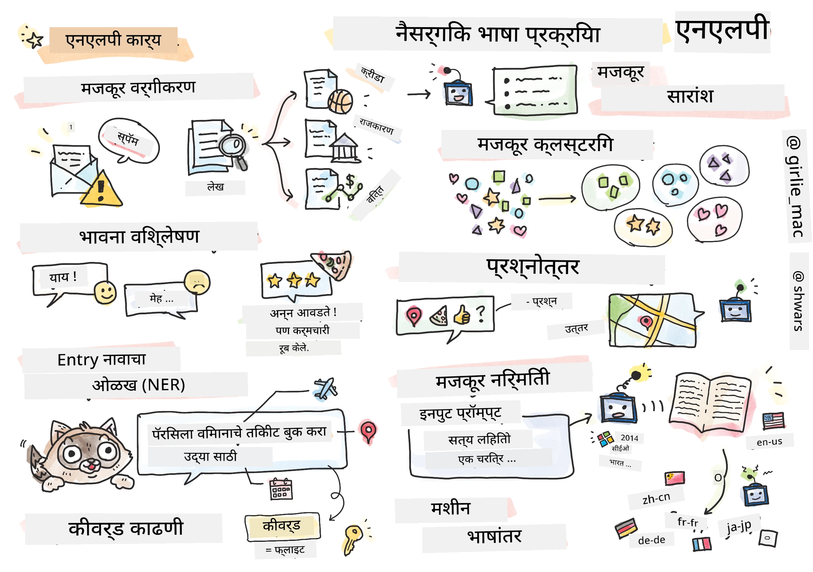

# नैसर्गिक भाषा प्रक्रिया



या विभागात, आपण **नैसर्गिक भाषा प्रक्रिया (NLP)** संबंधित कार्ये हाताळण्यासाठी न्यूरल नेटवर्क्स वापरण्यावर लक्ष केंद्रित करू. अनेक NLP समस्या आहेत ज्या आपण संगणकांसाठी सोडवू इच्छितो:

* **मतलब वर्गीकरण** हा मजकूर अनुक्रमणिकांना संबंधित एक सामान्य वर्गीकरण समस्या आहे. उदाहरणार्थ, ई-मेल संदेशांना स्पॅम विरुद्ध नॉन-स्पॅम म्हणून वर्गीकृत करणे अथवा लेखांना क्रीडा, व्यवसाय, राजकारण इत्यादी विषयांत वर्गीकरण करणे. तसेच, चॅट बॉट विकसित करताना, वापरकर्त्याने काय म्हणायचे होते हे समजून घेणे गरजेचे असते -- या प्रकरणात आपण **इच्छा वर्गीकरण** शी संबंधित असतो. प्रामुख्याने, इच्छा वर्गीकरणात आपल्याला अनेक वर्गांशी व्यवहार करावा लागतो.
* **भावनात्मक विश्लेषण** ही एक सामान्य रिग्रेशन समस्या आहे, ज्यात आपल्याला वाक्याचा अर्थ किती सकारात्मक/नकारात्मक आहे हे दर्शविणारा एक संख्या (भावना) प्रदान करणे आवश्यक असते. भावनात्मक विश्लेषणाचा अधिक प्रगत प्रकार म्हणजे **अंगीकारात्मक भावनात्मक विश्लेषण** (ABSA), ज्यात आपण संपूर्ण वाक्याशिवाय त्याच्या वेगवेगळ्या भागांना (अंगी) भावना प्रदान करतो, उदा. *या रेस्टॉरंटमध्ये मला जेवण आवडले, पण वातावरण भयंकर होते*.
* **नामित घटक ओळख** (NER) म्हणजे मजकूरातून विशिष्ट घटक काढण्याची समस्या. उदाहरणार्थ, आपल्याला समजावे लागेल की वाक्यातील *मी उद्या पॅरिसला उडायला पाहिजे* या वाक्यात *उद्या* हा शब्द DATE दर्शवतो आणि *पॅरिस* हा LOCATION आहे.
* **कीवर्ड काढणी** NER सारखीच आहे, पण आपल्याला विशेष घटक प्रकारांसाठी पूर्व-प्रशिक्षण न करता वाक्याचा अर्थ समजून घेण्यासाठी महत्त्वाचे शब्द स्वयंचलितपणे काढावे लागतात.
* **मजकूर वर्गीकरण** उपयुक्त ठरते जेव्हा आपण सारखी वाक्ये एकत्र गटबद्ध करू इच्छितो, उदा., तांत्रिक सहाय्य संभाषणांमधील सारख्या विनंत्या.
* **प्रश्नोत्तर** म्हणजे एखाद्या मॉडेलमध्ये दिलेल्या प्रश्नाचे उत्तर देण्याची क्षमता. मॉडेलला एक मजकूर विभाग आणि प्रश्न दिला जातो, आणि त्याला त्या मजकूरात प्रश्नाचे उत्तर कुठे आहे ते द्यावे लागते (कधी कधी उत्तर मजकूर देखील तयार करावे लागते).
* **मजकूर निर्मिती** म्हणजे एक मॉडेल नवीन मजकूर तयार करण्याची क्षमता. याला वर्गीकरण कार्य म्हणूनही पाहिले जाऊ शकते जे पुढील अक्षर/शब्द भाकीत करते काही *मजकूर प्रॉम्प्ट* आधारित. प्रगत मजकूर निर्मिती मॉडेल्स, जसे GPT-3, इतर NLP कार्ये देखील सोडवू शकतात ज्यात [प्रॉम्प्ट प्रोग्रामिंग](https://towardsdatascience.com/software-3-0-how-prompting-will-change-the-rules-of-the-game-a982fbfe1e0) किंवा [प्रॉम्प्ट इंजीनियरिंग](https://medium.com/swlh/openai-gpt-3-and-prompt-engineering-dcdc2c5fcd29) या तंत्रांचा वापर करतात.
* **मजकूर सारांश** हा तंत्र आहे ज्यामध्ये संगणकाला लांब मजकूर "वाचून" काही वाक्यांमध्ये सारांश देण्यासाठी म्हटले जाते.
* **मशीन अनुवाद** एक भाषेतील मजकूर समजून घेणे आणि दुसऱ्या भाषेत मजकूर निर्माण करण्याचे संयोजन म्हणून पाहता येऊ शकते.

आधी, बहुतांश NLP कार्ये पारंपरिक पद्धती जसे व्याकरण वापरून सोडवली जात होती. उदाहरणार्थ, मशीन अनुवादात पार्सर वापरून सुरुवातीचा वाक्य संरचना वृक्षात रूपांतरित केला जात असे, नंतर उच्च स्तरीय अर्थव्यवस्था संरचना काढण्यात यायच्या, आणि त्या अर्थावर व टार्गेट भाषेच्या व्याकरणावर आधारित निकाल तयार केला जात असे. आजकाल बरेच NLP कार्य न्यूरल नेटवर्क्स वापरून अधिक प्रभावीपणे सोडवले जातात.

> अनेक पारंपरिक NLP पद्धती [Natural Language Processing Toolkit (NLTK)](https://www.nltk.org) या Python लायब्ररीमध्ये लागू केलेल्या आहेत. [NLTK Book](https://www.nltk.org/book/) हा उत्कृष्ट ऑनलाइन पुस्तक उपलब्ध आहे जो वेगवेगळ्या NLP कार्ये कशी सोडवायची ते शिकवतो.

आपल्या अभ्यासक्रमात आपण मुख्यतः NLP साठी न्यूरल नेटवर्क्स वापरण्यावर लक्ष केंद्रित करू, आणि गरज असताना NLTK वापरू.

आपण आधीच न्यूरल नेटवर्क्स वापरून टॅब्युलर डेटा आणि प्रतिमांसह काम करणे शिकलो आहोत. त्या प्रकारच्या डेटांपेक्षा मजकूराचा मुख्य फरक असा आहे की मजकूर हा एक बदलत्या लांबीनाचा अनुक्रम आहे, तर प्रतिमांच्या बाबतीत इनपुट आकार आधीपासून माहीत असतो. जिथे कॉन्व्होल्यूशनल नेटवर्क्स इनपुट डेटामधून नकाशा काढू शकतात, तिथे मजकूरातील नकाशे अधिक जटिल असतात. उदा., नकाराचा शब्द विषयापासून दूर असू शकतो आणि तरीही त्याला एक नकाशा म्हणून समजले पाहिजे (उदा. *मला संत्रे आवडत नाही*, विरुद्ध *मला त्या मोठ्या रंगीबेरंगी स्वादिष्ट संत्र्यांची आवड नाही*), आणि ते अजूनही एकाच नकाशा मानावे लागतो. म्हणूनच, भाषा हाताळण्यासाठी आपल्याला नवीन न्यूरल नेटवर्क प्रकार ओळखावे लागतील, जसे की *पुनरावर्ती नेटवर्क्स* आणि *ट्रान्सफॉर्मर्स*.

## लायब्ररी स्थापवा

आपण स्थानिक Python स्थापना वापरत असल्यास, आपण NLP साठी सर्व आवश्यक लायब्ररी खालील कमांड्सने स्थापित करणे आवश्यक असू शकते:

**PyTorch साठी**
```bash
pip install -r requirements-pytorch.txt
```
**TensorFlow साठी**
```bash
pip install -r requirements-tf.txt
```

> आपण [Microsoft Learn](https://docs.microsoft.com/learn/modules/intro-natural-language-processing-tensorflow/?WT.mc_id=academic-77998-cacaste) वर TensorFlow सह NLP प्रयत्न करू शकता

## GPU सूचना

या विभागात, काही उदाहरणांमध्ये आपण मोठे मॉडेल्स प्रशिक्षण देणार आहोत.
* **GPU-सक्षम संगणक वापरा**: मोठ्या मॉडेल्सवर काम करताना प्रतीक्षा वेळ कमी करण्यासाठी आपले नोटबुक GPU-सक्षम संगणकावर चालवणे शिफारसीय आहे.
* **GPU स्मृती मर्यादा**: GPU वर चालवताना GPU स्मृती संपण्याची शक्यता असते, विशेषतः मोठे मॉडेल्स प्रशिक्षण देताना.
* **GPU स्मृतीचा वापर**: प्रशिक्षणादरम्यान वापरली जाणारी GPU स्मृती अनेक घटकांवर अवलंबून असते, ज्यात मिनीबॅच आकार देखील आहे.
* **मिनीबॅच आकार कमी करा**: GPU स्मृती समस्या आल्यास, आपल्या कोडमधील मिनीबॅच आकार कमी करणे एक उपाय असू शकतो.
* **TensorFlow GPU स्मृती रिलीज**: जुन्या TensorFlow आवृत्त्या एकाच Python कर्नेलमध्ये अनेक मॉडेल्स प्रशिक्षण देताना GPU स्मृती योग्य प्रकारे रिलीज करणार नाहीत. GPU स्मृतीचा प्रभावी वापर करण्यासाठी, आपण TensorFlow हे फक्त आवश्यकतेनुसार GPU स्मृती प्रदान करण्यासाठी कॉन्फिगर करू शकता.
* **कोड समाविष्ट करा**: TensorFlow GPU स्मृती वाढवण्यासाठी फक्त आवश्यकतेनुसार वाटप करण्यासाठी खालील कोड आपल्या नोटबुकमध्ये समाविष्ट करा:

```python
physical_devices = tf.config.list_physical_devices('GPU') 
if len(physical_devices)>0:
    tf.config.experimental.set_memory_growth(physical_devices[0], True) 
```

आपल्याला क्लासिक ML दृष्टिकोनातून NLP शिकण्यात रस असल्यास, [ही शिकवणी संच](https://github.com/microsoft/ML-For-Beginners/tree/main/6-NLP) पहा

## या विभागात
या विभागात आपण खालील गोष्टी शिकणार आहोत:

* [मजकूराचे टेन्सर स्वरूप](13-TextRep/README.md)
* [शब्द एम्बेडिंग्ज](14-Embeddings/README.md)
* [भाषा मॉडेलिंग](15-LanguageModeling/README.md)
* [पुनरावर्ती न्यूरल नेटवर्क्स](16-RNN/README.md)
* [जनरेटिव्ह नेटवर्क्स](17-GenerativeNetworks/README.md)
* [ट्रान्सफॉर्मर्स](18-Transformers/README.md)

---

<!-- CO-OP TRANSLATOR DISCLAIMER START -->
**अस्वीकरण**:
हा दस्तऐवज AI भाषांतर सेवा [Co-op Translator](https://github.com/Azure/co-op-translator) चा वापर करून अनुवादित केला आहे. जरी आम्ही अचूकतेसाठी प्रयत्न करतो, तरी कृपया लक्षात घ्या की स्वयंचलित भाषांतरांमध्ये त्रुटी किंवा अचूकतेची कमतरता असू शकते. मूळ दस्तऐवज त्याच्या मूळ भाषेत अधिकृत स्रोत मानला पाहिजे. महत्त्वाची माहिती असल्यास, व्यावसायिक मानवी भाषांतराची शिफारस केली जाते. या भाषांतराच्या वापरामुळे उद्भवणाऱ्या कोणत्याही गैरसमज किंवा चुकीच्या अर्थलावणीसाठी आम्ही जबाबदार नाही.
<!-- CO-OP TRANSLATOR DISCLAIMER END -->