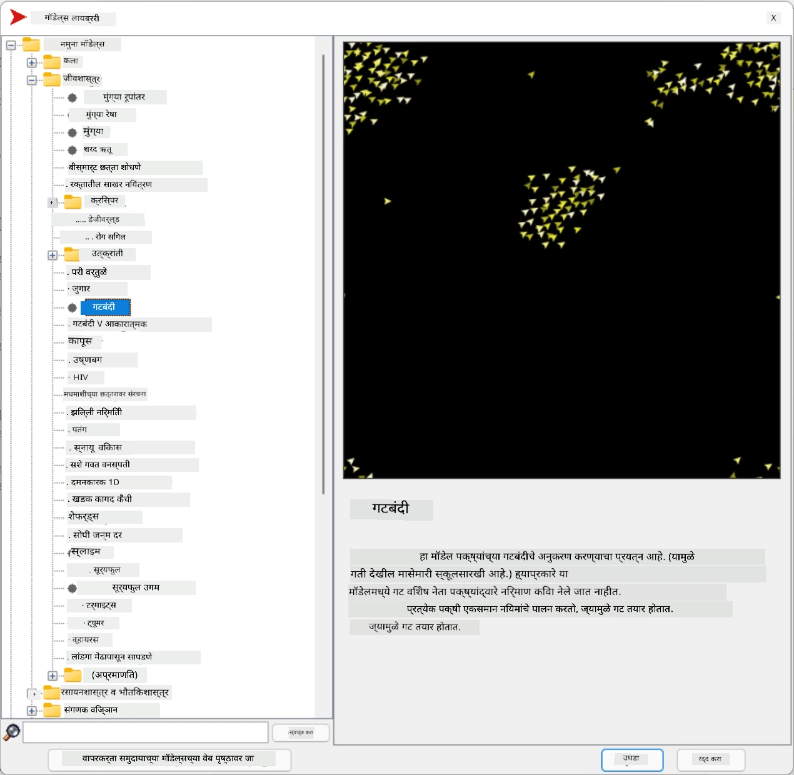
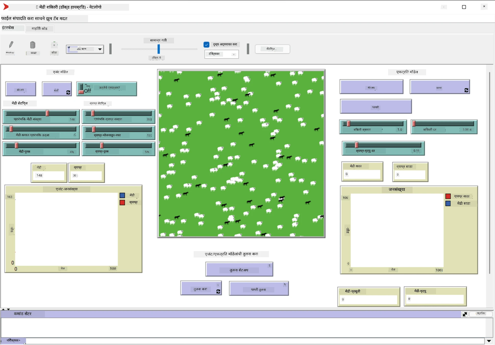

# मल्टी-एजंट सिस्टीम्स

बुद्धिमत्ता मिळवण्याचा एक संभाव्य मार्ग म्हणजे **उत्पन्न** (किंवा **सहकार्यात्मक**) दृष्टिकोन, जो अशा तत्त्वावर आधारित आहे की अनेक तुलनेने साध्या एजंट्सच्या एकत्रित वर्तनामुळे संपूर्ण प्रणालीचे अधिक जटिल (किंवा बुद्धिमान) वर्तन होऊ शकते. सैद्धांतिकदृष्ट्या, हे [सामूहिक बुद्धिमत्ता](https://en.wikipedia.org/wiki/Collective_intelligence), [उत्पन्नवाद](https://en.wikipedia.org/wiki/Global_brain) आणि [विकसनशील सायबरनेटिक्स](https://en.wikipedia.org/wiki/Global_brain) च्या तत्त्वांवर आधारित आहे, जे असे म्हणतात की उच्च-स्तरीय प्रणालींना काही प्रकारचे अतिरिक्त मूल्य मिळते जेव्हा त्यांना योग्य प्रकारे कमी-स्तरीय प्रणालींमधून एकत्रित केले जाते (*मेटासिस्टम ट्रांझिशनचे तत्त्व*).

## [पूर्व-व्याख्यान प्रश्नमंजुषा](https://ff-quizzes.netlify.app/en/ai/quiz/45)

**मल्टी-एजंट सिस्टीम्स** चा दिशानिर्देश 1990 च्या दशकात इंटरनेट आणि वितरित प्रणालींच्या वाढीला प्रतिसाद म्हणून AI मध्ये उदयास आला. [Artificial Intelligence: A Modern Approach](https://en.wikipedia.org/wiki/Artificial_Intelligence:_A_Modern_Approach) या AI च्या क्लासिकल पाठ्यपुस्तकांपैकी एक, मल्टी-एजंट सिस्टीम्सच्या दृष्टिकोनातून क्लासिकल AI चा विचार करते.

मल्टी-एजंट दृष्टिकोनाचा केंद्रबिंदू म्हणजे **एजंट** - एक घटक जो काही **पर्यावरणात** राहतो, ज्याला तो जाणून घेऊ शकतो आणि त्यावर कृती करू शकतो. ही एक अतिशय व्यापक व्याख्या आहे आणि एजंट्सचे अनेक प्रकार आणि वर्गीकरण असू शकते:

* त्यांच्या विचार करण्याच्या क्षमतेनुसार:
   - **प्रतिक्रियाशील** एजंट्स साधारणतः विनंती-प्रतिक्रिया प्रकारचे वर्तन करतात
   - **विचारशील** एजंट्स काही प्रकारचे तर्कशास्त्रीय विचार आणि/किंवा नियोजन क्षमता वापरतात
* एजंट्स कोठे कोड कार्यान्वित करतात यानुसार:
   - **स्थिर** एजंट्स एका समर्पित नेटवर्क नोडवर कार्य करतात
   - **मोबाइल** एजंट्स त्यांचा कोड नेटवर्क नोड्समध्ये हलवू शकतात
* त्यांच्या वर्तनानुसार:
   - **निष्क्रिय एजंट्स** विशिष्ट उद्दिष्टे नसतात. असे एजंट्स बाह्य उत्तेजनांना प्रतिसाद देऊ शकतात, परंतु स्वतःहून कोणतीही कृती सुरू करणार नाहीत.
   - **सक्रिय एजंट्स** काही उद्दिष्टे असतात ज्याचा ते पाठपुरावा करतात
   - **संज्ञानात्मक एजंट्स** जटिल नियोजन आणि विचारांचा समावेश करतात

आजकाल मल्टी-एजंट सिस्टीम्स अनेक अनुप्रयोगांमध्ये वापरल्या जातात:

* गेम्समध्ये, अनेक नॉन-प्लेअर कॅरेक्टर्स काही प्रकारचे AI वापरतात आणि त्यांना बुद्धिमान एजंट्स मानले जाऊ शकते
* व्हिडिओ निर्मितीत, गर्दी असलेल्या जटिल 3D दृश्यांचे रेंडरिंग सामान्यतः मल्टी-एजंट सिम्युलेशन वापरून केले जाते
* सिस्टीम मॉडेलिंगमध्ये, मल्टी-एजंट दृष्टिकोनाचा वापर जटिल मॉडेलच्या वर्तनाचे अनुकरण करण्यासाठी केला जातो. उदाहरणार्थ, मल्टी-एजंट दृष्टिकोनाचा यशस्वीरित्या वापर COVID-19 रोगाचा जागतिक स्तरावर प्रसार भाकीत करण्यासाठी केला गेला आहे. समान दृष्टिकोनाचा वापर शहरातील वाहतूक मॉडेल करण्यासाठी केला जाऊ शकतो आणि वाहतूक नियमांमध्ये बदलांना कसे प्रतिसाद दिला जातो हे पाहण्यासाठी.
* जटिल ऑटोमेशन सिस्टीम्समध्ये, प्रत्येक उपकरण स्वतंत्र एजंट म्हणून कार्य करू शकते, ज्यामुळे संपूर्ण प्रणाली कमी एकसंध आणि अधिक मजबूत बनते.

आम्ही मल्टी-एजंट सिस्टीम्समध्ये खोलवर जाण्यासाठी जास्त वेळ खर्च करणार नाही, परंतु **मल्टी-एजंट मॉडेलिंग** चा एक उदाहरण विचार करू.

## NetLogo

[NetLogo](https://ccl.northwestern.edu/netlogo/) हे [Logo](https://en.wikipedia.org/wiki/Logo_(programming_language)) प्रोग्रामिंग भाषेच्या सुधारित आवृत्तीवर आधारित मल्टी-एजंट मॉडेलिंग वातावरण आहे. ही भाषा मुलांना प्रोग्रामिंग संकल्पना शिकवण्यासाठी विकसित केली गेली होती आणि ती तुम्हाला **कासव** नावाच्या एजंटला नियंत्रित करण्याची परवानगी देते, जो हलू शकतो आणि मागे एक चिन्ह सोडतो. यामुळे जटिल भूमितीय आकृत्या तयार होतात, जे एजंटच्या वर्तन समजून घेण्याचा एक अत्यंत दृश्यात्मक मार्ग आहे.

NetLogo मध्ये, आपण `create-turtles` कमांड वापरून अनेक कासवे तयार करू शकतो. त्यानंतर आपण सर्व कासवांना काही कृती करण्याचे आदेश देऊ शकतो (खालील उदाहरणात - 10 पॉइंट पुढे हलवा):

```
create-turtles 10
ask turtles [
  forward 10
]
```

अर्थात, जेव्हा सर्व कासवे एकसारखे वागतात तेव्हा ते मनोरंजक नसते, म्हणून आपण विशिष्ट बिंदूच्या आसपास असलेल्या कासवांच्या गटांना `ask` करू शकतो. आपण `breed [cats cat]` कमांड वापरून वेगवेगळ्या *प्रजातींच्या* कासवांना देखील तयार करू शकतो. येथे `cat` ही प्रजातीचे नाव आहे आणि आपल्याला एकवचनी आणि बहुवचनी शब्द निर्दिष्ट करणे आवश्यक आहे, कारण वेगवेगळ्या कमांड्स स्पष्टतेसाठी वेगवेगळ्या स्वरूपांचा वापर करतात.

> ✅ आम्ही NetLogo भाषा शिकण्यात खोलवर जाणार नाही - तुम्हाला अधिक जाणून घेण्यात स्वारस्य असल्यास तुम्ही उत्कृष्ट [Beginner's Interactive NetLogo Dictionary](https://ccl.northwestern.edu/netlogo/bind/) संसाधनाला भेट देऊ शकता.

तुम्ही [डाउनलोड](https://ccl.northwestern.edu/netlogo/download.shtml) करून NetLogo स्थापित करू शकता आणि प्रयत्न करू शकता.

### मॉडेल्स लायब्ररी

NetLogo ची एक उत्तम गोष्ट म्हणजे त्यात कार्यरत मॉडेल्सची लायब्ररी आहे जी तुम्ही वापरून पाहू शकता. **File &rightarrow; Models Library** वर जा, आणि तुम्हाला निवडण्यासाठी अनेक श्रेणीतील मॉडेल्स मिळतील.



> मॉडेल्स लायब्ररीचा स्क्रीनशॉट - Dmitry Soshnikov

तुम्ही मॉडेल्सपैकी एक उघडू शकता, उदाहरणार्थ **Biology &rightarrow; Flocking**.

### मुख्य तत्त्वे

मॉडेल उघडल्यानंतर, तुम्हाला मुख्य NetLogo स्क्रीनवर नेले जाते. येथे एक नमुना मॉडेल आहे जो मर्यादित संसाधने (गवत) दिल्यास लांडगा आणि मेंढ्यांच्या लोकसंख्येचे वर्णन करतो.



> स्क्रीनशॉट - Dmitry Soshnikov

या स्क्रीनवर तुम्ही पाहू शकता:

* **इंटरफेस** विभाग ज्यामध्ये समाविष्ट आहे:
  - मुख्य क्षेत्र, जिथे सर्व एजंट्स राहतात
  - विविध नियंत्रण: बटणे, स्लायडर्स, इ.
  - ग्राफ्स जे तुम्ही सिम्युलेशनच्या पॅरामीटर्स प्रदर्शित करण्यासाठी वापरू शकता
* **कोड** टॅब ज्यामध्ये संपादक आहे, जिथे तुम्ही NetLogo प्रोग्राम टाइप करू शकता

बहुतेक प्रकरणांमध्ये, इंटरफेसमध्ये **Setup** बटण असेल, जे सिम्युलेशन स्थिती प्रारंभ करते, आणि **Go** बटण जे अंमलबजावणी सुरू करते. हे संबंधित हँडलर्सद्वारे हाताळले जातात जे असे दिसतात:

```
to go [
...
]
```

NetLogo च्या जगात खालील वस्तूंचा समावेश आहे:

* **एजंट्स** (कासवे) जे क्षेत्रामध्ये फिरू शकतात आणि काहीतरी करू शकतात. तुम्ही `ask turtles [...]` सिंटॅक्स वापरून एजंट्सला आदेश देऊ शकता, आणि कोष्ठकातील कोड सर्व एजंट्सद्वारे *कासव मोडमध्ये* अंमलात आणला जातो.
* **पॅचेस** हे क्षेत्राचे चौकोनी भाग आहेत, ज्यावर एजंट्स राहतात. तुम्ही सर्व एजंट्सचा संदर्भ घेऊ शकता जे एकाच पॅचवर आहेत, किंवा तुम्ही पॅच रंग आणि काही इतर गुणधर्म बदलू शकता. तुम्ही `ask patches` वापरून पॅचेसला काहीतरी करण्यास सांगू शकता.
* **ऑब्झर्व्हर** हा एक अद्वितीय एजंट आहे जो जग नियंत्रित करतो. सर्व बटण हँडलर्स *ऑब्झर्व्हर मोडमध्ये* अंमलात आणले जातात.

> ✅ मल्टी-एजंट वातावरणाची सुंदरता म्हणजे कासव मोड किंवा पॅच मोडमध्ये चालणारा कोड सर्व एजंट्सद्वारे एकाच वेळी समांतरपणे अंमलात आणला जातो. अशा प्रकारे, थोडासा कोड लिहून आणि वैयक्तिक एजंटच्या वर्तनाचे प्रोग्रामिंग करून, तुम्ही संपूर्ण सिम्युलेशन सिस्टीमचे जटिल वर्तन तयार करू शकता.

### फ्लॉकिंग

मल्टी-एजंट वर्तनाच्या उदाहरण म्हणून, **[Flocking](https://en.wikipedia.org/wiki/Flocking_(behavior))** विचार करूया. फ्लॉकिंग हा एक जटिल नमुना आहे जो पक्ष्यांच्या थव्याने उडण्यासारखा आहे. त्यांना उडताना पाहून तुम्हाला वाटेल की ते काही प्रकारच्या सामूहिक अल्गोरिदमचे अनुसरण करतात, किंवा त्यांच्याकडे काही प्रकारची *सामूहिक बुद्धिमत्ता* आहे. तथापि, हे जटिल वर्तन उद्भवते जेव्हा प्रत्येक वैयक्तिक एजंट (या प्रकरणात, एक *पक्षी*) फक्त त्याच्या जवळच्या काही एजंट्सचे निरीक्षण करते आणि तीन साध्या नियमांचे अनुसरण करते:

* **अलायन्मेंट** - शेजारी एजंट्सच्या सरासरी दिशेने वळते
* **कोहेशन** - शेजाऱ्यांच्या सरासरी स्थानाकडे वळण्याचा प्रयत्न करते (*लांब पल्ल्याचे आकर्षण*)
* **सेपरेशन** - इतर पक्ष्यांच्या खूप जवळ जाताना, दूर जाण्याचा प्रयत्न करते (*लघु पल्ल्याचे प्रतिकर्षण*)

तुम्ही फ्लॉकिंगचे उदाहरण चालवू शकता आणि वर्तनाचे निरीक्षण करू शकता. तुम्ही *सेपरेशनचा अंश* किंवा *दृश्य श्रेणी* सारख्या पॅरामीटर्स समायोजित करू शकता, जे प्रत्येक पक्षी किती दूर पाहू शकतो हे परिभाषित करते. लक्षात ठेवा की जर तुम्ही दृश्य श्रेणी 0 पर्यंत कमी केली, तर सर्व पक्षी आंधळे होतात आणि फ्लॉकिंग थांबते. जर तुम्ही सेपरेशन 0 पर्यंत कमी केले, तर सर्व पक्षी एका सरळ रेषेत गोळा होतात.

> ✅ **Code** टॅबवर स्विच करा आणि फ्लॉकिंगचे तीन नियम (अलायन्मेंट, कोहेशन आणि सेपरेशन) कोडमध्ये कुठे अंमलात आणले आहेत ते पहा. लक्षात घ्या की आम्ही फक्त दृष्टीक्षेपात असलेल्या एजंट्सचा संदर्भ घेतो.

### पाहण्यासाठी इतर मॉडेल्स

तुम्ही प्रयोग करू शकता अशा काही अधिक मनोरंजक मॉडेल्स आहेत:

* **Art &rightarrow; Fireworks** दर्शवते की फटाके कसे वैयक्तिक फायर स्ट्रीम्सच्या सामूहिक वर्तन मानले जाऊ शकते
* **Social Science &rightarrow; Traffic Basic** आणि **Social Science &rightarrow; Traffic Grid** शहरातील वाहतुकीचे मॉडेल 1D आणि 2D ग्रिडमध्ये सिग्नलसह किंवा सिग्नलशिवाय दर्शवते. सिम्युलेशनमधील प्रत्येक कार खालील नियमांचे अनुसरण करते:
   - जर त्याच्या समोरची जागा रिकामी असेल - वेग वाढवा (एक विशिष्ट कमाल वेगापर्यंत)
   - जर त्याला समोर अडथळा दिसला - ब्रेक करा (आणि तुम्ही ड्रायव्हर किती दूर पाहू शकतो हे समायोजित करू शकता)
* **Social Science &rightarrow; Party** दाखवते की कॉकटेल पार्टी दरम्यान लोक कसे एकत्रित होतात. तुम्ही गटाच्या आनंदात सर्वात जलद वाढ होण्यासाठी पॅरामीटर्सचे संयोजन शोधू शकता.

या उदाहरणांमधून तुम्ही पाहू शकता की मल्टी-एजंट सिम्युलेशन वैयक्तिक व्यक्तींच्या समान किंवा समान तर्काचे अनुसरण करणाऱ्या जटिल प्रणालीचे वर्तन समजून घेण्याचा एक उपयुक्त मार्ग असू शकतो. याचा वापर आभासी एजंट्स, जसे की संगणक गेम्समधील [NPCs](https://en.wikipedia.org/wiki/NPC), किंवा 3D अॅनिमेटेड जगातील एजंट्स नियंत्रित करण्यासाठी देखील केला जाऊ शकतो.

## विचारशील एजंट्स

वर वर्णन केलेले एजंट्स अतिशय साधे आहेत, जे काही प्रकारच्या अल्गोरिदमचा वापर करून पर्यावरणातील बदलांना प्रतिसाद देतात. त्यामुळे ते **प्रतिक्रियाशील एजंट्स** आहेत. तथापि, कधीकधी एजंट्स विचार करू शकतात आणि त्यांच्या कृतींचे नियोजन करू शकतात, अशा परिस्थितीत त्यांना **विचारशील** म्हणतात.

एक सामान्य उदाहरण म्हणजे वैयक्तिक एजंट जो मानवाकडून सुट्टीचा टूर बुक करण्याचे निर्देश प्राप्त करतो. समजा की इंटरनेटवर अनेक एजंट्स आहेत, जे त्याला मदत करू शकतात. त्याने मग इतर एजंट्सशी संपर्क साधला पाहिजे की कोणती फ्लाइट्स उपलब्ध आहेत, वेगवेगळ्या तारखांसाठी हॉटेलचे दर काय आहेत, आणि सर्वोत्तम किंमत मिळवण्यासाठी वाटाघाटी करण्याचा प्रयत्न केला पाहिजे. जेव्हा सुट्टीची योजना पूर्ण होते आणि मालकाने पुष्टी केली जाते, तेव्हा ती बुकिंगसह पुढे जाऊ शकते.

हे करण्यासाठी, एजंट्सना **संवाद साधण्याची** आवश्यकता आहे. यशस्वी संवादासाठी त्यांना आवश्यक आहे:

* **ज्ञानाची देवाणघेवाण करण्यासाठी मानक भाषा**, जसे की [Knowledge Interchange Format](https://en.wikipedia.org/wiki/Knowledge_Interchange_Format) (KIF) आणि [Knowledge Query and Manipulation Language](https://en.wikipedia.org/wiki/Knowledge_Query_and_Manipulation_Language) (KQML). या भाषा [Speech Act theory](https://en.wikipedia.org/wiki/Speech_act) वर आधारित आहेत.
* या भाषांमध्ये **वाटाघाटींसाठी प्रोटोकॉल्स** देखील समाविष्ट असावेत, जे विविध **लिलाव प्रकारांवर** आधारित आहेत.
* **सामान्य ऑंटोलॉजी** वापरण्यासाठी, जेणेकरून ते समान संकल्पनांचा संदर्भ घेतील आणि त्यांचे अर्थ जाणतील
* इतर एजंट्स काय करू शकतात हे **शोधण्याचा मार्ग**, जो काही प्रकारच्या ऑंटोलॉजीवर आधारित आहे

विचारशील एजंट्स प्रतिक्रियाशील एजंट्सपेक्षा खूपच जटिल असतात, कारण ते केवळ पर्यावरणातील बदलांना प्रतिसाद देत नाहीत, तर ते *कृती सुरू* करण्यास सक्षम असले पाहिजेत. विचारशील एजंट्ससाठी प्रस्तावित आर्किटेक्चरपैकी एक म्हणजे Belief-Desire-Intention (BDI) एजंट:

* **Beliefs** एजंटच्या पर्यावरणाबद्दलच्या ज्ञानाचा संच तयार करतात. हे ज्ञान आधार किंवा नियमांच्या संचासारखे संरचित केले जाऊ शकते जे एजंट विशिष्ट परिस्थितीत लागू करू शकतो.
* **Desires** एजंट काय करायचे आहे ते परिभाषित करतात, म्हणजे त्याची उद्दिष्टे. उदाहरणार्थ, वरील वैयक्तिक सहाय्यक एजंटचे उद्दिष्ट टूर बुक करणे आहे, आणि हॉटेल एजंटचे उद्दिष्ट नफा वाढवणे आहे.
* **Intentions** विशिष्ट कृती आहेत ज्या एजंट त्याच्या उद्दिष्टे साध्य करण्यासाठी योजना करतो. कृती सामान्यतः पर्यावरण बदलतात आणि इतर एजंट्सशी संवाद साधतात.

मल्टी-एजंट सिस्टीम्स तयार करण्यासाठी काही प्लॅटफॉर्म्स उपलब्ध आहेत, जसे की [JADE](https://jade.tilab.com/). [हा पेपर](https://arxiv.org/ftp/arxiv/papers/2007/2007.08961.pdf) मल्टी-एजंट प्लॅटफॉर्म्सचा आढावा घेतो, मल्टी-एजंट सिस्टीम्सचा थोडक्यात इतिहास आणि त्यांचे विविध वापर परिदृश्यांसह.

## निष्कर्ष

मल्टी-एजंट सिस्टीम्स वेगवेगळ्या स्वरूपात असू शकतात आणि अनेक वेगवेगळ्या अनुप्रयोगांमध्ये वापरल्या ज

---

