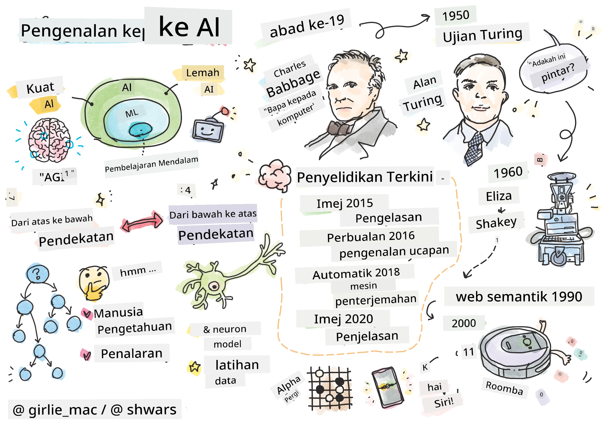
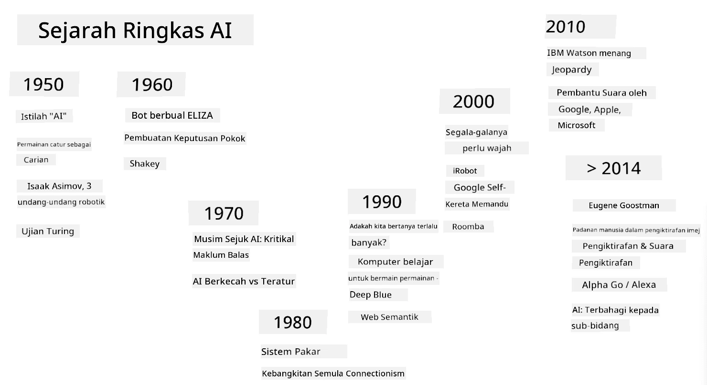
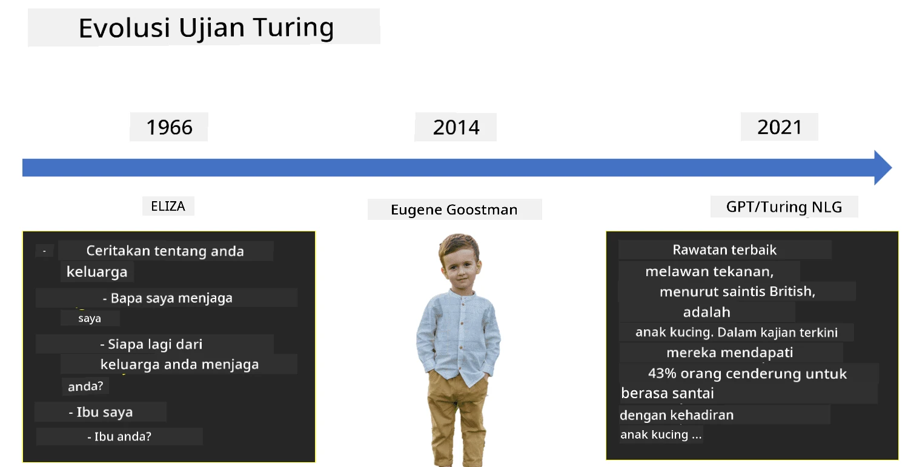

# Pengenalan kepada AI

> Sketchnote oleh [Tomomi Imura](https://twitter.com/girlie_mac)

## [Kuiz pra-kuliah](https://ff-quizzes.netlify.app/en/ai/quiz/1)

**Kecerdasan Buatan** adalah satu disiplin sains yang menarik yang mengkaji bagaimana kita boleh membuat komputer menunjukkan tingkah laku yang cerdas, contohnya melakukan perkara-perkara yang manusia pandai lakukan.

Pada asalnya, komputer dicipta oleh [Charles Babbage](https://en.wikipedia.org/wiki/Charles_Babbage) untuk beroperasi pada nombor mengikut prosedur yang jelas - iaitu algoritma. Komputer moden, walaupun jauh lebih maju daripada model asal yang dicadangkan pada abad ke-19, masih mengikuti idea yang sama iaitu pengiraan terkawal. Oleh itu, adalah mungkin untuk memprogram komputer untuk melakukan sesuatu jika kita tahu urutan langkah yang tepat yang perlu dilakukan untuk mencapai matlamat tersebut.

> Foto oleh [Vickie Soshnikova](http://twitter.com/vickievalerie)

> ✅ Menentukan umur seseorang daripada fotonya adalah tugas yang tidak boleh diprogramkan secara eksplisit, kerana kita tidak tahu bagaimana kita menghasilkan nombor dalam kepala kita apabila melakukannya.

---

Namun, terdapat beberapa tugas yang kita tidak tahu secara eksplisit bagaimana untuk menyelesaikannya. Pertimbangkan menentukan umur seseorang daripada fotonya. Kita entah bagaimana belajar melakukannya kerana kita telah melihat banyak contoh orang dari pelbagai umur, tetapi kita tidak dapat menjelaskan secara eksplisit bagaimana kita melakukannya, mahupun memprogram komputer untuk melakukannya. Inilah jenis tugas yang menarik perhatian **Kecerdasan Buatan** (AI).

✅ Fikirkan beberapa tugas yang anda boleh serahkan kepada komputer yang akan mendapat manfaat daripada AI. Pertimbangkan bidang kewangan, perubatan, dan seni - bagaimana bidang-bidang ini mendapat manfaat daripada AI hari ini?

## AI Lemah vs. AI Kuat

AI Lemah | AI Kuat
---------------------------------------|-------------------------------------
AI Lemah merujuk kepada sistem AI yang direka dan dilatih untuk tugas tertentu atau set tugas yang sempit.|AI Kuat, atau Kecerdasan Buatan Umum (AGI), merujuk kepada sistem AI dengan kecerdasan dan pemahaman setaraf manusia.
Sistem AI ini tidak cerdas secara umum; ia cemerlang dalam melaksanakan tugas yang telah ditentukan tetapi tidak mempunyai pemahaman sebenar atau kesedaran.|Sistem AI ini mempunyai keupayaan untuk melaksanakan sebarang tugas intelektual yang manusia boleh lakukan, menyesuaikan diri dengan pelbagai domain, dan memiliki bentuk kesedaran atau kesedaran diri.
Contoh AI lemah termasuk pembantu maya seperti Siri atau Alexa, algoritma cadangan yang digunakan oleh perkhidmatan penstriman, dan chatbot yang direka untuk tugas perkhidmatan pelanggan tertentu.|Mencapai AI Kuat adalah matlamat jangka panjang penyelidikan AI dan memerlukan pembangunan sistem AI yang boleh berfikir, belajar, memahami, dan menyesuaikan diri dalam pelbagai tugas dan konteks.
AI Lemah sangat khusus dan tidak memiliki keupayaan kognitif seperti manusia atau keupayaan menyelesaikan masalah secara umum di luar domain sempitnya.|AI Kuat pada masa ini adalah konsep teori, dan tiada sistem AI yang mencapai tahap kecerdasan umum ini.

Untuk maklumat lanjut, rujuk **[Artificial General Intelligence](https://en.wikipedia.org/wiki/Artificial_general_intelligence)** (AGI).

## Definisi Kecerdasan dan Ujian Turing

Salah satu masalah apabila berurusan dengan istilah **[Kecerdasan](https://en.wikipedia.org/wiki/Intelligence)** ialah tiada definisi yang jelas untuk istilah ini. Ada yang berpendapat bahawa kecerdasan berkaitan dengan **pemikiran abstrak**, atau **kesedaran diri**, tetapi kita tidak dapat mendefinisikannya dengan tepat.

> [Foto](https://unsplash.com/photos/75715CVEJhI) oleh [Amber Kipp](https://unsplash.com/@sadmax) dari Unsplash

Untuk melihat kekaburan istilah *kecerdasan*, cuba jawab soalan ini: "Adakah kucing itu cerdas?". Orang yang berbeza cenderung memberikan jawapan yang berbeza kepada soalan ini, kerana tiada ujian yang diterima secara universal untuk membuktikan kenyataan itu benar atau tidak. Dan jika anda fikir ada - cuba jalankan kucing anda melalui ujian IQ...

✅ Fikirkan sejenak bagaimana anda mendefinisikan kecerdasan. Adakah burung gagak yang boleh menyelesaikan labirin untuk mendapatkan makanan itu cerdas? Adakah seorang kanak-kanak cerdas?

---

Apabila bercakap tentang AGI, kita perlu mempunyai cara untuk menentukan sama ada kita telah mencipta sistem yang benar-benar cerdas. [Alan Turing](https://en.wikipedia.org/wiki/Alan_Turing) mencadangkan satu cara yang dipanggil **[Ujian Turing](https://en.wikipedia.org/wiki/Turing_test)**, yang juga bertindak sebagai definisi kecerdasan. Ujian ini membandingkan sistem tertentu dengan sesuatu yang sememangnya cerdas - seorang manusia sebenar, dan kerana sebarang perbandingan automatik boleh dielakkan oleh program komputer, kita menggunakan seorang pemeriksa manusia. Jadi, jika seorang manusia tidak dapat membezakan antara seorang manusia sebenar dan sistem komputer dalam dialog berasaskan teks - sistem itu dianggap cerdas.

> Sebuah chatbot bernama [Eugene Goostman](https://en.wikipedia.org/wiki/Eugene_Goostman), yang dibangunkan di St. Petersburg, hampir lulus ujian Turing pada tahun 2014 dengan menggunakan helah personaliti yang bijak. Ia mengumumkan sejak awal bahawa ia adalah seorang budak lelaki Ukraine berusia 13 tahun, yang akan menjelaskan kekurangan pengetahuan dan beberapa ketidakkonsistenan dalam teks. Bot itu meyakinkan 30% hakim bahawa ia adalah manusia selepas dialog selama 5 minit, satu metrik yang Turing percaya mesin akan dapat lulus menjelang tahun 2000. Walau bagaimanapun, seseorang harus memahami bahawa ini tidak menunjukkan bahawa kita telah mencipta sistem cerdas, atau bahawa sistem komputer telah memperdaya pemeriksa manusia - sistem itu tidak memperdaya manusia, tetapi pencipta bot yang melakukannya!

✅ Pernahkah anda tertipu oleh chatbot sehingga menyangka anda bercakap dengan manusia? Bagaimana ia meyakinkan anda?

## Pendekatan Berbeza kepada AI

Jika kita mahu komputer berkelakuan seperti manusia, kita perlu entah bagaimana memodelkan cara kita berfikir di dalam komputer. Oleh itu, kita perlu cuba memahami apa yang menjadikan manusia itu cerdas.

> Untuk dapat memprogram kecerdasan ke dalam mesin, kita perlu memahami bagaimana proses membuat keputusan kita sendiri berfungsi. Jika anda melakukan sedikit introspeksi, anda akan menyedari bahawa terdapat beberapa proses yang berlaku secara bawah sedar – contohnya, kita boleh membezakan kucing daripada anjing tanpa memikirkannya - manakala yang lain melibatkan penaakulan.

Terdapat dua pendekatan yang mungkin untuk masalah ini:

Pendekatan Atas ke Bawah (Penaakulan Simbolik) | Pendekatan Bawah ke Atas (Rangkaian Neural)
---------------------------------------|-------------------------------------
Pendekatan atas ke bawah memodelkan cara seseorang berfikir untuk menyelesaikan masalah. Ia melibatkan pengekstrakan **pengetahuan** daripada manusia, dan mewakilkannya dalam bentuk yang boleh dibaca oleh komputer. Kita juga perlu membangunkan cara untuk memodelkan **penaakulan** di dalam komputer. | Pendekatan bawah ke atas memodelkan struktur otak manusia, yang terdiri daripada sejumlah besar unit mudah yang dipanggil **neuron**. Setiap neuron bertindak seperti purata berwajaran inputnya, dan kita boleh melatih rangkaian neuron untuk menyelesaikan masalah berguna dengan menyediakan **data latihan**.

Terdapat juga beberapa pendekatan lain yang mungkin kepada kecerdasan:

* Pendekatan **Emergen**, **Sinergi** atau **multi-agen** berdasarkan fakta bahawa tingkah laku cerdas yang kompleks boleh diperoleh melalui interaksi sejumlah besar agen mudah. Menurut [sibernetik evolusi](https://en.wikipedia.org/wiki/Global_brain#Evolutionary_cybernetics), kecerdasan boleh *muncul* daripada tingkah laku reaktif yang lebih mudah dalam proses *peralihan metasistem*.

* Pendekatan **Evolusi**, atau **algoritma genetik** adalah proses pengoptimuman berdasarkan prinsip evolusi.

Kita akan mempertimbangkan pendekatan-pendekatan ini kemudian dalam kursus, tetapi buat masa ini kita akan memberi tumpuan kepada dua arah utama: atas ke bawah dan bawah ke atas.

### Pendekatan Atas ke Bawah

Dalam **pendekatan atas ke bawah**, kita cuba memodelkan penaakulan kita. Oleh kerana kita boleh mengikuti pemikiran kita apabila kita berfikir, kita boleh cuba memformalkan proses ini dan memprogramkannya di dalam komputer. Ini dipanggil **penaakulan simbolik**.

Manusia cenderung mempunyai beberapa peraturan dalam kepala mereka yang membimbing proses membuat keputusan mereka. Sebagai contoh, apabila seorang doktor mendiagnosis pesakit, dia mungkin menyedari bahawa seseorang itu demam, dan oleh itu mungkin ada keradangan yang berlaku di dalam badan. Dengan menggunakan satu set peraturan yang besar untuk masalah tertentu, seorang doktor mungkin dapat membuat diagnosis akhir.

Pendekatan ini sangat bergantung pada **perwakilan pengetahuan** dan **penaakulan**. Mengekstrak pengetahuan daripada pakar manusia mungkin merupakan bahagian yang paling sukar, kerana seorang doktor dalam banyak kes tidak akan tahu dengan tepat mengapa dia membuat diagnosis tertentu. Kadang-kadang penyelesaian hanya muncul dalam kepalanya tanpa pemikiran eksplisit. Beberapa tugas, seperti menentukan umur seseorang daripada foto, sama sekali tidak boleh dikurangkan kepada manipulasi pengetahuan.

### Pendekatan Bawah ke Atas

Sebaliknya, kita boleh cuba memodelkan elemen paling mudah dalam otak kita – iaitu neuron. Kita boleh membina apa yang dipanggil **rangkaian neural buatan** di dalam komputer, dan kemudian cuba mengajarnya untuk menyelesaikan masalah dengan memberikannya contoh. Proses ini serupa dengan bagaimana seorang bayi yang baru lahir belajar tentang persekitarannya dengan membuat pemerhatian.

✅ Lakukan sedikit penyelidikan tentang bagaimana bayi belajar. Apakah elemen asas otak bayi?

> | Bagaimana dengan ML?         |      |
> |--------------|-----------|
> | Bahagian Kecerdasan Buatan yang berdasarkan komputer belajar untuk menyelesaikan masalah berdasarkan beberapa data dipanggil **Pembelajaran Mesin**. Kita tidak akan mempertimbangkan pembelajaran mesin klasik dalam kursus ini - kita merujuk anda kepada kurikulum [Machine Learning for Beginners](http://aka.ms/ml-beginners) yang berasingan. |       |

## Sejarah Ringkas AI

Kecerdasan Buatan bermula sebagai satu bidang pada pertengahan abad ke-20. Pada mulanya, pendekatan penaakulan simbolik adalah pendekatan yang dominan, dan ia membawa kepada beberapa kejayaan penting, seperti sistem pakar – program komputer yang mampu bertindak sebagai pakar dalam beberapa domain masalah yang terhad. Walau bagaimanapun, tidak lama kemudian menjadi jelas bahawa pendekatan sedemikian tidak berskala dengan baik. Mengekstrak pengetahuan daripada pakar, mewakilkannya dalam komputer, dan memastikan pangkalan pengetahuan itu tepat ternyata menjadi tugas yang sangat kompleks, dan terlalu mahal untuk praktikal dalam banyak kes. Ini membawa kepada apa yang dipanggil [AI Winter](https://en.wikipedia.org/wiki/AI_winter) pada tahun 1970-an.

> Imej oleh [Dmitry Soshnikov](http://soshnikov.com)

Seiring berjalannya waktu, sumber pengkomputeran menjadi lebih murah, dan lebih banyak data tersedia, jadi pendekatan rangkaian neural mula menunjukkan prestasi hebat dalam bersaing dengan manusia dalam banyak bidang, seperti penglihatan komputer atau pemahaman pertuturan. Dalam dekad terakhir, istilah Kecerdasan Buatan kebanyakannya digunakan sebagai sinonim untuk Rangkaian Neural, kerana kebanyakan kejayaan AI yang kita dengar adalah berdasarkan mereka.

Kita boleh melihat bagaimana pendekatan berubah, contohnya, dalam mencipta program komputer bermain catur:

* Program catur awal berdasarkan carian – program secara eksplisit cuba menganggarkan kemungkinan langkah lawan untuk beberapa langkah seterusnya, dan memilih langkah optimum berdasarkan kedudukan optimum yang boleh dicapai dalam beberapa langkah. Ini membawa kepada pembangunan algoritma carian [alpha-beta pruning](https://en.wikipedia.org/wiki/Alpha%E2%80%93beta_pruning).
* Strategi carian berfungsi dengan baik ke arah akhir permainan, di mana ruang carian dihadkan oleh bilangan langkah yang mungkin yang kecil. Walau bagaimanapun, pada permulaan permainan, ruang carian sangat besar, dan algoritma boleh diperbaiki dengan belajar daripada perlawanan sedia ada antara pemain manusia. Eksperimen seterusnya menggunakan apa yang dipanggil [case-based reasoning](https://en.wikipedia.org/wiki/Case-based_reasoning), di mana program mencari kes dalam pangkalan pengetahuan yang sangat serupa dengan kedudukan semasa dalam permainan.
* Program moden yang menang ke atas pemain manusia adalah berdasarkan rangkaian neural dan [pembelajaran pengukuhan](https://en.wikipedia.org/wiki/Reinforcement_learning), di mana program belajar bermain semata-mata dengan bermain lama terhadap diri mereka sendiri dan belajar daripada kesilapan mereka sendiri – sama seperti manusia belajar bermain catur. Walau bagaimanapun, program komputer boleh bermain lebih banyak permainan dalam masa yang lebih singkat, dan dengan itu boleh belajar dengan lebih cepat.

✅ Lakukan sedikit penyelidikan tentang permainan lain yang telah dimainkan oleh AI.

Begitu juga, kita boleh melihat bagaimana pendekatan terhadap mencipta “program bercakap” (yang mungkin lulus ujian Turing) berubah:

* Program awal seperti [Eliza](https://en.wikipedia.org/wiki/ELIZA), berdasarkan peraturan tatabahasa yang sangat mudah dan pembentukan semula ayat input menjadi soalan.
* Pembantu moden, seperti Cortana, Siri atau Google Assistant semuanya adalah sistem hibrid yang menggunakan rangkaian neural untuk menukar pertuturan kepada teks dan mengenali niat kita, dan kemudian menggunakan beberapa penaakulan atau algoritma eksplisit untuk melaksanakan tindakan yang diperlukan.
* Pada masa depan, kita mungkin menjangkakan model berasaskan neural sepenuhnya untuk mengendalikan dialog dengan sendirinya. Keluarga GPT dan [Turing-NLG](https://www.microsoft.com/research/blog/turing-nlg-a-17-billion-parameter-language-model-by-microsoft) rangkaian neural baru-baru ini menunjukkan kejayaan besar dalam hal ini.

> Gambar oleh Dmitry Soshnikov, [foto](https://unsplash.com/photos/r8LmVbUKgns) oleh [Marina Abrosimova](https://unsplash.com/@abrosimova_marina_foto), Unsplash

## Penyelidikan AI Terkini

Pertumbuhan besar dalam penyelidikan rangkaian neural bermula sekitar tahun 2010, apabila dataset awam yang besar mula tersedia. Koleksi besar gambar yang dipanggil [ImageNet](https://en.wikipedia.org/wiki/ImageNet), yang mengandungi sekitar 14 juta gambar beranotasi, melahirkan [Cabaran Pengiktirafan Visual Skala Besar ImageNet](https://image-net.org/challenges/LSVRC/).

> Gambar oleh [Dmitry Soshnikov](http://soshnikov.com)

Pada tahun 2012, [Convolutional Neural Networks](../4-ComputerVision/07-ConvNets/README.md) pertama kali digunakan dalam klasifikasi imej, yang membawa kepada penurunan ketara dalam kesilapan klasifikasi (daripada hampir 30% kepada 16.4%). Pada tahun 2015, seni bina ResNet dari Microsoft Research [mencapai ketepatan setara manusia](https://doi.org/10.1109/ICCV.2015.123).

Sejak itu, Rangkaian Neural menunjukkan prestasi yang sangat berjaya dalam banyak tugas:

---

Tahun | Pariti Manusia Dicapai
-----|--------
2015 | [Klasifikasi Imej](https://doi.org/10.1109/ICCV.2015.123)
2016 | [Pengecaman Ucapan Perbualan](https://arxiv.org/abs/1610.05256)
2018 | [Penterjemahan Mesin Automatik](https://arxiv.org/abs/1803.05567) (Cina-ke-Inggeris)
2020 | [Penerangan Imej](https://arxiv.org/abs/2009.13682)

Dalam beberapa tahun kebelakangan ini, kita telah menyaksikan kejayaan besar dengan model bahasa berskala besar, seperti BERT dan GPT-3. Ini berlaku terutamanya kerana terdapat banyak data teks umum yang tersedia yang membolehkan kita melatih model untuk menangkap struktur dan makna teks, melatih awal model pada koleksi teks umum, dan kemudian mengkhususkan model tersebut untuk tugas yang lebih spesifik. Kita akan belajar lebih lanjut tentang [Pemprosesan Bahasa Semula Jadi](../5-NLP/README.md) kemudian dalam kursus ini.

## 🚀 Cabaran

Lakukan lawatan di internet untuk menentukan, pada pendapat anda, di mana AI digunakan dengan paling berkesan. Adakah ia dalam aplikasi Pemetaan, atau perkhidmatan ucapan-ke-teks, atau permainan video? Selidik bagaimana sistem itu dibangunkan.

## [Kuiz selepas kuliah](https://ff-quizzes.netlify.app/en/ai/quiz/2)

## Ulasan & Kajian Kendiri

Tinjau sejarah AI dan ML dengan membaca [pelajaran ini](https://github.com/microsoft/ML-For-Beginners/tree/main/1-Introduction/2-history-of-ML). Ambil satu elemen daripada sketchnote di bahagian atas pelajaran itu atau pelajaran ini dan kaji dengan lebih mendalam untuk memahami konteks budaya yang mempengaruhi evolusinya.

**Tugasan**: [Game Jam](assignment.md)

---

<!-- CO-OP TRANSLATOR DISCLAIMER START -->
**Penafian**:  
Dokumen ini telah diterjemahkan menggunakan perkhidmatan terjemahan AI [Co-op Translator](https://github.com/Azure/co-op-translator). Walaupun kami berusaha untuk ketepatan, sila ambil perhatian bahawa terjemahan automatik mungkin mengandungi kesilapan atau ketidaktepatan. Dokumen asal dalam bahasa asalnya harus dianggap sebagai sumber yang berwibawa. Untuk maklumat kritikal, terjemahan manusia profesional adalah disyorkan. Kami tidak bertanggungjawab atas sebarang salah faham atau salah tafsir yang timbul daripada penggunaan terjemahan ini.
<!-- CO-OP TRANSLATOR DISCLAIMER END -->