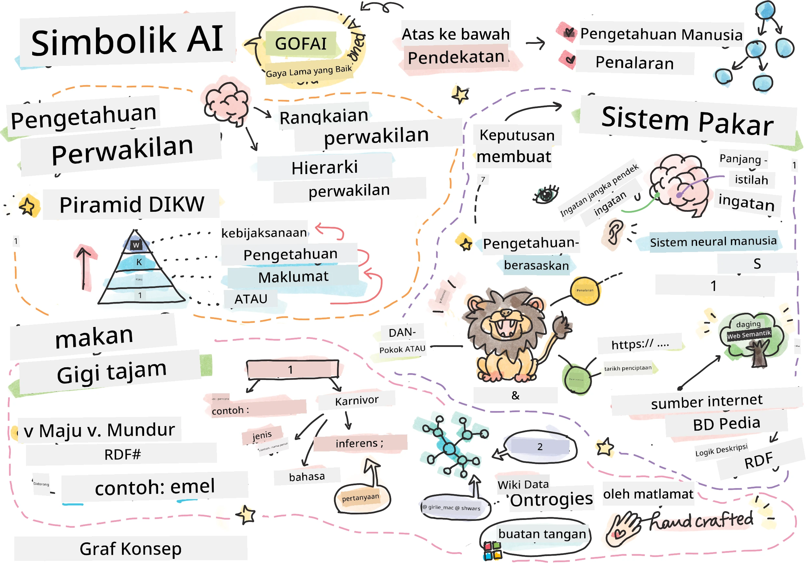
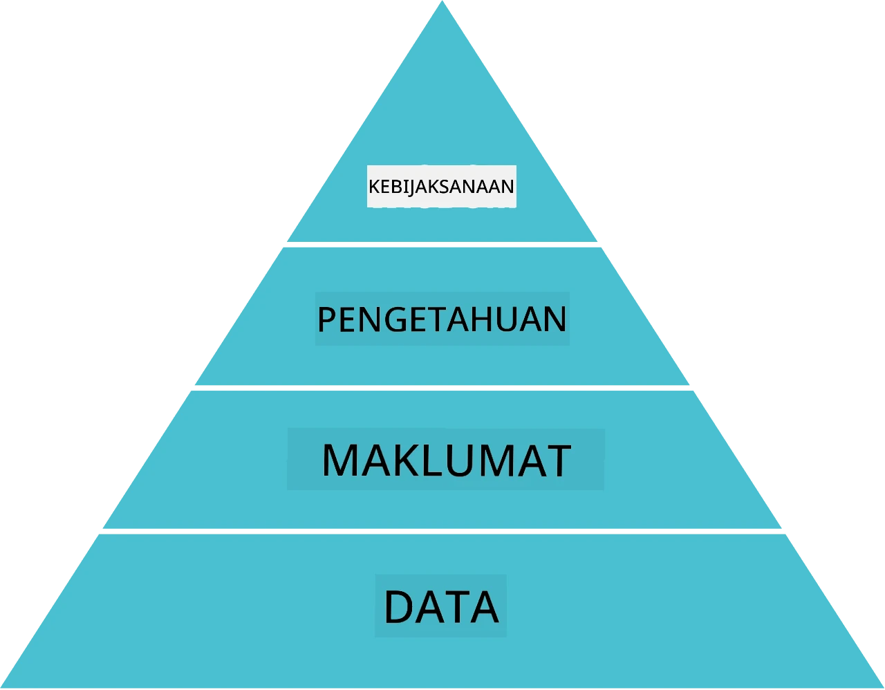
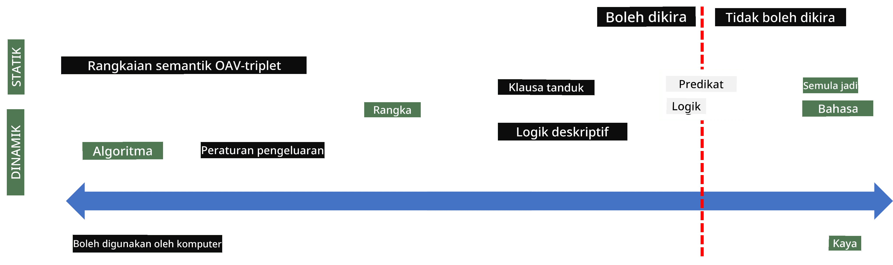
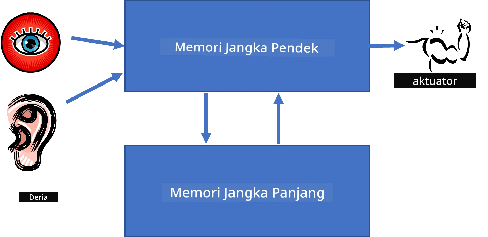
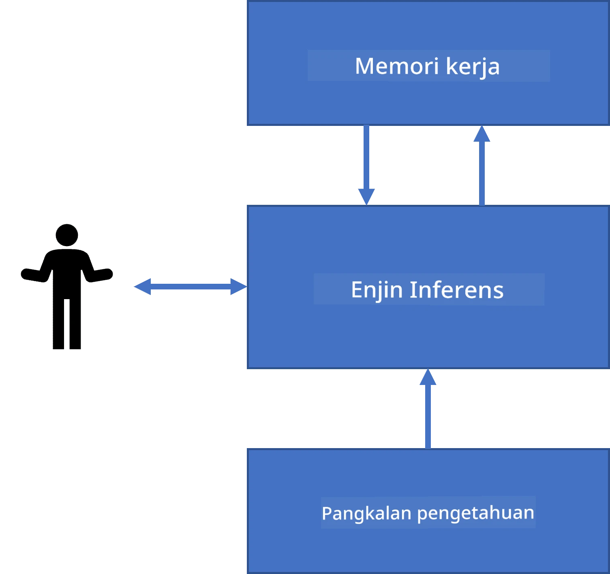
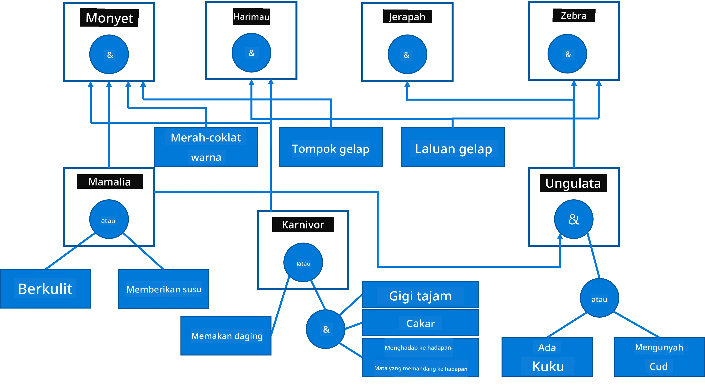
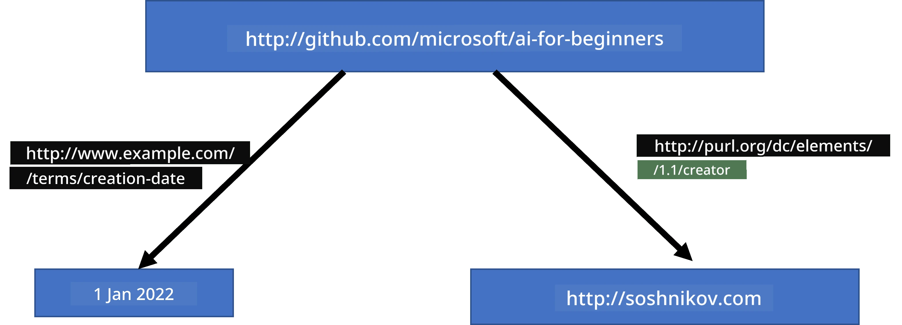
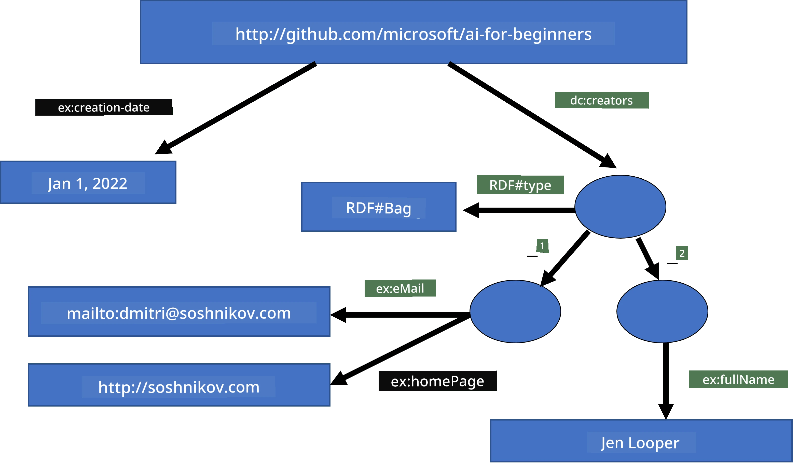
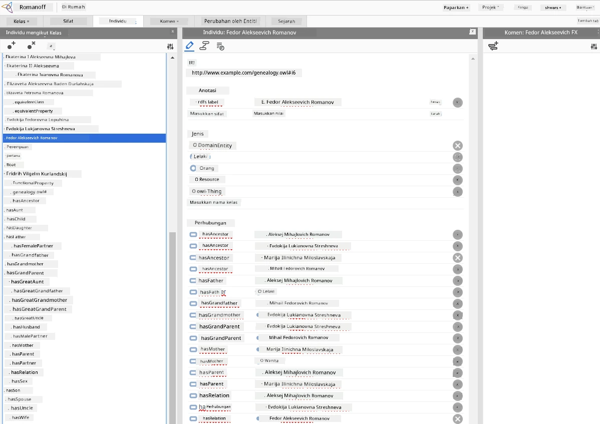

# Perwakilan Pengetahuan dan Sistem Pakar



> Sketchnote oleh [Tomomi Imura](https://twitter.com/girlie_mac)

Pencarian kecerdasan buatan berasaskan pencarian pengetahuan, untuk memahami dunia seperti manusia. Tetapi bagaimana anda boleh melakukannya?

## [Kuiz pra-ceramah](https://ff-quizzes.netlify.app/en/ai/quiz/3)

Pada zaman awal AI, pendekatan dari atas ke bawah untuk mencipta sistem pintar (dibincangkan dalam pelajaran sebelumnya) adalah popular. Idea itu adalah untuk mengekstrak pengetahuan daripada manusia ke dalam bentuk yang boleh dibaca mesin, kemudian menggunakannya untuk menyelesaikan masalah secara automatik. Pendekatan ini berdasarkan dua idea besar:

* Perwakilan Pengetahuan
* Penalaran

## Perwakilan Pengetahuan

Salah satu konsep penting dalam AI Simbolik adalah **pengetahuan**. Penting untuk membezakan pengetahuan daripada *maklumat* atau *data*. Contohnya, seseorang boleh mengatakan bahawa buku mengandungi pengetahuan, kerana seseorang boleh belajar dari buku dan menjadi pakar. Namun, apa yang terkandung dalam buku sebenarnya dipanggil *data*, dan dengan membaca buku dan mengintegrasikan data ini ke dalam model dunia kita, kita menukar data ini menjadi pengetahuan.

> ✅ **Pengetahuan** adalah sesuatu yang terkandung dalam kepala kita dan mewakili pemahaman kita tentang dunia. Ia diperoleh melalui proses **pembelajaran** aktif, yang mengintegrasikan kepingan maklumat yang kita terima ke dalam model aktif dunia kita.

Kebiasaannya, kita tidak mendefinisikan pengetahuan secara ketat, tetapi kita menyelaraskannya dengan konsep berkaitan lain menggunakan [Piramid DIKW](https://en.wikipedia.org/wiki/DIKW_pyramid). Ia mengandungi konsep-konsep berikut:

* **Data** adalah sesuatu yang diwakili dalam media fizikal, seperti teks bertulis atau kata-kata yang diucapkan. Data wujud secara bebas daripada manusia dan boleh dipindahkan antara orang.
* **Maklumat** adalah bagaimana kita mentafsir data dalam kepala kita. Contohnya, apabila kita mendengar perkataan *komputer*, kita mempunyai sedikit kefahaman tentang apa itu.
* **Pengetahuan** adalah maklumat yang diintegrasikan ke dalam model dunia kita. Contohnya, apabila kita belajar apa itu komputer, kita mula mempunyai beberapa idea tentang bagaimana ia berfungsi, berapa harganya, dan apa yang ia boleh digunakan. Rangkaian konsep yang saling berkaitan ini membentuk pengetahuan kita.
* **Kebijaksanaan** adalah satu lagi tahap pemahaman dunia kita, dan ia mewakili *meta-pengetahuan*, contohnya, satu konsep tentang bagaimana dan bila pengetahuan harus digunakan.



*Imej [dari Wikipedia](https://commons.wikimedia.org/w/index.php?curid=37705247), Oleh Longlivetheux - Karya sendiri, CC BY-SA 4.0*

Jadi, masalah **perwakilan pengetahuan** adalah untuk mencari cara yang berkesan untuk mewakili pengetahuan di dalam komputer dalam bentuk data, supaya ia boleh digunakan secara automatik. Ini boleh dilihat sebagai spektrum:



> Imej oleh [Dmitry Soshnikov](http://soshnikov.com)

* Di sebelah kiri, terdapat jenis perwakilan pengetahuan yang sangat mudah yang boleh digunakan dengan berkesan oleh komputer. Yang paling mudah ialah algoritmik, apabila pengetahuan diwakili oleh program komputer. Walau bagaimanapun, ini bukan cara terbaik untuk mewakili pengetahuan kerana ia tidak fleksibel. Pengetahuan dalam kepala kita sering kali tidak bersifat algoritmik.
* Di sebelah kanan, terdapat perwakilan seperti teks semula jadi. Ia paling kuat, tetapi tidak boleh digunakan untuk penalaran automatik.

> ✅ Fikirkan seketika tentang bagaimana anda mewakili pengetahuan dalam kepala anda dan menukarnya kepada nota. Adakah terdapat format tertentu yang berkesan untuk anda membantu dalam penyimpanan?

## Mengklasifikasikan Perwakilan Pengetahuan Komputer

Kita boleh mengklasifikasikan kaedah perwakilan pengetahuan komputer yang berbeza ke dalam kategori berikut:

* **Perwakilan rangkaian** berdasarkan fakta bahawa kita mempunyai rangkaian konsep yang saling berkaitan dalam kepala kita. Kita boleh cuba menghasilkan rangkaian yang sama sebagai graf dalam komputer - dipanggil **rangkaian semantik**.

1. **Triplet Objek-Atribut-Nilai** atau **pasangan atribut-nilai**. Oleh kerana graf boleh diwakili dalam komputer sebagai senarai nod dan tepi, kita boleh mewakili rangkaian semantik dengan senarai triplet, yang mengandungi objek, atribut, dan nilai. Contohnya, kita membina triplet berikut tentang bahasa pengaturcaraan:

Objek | Atribut | Nilai
-------|-----------|------
Python | adalah | Bahasa-Tiada-Tip
Python | dicipta-oleh | Guido van Rossum
Python | sintaks-blok | penjorokan
Bahasa-Tiada-Tip | tidak ada | definisi jenis

> ✅ Fikirkan bagaimana triplet boleh digunakan untuk mewakili jenis pengetahuan lain.

2. **Perwakilan hierarki** menekankan fakta bahawa kita sering mencipta hierarki objek dalam kepala kita. Contohnya, kita tahu bahawa kenari adalah burung, dan semua burung mempunyai sayap. Kita juga mempunyai idea tentang warna biasa kenari, dan kelajuan terbang mereka.

   - **Perwakilan bingkai** berdasarkan pada mewakili setiap objek atau kelas objek sebagai **bingkai** yang mengandungi **slot**. Slot mempunyai nilai lalai yang mungkin, sekatan nilai, atau prosedur tersimpan yang boleh dipanggil untuk memperoleh nilai slot. Semua bingkai membentuk hierarki serupa dengan hierarki objek dalam bahasa pengaturcaraan berorientasikan objek.
   - **Senario** adalah jenis bingkai khas yang mewakili situasi kompleks yang boleh berlaku dalam masa.

**Python**

Slot | Nilai | Nilai Lalai | Julat |
-----|-------|-------------|--------|
Nama | Python | | |
Adalah | Bahasa-Tiada-Tip | | |
Variabel Case | | CamelCase | |
Panjang Program | | | 5-5000 baris |
Sintaks Blok | Penjorokan | | |

3. **Perwakilan prosedural** berdasarkan pada mewakili pengetahuan dengan senarai tindakan yang boleh dilaksanakan apabila satu syarat tertentu berlaku.
   - Peraturan pengeluaran adalah pernyataan jika-maka yang membolehkan kita membuat kesimpulan. Contohnya, seorang doktor boleh mempunyai peraturan yang mengatakan **JIKA** pesakit mempunyai demam tinggi **ATAU** tahap tinggi protein C-reaktif dalam ujian darah **MAKA** dia mengalami keradangan. Setelah menemui salah satu syarat, kita boleh membuat kesimpulan mengenai keradangan, dan kemudian menggunakannya dalam penalaran selanjutnya.
   - Algoritma boleh dianggap sebagai bentuk perwakilan prosedural lain, walaupun ia hampir tidak pernah digunakan secara langsung dalam sistem berasaskan pengetahuan.

4. **Logik** asalnya dicadangkan oleh Aristotle sebagai cara untuk mewakili pengetahuan manusia sejagat.
   - Logik Predikat sebagai teori matematik terlalu kaya untuk dikira, oleh itu subset daripadanya biasanya digunakan, seperti klausa Horn yang digunakan dalam Prolog.
   - Logik Deskriptif adalah keluarga sistem logik yang digunakan untuk mewakili dan berfikir tentang hierarki objek dalam perwakilan pengetahuan teragih seperti *web semantik*.

## Sistem Pakar

Salah satu kejayaan awal AI simbolik ialah yang dipanggil **sistem pakar** - sistem komputer yang direka untuk bertindak sebagai pakar dalam domain masalah terhad. Ia berdasarkan pada **pangkalan pengetahuan** yang diekstrak daripada satu atau lebih pakar manusia, dan mengandungi **enjin inferens** yang melakukan penalaran ke atasnya.

 | 
---------------------------------------------|------------------------------------------------
Struktur ringkas sistem saraf manusia | Seni bina sistem berasaskan pengetahuan

Sistem pakar dibina seperti sistem penalaran manusia, yang mengandungi **memori jangka pendek** dan **memori jangka panjang**. Begitu juga, dalam sistem berasaskan pengetahuan kita membezakan komponen berikut:

* **Memori masalah**: mengandungi pengetahuan tentang masalah yang sedang diselesaikan, contohnya suhu atau tekanan darah pesakit, sama ada dia mengalami keradangan atau tidak, dan lain-lain. Pengetahuan ini juga dipanggil **pengetahuan statik**, kerana ia mengandungi gagasan snapshot tentang apa yang kita tahu tentang masalah tersebut - dipanggil *keadaan masalah*.
* **Pangkalan pengetahuan**: mewakili pengetahuan jangka panjang tentang domain masalah. Ia diekstrak secara manual dari pakar manusia, dan tidak berubah dari satu perundingan ke perundingan lain. Kerana ia membolehkan kita bergerak dari satu keadaan masalah ke keadaan lain, ia juga dipanggil **pengetahuan dinamik**.
* **Enjin inferens**: mengatur keseluruhan proses carian dalam ruang keadaan masalah, mengemukakan soalan kepada pengguna apabila perlu. Ia juga bertanggungjawab mencari peraturan yang betul untuk digunakan pada setiap keadaan.

Sebagai contoh, mari kita pertimbangkan sistem pakar berikut untuk menentukan haiwan berdasarkan ciri fizikalnya:



> Imej oleh [Dmitry Soshnikov](http://soshnikov.com)

Diagram ini dipanggil **pokok AND-OR**, dan ia adalah perwakilan grafik bagi set peraturan pengeluaran. Melukis pokok berguna pada permulaan mengekstrak pengetahuan daripada pakar. Untuk mewakili pengetahuan dalam komputer, lebih mudah menggunakan peraturan:

```
IF the animal eats meat
OR (animal has sharp teeth
    AND animal has claws
    AND animal has forward-looking eyes
) 
THEN the animal is a carnivore
```

Anda boleh perhatikan bahawa setiap syarat di sebelah kiri peraturan dan tindakan sebenarnya adalah triplet objek-atribut-nilai (OAV). **Memori kerja** mengandungi set triplet OAV yang berkaitan dengan masalah yang sedang diselesaikan. **Enjin peraturan** mencari peraturan yang syaratnya dipenuhi dan melaksanakannya, menambah satu triplet baru ke dalam memori kerja.

> ✅ Tulis pokok AND-OR anda sendiri tentang topik yang anda suka!

### Inferens Hadapan vs Inferens Kebalikan

Proses yang diterangkan di atas dipanggil **inferens hadapan**. Ia bermula dengan beberapa data awal tentang masalah yang tersedia dalam memori kerja, kemudiannya melaksanakan gelung penalaran berikut:

1. Jika atribut sasaran terdapat dalam memori kerja - berhenti dan berikan keputusan
2. Cari semua peraturan yang syaratnya dipenuhi sekarang - dapatkan **set pertembungan** peraturan.
3. Lakukan **penyelesaian pertembungan** - pilih satu peraturan yang akan dilaksanakan pada langkah ini. Terdapat beberapa strategi penyelesaian pertembungan:
   - Pilih peraturan pertama yang boleh digunakan dalam pangkalan pengetahuan
   - Pilih peraturan secara rawak
   - Pilih peraturan *lebih khusus*, iaitu yang memenuhi syarat terbanyak di sebelah "kiri" (LHS)
4. Terapkan peraturan yang dipilih dan masukkan pengetahuan baru ke dalam keadaan masalah
5. Ulang dari langkah 1.

Walau bagaimanapun, dalam beberapa kes kita mungkin mahu bermula dengan pengetahuan kosong tentang masalah, dan bertanya soalan yang akan membantu kita sampai kepada kesimpulan. Contohnya, ketika melakukan diagnosis perubatan, kita biasanya tidak melakukan semua analisis perubatan terlebih dahulu sebelum memulakan diagnosis pesakit. Kita lebih suka melakukan analisis apabila keputusan perlu dibuat.

Proses ini boleh dimodelkan menggunakan **inferens kebalikan**. Ia digerakkan oleh **matlamat** - nilai atribut yang kita cari:

1. Pilih semua peraturan yang boleh memberi kita nilai matlamat (iaitu dengan matlamat di sebelah kanan (RHS)) - satu set pertembungan
1. Jika tiada peraturan untuk atribut ini, atau terdapat peraturan yang mengatakan bahawa kita harus bertanya nilai daripada pengguna - tanya, jika tidak:
1. Gunakan strategi penyelesaian pertembungan untuk memilih satu peraturan yang akan digunakan sebagai *hipotesis* - kita akan cuba membuktikannya
1. Ulang semula proses untuk semua atribut dalam LHS peraturan, cuba membuktikannya sebagai matlamat
1. Jika pada bila-bila masa proses gagal - gunakan peraturan lain pada langkah 3.

> ✅ Dalam situasi manakah inferens hadapan lebih sesuai? Bagaimana dengan inferens kebalikan?

### Melaksanakan Sistem Pakar

Sistem pakar boleh dilaksanakan menggunakan pelbagai alat:

* Menyediakannya terus dalam bahasa pengaturcaraan tahap tinggi. Ini bukan idea terbaik, kerana kelebihan utama sistem berasaskan pengetahuan adalah pengetahuan dipisahkan daripada inferens, dan pakar domain masalah berpotensi dapat menulis peraturan tanpa memahami butiran proses inferens
* Menggunakan **shell sistem pakar**, iaitu sistem yang direka khusus untuk diisi dengan pengetahuan menggunakan bahasa perwakilan pengetahuan.

## ✍️ Latihan: Inferens Haiwan

Lihat [Animals.ipynb](https://github.com/microsoft/AI-For-Beginners/blob/main/lessons/2-Symbolic/Animals.ipynb) sebagai contoh melaksanakan sistem pakar inferens hadapan dan kebalikan.

> **Nota**: Contoh ini agak mudah, dan hanya memberikan idea bagaimana sistem pakar kelihatan. Apabila anda mula mencipta sistem sebegini, anda hanya akan perasan beberapa tingkah laku *pintar* apabila mencapai jumlah peraturan tertentu, sekitar 200+. Pada satu titik, peraturan menjadi terlalu kompleks untuk diingat semuanya, dan pada waktu itu anda mungkin mula tertanya-tanya mengapa sistem membuat keputusan tertentu. Namun, ciri penting sistem berasaskan pengetahuan adalah anda sentiasa boleh *menjelaskan* dengan tepat bagaimana keputusan dibuat.

## Ontologi dan Web Semantik

Pada akhir abad ke-20, terdapat inisiatif untuk menggunakan perwakilan pengetahuan untuk menganotasi sumber Internet, supaya boleh mencari sumber yang sesuai dengan pertanyaan yang sangat spesifik. Gerakan ini dipanggil **Web Semantik**, dan ia bergantung pada beberapa konsep:

- Perwakilan pengetahuan khas berdasarkan **[logik deskriptif](https://en.wikipedia.org/wiki/Description_logic)** (DL). Ia serupa dengan perwakilan bingkai, kerana ia membina hierarki objek dengan sifat, tetapi ia mempunyai semantik logik formal dan inferens. Terdapat satu keluarga DL yang mengimbangi antara keupayaan ekspresif dan kerumitan algoritma inferens.
- Perwakilan pengetahuan teragih, di mana semua konsep diwakili oleh pengecam URI global, membolehkan penciptaan hierarki pengetahuan merentasi internet.
- Satu keluarga bahasa berasaskan XML untuk penerangan pengetahuan: RDF (Resource Description Framework), RDFS (RDF Schema), OWL (Ontology Web Language).

Konsep teras dalam Semantic Web ialah konsep **Ontologi**. Ia merujuk kepada spesifikasi eksplisit bagi domain masalah menggunakan beberapa representasi pengetahuan formal. Ontologi yang paling mudah boleh jadi hanya hierarki objek dalam domain masalah, tetapi ontologi yang lebih kompleks akan merangkumi peraturan yang boleh digunakan untuk inferens.

Dalam semantic web, semua representasi berasaskan triplet. Setiap objek dan setiap hubungan dikenalpasti secara unik oleh URI. Sebagai contoh, jika kita ingin menyatakan fakta bahawa Kurikulum AI ini telah dibangunkan oleh Dmitry Soshnikov pada 1 Jan 2022 - berikut adalah triplet yang kita boleh gunakan:



```
http://github.com/microsoft/ai-for-beginners http://www.example.com/terms/creation-date “Jan 1, 2022”
http://github.com/microsoft/ai-for-beginners http://purl.org/dc/elements/1.1/creator http://soshnikov.com
```

> ✅ Di sini `http://www.example.com/terms/creation-date` dan `http://purl.org/dc/elements/1.1/creator` adalah beberapa URI yang diketahui dan diterima secara universal untuk menyatakan konsep *pencipta* dan *tarikh penciptaan*.

Dalam keadaan yang lebih kompleks, jika kita ingin mentakrif senarai pencipta, kita boleh menggunakan beberapa struktur data yang ditakrifkan dalam RDF.



> Rajah di atas oleh [Dmitry Soshnikov](http://soshnikov.com)

Kemajuan dalam membina Semantic Web agak perlahan disebabkan kejayaan enjin carian dan teknik pemprosesan bahasa semula jadi, yang membolehkan pengekstrakan data berstruktur dari teks. Namun, dalam beberapa bidang masih terdapat usaha ketara untuk mengekalkan ontologi dan pangkalan pengetahuan. Beberapa projek yang patut diberi perhatian:

* [WikiData](https://wikidata.org/) ialah koleksi pangkalan pengetahuan yang boleh dibaca mesin yang berkaitan dengan Wikipedia. Kebanyakan data diperolehi dari *InfoBoxes* Wikipedia, potongan kandungan berstruktur dalam halaman Wikipedia. Anda boleh [membuat pertanyaan](https://query.wikidata.org/) terhadap wikidata menggunakan SPARQL, bahasa pertanyaan khas untuk Semantic Web. Berikut adalah contoh pertanyaan yang memaparkan warna mata paling popular di kalangan manusia:

```sparql
#defaultView:BubbleChart
SELECT ?eyeColorLabel (COUNT(?human) AS ?count)
WHERE
{
  ?human wdt:P31 wd:Q5.       # human instance-of homo sapiens
  ?human wdt:P1340 ?eyeColor. # human eye-color ?eyeColor
  SERVICE wikibase:label { bd:serviceParam wikibase:language "en". }
}
GROUP BY ?eyeColorLabel
```

* [DBpedia](https://www.dbpedia.org/) ialah usaha lain yang serupa dengan WikiData.

> ✅ Jika anda ingin mencuba membina ontologi anda sendiri, atau membuka yang sedia ada, terdapat editor ontologi visual yang hebat dipanggil [Protégé](https://protege.stanford.edu/). Muat turun atau gunakannya secara atas talian.



*Editor Web Protégé dibuka dengan ontologi Keluarga Romanov. Tangkapan skrin oleh Dmitry Soshnikov*

## ✍️ Latihan: Ontologi Keluarga

Lihat [FamilyOntology.ipynb](https://github.com/Ezana135/AI-For-Beginners/blob/main/lessons/2-Symbolic/FamilyOntology.ipynb) untuk contoh menggunakan teknik Semantic Web bagi membuat inferens tentang hubungan keluarga. Kita akan mengambil pohon keluarga yang diwakili dalam format GEDCOM biasa dan ontologi hubungan keluarga serta membina graf semua hubungan keluarga untuk set individu yang diberikan.

## Microsoft Concept Graph

Dalam kebanyakan kes, ontologi dibina dengan berhati-hati secara manual. Walau bagaimanapun, adalah juga mungkin untuk **melombong** ontologi dari data tidak berstruktur, contohnya, dari teks bahasa semula jadi.

Satu usaha tersebut dilakukan oleh Microsoft Research, yang menghasilkan [Microsoft Concept Graph](https://blogs.microsoft.com/ai/microsoft-researchers-release-graph-that-helps-machines-conceptualize/?WT.mc_id=academic-77998-cacaste).

Ia adalah koleksi besar entiti yang dikelompokkan bersama menggunakan hubungan pewarisan `is-a`. Ia membolehkan menjawab soalan seperti "Apa itu Microsoft?" - jawapannya ialah sesuatu seperti "sebuah syarikat dengan kebarangkalian 0.87, dan sebuah jenama dengan kebarangkalian 0.75".

Graf ini tersedia sama ada sebagai REST API, atau sebagai fail teks besar yang boleh dimuat turun yang menyenaraikan semua pasangan entiti.

## ✍️ Latihan: Graf Konsep

Cuba notebook [MSConceptGraph.ipynb](https://github.com/microsoft/AI-For-Beginners/blob/main/lessons/2-Symbolic/MSConceptGraph.ipynb) untuk melihat bagaimana kita boleh menggunakan Microsoft Concept Graph untuk mengelompokkan artikel berita ke dalam beberapa kategori.

## Kesimpulan

Kini, AI sering dianggap sebagai sinonim untuk *Machine Learning* atau *Neural Networks*. Walau bagaimanapun, manusia juga menunjukkan alasan eksplisit, sesuatu yang kini tidak diurus oleh rangkaian neural. Dalam projek dunia sebenar, alasan eksplisit masih digunakan untuk melaksanakan tugas yang memerlukan penjelasan, atau boleh mengubah tingkah laku sistem secara terkawal.

## 🚀 Cabaran

Dalam notebook Ontologi Keluarga yang berkaitan dengan pelajaran ini, terdapat peluang untuk mencuba hubungan keluarga yang lain. Cuba temui hubungan baru antara orang dalam pohon keluarga tersebut.

## [Kuis selepas kuliah](https://ff-quizzes.netlify.app/en/ai/quiz/4)

## Semakan & Pembelajaran Kendiri

Lakukan kajian di internet untuk mengetahui bidang di mana manusia telah cuba mengkuantifikasi dan mengkodkan pengetahuan. Lihatlah Taksonomi Bloom, dan kembali ke sejarah untuk belajar bagaimana manusia cuba memahami dunia mereka. Terokai kerja Linnaeus dalam mencipta taksonomi organisma, dan perhatikan cara Dmitri Mendeleev mencipta kaedah untuk menerangkan dan mengelompokkan unsur kimia. Apakah contoh menarik lain yang anda boleh temui?

**Tugasan**: [Bina Ontologi](assignment.md)

---

<!-- CO-OP TRANSLATOR DISCLAIMER START -->
**Penafian**:
Dokumen ini telah diterjemahkan menggunakan perkhidmatan terjemahan AI [Co-op Translator](https://github.com/Azure/co-op-translator). Walaupun kami berusaha untuk mencapai ketepatan, sila ambil maklum bahawa terjemahan automatik mungkin mengandungi kesilapan atau ketidaktepatan. Dokumen asal dalam bahasa asalnya perlu dianggap sebagai sumber yang sahih. Untuk maklumat penting, terjemahan profesional oleh manusia adalah disyorkan. Kami tidak bertanggungjawab atas sebarang salah faham atau salah tafsir yang timbul daripada penggunaan terjemahan ini.
<!-- CO-OP TRANSLATOR DISCLAIMER END -->