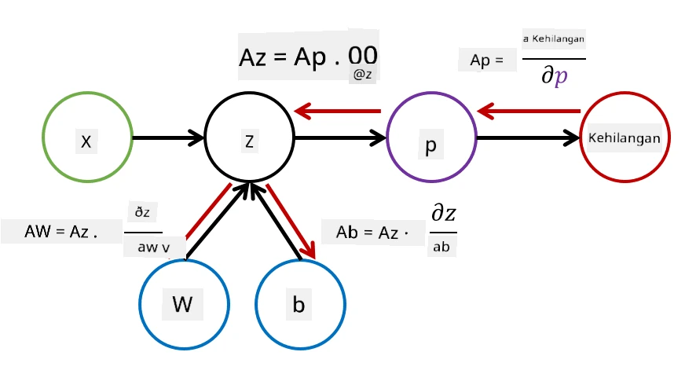

# Pengenalan kepada Rangkaian Neural. Multi-Layered Perceptron

Dalam bahagian sebelumnya, anda telah mempelajari model rangkaian neural yang paling mudah - perceptron satu lapisan, iaitu model klasifikasi linear dua kelas.

Dalam bahagian ini, kita akan memperluaskan model ini kepada kerangka yang lebih fleksibel, membolehkan kita:

* melakukan **klasifikasi pelbagai kelas** selain daripada dua kelas
* menyelesaikan **masalah regresi** selain daripada klasifikasi
* memisahkan kelas yang tidak boleh dipisahkan secara linear

Kita juga akan membangunkan kerangka modular kita sendiri dalam Python yang membolehkan kita membina pelbagai seni bina rangkaian neural.

## [Kuiz pra-kuliah](https://ff-quizzes.netlify.app/en/ai/quiz/7)

## Formalisasi Pembelajaran Mesin

Mari kita mulakan dengan memformalkan masalah Pembelajaran Mesin. Katakan kita mempunyai dataset latihan **X** dengan label **Y**, dan kita perlu membina model *f* yang akan membuat ramalan paling tepat. Kualiti ramalan diukur oleh **Fungsi Kehilangan** &lagran;. Fungsi kehilangan berikut sering digunakan:

* Untuk masalah regresi, apabila kita perlu meramalkan nombor, kita boleh menggunakan **ralat mutlak** &sum;i|f(x(i))-y(i)|, atau **ralat kuasa dua** &sum;i(f(x(i))-y(i))2
* Untuk klasifikasi, kita menggunakan **kehilangan 0-1** (yang pada asasnya sama dengan **ketepatan** model), atau **kehilangan logistik**.

Untuk perceptron satu lapisan, fungsi *f* ditakrifkan sebagai fungsi linear *f(x)=wx+b* (di sini *w* adalah matriks berat, *x* adalah vektor ciri input, dan *b* adalah vektor bias). Untuk seni bina rangkaian neural yang berbeza, fungsi ini boleh mengambil bentuk yang lebih kompleks.

> Dalam kes klasifikasi, sering kali diinginkan untuk mendapatkan kebarangkalian kelas yang sesuai sebagai output rangkaian. Untuk menukar nombor sewenang-wenang kepada kebarangkalian (contohnya untuk menormalkan output), kita sering menggunakan fungsi **softmax** &sigma;, dan fungsi *f* menjadi *f(x)=&sigma;(wx+b)*

Dalam definisi *f* di atas, *w* dan *b* dipanggil **parameter** &theta;=⟨*w,b*⟩. Diberikan dataset ⟨**X**,**Y**⟩, kita boleh mengira ralat keseluruhan pada keseluruhan dataset sebagai fungsi parameter &theta;.

> ✅ **Matlamat latihan rangkaian neural adalah untuk meminimumkan ralat dengan mengubah parameter &theta;**

## Pengoptimuman Penurunan Gradien

Terdapat kaedah pengoptimuman fungsi yang terkenal yang dipanggil **penurunan gradien**. Ideanya ialah kita boleh mengira derivatif (dalam kes berbilang dimensi dipanggil **gradien**) fungsi kehilangan berkenaan dengan parameter, dan mengubah parameter sedemikian rupa sehingga ralat akan berkurangan. Ini boleh diformalkan seperti berikut:

* Inisialisasi parameter dengan beberapa nilai rawak w(0), b(0)
* Ulang langkah berikut berkali-kali:
    - w(i+1) = w(i)-&eta;&part;&lagran;/&part;w
    - b(i+1) = b(i)-&eta;&part;&lagran;/&part;b

Semasa latihan, langkah pengoptimuman sepatutnya dikira dengan mempertimbangkan keseluruhan dataset (ingat bahawa kehilangan dikira sebagai jumlah melalui semua sampel latihan). Walau bagaimanapun, dalam kehidupan sebenar kita mengambil bahagian kecil dataset yang dipanggil **minibatch**, dan mengira gradien berdasarkan subset data. Oleh kerana subset diambil secara rawak setiap kali, kaedah sedemikian dipanggil **penurunan gradien stokastik** (SGD).

## Multi-Layered Perceptrons dan Backpropagation

Rangkaian satu lapisan, seperti yang telah kita lihat di atas, mampu mengklasifikasikan kelas yang boleh dipisahkan secara linear. Untuk membina model yang lebih kaya, kita boleh menggabungkan beberapa lapisan rangkaian. Secara matematik, ini bermakna fungsi *f* akan mempunyai bentuk yang lebih kompleks, dan akan dikira dalam beberapa langkah:
* z1=w1x+b1
* z2=w2&alpha;(z1)+b2
* f = &sigma;(z2)

Di sini, &alpha; adalah **fungsi pengaktifan tidak linear**, &sigma; adalah fungsi softmax, dan parameter &theta;=<*w1,b1,w2,b2*>.

Algoritma penurunan gradien akan kekal sama, tetapi ia akan menjadi lebih sukar untuk mengira gradien. Berdasarkan peraturan pembezaan rantai, kita boleh mengira derivatif seperti:

* &part;&lagran;/&part;w2 = (&part;&lagran;/&part;&sigma;)(&part;&sigma;/&part;z2)(&part;z2/&part;w2)
* &part;&lagran;/&part;w1 = (&part;&lagran;/&part;&sigma;)(&part;&sigma;/&part;z2)(&part;z2/&part;&alpha;)(&part;&alpha;/&part;z1)(&part;z1/&part;w1)

> ✅ Peraturan pembezaan rantai digunakan untuk mengira derivatif fungsi kehilangan berkenaan dengan parameter.

Perhatikan bahawa bahagian paling kiri semua ungkapan tersebut adalah sama, dan oleh itu kita boleh mengira derivatif dengan berkesan bermula daripada fungsi kehilangan dan bergerak "ke belakang" melalui graf pengiraan. Oleh itu, kaedah latihan perceptron berbilang lapisan dipanggil **backpropagation**, atau 'backprop'.

> TODO: rujukan imej

> ✅ Kita akan membincangkan backprop dengan lebih terperinci dalam contoh notebook kita.  

## Kesimpulan

Dalam pelajaran ini, kita telah membina perpustakaan rangkaian neural kita sendiri, dan kita telah menggunakannya untuk tugas klasifikasi dua dimensi yang mudah.

## 🚀 Cabaran

Dalam notebook yang disertakan, anda akan melaksanakan kerangka anda sendiri untuk membina dan melatih perceptron berbilang lapisan. Anda akan dapat melihat secara terperinci bagaimana rangkaian neural moden beroperasi.

Teruskan ke notebook [OwnFramework](OwnFramework.ipynb) dan selesaikan latihan di dalamnya.

## [Kuiz pasca-kuliah](https://ff-quizzes.netlify.app/en/ai/quiz/8)

## Kajian & Pembelajaran Kendiri

Backpropagation adalah algoritma biasa yang digunakan dalam AI dan ML, berbaloi untuk dikaji [dengan lebih mendalam](https://wikipedia.org/wiki/Backpropagation)

## [Tugasan](lab/README.md)

Dalam makmal ini, anda diminta untuk menggunakan kerangka yang anda bina dalam pelajaran ini untuk menyelesaikan klasifikasi digit tulisan tangan MNIST.

* [Arahan](lab/README.md)
* [Notebook](lab/MyFW_MNIST.ipynb)

---

