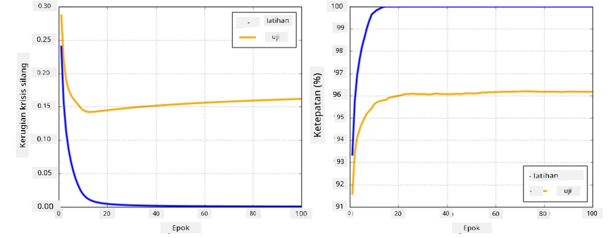

# Rangka Kerja Rangkaian Neural

Seperti yang telah kita pelajari, untuk melatih rangkaian neural dengan cekap, kita perlu melakukan dua perkara:

* Beroperasi pada tensor, contohnya untuk mendarab, menambah, dan mengira beberapa fungsi seperti sigmoid atau softmax
* Mengira kecerunan semua ekspresi, untuk melaksanakan pengoptimuman penurunan kecerunan

## [Kuiz pra-kuliah](https://ff-quizzes.netlify.app/en/ai/quiz/9)

Walaupun perpustakaan `numpy` boleh melakukan bahagian pertama, kita memerlukan mekanisme untuk mengira kecerunan. Dalam [rangka kerja kita](../04-OwnFramework/OwnFramework.ipynb) yang telah kita bangunkan dalam bahagian sebelumnya, kita perlu memprogramkan semua fungsi derivatif secara manual di dalam kaedah `backward`, yang melakukan backpropagation. Sebaiknya, rangka kerja harus memberi kita peluang untuk mengira kecerunan bagi *sebarang ekspresi* yang boleh kita tentukan.

Perkara penting lain ialah keupayaan untuk melakukan pengiraan pada GPU, atau unit pengiraan khusus lain seperti [TPU](https://en.wikipedia.org/wiki/Tensor_Processing_Unit). Latihan rangkaian neural yang mendalam memerlukan *banyak* pengiraan, dan keupayaan untuk memparallelkan pengiraan tersebut pada GPU adalah sangat penting.

> ✅ Istilah 'parallelkan' bermaksud mengagihkan pengiraan ke pelbagai peranti.

Pada masa ini, dua rangka kerja neural yang paling popular ialah: [TensorFlow](http://TensorFlow.org) dan [PyTorch](https://pytorch.org/). Kedua-duanya menyediakan API peringkat rendah untuk beroperasi dengan tensor pada CPU dan GPU. Di atas API peringkat rendah, terdapat juga API peringkat tinggi, yang dipanggil [Keras](https://keras.io/) dan [PyTorch Lightning](https://pytorchlightning.ai/) masing-masing.

API Peringkat Rendah | [TensorFlow](http://TensorFlow.org) | [PyTorch](https://pytorch.org/)
----------------------|-------------------------------------|--------------------------------
API Peringkat Tinggi  | [Keras](https://keras.io/)         | [PyTorch Lightning](https://pytorchlightning.ai/)

**API peringkat rendah** dalam kedua-dua rangka kerja membolehkan anda membina **graf pengiraan**. Graf ini menentukan cara untuk mengira output (biasanya fungsi kerugian) dengan parameter input yang diberikan, dan boleh dihantar untuk pengiraan pada GPU, jika tersedia. Terdapat fungsi untuk membezakan graf pengiraan ini dan mengira kecerunan, yang kemudiannya boleh digunakan untuk mengoptimumkan parameter model.

**API peringkat tinggi** menganggap rangkaian neural sebagai **urutan lapisan**, dan memudahkan pembinaan kebanyakan rangkaian neural. Latihan model biasanya memerlukan penyediaan data dan kemudian memanggil fungsi `fit` untuk melaksanakan tugas tersebut.

API peringkat tinggi membolehkan anda membina rangkaian neural biasa dengan cepat tanpa perlu risau tentang banyak perincian. Pada masa yang sama, API peringkat rendah menawarkan lebih banyak kawalan ke atas proses latihan, dan oleh itu ia banyak digunakan dalam penyelidikan, apabila anda berurusan dengan seni bina rangkaian neural baharu.

Adalah penting untuk memahami bahawa anda boleh menggunakan kedua-dua API bersama-sama, contohnya, anda boleh membangunkan seni bina lapisan rangkaian anda sendiri menggunakan API peringkat rendah, dan kemudian menggunakannya di dalam rangkaian yang lebih besar yang dibina dan dilatih dengan API peringkat tinggi. Atau anda boleh menentukan rangkaian menggunakan API peringkat tinggi sebagai urutan lapisan, dan kemudian menggunakan gelung latihan peringkat rendah anda sendiri untuk melaksanakan pengoptimuman. Kedua-dua API menggunakan konsep asas yang sama, dan ia direka untuk berfungsi dengan baik bersama-sama.

## Pembelajaran

Dalam kursus ini, kami menawarkan kebanyakan kandungan untuk PyTorch dan TensorFlow. Anda boleh memilih rangka kerja pilihan anda dan hanya melalui buku nota yang berkaitan. Jika anda tidak pasti rangka kerja mana yang hendak dipilih, baca beberapa perbincangan di internet mengenai **PyTorch vs. TensorFlow**. Anda juga boleh melihat kedua-dua rangka kerja untuk mendapatkan pemahaman yang lebih baik.

Di mana mungkin, kami akan menggunakan API Peringkat Tinggi untuk kesederhanaan. Walau bagaimanapun, kami percaya adalah penting untuk memahami cara rangkaian neural berfungsi dari asas, oleh itu pada permulaan kami bermula dengan bekerja dengan API peringkat rendah dan tensor. Walau bagaimanapun, jika anda ingin bermula dengan cepat dan tidak mahu menghabiskan banyak masa untuk mempelajari perincian ini, anda boleh melangkau bahagian tersebut dan terus ke buku nota API peringkat tinggi.

## ✍️ Latihan: Rangka Kerja

Teruskan pembelajaran anda dalam buku nota berikut:

API Peringkat Rendah | [Buku Nota TensorFlow+Keras](IntroKerasTF.ipynb) | [PyTorch](IntroPyTorch.ipynb)
----------------------|-------------------------------------|--------------------------------
API Peringkat Tinggi  | [Keras](IntroKeras.ipynb)         | *PyTorch Lightning*

Selepas menguasai rangka kerja, mari kita ulang kaji konsep overfitting.

# Overfitting

Overfitting adalah konsep yang sangat penting dalam pembelajaran mesin, dan sangat penting untuk memahaminya dengan betul!

Pertimbangkan masalah berikut untuk menghampiri 5 titik (diwakili oleh `x` pada graf di bawah):

 | 
-------------------------|--------------------------
**Model Linear, 2 parameter** | **Model Tidak Linear, 7 parameter**
Ralat latihan = 5.3 | Ralat latihan = 0
Ralat validasi = 5.1 | Ralat validasi = 20

* Di sebelah kiri, kita melihat anggaran garis lurus yang baik. Oleh kerana bilangan parameter adalah mencukupi, model memahami taburan titik dengan betul.
* Di sebelah kanan, model terlalu kuat. Oleh kerana kita hanya mempunyai 5 titik dan model mempunyai 7 parameter, ia boleh menyesuaikan sedemikian rupa sehingga melalui semua titik, menjadikan ralat latihan menjadi 0. Walau bagaimanapun, ini menghalang model daripada memahami corak yang betul di sebalik data, menyebabkan ralat validasi menjadi sangat tinggi.

Adalah sangat penting untuk mencapai keseimbangan yang betul antara kekayaan model (bilangan parameter) dan bilangan sampel latihan.

## Mengapa overfitting berlaku

  * Data latihan tidak mencukupi
  * Model terlalu kuat
  * Terlalu banyak bunyi dalam data input

## Cara mengesan overfitting

Seperti yang anda lihat daripada graf di atas, overfitting boleh dikesan melalui ralat latihan yang sangat rendah, dan ralat validasi yang tinggi. Biasanya semasa latihan kita akan melihat kedua-dua ralat latihan dan validasi mula berkurangan, dan kemudian pada satu ketika ralat validasi mungkin berhenti berkurangan dan mula meningkat. Ini akan menjadi tanda overfitting, dan petunjuk bahawa kita mungkin perlu menghentikan latihan pada ketika ini (atau sekurang-kurangnya membuat snapshot model).

## Cara mencegah overfitting

Jika anda melihat bahawa overfitting berlaku, anda boleh melakukan salah satu perkara berikut:

 * Tambahkan jumlah data latihan
 * Kurangkan kerumitan model
 * Gunakan beberapa [teknik regularisasi](../../4-ComputerVision/08-TransferLearning/TrainingTricks.md), seperti [Dropout](../../4-ComputerVision/08-TransferLearning/TrainingTricks.md#Dropout), yang akan kita pertimbangkan kemudian.

## Overfitting dan Tradeoff Bias-Variance

Overfitting sebenarnya adalah kes bagi masalah yang lebih umum dalam statistik yang dipanggil [Tradeoff Bias-Variance](https://en.wikipedia.org/wiki/Bias%E2%80%93variance_tradeoff). Jika kita mempertimbangkan sumber ralat yang mungkin dalam model kita, kita boleh melihat dua jenis ralat:

* **Ralat bias** disebabkan oleh algoritma kita yang tidak dapat menangkap hubungan antara data latihan dengan betul. Ia boleh berlaku kerana model kita tidak cukup kuat (**underfitting**).
* **Ralat varians**, yang disebabkan oleh model menghampiri bunyi dalam data input dan bukannya hubungan yang bermakna (**overfitting**).

Semasa latihan, ralat bias berkurangan (kerana model kita belajar menghampiri data), dan ralat varians meningkat. Adalah penting untuk menghentikan latihan - sama ada secara manual (apabila kita mengesan overfitting) atau secara automatik (dengan memperkenalkan regularisasi) - untuk mencegah overfitting.

## Kesimpulan

Dalam pelajaran ini, anda telah mempelajari perbezaan antara pelbagai API untuk dua rangka kerja AI yang paling popular, TensorFlow dan PyTorch. Selain itu, anda telah mempelajari topik yang sangat penting, iaitu overfitting.

## 🚀 Cabaran

Dalam buku nota yang disertakan, anda akan menemui 'tugas' di bahagian bawah; selesaikan buku nota tersebut dan lengkapkan tugas-tugasnya.

## [Kuiz pasca-kuliah](https://ff-quizzes.netlify.app/en/ai/quiz/10)

## Kajian & Pembelajaran Kendiri

Lakukan penyelidikan mengenai topik berikut:

- TensorFlow
- PyTorch
- Overfitting

Tanya diri anda soalan berikut:

- Apakah perbezaan antara TensorFlow dan PyTorch?
- Apakah perbezaan antara overfitting dan underfitting?

## [Tugasan](lab/README.md)

Dalam makmal ini, anda diminta untuk menyelesaikan dua masalah klasifikasi menggunakan rangkaian berlapis tunggal dan berbilang lapisan sepenuhnya bersambung menggunakan PyTorch atau TensorFlow.

* [Arahan](lab/README.md)
* [Buku Nota](lab/LabFrameworks.ipynb)

---

