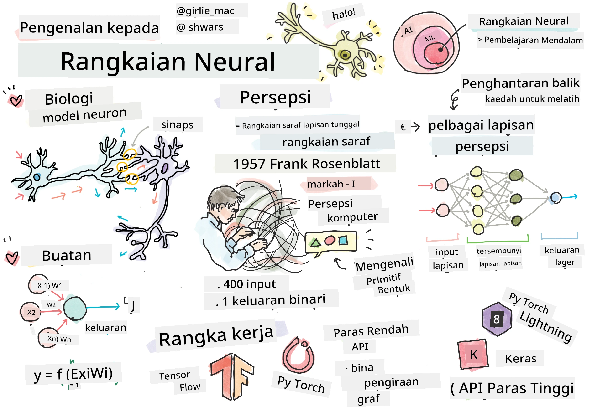
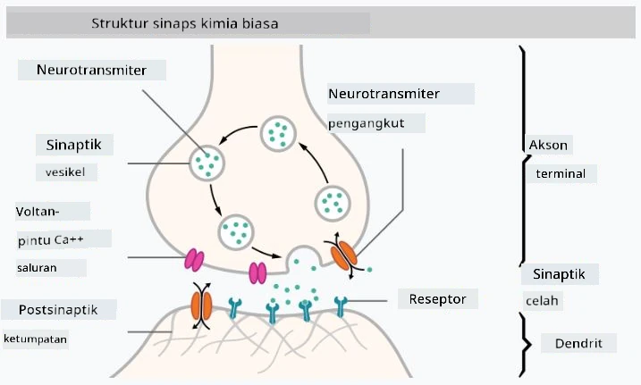

# Pengenalan kepada Rangkaian Neural

Seperti yang telah kita bincangkan dalam pengenalan, salah satu cara untuk mencapai kecerdasan adalah dengan melatih **model komputer** atau **otak tiruan**. Sejak pertengahan abad ke-20, para penyelidik telah mencuba pelbagai model matematik, sehingga beberapa tahun kebelakangan ini arah ini terbukti sangat berjaya. Model matematik otak seperti ini dipanggil **rangkaian neural**.

> Kadang-kadang rangkaian neural dipanggil *Rangkaian Neural Tiruan* atau ANNs, untuk menunjukkan bahawa kita bercakap tentang model, bukan rangkaian sebenar neuron.

## Pembelajaran Mesin

Rangkaian Neural adalah sebahagian daripada disiplin yang lebih besar yang dipanggil **Pembelajaran Mesin**, yang bertujuan menggunakan data untuk melatih model komputer yang mampu menyelesaikan masalah. Pembelajaran Mesin merupakan sebahagian besar daripada Kecerdasan Buatan, namun, kita tidak akan membincangkan Pembelajaran Mesin klasik dalam kurikulum ini.

> Lawati kurikulum **[Machine Learning for Beginners](http://github.com/microsoft/ml-for-beginners)** kami untuk mempelajari lebih lanjut tentang Pembelajaran Mesin klasik.

Dalam Pembelajaran Mesin, kita mengandaikan bahawa kita mempunyai beberapa set data contoh **X**, dan nilai output yang sepadan **Y**. Contoh-contoh ini sering kali merupakan vektor N-dimensi yang terdiri daripada **ciri-ciri**, dan output dipanggil **label**.

Kita akan mempertimbangkan dua masalah pembelajaran mesin yang paling biasa:

* **Klasifikasi**, di mana kita perlu mengklasifikasikan objek input ke dalam dua atau lebih kelas.
* **Regresi**, di mana kita perlu meramalkan nilai berangka untuk setiap sampel input.

> Apabila mewakili input dan output sebagai tensor, set data input adalah matriks bersaiz M&times;N, di mana M adalah bilangan sampel dan N adalah bilangan ciri. Label output Y adalah vektor bersaiz M.

Dalam kurikulum ini, kita hanya akan memberi tumpuan kepada model rangkaian neural.

## Model Neuron

Daripada biologi, kita tahu bahawa otak kita terdiri daripada sel-sel neural (neuron), setiap satunya mempunyai pelbagai "input" (dendrit) dan satu "output" (akson). Kedua-dua dendrit dan akson boleh menghantar isyarat elektrik, dan sambungan di antara mereka — dikenali sebagai sinaps — boleh menunjukkan tahap kekonduksian yang berbeza-beza, yang dikawal oleh neurotransmitter.

 | 
----|----
Neuron Sebenar *([Imej](https://en.wikipedia.org/wiki/Synapse#/media/File:SynapseSchematic_lines.svg) dari Wikipedia)* | Neuron Tiruan *(Imej oleh Penulis)*

Oleh itu, model matematik paling mudah bagi neuron mengandungi beberapa input X1, ..., XN dan satu output Y, serta satu siri pemberat W1, ..., WN. Output dikira sebagai:

di mana f adalah beberapa **fungsi pengaktifan** bukan linear.

> Model awal neuron telah diterangkan dalam kertas klasik [A logical calculus of the ideas immanent in nervous activity](https://www.cs.cmu.edu/~./epxing/Class/10715/reading/McCulloch.and.Pitts.pdf) oleh Warren McCullock dan Walter Pitts pada tahun 1943. Donald Hebb dalam bukunya "[The Organization of Behavior: A Neuropsychological Theory](https://books.google.com/books?id=VNetYrB8EBoC)" mencadangkan cara rangkaian ini boleh dilatih.

## Dalam Bahagian Ini

Dalam bahagian ini kita akan mempelajari tentang:
* [Perceptron](03-Perceptron/README.md), salah satu model rangkaian neural terawal untuk klasifikasi dua kelas
* [Rangkaian berlapis-lapis](04-OwnFramework/README.md) dengan buku nota berpasangan [cara membina rangka kerja kita sendiri](04-OwnFramework/OwnFramework.ipynb)
* [Rangka Kerja Rangkaian Neural](05-Frameworks/README.md), dengan buku nota ini: [PyTorch](05-Frameworks/IntroPyTorch.ipynb) dan [Keras/Tensorflow](05-Frameworks/IntroKerasTF.ipynb)
* [Overfitting](../../../../lessons/3-NeuralNetworks/05-Frameworks)

---

**Penafian**:  
Dokumen ini telah diterjemahkan menggunakan perkhidmatan terjemahan AI [Co-op Translator](https://github.com/Azure/co-op-translator). Walaupun kami berusaha untuk memastikan ketepatan, sila ambil perhatian bahawa terjemahan automatik mungkin mengandungi kesilapan atau ketidaktepatan. Dokumen asal dalam bahasa asalnya harus dianggap sebagai sumber yang berwibawa. Untuk maklumat penting, terjemahan manusia profesional adalah disyorkan. Kami tidak bertanggungjawab atas sebarang salah faham atau salah tafsir yang timbul daripada penggunaan terjemahan ini.