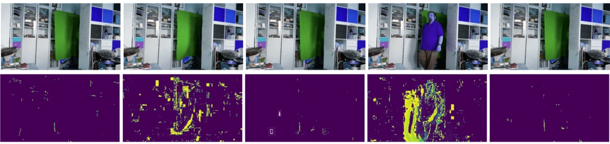

# Pengenalan kepada Penglihatan Komputer

[Penglihatan Komputer](https://wikipedia.org/wiki/Computer_vision) adalah satu bidang yang bertujuan untuk membolehkan komputer memahami imej digital pada tahap tinggi. Definisi ini agak luas kerana *memahami* boleh membawa pelbagai maksud, termasuk mencari objek dalam gambar (**pengesanan objek**), memahami apa yang sedang berlaku (**pengesanan peristiwa**), menerangkan gambar dalam bentuk teks, atau membina semula pemandangan dalam 3D. Terdapat juga tugas-tugas khas berkaitan imej manusia: anggaran umur dan emosi, pengesanan dan pengenalan wajah, serta anggaran pose 3D, antara lain.

## [Kuiz pra-kuliah](https://ff-quizzes.netlify.app/en/ai/quiz/11)

Salah satu tugas paling mudah dalam penglihatan komputer ialah **pengelasan imej**.

Penglihatan komputer sering dianggap sebagai cabang AI. Pada masa kini, kebanyakan tugas penglihatan komputer diselesaikan menggunakan rangkaian neural. Kita akan belajar lebih lanjut tentang jenis rangkaian neural khas yang digunakan untuk penglihatan komputer, [convolutional neural networks](../07-ConvNets/README.md), sepanjang bahagian ini.

Namun, sebelum anda menghantar imej kepada rangkaian neural, dalam banyak kes adalah masuk akal untuk menggunakan beberapa teknik algoritma untuk meningkatkan imej tersebut.

Terdapat beberapa perpustakaan Python yang tersedia untuk pemprosesan imej:

* **[imageio](https://imageio.readthedocs.io/en/stable/)** boleh digunakan untuk membaca/menulis pelbagai format imej. Ia juga menyokong ffmpeg, alat berguna untuk menukar bingkai video kepada imej.
* **[Pillow](https://pillow.readthedocs.io/en/stable/index.html)** (juga dikenali sebagai PIL) lebih berkuasa, dan juga menyokong beberapa manipulasi imej seperti morphing, pelarasan palet, dan banyak lagi.
* **[OpenCV](https://opencv.org/)** adalah perpustakaan pemprosesan imej yang berkuasa ditulis dalam C++, yang telah menjadi standard *de facto* untuk pemprosesan imej. Ia mempunyai antara muka Python yang mudah.
* **[dlib](http://dlib.net/)** adalah perpustakaan C++ yang melaksanakan banyak algoritma pembelajaran mesin, termasuk beberapa algoritma Penglihatan Komputer. Ia juga mempunyai antara muka Python, dan boleh digunakan untuk tugas mencabar seperti pengesanan wajah dan tanda wajah.

## OpenCV

[OpenCV](https://opencv.org/) dianggap sebagai standard *de facto* untuk pemprosesan imej. Ia mengandungi banyak algoritma berguna, yang dilaksanakan dalam C++. Anda juga boleh memanggil OpenCV dari Python.

Tempat yang baik untuk belajar OpenCV ialah [kursus Learn OpenCV ini](https://learnopencv.com/getting-started-with-opencv/). Dalam kurikulum kita, matlamat kita bukan untuk belajar OpenCV, tetapi untuk menunjukkan beberapa contoh di mana ia boleh digunakan, dan bagaimana.

### Memuatkan Imej

Imej dalam Python boleh diwakili dengan mudah oleh array NumPy. Sebagai contoh, imej grayscale dengan saiz 320x200 piksel akan disimpan dalam array 200x320, dan imej berwarna dengan dimensi yang sama akan mempunyai bentuk 200x320x3 (untuk 3 saluran warna). Untuk memuatkan imej, anda boleh menggunakan kod berikut:

```python
import cv2
import matplotlib.pyplot as plt

im = cv2.imread('image.jpeg')
plt.imshow(im)
```

Secara tradisional, OpenCV menggunakan pengekodan BGR (Biru-Hijau-Merah) untuk imej berwarna, manakala alat Python lain menggunakan pengekodan RGB (Merah-Hijau-Biru) yang lebih tradisional. Untuk imej kelihatan betul, anda perlu menukarnya kepada ruang warna RGB, sama ada dengan menukar dimensi dalam array NumPy, atau dengan memanggil fungsi OpenCV:

```python
im = cv2.cvtColor(im,cv2.COLOR_BGR2RGB)
```

Fungsi `cvtColor` yang sama juga boleh digunakan untuk melaksanakan transformasi ruang warna lain seperti menukar imej kepada grayscale atau kepada ruang warna HSV (Hue-Saturation-Value).

Anda juga boleh menggunakan OpenCV untuk memuatkan bingkai video satu persatu - contoh diberikan dalam latihan [OpenCV Notebook](OpenCV.ipynb).

### Pemprosesan Imej

Sebelum menghantar imej kepada rangkaian neural, anda mungkin ingin melaksanakan beberapa langkah pra-pemprosesan. OpenCV boleh melakukan banyak perkara, termasuk:

* **Mengubah saiz** imej menggunakan `im = cv2.resize(im, (320,200),interpolation=cv2.INTER_LANCZOS)`
* **Mengaburkan** imej menggunakan `im = cv2.medianBlur(im,3)` atau `im = cv2.GaussianBlur(im, (3,3), 0)`
* Menukar **kecerahan dan kontras** imej boleh dilakukan melalui manipulasi array NumPy, seperti yang diterangkan [dalam nota Stackoverflow ini](https://stackoverflow.com/questions/39308030/how-do-i-increase-the-contrast-of-an-image-in-python-opencv).
* Menggunakan [thresholding](https://docs.opencv.org/4.x/d7/d4d/tutorial_py_thresholding.html) dengan memanggil fungsi `cv2.threshold`/`cv2.adaptiveThreshold`, yang sering lebih disukai daripada melaraskan kecerahan atau kontras.
* Melaksanakan pelbagai [transformasi](https://docs.opencv.org/4.5.5/da/d6e/tutorial_py_geometric_transformations.html) pada imej:
    - **[Transformasi affine](https://docs.opencv.org/4.5.5/d4/d61/tutorial_warp_affine.html)** boleh berguna jika anda perlu menggabungkan putaran, pengubahan saiz dan herotan pada imej dan anda tahu lokasi sumber dan destinasi bagi tiga titik dalam imej. Transformasi affine mengekalkan garis selari tetap selari.
    - **[Transformasi perspektif](https://medium.com/analytics-vidhya/opencv-perspective-transformation-9edffefb2143)** boleh berguna apabila anda tahu kedudukan sumber dan destinasi bagi 4 titik dalam imej. Sebagai contoh, jika anda mengambil gambar dokumen segi empat tepat melalui kamera telefon pintar dari sudut tertentu, dan anda ingin membuat imej segi empat tepat dokumen itu sendiri.
* Memahami pergerakan dalam imej dengan menggunakan **[optical flow](https://docs.opencv.org/4.5.5/d4/dee/tutorial_optical_flow.html)**.

## Contoh Penggunaan Penglihatan Komputer

Dalam [OpenCV Notebook](OpenCV.ipynb) kami, kami memberikan beberapa contoh di mana penglihatan komputer boleh digunakan untuk melaksanakan tugas tertentu:

* **Pra-pemprosesan gambar buku Braille**. Kami memberi tumpuan kepada bagaimana kami boleh menggunakan thresholding, pengesanan ciri, transformasi perspektif dan manipulasi NumPy untuk memisahkan simbol Braille individu untuk pengelasan selanjutnya oleh rangkaian neural.

 |  | 
----|-----|-----

> Imej dari [OpenCV.ipynb](OpenCV.ipynb)

* **Mengesan pergerakan dalam video menggunakan perbezaan bingkai**. Jika kamera tetap, maka bingkai dari suapan kamera seharusnya agak serupa antara satu sama lain. Oleh kerana bingkai diwakili sebagai array, hanya dengan menolak array tersebut untuk dua bingkai berturut-turut kita akan mendapat perbezaan piksel, yang seharusnya rendah untuk bingkai statik, dan menjadi lebih tinggi apabila terdapat pergerakan yang ketara dalam imej.



> Imej dari [OpenCV.ipynb](OpenCV.ipynb)

* **Mengesan pergerakan menggunakan Optical Flow**. [Optical flow](https://docs.opencv.org/3.4/d4/dee/tutorial_optical_flow.html) membolehkan kita memahami bagaimana piksel individu pada bingkai video bergerak. Terdapat dua jenis optical flow:

   - **Dense Optical Flow** mengira medan vektor yang menunjukkan untuk setiap piksel ke mana ia bergerak
   - **Sparse Optical Flow** berdasarkan mengambil beberapa ciri yang jelas dalam imej (contohnya, tepi), dan membina trajektori mereka dari bingkai ke bingkai.


> Imej dari [OpenCV.ipynb](OpenCV.ipynb)

## ✍️ Notebook Contoh: OpenCV [cuba OpenCV dalam Tindakan](OpenCV.ipynb)

Mari lakukan beberapa eksperimen dengan OpenCV dengan meneroka [OpenCV Notebook](OpenCV.ipynb)

## Kesimpulan

Kadang-kadang, tugas yang agak kompleks seperti pengesanan pergerakan atau pengesanan hujung jari boleh diselesaikan semata-mata melalui penglihatan komputer. Oleh itu, sangat berguna untuk mengetahui teknik asas penglihatan komputer, dan apa yang perpustakaan seperti OpenCV boleh lakukan.

## 🚀 Cabaran

Tonton [video ini](https://docs.microsoft.com/shows/ai-show/ai-show--2021-opencv-ai-competition--grand-prize-winners--cortic-tigers--episode-32?WT.mc_id=academic-77998-cacaste) dari AI show untuk belajar tentang projek Cortic Tigers dan bagaimana mereka membina penyelesaian berasaskan blok untuk mendemokrasikan tugas penglihatan komputer melalui robot. Lakukan penyelidikan tentang projek lain seperti ini yang membantu pelajar baru menceburi bidang ini.

## [Kuiz pasca-kuliah](https://ff-quizzes.netlify.app/en/ai/quiz/12)

## Ulasan & Kajian Kendiri

Baca lebih lanjut tentang optical flow [dalam tutorial hebat ini](https://learnopencv.com/optical-flow-in-opencv/).

## [Tugasan](lab/README.md)

Dalam makmal ini, anda akan mengambil video dengan gerakan mudah, dan matlamat anda adalah untuk mengekstrak pergerakan atas/bawah/kiri/kanan menggunakan optical flow.


---

