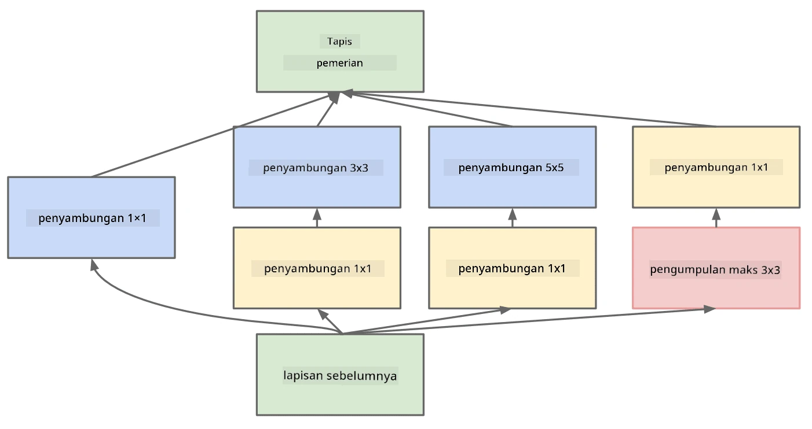

# Senibina CNN Terkenal

### VGG-16

VGG-16 adalah rangkaian yang mencapai ketepatan 92.7% dalam klasifikasi top-5 ImageNet pada tahun 2014. Ia mempunyai struktur lapisan seperti berikut:

Seperti yang anda lihat, VGG mengikuti senibina piramid tradisional, iaitu urutan lapisan penumpuan dan pengumpulan.

> Imej daripada [Researchgate](https://www.researchgate.net/figure/Vgg16-model-structure-To-get-the-VGG-NIN-model-we-replace-the-2-nd-4-th-6-th-7-th_fig2_335194493)

### ResNet

ResNet adalah keluarga model yang dicadangkan oleh Microsoft Research pada tahun 2015. Idea utama ResNet adalah menggunakan **blok residual**:

> Imej daripada [kertas ini](https://arxiv.org/pdf/1512.03385.pdf)

Sebab menggunakan laluan identiti adalah untuk membolehkan lapisan kita meramalkan **perbezaan** antara hasil lapisan sebelumnya dan output blok residual - oleh itu dinamakan *residual*. Blok-blok ini lebih mudah untuk dilatih, dan kita boleh membina rangkaian dengan ratusan blok tersebut (varian yang paling biasa adalah ResNet-52, ResNet-101 dan ResNet-152).

Anda juga boleh menganggap rangkaian ini sebagai mampu menyesuaikan kerumitannya kepada dataset. Pada mulanya, apabila anda mula melatih rangkaian, nilai berat adalah kecil, dan kebanyakan isyarat melalui lapisan identiti laluan terus. Apabila latihan berlangsung dan nilai berat menjadi lebih besar, kepentingan parameter rangkaian meningkat, dan rangkaian menyesuaikan diri untuk memenuhi kuasa ekspresif yang diperlukan untuk mengklasifikasikan imej latihan dengan betul.

### Google Inception

Senibina Google Inception membawa idea ini satu langkah lebih jauh, dan membina setiap lapisan rangkaian sebagai gabungan beberapa laluan yang berbeza:

> Imej daripada [Researchgate](https://www.researchgate.net/figure/Inception-module-with-dimension-reductions-left-and-schema-for-Inception-ResNet-v1_fig2_355547454)

Di sini, kita perlu menekankan peranan penumpuan 1x1, kerana pada mulanya ia tidak masuk akal. Mengapa kita perlu melalui imej dengan penapis 1x1? Walau bagaimanapun, anda perlu ingat bahawa penapis penumpuan juga berfungsi dengan beberapa saluran kedalaman (asalnya - warna RGB, dalam lapisan berikutnya - saluran untuk penapis yang berbeza), dan penumpuan 1x1 digunakan untuk mencampurkan saluran input tersebut menggunakan berat yang boleh dilatih. Ia juga boleh dilihat sebagai pensampelan semula (pengumpulan) pada dimensi saluran.

Berikut adalah [blog post yang baik](https://medium.com/analytics-vidhya/talented-mr-1x1-comprehensive-look-at-1x1-convolution-in-deep-learning-f6b355825578) mengenai subjek ini, dan [kertas asal](https://arxiv.org/pdf/1312.4400.pdf).

### MobileNet

MobileNet adalah keluarga model dengan saiz yang dikurangkan, sesuai untuk peranti mudah alih. Gunakan mereka jika anda kekurangan sumber, dan boleh mengorbankan sedikit ketepatan. Idea utama di sebaliknya adalah **penumpuan separable depthwise**, yang membolehkan penapis penumpuan diwakili oleh komposisi penumpuan spatial dan penumpuan 1x1 pada saluran kedalaman. Ini secara signifikan mengurangkan bilangan parameter, menjadikan rangkaian lebih kecil dalam saiz, dan juga lebih mudah untuk dilatih dengan data yang kurang.

Berikut adalah [blog post yang baik mengenai MobileNet](https://medium.com/analytics-vidhya/image-classification-with-mobilenet-cc6fbb2cd470).

## Kesimpulan

Dalam unit ini, anda telah mempelajari konsep utama di sebalik rangkaian neural penglihatan komputer - rangkaian penumpuan. Senibina sebenar yang menggerakkan klasifikasi imej, pengesanan objek, dan juga rangkaian penjanaan imej semuanya berdasarkan CNN, hanya dengan lebih banyak lapisan dan beberapa trik latihan tambahan.

## 🚀 Cabaran

Dalam notebook yang disertakan, terdapat nota di bahagian bawah tentang cara mendapatkan ketepatan yang lebih tinggi. Lakukan beberapa eksperimen untuk melihat jika anda boleh mencapai ketepatan yang lebih tinggi.

## [Kuiz selepas kuliah](https://ff-quizzes.netlify.app/en/ai/quiz/14)

## Kajian & Pembelajaran Sendiri

Walaupun CNN paling sering digunakan untuk tugas Penglihatan Komputer, ia secara amnya baik untuk mengekstrak corak bersaiz tetap. Sebagai contoh, jika kita berurusan dengan bunyi, kita juga mungkin ingin menggunakan CNN untuk mencari beberapa corak tertentu dalam isyarat audio - dalam kes ini penapis akan menjadi 1-dimensi (dan CNN ini akan dipanggil 1D-CNN). Selain itu, kadang-kadang 3D-CNN digunakan untuk mengekstrak ciri dalam ruang multi-dimensi, seperti peristiwa tertentu yang berlaku dalam video - CNN boleh menangkap corak tertentu perubahan ciri sepanjang masa. Lakukan kajian dan pembelajaran sendiri tentang tugas lain yang boleh dilakukan dengan CNN.

## [Tugasan](lab/README.md)

Dalam makmal ini, anda ditugaskan untuk mengklasifikasikan pelbagai baka kucing dan anjing. Imej-imej ini lebih kompleks daripada dataset MNIST dan mempunyai dimensi yang lebih tinggi, serta terdapat lebih daripada 10 kelas.

---

