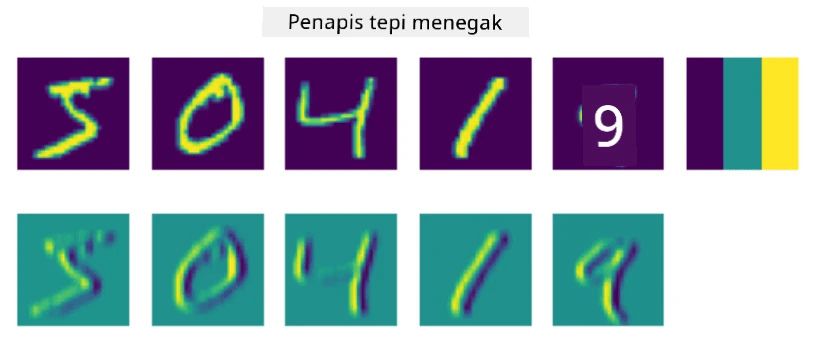
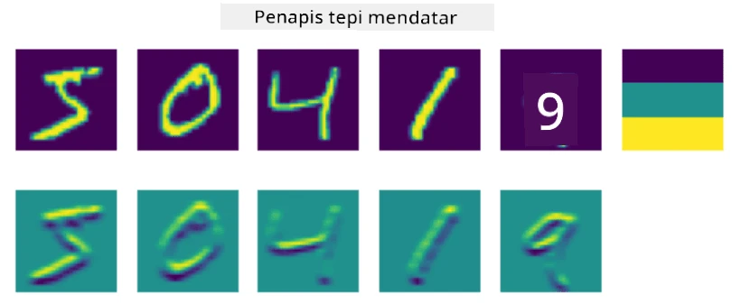
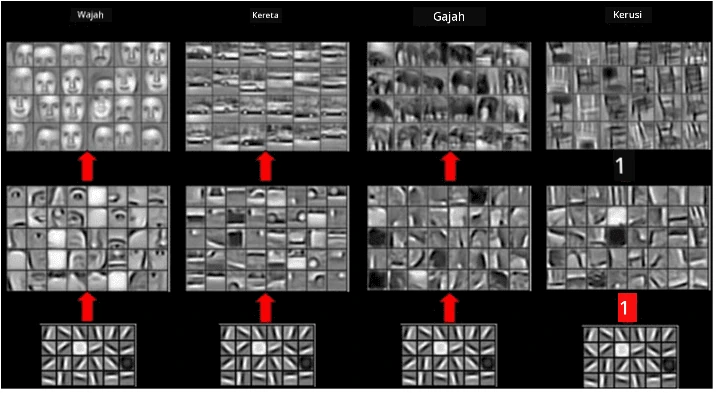
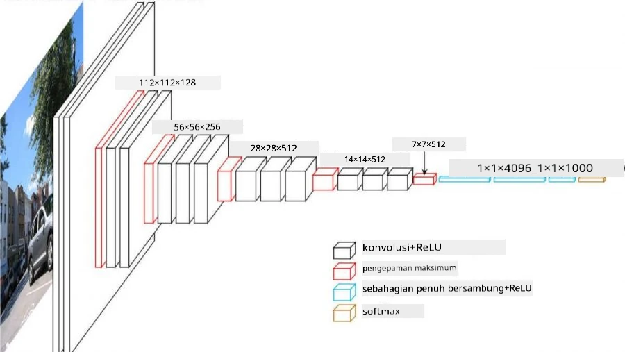

# Rangkaian Neural Konvolusi

Kita telah melihat sebelum ini bahawa rangkaian neural sangat baik dalam mengendalikan imej, malah perceptron satu lapisan mampu mengenali angka tulisan tangan daripada dataset MNIST dengan ketepatan yang munasabah. Walau bagaimanapun, dataset MNIST sangat istimewa, di mana semua angka berada di tengah imej, menjadikan tugas ini lebih mudah.

## [Kuiz pra-kuliah](https://ff-quizzes.netlify.app/en/ai/quiz/13)

Dalam kehidupan sebenar, kita ingin dapat mengenali objek dalam gambar tanpa mengira lokasi tepatnya dalam imej. Penglihatan komputer berbeza daripada klasifikasi umum, kerana apabila kita cuba mencari objek tertentu dalam gambar, kita mengimbas imej untuk mencari **pola** tertentu dan gabungannya. Sebagai contoh, apabila mencari kucing, kita mungkin mula mencari garis mendatar yang boleh membentuk misai, dan kemudian gabungan tertentu misai boleh memberitahu kita bahawa ia sebenarnya gambar kucing. Kedudukan relatif dan kehadiran pola tertentu adalah penting, bukan kedudukan tepatnya dalam imej.

Untuk mengekstrak pola, kita akan menggunakan konsep **penapis konvolusi**. Seperti yang anda tahu, imej diwakili oleh matriks 2D, atau tensor 3D dengan kedalaman warna. Menggunakan penapis bermaksud kita mengambil matriks **kernel penapis** yang agak kecil, dan untuk setiap piksel dalam imej asal, kita mengira purata berwajaran dengan titik-titik jiran. Kita boleh melihat ini seperti tingkap kecil yang meluncur di seluruh imej, dan meratakan semua piksel mengikut berat dalam matriks kernel penapis.

 | 
----|----

> Imej oleh Dmitry Soshnikov

Sebagai contoh, jika kita menggunakan penapis tepi menegak dan mendatar 3x3 pada angka MNIST, kita boleh mendapatkan sorotan (contohnya, nilai tinggi) di mana terdapat tepi menegak dan mendatar dalam imej asal kita. Oleh itu, kedua-dua penapis ini boleh digunakan untuk "mencari" tepi. Begitu juga, kita boleh mereka bentuk penapis yang berbeza untuk mencari pola tahap rendah yang lain:

> Imej daripada [Leung-Malik Filter Bank](https://www.robots.ox.ac.uk/~vgg/research/texclass/filters.html)

Walau bagaimanapun, sementara kita boleh mereka bentuk penapis untuk mengekstrak beberapa pola secara manual, kita juga boleh mereka bentuk rangkaian sedemikian rupa sehingga ia akan belajar pola secara automatik. Ini adalah salah satu idea utama di sebalik CNN.

## Idea utama di sebalik CNN

Cara CNN berfungsi berdasarkan idea penting berikut:

* Penapis konvolusi boleh mengekstrak pola
* Kita boleh mereka bentuk rangkaian sedemikian rupa sehingga penapis dilatih secara automatik
* Kita boleh menggunakan pendekatan yang sama untuk mencari pola dalam ciri tahap tinggi, bukan hanya dalam imej asal. Oleh itu, pengekstrakan ciri CNN berfungsi pada hierarki ciri, bermula daripada gabungan piksel tahap rendah, sehingga gabungan tahap tinggi bahagian gambar.

> Imej daripada [kertas kerja oleh Hislop-Lynch](https://www.semanticscholar.org/paper/Computer-vision-based-pedestrian-trajectory-Hislop-Lynch/26e6f74853fc9bbb7487b06dc2cf095d36c9021d), berdasarkan [penyelidikan mereka](https://dl.acm.org/doi/abs/10.1145/1553374.1553453)

## ✍️ Latihan: Rangkaian Neural Konvolusi

Mari teruskan meneroka bagaimana rangkaian neural konvolusi berfungsi, dan bagaimana kita boleh mencapai penapis yang boleh dilatih, dengan bekerja melalui buku nota yang berkaitan:

* [Rangkaian Neural Konvolusi - PyTorch](ConvNetsPyTorch.ipynb)
* [Rangkaian Neural Konvolusi - TensorFlow](ConvNetsTF.ipynb)

## Seni Bina Piramid

Kebanyakan CNN yang digunakan untuk pemprosesan imej mengikuti seni bina yang dipanggil piramid. Lapisan konvolusi pertama yang digunakan pada imej asal biasanya mempunyai bilangan penapis yang agak rendah (8-16), yang sepadan dengan gabungan piksel yang berbeza, seperti garis mendatar/menegak atau strok. Pada tahap seterusnya, kita mengurangkan dimensi spatial rangkaian, dan meningkatkan bilangan penapis, yang sepadan dengan lebih banyak kemungkinan gabungan ciri mudah. Dengan setiap lapisan, apabila kita bergerak ke arah pengklasifikasi akhir, dimensi spatial imej berkurang, dan bilangan penapis meningkat.

Sebagai contoh, mari kita lihat seni bina VGG-16, rangkaian yang mencapai ketepatan 92.7% dalam klasifikasi top-5 ImageNet pada tahun 2014:

> Imej daripada [Researchgate](https://www.researchgate.net/figure/Vgg16-model-structure-To-get-the-VGG-NIN-model-we-replace-the-2-nd-4-th-6-th-7-th_fig2_335194493)

## Seni Bina CNN Terkenal

[Teruskan kajian anda tentang seni bina CNN yang terkenal](CNN_Architectures.md)

---

