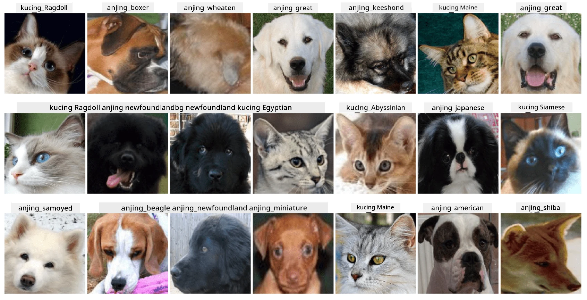

# Pengelasan Wajah Haiwan Peliharaan

Tugasan Makmal daripada [Kurikulum AI untuk Pemula](https://github.com/microsoft/ai-for-beginners).

## Tugas

Bayangkan anda perlu membangunkan aplikasi untuk pusat penjagaan haiwan peliharaan bagi mengkatalogkan semua haiwan peliharaan. Salah satu ciri hebat aplikasi tersebut ialah mengenal pasti baka secara automatik daripada gambar. Ini boleh dilakukan dengan jayanya menggunakan rangkaian neural.

Anda perlu melatih rangkaian neural konvolusi untuk mengklasifikasikan pelbagai baka kucing dan anjing menggunakan dataset **Pet Faces**.

## Dataset

Kita akan menggunakan [Oxford-IIIT Pet Dataset](https://www.robots.ox.ac.uk/~vgg/data/pets/), yang mengandungi imej 37 baka anjing dan kucing yang berbeza.



Untuk memuat turun dataset, gunakan kod berikut:

```python
!wget https://thor.robots.ox.ac.uk/~vgg/data/pets/images.tar.gz
!tar xfz images.tar.gz
!rm images.tar.gz
```

**Nota:** Imej dalam Oxford-IIIT Pet Dataset diatur mengikut nama fail (contohnya, `Abyssinian_1.jpg`, `Bengal_2.jpg`). Notebook ini termasuk kod untuk mengatur imej-imej ini ke dalam subdirektori mengikut baka untuk memudahkan pengelasan.

## Memulakan Notebook

Mulakan makmal dengan membuka [PetFaces.ipynb](PetFaces.ipynb)

## Kesimpulan

Anda telah menyelesaikan masalah pengelasan imej yang agak kompleks dari awal! Terdapat banyak kelas, dan anda masih mampu mencapai ketepatan yang munasabah! Ia juga masuk akal untuk mengukur ketepatan top-k, kerana mudah untuk mengelirukan beberapa kelas yang tidak begitu berbeza walaupun bagi manusia.

---

**Penafian**:  
Dokumen ini telah diterjemahkan menggunakan perkhidmatan terjemahan AI [Co-op Translator](https://github.com/Azure/co-op-translator). Walaupun kami berusaha untuk memastikan ketepatan, sila ambil perhatian bahawa terjemahan automatik mungkin mengandungi kesilapan atau ketidaktepatan. Dokumen asal dalam bahasa asalnya harus dianggap sebagai sumber yang berwibawa. Untuk maklumat yang kritikal, terjemahan manusia profesional adalah disyorkan. Kami tidak bertanggungjawab atas sebarang salah faham atau salah tafsir yang timbul daripada penggunaan terjemahan ini.