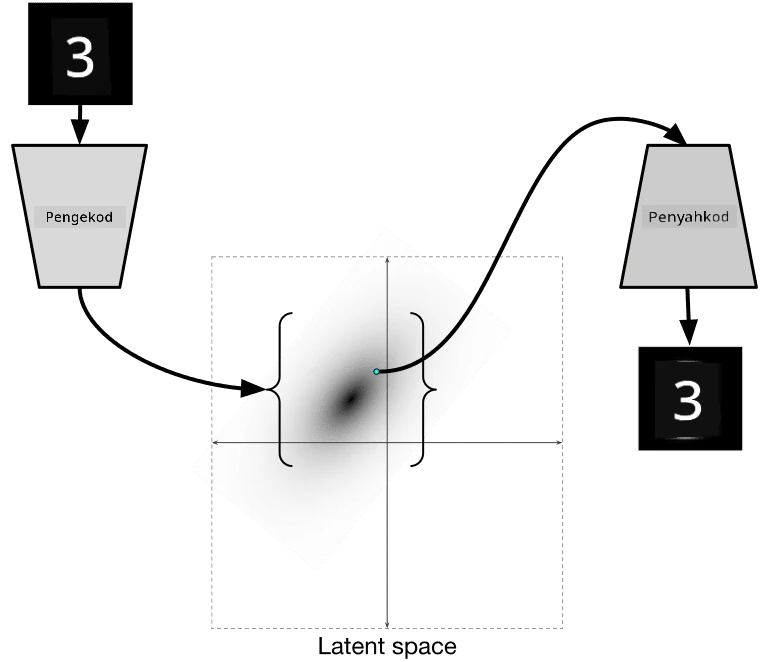

# Autoencoders

Semasa melatih CNN, salah satu masalahnya ialah kita memerlukan banyak data yang berlabel. Dalam kes klasifikasi imej, kita perlu memisahkan imej ke dalam kelas yang berbeza, yang memerlukan usaha manual.

## [Pre-lecture quiz](https://ff-quizzes.netlify.app/en/ai/quiz/17)

Namun, kita mungkin ingin menggunakan data mentah (tidak berlabel) untuk melatih pengekstrak ciri CNN, yang dipanggil **pembelajaran kendiri**. Sebagai ganti label, kita akan menggunakan imej latihan sebagai input dan output rangkaian. Idea utama **autoencoder** ialah kita akan mempunyai **rangkaian pengekod** yang menukar imej input kepada beberapa **ruang laten** (biasanya ia hanya vektor bersaiz lebih kecil), kemudian **rangkaian penyahkod**, yang bertujuan untuk membina semula imej asal.

> ✅ [Autoencoder](https://wikipedia.org/wiki/Autoencoder) ialah "sejenis rangkaian neural tiruan yang digunakan untuk mempelajari pengekodan yang efisien daripada data tidak berlabel."

Oleh kerana kita melatih autoencoder untuk menangkap sebanyak mungkin maklumat daripada imej asal bagi tujuan pembinaan semula yang tepat, rangkaian cuba mencari **embedding** terbaik bagi imej input untuk menangkap maknanya.

> Imej daripada [Keras blog](https://blog.keras.io/building-autoencoders-in-keras.html)

## Senario Penggunaan Autoencoders

Walaupun membina semula imej asal tidak kelihatan berguna dengan sendirinya, terdapat beberapa senario di mana autoencoders sangat berguna:

* **Mengurangkan dimensi imej untuk visualisasi** atau **melatih embedding imej**. Biasanya autoencoders memberikan hasil yang lebih baik daripada PCA, kerana ia mengambil kira sifat spatial imej dan ciri hierarki.
* **Menghilangkan bunyi**, iaitu menghapuskan bunyi daripada imej. Oleh kerana bunyi membawa banyak maklumat yang tidak berguna, autoencoder tidak dapat memuatkan semuanya ke dalam ruang laten yang agak kecil, dan oleh itu ia hanya menangkap bahagian penting imej. Semasa melatih penghilang bunyi, kita bermula dengan imej asal, dan menggunakan imej dengan bunyi yang ditambah secara tiruan sebagai input untuk autoencoder.
* **Super-resolution**, meningkatkan resolusi imej. Kita bermula dengan imej beresolusi tinggi, dan menggunakan imej dengan resolusi lebih rendah sebagai input autoencoder.
* **Model generatif**. Setelah kita melatih autoencoder, bahagian penyahkod boleh digunakan untuk mencipta objek baharu bermula daripada vektor laten rawak.

## Variational Autoencoders (VAE)

Autoencoder tradisional mengurangkan dimensi data input dengan cara tertentu, mengenal pasti ciri penting imej input. Walau bagaimanapun, vektor laten sering tidak masuk akal. Dalam erti kata lain, mengambil dataset MNIST sebagai contoh, mengenal pasti digit yang sepadan dengan vektor laten yang berbeza bukanlah tugas yang mudah, kerana vektor laten yang berdekatan tidak semestinya sepadan dengan digit yang sama.

Sebaliknya, untuk melatih model *generatif* adalah lebih baik untuk mempunyai pemahaman tentang ruang laten. Idea ini membawa kita kepada **variational auto-encoder** (VAE).

VAE ialah autoencoder yang belajar untuk meramalkan *taburan statistik* parameter laten, yang dipanggil **taburan laten**. Sebagai contoh, kita mungkin mahu vektor laten diedarkan secara normal dengan beberapa min zmean dan sisihan piawai zsigma (kedua-dua min dan sisihan piawai adalah vektor dengan beberapa dimensi d). Pengekod dalam VAE belajar untuk meramalkan parameter tersebut, dan kemudian penyahkod mengambil vektor rawak daripada taburan ini untuk membina semula objek.

Ringkasnya:

 * Daripada vektor input, kita meramalkan `z_mean` dan `z_log_sigma` (bukannya meramalkan sisihan piawai itu sendiri, kita meramalkan logaritmanya)
 * Kita mengambil sampel vektor `sample` daripada taburan N(zmean,exp(zlog\_sigma))
 * Penyahkod cuba menyahkod imej asal menggunakan `sample` sebagai vektor input

 

> Imej daripada [blog post ini](https://ijdykeman.github.io/ml/2016/12/21/cvae.html) oleh Isaak Dykeman

Variational auto-encoders menggunakan fungsi kehilangan kompleks yang terdiri daripada dua bahagian:

* **Reconstruction loss** ialah fungsi kehilangan yang menunjukkan sejauh mana imej yang dibina semula hampir dengan sasaran (ia boleh menjadi Mean Squared Error, atau MSE). Ia adalah fungsi kehilangan yang sama seperti dalam autoencoders biasa.
* **KL loss**, yang memastikan taburan pembolehubah laten kekal dekat dengan taburan normal. Ia berdasarkan konsep [Kullback-Leibler divergence](https://www.countbayesie.com/blog/2017/5/9/kullback-leibler-divergence-explained) - metrik untuk menganggarkan sejauh mana dua taburan statistik serupa.

Satu kelebihan penting VAE ialah ia membolehkan kita menjana imej baharu dengan agak mudah, kerana kita tahu taburan mana yang perlu diambil sampel vektor laten. Sebagai contoh, jika kita melatih VAE dengan vektor laten 2D pada MNIST, kita boleh mengubah komponen vektor laten untuk mendapatkan digit yang berbeza:

> Imej oleh [Dmitry Soshnikov](http://soshnikov.com)

Perhatikan bagaimana imej bercampur antara satu sama lain, apabila kita mula mendapatkan vektor laten daripada bahagian yang berbeza dalam ruang parameter laten. Kita juga boleh memvisualisasikan ruang ini dalam 2D:

 

> Imej oleh [Dmitry Soshnikov](http://soshnikov.com)

## ✍️ Latihan: Autoencoders

Pelajari lebih lanjut tentang autoencoders dalam notebook berikut:

* [Autoencoders dalam TensorFlow](AutoencodersTF.ipynb)
* [Autoencoders dalam PyTorch](AutoEncodersPyTorch.ipynb)

## Sifat Autoencoders

* **Data Spesifik** - ia hanya berfungsi dengan baik dengan jenis imej yang telah dilatih. Sebagai contoh, jika kita melatih rangkaian super-resolution pada bunga, ia tidak akan berfungsi dengan baik pada potret. Ini kerana rangkaian boleh menghasilkan imej resolusi tinggi dengan mengambil butiran halus daripada ciri yang dipelajari daripada dataset latihan.
* **Lossy** - imej yang dibina semula tidak sama dengan imej asal. Sifat kehilangan ditentukan oleh *fungsi kehilangan* yang digunakan semasa latihan.
* Berfungsi pada **data tidak berlabel**

## [Post-lecture quiz](https://ff-quizzes.netlify.app/en/ai/quiz/18)

## Kesimpulan

Dalam pelajaran ini, anda telah mempelajari pelbagai jenis autoencoders yang tersedia untuk saintis AI. Anda telah belajar cara membinanya, dan cara menggunakannya untuk membina semula imej. Anda juga telah mempelajari tentang VAE dan cara menggunakannya untuk menjana imej baharu.

## 🚀 Cabaran

Dalam pelajaran ini, anda telah mempelajari tentang penggunaan autoencoders untuk imej. Tetapi ia juga boleh digunakan untuk muzik! Lihat projek Magenta [MusicVAE](https://magenta.tensorflow.org/music-vae), yang menggunakan autoencoders untuk belajar membina semula muzik. Lakukan beberapa [eksperimen](https://colab.research.google.com/github/magenta/magenta-demos/blob/master/colab-notebooks/Multitrack_MusicVAE.ipynb) dengan perpustakaan ini untuk melihat apa yang boleh anda cipta.

## [Post-lecture quiz](https://ff-quizzes.netlify.app/en/ai/quiz/16)

## Kajian & Pembelajaran Kendiri

Sebagai rujukan, baca lebih lanjut tentang autoencoders dalam sumber berikut:

* [Membina Autoencoders dalam Keras](https://blog.keras.io/building-autoencoders-in-keras.html)
* [Blog post di NeuroHive](https://neurohive.io/ru/osnovy-data-science/variacionnyj-avtojenkoder-vae/)
* [Variational Autoencoders Dijelaskan](https://kvfrans.com/variational-autoencoders-explained/)
* [Conditional Variational Autoencoders](https://ijdykeman.github.io/ml/2016/12/21/cvae.html)

## Tugasan

Di akhir [notebook ini menggunakan TensorFlow](AutoencodersTF.ipynb), anda akan menemui 'tugas' - gunakan ini sebagai tugasan anda.

---

