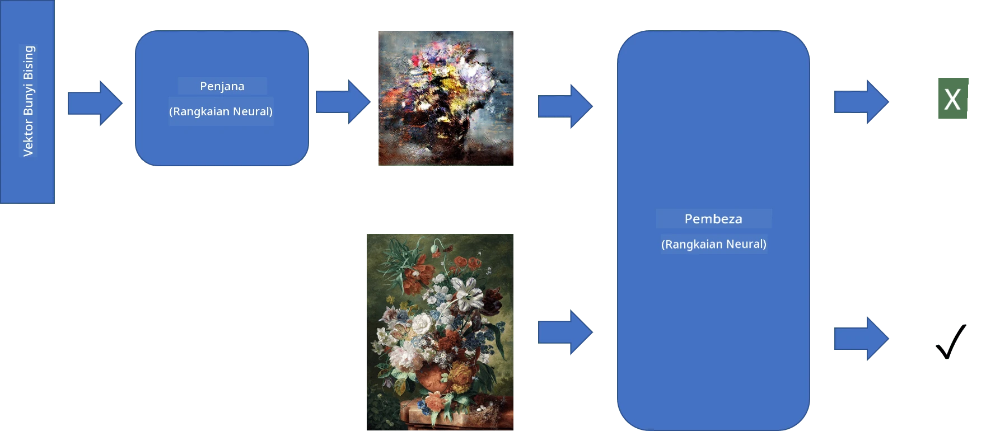
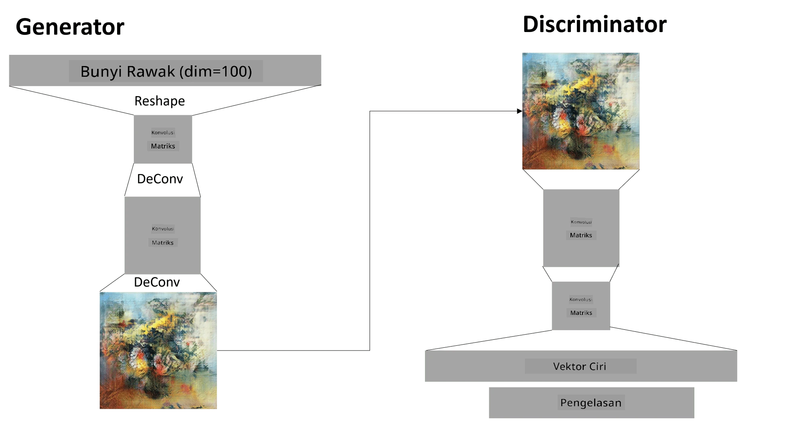

# Generative Adversarial Networks

Dalam bahagian sebelumnya, kita telah mempelajari tentang **model generatif**: model yang boleh menghasilkan imej baru yang serupa dengan imej dalam dataset latihan. VAE adalah contoh yang baik bagi model generatif.

## [Pre-lecture quiz](https://ff-quizzes.netlify.app/en/ai/quiz/19)

Namun, jika kita cuba menghasilkan sesuatu yang benar-benar bermakna, seperti lukisan dengan resolusi yang wajar, menggunakan VAE, kita akan dapati bahawa latihan tidak mencapai hasil yang baik. Untuk kes penggunaan ini, kita perlu mempelajari satu lagi seni bina yang khusus untuk model generatif - **Generative Adversarial Networks**, atau GANs.

Idea utama GAN adalah mempunyai dua rangkaian neural yang dilatih saling bersaing:

> Imej oleh [Dmitry Soshnikov](http://soshnikov.com)

> ✅ Sedikit perbendaharaan kata:
> * **Generator** adalah rangkaian yang mengambil vektor rawak dan menghasilkan imej sebagai hasilnya.
> * **Discriminator** adalah rangkaian yang mengambil imej dan menentukan sama ada ia adalah imej sebenar (daripada dataset latihan) atau imej yang dihasilkan oleh generator. Ia pada dasarnya adalah pengklasifikasi imej.

### Discriminator

Seni bina discriminator tidak berbeza daripada rangkaian pengklasifikasi imej biasa. Dalam kes paling mudah, ia boleh menjadi pengklasifikasi fully-connected, tetapi kemungkinan besar ia akan menjadi [rangkaian konvolusi](../07-ConvNets/README.md).

> ✅ GAN yang berdasarkan rangkaian konvolusi dipanggil [DCGAN](https://arxiv.org/pdf/1511.06434.pdf)

Discriminator CNN terdiri daripada lapisan berikut: beberapa konvolusi+pooling (dengan saiz spatial yang semakin berkurang) dan satu atau lebih lapisan fully-connected untuk mendapatkan "vektor ciri", pengklasifikasi binari akhir.

> ✅ 'Pooling' dalam konteks ini adalah teknik yang mengurangkan saiz imej. "Lapisan pooling mengurangkan dimensi data dengan menggabungkan output kluster neuron pada satu lapisan ke dalam satu neuron pada lapisan seterusnya." - [sumber](https://wikipedia.org/wiki/Convolutional_neural_network#Pooling_layers)

### Generator

Generator sedikit lebih rumit. Anda boleh menganggapnya sebagai discriminator yang terbalik. Bermula dari vektor laten (menggantikan vektor ciri), ia mempunyai lapisan fully-connected untuk menukarkannya kepada saiz/bentuk yang diperlukan, diikuti oleh dekonvolusi+upscaling. Ini serupa dengan bahagian *decoder* dalam [autoencoder](../09-Autoencoders/README.md).

> ✅ Oleh kerana lapisan konvolusi dilaksanakan sebagai penapis linear yang melintasi imej, dekonvolusi pada dasarnya serupa dengan konvolusi dan boleh dilaksanakan menggunakan logik lapisan yang sama.

> Imej oleh [Dmitry Soshnikov](http://soshnikov.com)

### Melatih GAN

GAN dipanggil **adversarial** kerana terdapat persaingan berterusan antara generator dan discriminator. Semasa persaingan ini, kedua-dua generator dan discriminator bertambah baik, dan rangkaian belajar menghasilkan imej yang semakin baik.

Latihan berlaku dalam dua peringkat:

* **Melatih discriminator**. Tugas ini agak mudah: kita menghasilkan satu batch imej menggunakan generator, melabelkannya sebagai 0, yang bermaksud imej palsu, dan mengambil satu batch imej daripada dataset input (dengan label 1, imej sebenar). Kita memperoleh *discriminator loss*, dan melakukan backprop.
* **Melatih generator**. Ini sedikit lebih rumit kerana kita tidak tahu output yang dijangka untuk generator secara langsung. Kita mengambil keseluruhan rangkaian GAN yang terdiri daripada generator diikuti oleh discriminator, memberinya vektor rawak, dan mengharapkan hasilnya adalah 1 (bersamaan dengan imej sebenar). Kita kemudian membekukan parameter discriminator (kita tidak mahu ia dilatih pada langkah ini), dan melakukan backprop.

Semasa proses ini, kedua-dua generator dan discriminator loss tidak turun dengan ketara. Dalam situasi ideal, mereka sepatutnya berayun, menunjukkan kedua-dua rangkaian meningkatkan prestasi mereka.

## ✍️ Latihan: GANs

* [Notebook GAN dalam TensorFlow/Keras](GANTF.ipynb)
* [Notebook GAN dalam PyTorch](GANPyTorch.ipynb)

### Masalah dengan Latihan GAN

GAN diketahui sukar untuk dilatih. Berikut adalah beberapa masalah:

* **Mode Collapse**. Istilah ini merujuk kepada generator yang belajar menghasilkan satu imej berjaya yang menipu discriminator, tetapi tidak pelbagai imej yang berbeza.
* **Sensitiviti terhadap hiperparameter**. Selalunya anda akan dapati bahawa GAN tidak mencapai hasil sama sekali, dan kemudian tiba-tiba penurunan kadar pembelajaran membawa kepada hasil.
* Menjaga **keseimbangan** antara generator dan discriminator. Dalam banyak kes, discriminator loss boleh turun ke sifar dengan cepat, yang menyebabkan generator tidak dapat dilatih lebih lanjut. Untuk mengatasi ini, kita boleh cuba menetapkan kadar pembelajaran yang berbeza untuk generator dan discriminator, atau melangkau latihan discriminator jika loss sudah terlalu rendah.
* Latihan untuk **resolusi tinggi**. Masalah ini mencerminkan masalah yang sama dengan autoencoder, yang berlaku kerana pembinaan semula terlalu banyak lapisan rangkaian konvolusi membawa kepada artifak. Masalah ini biasanya diselesaikan dengan **progressive growing**, di mana beberapa lapisan pertama dilatih pada imej resolusi rendah, dan kemudian lapisan "dibuka" atau ditambah. Penyelesaian lain adalah menambah sambungan tambahan antara lapisan dan melatih beberapa resolusi sekaligus - lihat kertas [Multi-Scale Gradient GANs](https://arxiv.org/abs/1903.06048) untuk butiran.

## Style Transfer

GAN adalah cara yang hebat untuk menghasilkan imej artistik. Teknik menarik lain adalah **style transfer**, yang mengambil satu **imej kandungan** dan melukis semula dalam gaya yang berbeza, menggunakan penapis daripada **imej gaya**.

Cara ia berfungsi adalah seperti berikut:
* Kita bermula dengan imej noise rawak (atau dengan imej kandungan, tetapi untuk pemahaman lebih mudah, kita bermula dengan noise rawak).
* Matlamat kita adalah menghasilkan imej yang dekat dengan imej kandungan dan imej gaya. Ini ditentukan oleh dua fungsi loss:
   - **Content loss** dikira berdasarkan ciri yang diekstrak oleh CNN pada beberapa lapisan daripada imej semasa dan imej kandungan.
   - **Style loss** dikira antara imej semasa dan imej gaya dengan cara yang bijak menggunakan matriks Gram (butiran lanjut dalam [notebook contoh](StyleTransfer.ipynb)).
* Untuk menjadikan imej lebih licin dan menghilangkan noise, kita juga memperkenalkan **Variation loss**, yang mengira jarak purata antara piksel yang berdekatan.
* Gelung pengoptimuman utama menyesuaikan imej semasa menggunakan gradient descent (atau algoritma pengoptimuman lain) untuk meminimumkan jumlah loss, yang merupakan jumlah berwajaran semua loss.

## ✍️ Contoh: [Style Transfer](StyleTransfer.ipynb)

## [Post-lecture quiz](https://ff-quizzes.netlify.app/en/ai/quiz/20)

## Kesimpulan

Dalam pelajaran ini, anda telah mempelajari tentang GAN dan cara melatihnya. Anda juga telah mempelajari cabaran khas yang dihadapi oleh jenis rangkaian neural ini, serta beberapa strategi untuk mengatasinya.

## 🚀 Cabaran

Jalankan [notebook Style Transfer](StyleTransfer.ipynb) menggunakan imej anda sendiri.

## Kajian & Pembelajaran Kendiri

Sebagai rujukan, baca lebih lanjut tentang GAN dalam sumber berikut:

* Marco Pasini, [10 Lessons I Learned Training GANs for one Year](https://towardsdatascience.com/10-lessons-i-learned-training-generative-adversarial-networks-gans-for-a-year-c9071159628)
* [StyleGAN](https://en.wikipedia.org/wiki/StyleGAN), seni bina GAN yang *de facto* untuk dipertimbangkan
* [Creating Generative Art using GANs on Azure ML](https://soshnikov.com/scienceart/creating-generative-art-using-gan-on-azureml/)

## Tugasan

Kaji semula salah satu daripada dua notebook yang berkaitan dengan pelajaran ini dan latih semula GAN menggunakan imej anda sendiri. Apa yang boleh anda hasilkan?

---

