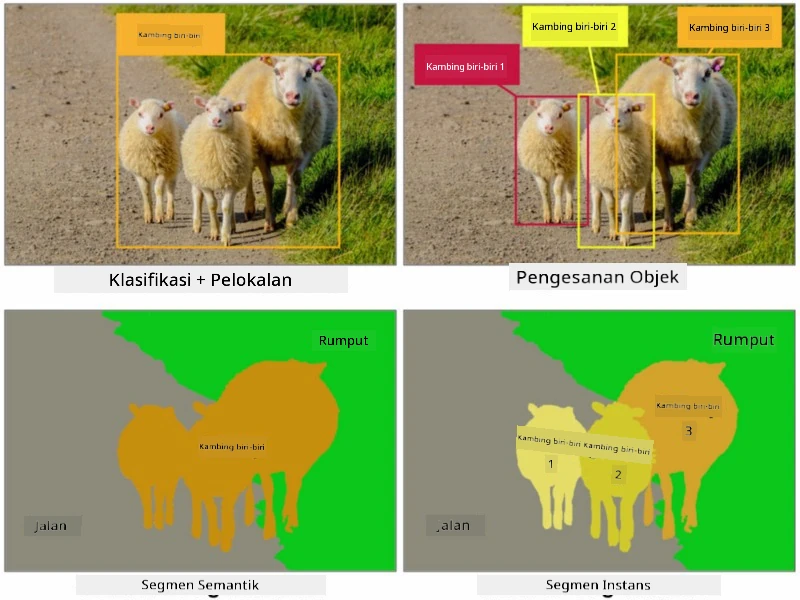
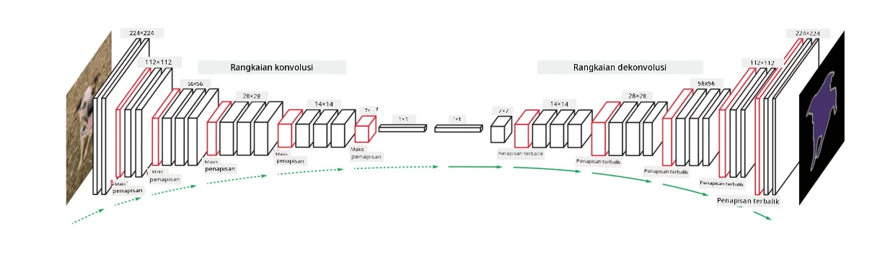

# Segmentasi

Kita telah mempelajari tentang Pengesanan Objek sebelum ini, yang membolehkan kita mencari objek dalam imej dengan meramalkan *kotak sempadan* mereka. Walau bagaimanapun, untuk sesetengah tugas, kita bukan sahaja memerlukan kotak sempadan tetapi juga penempatan objek yang lebih tepat. Tugas ini dipanggil **segmentasi**.

## [Kuiz pra-kuliah](https://ff-quizzes.netlify.app/en/ai/quiz/23)

Segmentasi boleh dilihat sebagai **klasifikasi piksel**, di mana untuk **setiap** piksel dalam imej kita mesti meramalkan kelasnya (*latar belakang* menjadi salah satu kelas). Terdapat dua algoritma segmentasi utama:

* **Segmentasi semantik** hanya menentukan kelas piksel, dan tidak membezakan antara objek yang berbeza dalam kelas yang sama.
* **Segmentasi instans** membahagikan kelas kepada instans yang berbeza.

Sebagai contoh, dalam segmentasi instans, kambing biri-biri ini adalah objek yang berbeza, tetapi dalam segmentasi semantik semua kambing biri-biri diwakili oleh satu kelas.

> Imej daripada [blog ini](https://nirmalamurali.medium.com/image-classification-vs-semantic-segmentation-vs-instance-segmentation-625c33a08d50)

Terdapat pelbagai seni bina neural untuk segmentasi, tetapi semuanya mempunyai struktur yang sama. Dalam satu cara, ia serupa dengan autoencoder yang telah anda pelajari sebelum ini, tetapi bukannya menyahstruktur imej asal, matlamat kita adalah untuk menyahstrukturkan **mask**. Oleh itu, rangkaian segmentasi mempunyai bahagian berikut:

* **Encoder** mengekstrak ciri daripada imej input.
* **Decoder** mengubah ciri-ciri tersebut menjadi **imej mask**, dengan saiz dan bilangan saluran yang sama yang sepadan dengan bilangan kelas.

> Imej daripada [penerbitan ini](https://arxiv.org/pdf/2001.05566.pdf)

Kita perlu memberi perhatian khusus kepada fungsi kehilangan yang digunakan untuk segmentasi. Apabila menggunakan autoencoder klasik, kita perlu mengukur kesamaan antara dua imej, dan kita boleh menggunakan mean square error (MSE) untuk melakukannya. Dalam segmentasi, setiap piksel dalam imej mask sasaran mewakili nombor kelas (one-hot-encoded di sepanjang dimensi ketiga), jadi kita perlu menggunakan fungsi kehilangan khusus untuk klasifikasi - kehilangan cross-entropy, yang diambil purata ke atas semua piksel. Jika mask adalah binari - **binary cross-entropy loss** (BCE) digunakan.

> ✅ One-hot encoding adalah cara untuk mengekod label kelas ke dalam vektor dengan panjang yang sama dengan bilangan kelas. Lihat [artikel ini](https://datagy.io/sklearn-one-hot-encode/) untuk teknik ini.

## Segmentasi untuk Pengimejan Perubatan

Dalam pelajaran ini, kita akan melihat segmentasi dalam tindakan dengan melatih rangkaian untuk mengenali nevi manusia (juga dikenali sebagai tahi lalat) pada imej perubatan. Kita akan menggunakan <a href="https://www.fc.up.pt/addi/ph2%20database.html">Pangkalan Data PH2</a> untuk imej dermoskopi sebagai sumber imej. Dataset ini mengandungi 200 imej daripada tiga kelas: nevus tipikal, nevus atipikal, dan melanoma. Semua imej juga mengandungi **mask** yang sepadan yang menggariskan nevus.

> ✅ Teknik ini sangat sesuai untuk jenis pengimejan perubatan ini, tetapi apakah aplikasi dunia sebenar lain yang boleh anda bayangkan?

> Imej daripada Pangkalan Data PH2

Kita akan melatih model untuk memisahkan sebarang nevus daripada latar belakangnya.

## ✍️ Latihan: Segmentasi Semantik

Buka notebook di bawah untuk mengetahui lebih lanjut tentang pelbagai seni bina segmentasi semantik, berlatih menggunakannya, dan melihatnya dalam tindakan.

* [Segmentasi Semantik Pytorch](SemanticSegmentationPytorch.ipynb)
* [Segmentasi Semantik TensorFlow](SemanticSegmentationTF.ipynb)

## [Kuiz pasca-kuliah](https://ff-quizzes.netlify.app/en/ai/quiz/24)

## Kesimpulan

Segmentasi adalah teknik yang sangat berkuasa untuk klasifikasi imej, bergerak melangkaui kotak sempadan kepada klasifikasi peringkat piksel. Ia adalah teknik yang digunakan dalam pengimejan perubatan, antara aplikasi lain.

## 🚀 Cabaran

Segmentasi badan hanyalah salah satu tugas biasa yang boleh kita lakukan dengan imej manusia. Tugas penting lain termasuk **pengesanan rangka** dan **pengesanan pose**. Cuba gunakan perpustakaan [OpenPose](https://github.com/CMU-Perceptual-Computing-Lab/openpose) untuk melihat bagaimana pengesanan pose boleh digunakan.

## Kajian & Pembelajaran Kendiri

Artikel [Wikipedia ini](https://wikipedia.org/wiki/Image_segmentation) menawarkan gambaran yang baik tentang pelbagai aplikasi teknik ini. Pelajari lebih lanjut secara sendiri tentang subdomain Segmentasi Instans dan Segmentasi Panoptik dalam bidang ini.

## [Tugasan](lab/README.md)

Dalam makmal ini, cuba **segmentasi badan manusia** menggunakan [Dataset Segmentasi Full Body MADS](https://www.kaggle.com/datasets/tapakah68/segmentation-full-body-mads-dataset) daripada Kaggle.

---

