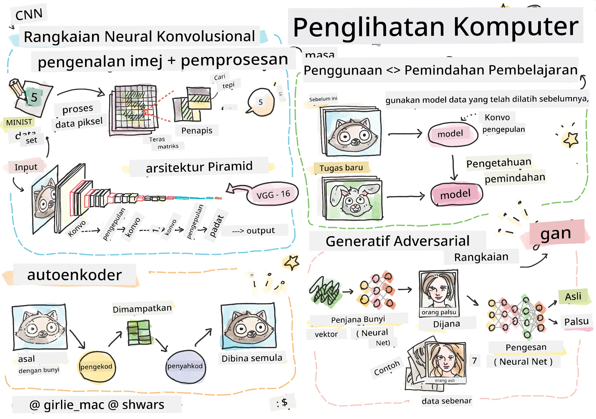

# Penglihatan Komputer

Dalam bahagian ini, kita akan mempelajari tentang:

* [Pengenalan kepada Penglihatan Komputer dan OpenCV](06-IntroCV/README.md)
* [Rangkaian Neural Konvolusi](07-ConvNets/README.md)
* [Rangkaian Pra-latih dan Pembelajaran Pindahan](08-TransferLearning/README.md) 
* [Autoencoder](09-Autoencoders/README.md)
* [Rangkaian Adversarial Generatif](10-GANs/README.md)
* [Pengesanan Objek](11-ObjectDetection/README.md)
* [Segmentasi Semantik](12-Segmentation/README.md)

---

**Penafian**:  
Dokumen ini telah diterjemahkan menggunakan perkhidmatan terjemahan AI [Co-op Translator](https://github.com/Azure/co-op-translator). Walaupun kami berusaha untuk memastikan ketepatan, sila ambil maklum bahawa terjemahan automatik mungkin mengandungi kesilapan atau ketidaktepatan. Dokumen asal dalam bahasa asalnya harus dianggap sebagai sumber yang berwibawa. Untuk maklumat penting, terjemahan manusia profesional adalah disyorkan. Kami tidak bertanggungjawab atas sebarang salah faham atau salah tafsir yang timbul daripada penggunaan terjemahan ini.