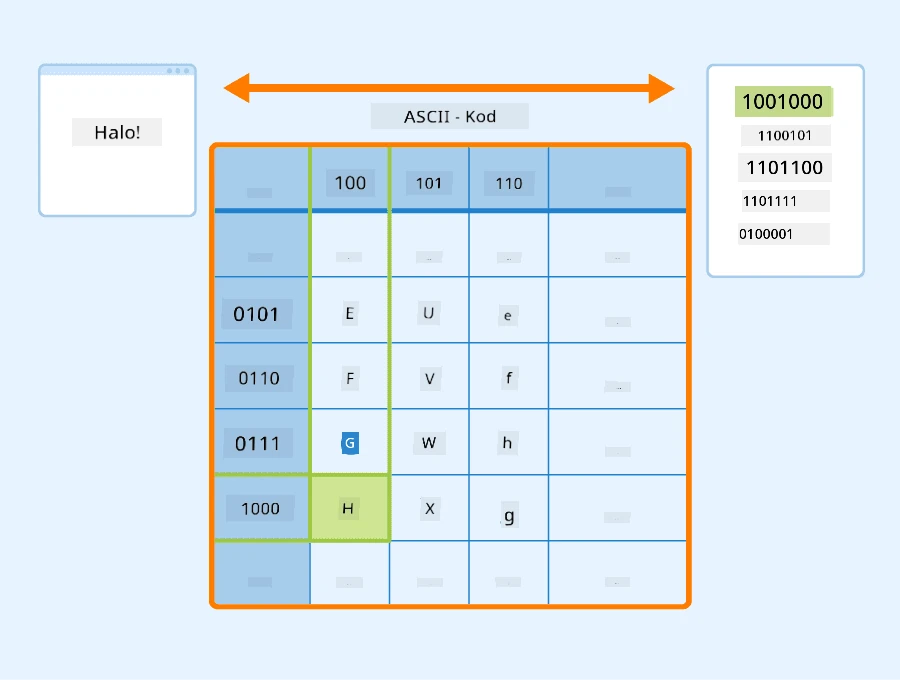
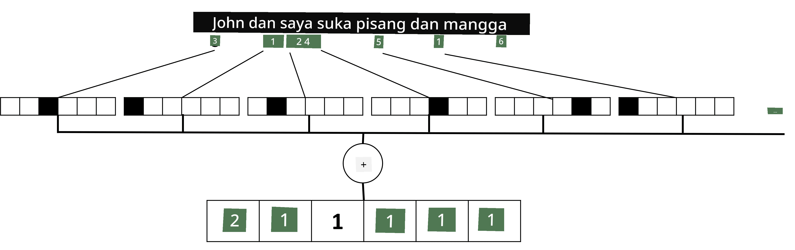

# Mewakili Teks sebagai Tensor

## [Kuiz Pra-Kuliah](https://ff-quizzes.netlify.app/en/ai/quiz/25)

## Pengelasan Teks

Sepanjang bahagian pertama seksyen ini, kita akan memberi tumpuan kepada tugas **pengelasan teks**. Kita akan menggunakan Dataset [AG News](https://www.kaggle.com/amananandrai/ag-news-classification-dataset), yang mengandungi artikel berita seperti berikut:

* Kategori: Sci/Tech
* Tajuk: Ky. Company Wins Grant to Study Peptides (AP)
* Kandungan: AP - Sebuah syarikat yang diasaskan oleh penyelidik kimia di Universiti Louisville memenangi geran untuk membangunkan...

Matlamat kita adalah untuk mengelaskan item berita ke dalam salah satu kategori berdasarkan teks.

## Mewakili teks

Jika kita ingin menyelesaikan tugas Pemprosesan Bahasa Semula Jadi (NLP) dengan rangkaian neural, kita memerlukan cara untuk mewakili teks sebagai tensor. Komputer sudah mewakili watak teks sebagai nombor yang memetakan kepada fon pada skrin anda menggunakan pengekodan seperti ASCII atau UTF-8.

> [Sumber imej](https://www.seobility.net/en/wiki/ASCII)

Sebagai manusia, kita memahami apa yang setiap huruf **wakili**, dan bagaimana semua watak bergabung untuk membentuk perkataan dalam ayat. Walau bagaimanapun, komputer sendiri tidak mempunyai pemahaman sedemikian, dan rangkaian neural perlu belajar makna semasa latihan.

Oleh itu, kita boleh menggunakan pendekatan yang berbeza semasa mewakili teks:

* **Perwakilan peringkat watak**, apabila kita mewakili teks dengan menganggap setiap watak sebagai nombor. Memandangkan kita mempunyai *C* watak yang berbeza dalam korpus teks kita, perkataan *Hello* akan diwakili oleh tensor 5x*C*. Setiap huruf akan sepadan dengan lajur tensor dalam pengekodan satu-haba.
* **Perwakilan peringkat perkataan**, di mana kita mencipta **perbendaharaan kata** semua perkataan dalam teks kita, dan kemudian mewakili perkataan menggunakan pengekodan satu-haba. Pendekatan ini agak lebih baik, kerana setiap huruf secara sendiri tidak mempunyai banyak makna, dan dengan menggunakan konsep semantik peringkat tinggi - perkataan - kita mempermudahkan tugas untuk rangkaian neural. Walau bagaimanapun, memandangkan saiz kamus yang besar, kita perlu menangani tensor jarang berdimensi tinggi.

Tidak kira perwakilan, kita perlu terlebih dahulu menukar teks kepada urutan **token**, satu token sama ada watak, perkataan, atau kadangkala sebahagian daripada perkataan. Kemudian, kita menukar token kepada nombor, biasanya menggunakan **perbendaharaan kata**, dan nombor ini boleh dimasukkan ke dalam rangkaian neural menggunakan pengekodan satu-haba.

## N-Gram

Dalam bahasa semula jadi, makna tepat perkataan hanya boleh ditentukan dalam konteks. Sebagai contoh, makna *neural network* dan *fishing network* adalah sangat berbeza. Salah satu cara untuk mengambil kira ini adalah dengan membina model kita berdasarkan pasangan perkataan, dan menganggap pasangan perkataan sebagai token perbendaharaan kata yang berasingan. Dengan cara ini, ayat *I like to go fishing* akan diwakili oleh urutan token berikut: *I like*, *like to*, *to go*, *go fishing*. Masalah dengan pendekatan ini ialah saiz kamus meningkat dengan ketara, dan kombinasi seperti *go fishing* dan *go shopping* diwakili oleh token yang berbeza, yang tidak berkongsi sebarang persamaan semantik walaupun menggunakan kata kerja yang sama.

Dalam beberapa kes, kita mungkin mempertimbangkan untuk menggunakan tri-gram -- kombinasi tiga perkataan -- juga. Oleh itu, pendekatan ini sering dipanggil **n-grams**. Ia juga masuk akal untuk menggunakan n-grams dengan perwakilan peringkat watak, di mana n-grams akan lebih kurang sepadan dengan suku kata yang berbeza.

## Bag-of-Words dan TF/IDF

Apabila menyelesaikan tugas seperti pengelasan teks, kita perlu dapat mewakili teks dengan satu vektor bersaiz tetap, yang akan kita gunakan sebagai input kepada pengelas padat akhir. Salah satu cara paling mudah untuk melakukannya adalah dengan menggabungkan semua perwakilan perkataan individu, contohnya dengan menambahnya. Jika kita menambah pengekodan satu-haba setiap perkataan, kita akan berakhir dengan vektor frekuensi, menunjukkan berapa kali setiap perkataan muncul dalam teks. Perwakilan teks seperti ini dipanggil **bag of words** (BoW).

> Imej oleh penulis

BoW pada dasarnya mewakili perkataan mana yang muncul dalam teks dan dalam kuantiti apa, yang boleh menjadi petunjuk yang baik tentang apa teks itu. Sebagai contoh, artikel berita tentang politik mungkin mengandungi perkataan seperti *president* dan *country*, manakala penerbitan saintifik mungkin mempunyai sesuatu seperti *collider*, *discovered*, dan sebagainya. Oleh itu, frekuensi perkataan dalam banyak kes boleh menjadi penunjuk yang baik tentang kandungan teks.

Masalah dengan BoW ialah perkataan biasa tertentu, seperti *and*, *is*, dan sebagainya muncul dalam kebanyakan teks, dan mereka mempunyai frekuensi tertinggi, menutupi perkataan yang benar-benar penting. Kita boleh mengurangkan kepentingan perkataan tersebut dengan mengambil kira frekuensi di mana perkataan berlaku dalam keseluruhan koleksi dokumen. Ini adalah idea utama di sebalik pendekatan TF/IDF, yang dibincangkan dengan lebih terperinci dalam buku nota yang dilampirkan pada pelajaran ini.

Walau bagaimanapun, tiada satu pun pendekatan ini dapat sepenuhnya mengambil kira **semantik** teks. Kita memerlukan model rangkaian neural yang lebih berkuasa untuk melakukan ini, yang akan kita bincangkan kemudian dalam seksyen ini.

## ✍️ Latihan: Perwakilan Teks

Teruskan pembelajaran anda dalam buku nota berikut:

* [Perwakilan Teks dengan PyTorch](TextRepresentationPyTorch.ipynb)
* [Perwakilan Teks dengan TensorFlow](TextRepresentationTF.ipynb)

## Kesimpulan

Setakat ini, kita telah mengkaji teknik yang boleh menambah berat frekuensi kepada perkataan yang berbeza. Walau bagaimanapun, teknik ini tidak dapat mewakili makna atau susunan. Seperti yang dikatakan oleh ahli bahasa terkenal J. R. Firth pada tahun 1935, "Makna lengkap sesuatu perkataan sentiasa bersifat kontekstual, dan tiada kajian tentang makna yang terpisah daripada konteks boleh dianggap serius." Kita akan belajar kemudian dalam kursus ini bagaimana untuk menangkap maklumat kontekstual daripada teks menggunakan pemodelan bahasa.

## 🚀 Cabaran

Cuba beberapa latihan lain menggunakan bag-of-words dan model data yang berbeza. Anda mungkin mendapat inspirasi daripada [pertandingan ini di Kaggle](https://www.kaggle.com/competitions/word2vec-nlp-tutorial/overview/part-1-for-beginners-bag-of-words)

## [Kuiz Pasca-Kuliah](https://ff-quizzes.netlify.app/en/ai/quiz/26)

## Ulasan & Kajian Kendiri

Latih kemahiran anda dengan teknik embedding teks dan bag-of-words di [Microsoft Learn](https://docs.microsoft.com/learn/modules/intro-natural-language-processing-pytorch/?WT.mc_id=academic-77998-cacaste)

## [Tugasan: Buku Nota](assignment.md)

---

