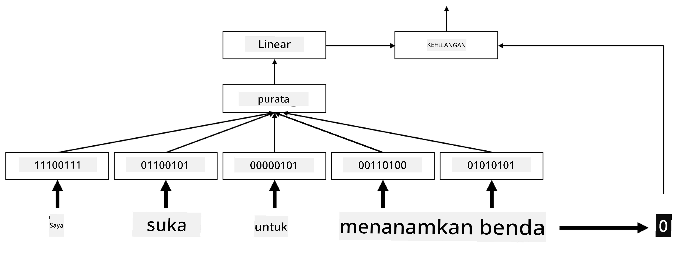

# Pembenaman

## [Kuiz pra-kuliah](https://ff-quizzes.netlify.app/en/ai/quiz/27)

Semasa melatih pengklasifikasi berdasarkan BoW atau TF/IDF, kita menggunakan vektor bag-of-words berdimensi tinggi dengan panjang `vocab_size`, dan kita secara eksplisit menukar daripada vektor perwakilan kedudukan berdimensi rendah kepada perwakilan satu-hot yang jarang. Walau bagaimanapun, perwakilan satu-hot ini tidak cekap dari segi memori. Selain itu, setiap perkataan dianggap secara bebas antara satu sama lain, iaitu vektor satu-hot tidak menyatakan sebarang persamaan semantik antara perkataan.

Idea **pembenaman** adalah untuk mewakili perkataan dengan vektor padat berdimensi rendah, yang mencerminkan makna semantik sesuatu perkataan. Kita akan membincangkan kemudian bagaimana untuk membina pembenaman perkataan yang bermakna, tetapi buat masa ini mari kita anggap pembenaman sebagai cara untuk mengurangkan dimensi vektor perkataan.

Jadi, lapisan pembenaman akan mengambil perkataan sebagai input, dan menghasilkan vektor output dengan `embedding_size` yang ditentukan. Dalam satu aspek, ia sangat mirip dengan lapisan `Linear`, tetapi bukannya mengambil vektor satu-hot, ia akan dapat mengambil nombor perkataan sebagai input, membolehkan kita mengelakkan penciptaan vektor satu-hot yang besar.

Dengan menggunakan lapisan pembenaman sebagai lapisan pertama dalam rangkaian pengklasifikasi kita, kita boleh beralih daripada model bag-of-words kepada model **embedding bag**, di mana kita mula-mula menukar setiap perkataan dalam teks kita kepada pembenaman yang sepadan, dan kemudian mengira beberapa fungsi agregat ke atas semua pembenaman tersebut, seperti `sum`, `average` atau `max`.  

> Imej oleh penulis

## ✍️ Latihan: Pembenaman

Teruskan pembelajaran anda dalam buku nota berikut:
* [Pembenaman dengan PyTorch](EmbeddingsPyTorch.ipynb)
* [Pembenaman TensorFlow](EmbeddingsTF.ipynb)

## Pembenaman Semantik: Word2Vec

Walaupun lapisan pembenaman belajar memetakan perkataan kepada perwakilan vektor, perwakilan ini tidak semestinya mempunyai banyak makna semantik. Akan lebih baik jika kita dapat belajar perwakilan vektor sedemikian rupa sehingga perkataan yang serupa atau sinonim sepadan dengan vektor yang dekat antara satu sama lain dari segi jarak vektor tertentu (contohnya, jarak Euclidean).

Untuk mencapai itu, kita perlu melatih model pembenaman kita terlebih dahulu pada koleksi teks yang besar dengan cara tertentu. Salah satu cara untuk melatih pembenaman semantik dipanggil [Word2Vec](https://en.wikipedia.org/wiki/Word2vec). Ia berdasarkan dua seni bina utama yang digunakan untuk menghasilkan perwakilan teragih bagi perkataan:

 - **Continuous bag-of-words** (CBoW) — dalam seni bina ini, kita melatih model untuk meramalkan satu perkataan daripada konteks sekeliling. Diberikan ngram $(W_{-2},W_{-1},W_0,W_1,W_2)$, matlamat model adalah untuk meramalkan $W_0$ daripada $(W_{-2},W_{-1},W_1,W_2)$.
 - **Continuous skip-gram** adalah bertentangan dengan CBoW. Model menggunakan tetingkap perkataan konteks sekeliling untuk meramalkan perkataan semasa.

CBoW lebih pantas, manakala skip-gram lebih perlahan tetapi lebih baik dalam mewakili perkataan yang jarang digunakan.

> Imej daripada [kertas ini](https://arxiv.org/pdf/1301.3781.pdf)

Pembenaman pra-latih Word2Vec (serta model serupa lain seperti GloVe) juga boleh digunakan sebagai ganti lapisan pembenaman dalam rangkaian neural. Walau bagaimanapun, kita perlu menangani kosa kata, kerana kosa kata yang digunakan untuk pra-latih Word2Vec/GloVe mungkin berbeza daripada kosa kata dalam korpus teks kita. Lihat buku nota di atas untuk melihat bagaimana masalah ini boleh diselesaikan.

## Pembenaman Kontekstual

Satu kekangan utama perwakilan pembenaman pra-latih tradisional seperti Word2Vec adalah masalah kekaburan makna perkataan. Walaupun pembenaman pra-latih boleh menangkap sebahagian daripada makna perkataan dalam konteks, setiap kemungkinan makna perkataan dikodkan ke dalam pembenaman yang sama. Ini boleh menyebabkan masalah dalam model hiliran, kerana banyak perkataan seperti 'play' mempunyai makna yang berbeza bergantung pada konteks penggunaannya.

Sebagai contoh, perkataan 'play' dalam dua ayat berikut mempunyai makna yang sangat berbeza:

- Saya pergi ke sebuah **play** di teater.
- John mahu **play** dengan kawan-kawannya.

Pembenaman pra-latih di atas mewakili kedua-dua makna perkataan 'play' dalam pembenaman yang sama. Untuk mengatasi kekangan ini, kita perlu membina pembenaman berdasarkan **model bahasa**, yang dilatih pada korpus teks yang besar, dan *tahu* bagaimana perkataan boleh disusun dalam konteks yang berbeza. Perbincangan tentang pembenaman kontekstual adalah di luar skop tutorial ini, tetapi kita akan kembali kepada topik ini apabila membincangkan model bahasa dalam kursus ini nanti.

## Kesimpulan

Dalam pelajaran ini, anda telah mempelajari cara membina dan menggunakan lapisan pembenaman dalam TensorFlow dan Pytorch untuk lebih mencerminkan makna semantik perkataan.

## 🚀 Cabaran

Word2Vec telah digunakan untuk beberapa aplikasi menarik, termasuk menghasilkan lirik lagu dan puisi. Lihat [artikel ini](https://www.politetype.com/blog/word2vec-color-poems) yang menerangkan bagaimana penulis menggunakan Word2Vec untuk menghasilkan puisi. Tonton [video ini oleh Dan Shiffmann](https://www.youtube.com/watch?v=LSS_bos_TPI&ab_channel=TheCodingTrain) juga untuk memahami penjelasan berbeza tentang teknik ini. Kemudian cuba gunakan teknik ini pada korpus teks anda sendiri, mungkin diperoleh daripada Kaggle.

## [Kuiz pasca-kuliah](https://ff-quizzes.netlify.app/en/ai/quiz/28)

## Ulasan & Kajian Kendiri

Baca kertas ini tentang Word2Vec: [Efficient Estimation of Word Representations in Vector Space](https://arxiv.org/pdf/1301.3781.pdf)

## [Tugasan: Buku Nota](assignment.md)

---

