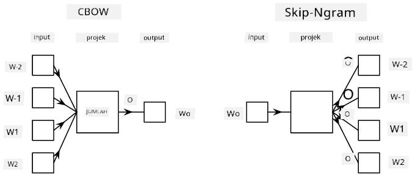

# Pemodelan Bahasa

Pemerangkapan semantik, seperti Word2Vec dan GloVe, sebenarnya adalah langkah pertama ke arah **pemodelan bahasa** - mencipta model yang dapat *memahami* (atau *mewakili*) sifat bahasa.

## [Kuiz Pra-Kuliah](https://ff-quizzes.netlify.app/en/ai/quiz/29)

Idea utama di sebalik pemodelan bahasa adalah melatihnya menggunakan dataset tanpa label secara tidak diawasi. Ini penting kerana kita mempunyai sejumlah besar teks tanpa label yang tersedia, sementara jumlah teks berlabel sentiasa terhad oleh usaha yang diperlukan untuk melabelkannya. Selalunya, kita boleh membina model bahasa yang dapat **meramalkan perkataan yang hilang** dalam teks, kerana mudah untuk menyembunyikan satu perkataan secara rawak dalam teks dan menggunakannya sebagai sampel latihan.

## Melatih Pemerangkapan

Dalam contoh sebelumnya, kita menggunakan pemerangkapan semantik yang telah dilatih, tetapi menarik untuk melihat bagaimana pemerangkapan tersebut boleh dilatih. Terdapat beberapa idea yang boleh digunakan:

* **Pemodelan bahasa N-Gram**, di mana kita meramalkan satu token dengan melihat N token sebelumnya (N-gram).
* **Continuous Bag-of-Words** (CBoW), di mana kita meramalkan token tengah $W_0$ dalam urutan token $W_{-N}$, ..., $W_N$.
* **Skip-gram**, di mana kita meramalkan satu set token berdekatan {$W_{-N},\dots, W_{-1}, W_1,\dots, W_N$} daripada token tengah $W_0$.

> Imej daripada [kertas kerja ini](https://arxiv.org/pdf/1301.3781.pdf)

## ✍️ Notebook Contoh: Melatih Model CBoW

Teruskan pembelajaran anda dalam notebook berikut:

* [Melatih CBoW Word2Vec dengan TensorFlow](CBoW-TF.ipynb)
* [Melatih CBoW Word2Vec dengan PyTorch](CBoW-PyTorch.ipynb)

## Kesimpulan

Dalam pelajaran sebelumnya, kita telah melihat bahawa pemerangkapan perkataan berfungsi seperti sihir! Kini kita tahu bahawa melatih pemerangkapan perkataan bukanlah tugas yang terlalu kompleks, dan kita seharusnya dapat melatih pemerangkapan perkataan kita sendiri untuk teks khusus domain jika diperlukan.

## [Kuiz Pasca-Kuliah](https://ff-quizzes.netlify.app/en/ai/quiz/30)

## Ulasan & Kajian Kendiri

* [Tutorial rasmi PyTorch tentang Pemodelan Bahasa](https://pytorch.org/tutorials/beginner/nlp/word_embeddings_tutorial.html).
* [Tutorial rasmi TensorFlow tentang melatih model Word2Vec](https://www.TensorFlow.org/tutorials/text/word2vec).
* Menggunakan rangka kerja **gensim** untuk melatih pemerangkapan yang paling biasa digunakan dalam beberapa baris kod diterangkan [dalam dokumentasi ini](https://pytorch.org/tutorials/beginner/nlp/word_embeddings_tutorial.html).

## 🚀 [Tugasan: Latih Model Skip-Gram](lab/README.md)

Dalam makmal, kami mencabar anda untuk mengubah kod daripada pelajaran ini untuk melatih model skip-gram dan bukannya CBoW. [Baca perinciannya](lab/README.md)

---

