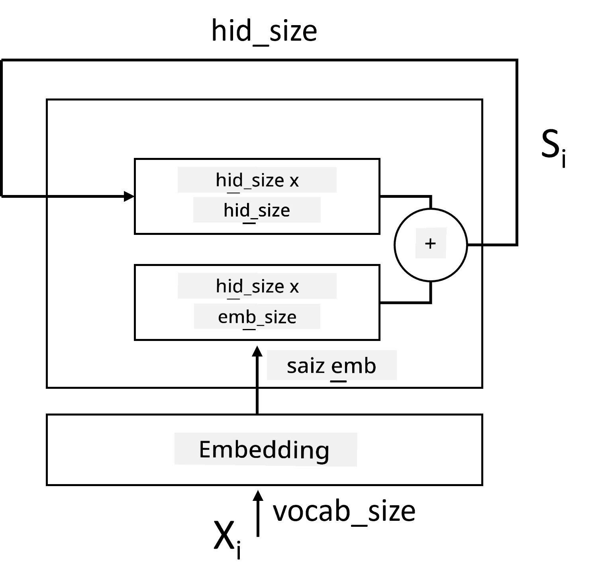
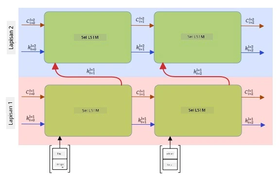

# Rangkaian Neural Berulang

## [Kuiz Pra-Kuliah](https://ff-quizzes.netlify.app/en/ai/quiz/31)

Dalam bahagian sebelum ini, kita telah menggunakan representasi semantik teks yang kaya dan pengklasifikasi linear ringkas di atas embedding. Apa yang dilakukan oleh seni bina ini adalah menangkap makna agregat perkataan dalam ayat, tetapi ia tidak mengambil kira **susunan** perkataan, kerana operasi agregasi di atas embedding telah menghapuskan maklumat ini daripada teks asal. Oleh kerana model ini tidak dapat memodelkan susunan perkataan, ia tidak dapat menyelesaikan tugas yang lebih kompleks atau samar seperti penjanaan teks atau menjawab soalan.

Untuk menangkap makna urutan teks, kita perlu menggunakan seni bina rangkaian neural lain, yang dipanggil **rangkaian neural berulang**, atau RNN. Dalam RNN, kita lalui ayat kita melalui rangkaian satu simbol pada satu masa, dan rangkaian menghasilkan beberapa **keadaan**, yang kemudian kita lalui semula ke rangkaian bersama simbol seterusnya.

> Gambar oleh penulis

Diberikan urutan input token X0,...,Xn, RNN mencipta urutan blok rangkaian neural, dan melatih urutan ini secara hujung ke hujung menggunakan backpropagation. Setiap blok rangkaian mengambil pasangan (Xi,Si) sebagai input, dan menghasilkan Si+1 sebagai hasil. Keadaan akhir Sn atau (output Yn) dimasukkan ke dalam pengklasifikasi linear untuk menghasilkan keputusan. Semua blok rangkaian berkongsi berat yang sama, dan dilatih secara hujung ke hujung menggunakan satu laluan backpropagation.

Oleh kerana vektor keadaan S0,...,Sn dilalui melalui rangkaian, ia dapat mempelajari pergantungan berurutan antara perkataan. Sebagai contoh, apabila perkataan *tidak* muncul di suatu tempat dalam urutan, ia boleh belajar untuk menafikan elemen tertentu dalam vektor keadaan, menghasilkan penafian.

> ✅ Oleh kerana berat semua blok RNN dalam gambar di atas adalah dikongsi, gambar yang sama boleh diwakili sebagai satu blok (di sebelah kanan) dengan gelung maklum balas berulang, yang menghantar keadaan output rangkaian kembali ke input.

## Anatomi Sel RNN

Mari kita lihat bagaimana sel RNN ringkas diatur. Ia menerima keadaan sebelumnya Si-1 dan simbol semasa Xi sebagai input, dan perlu menghasilkan keadaan output Si (dan, kadangkala, kita juga berminat dengan output lain Yi, seperti dalam kes rangkaian generatif).

Sel RNN ringkas mempunyai dua matriks berat di dalamnya: satu mengubah simbol input (kita panggil ia W), dan satu lagi mengubah keadaan input (H). Dalam kes ini, output rangkaian dikira sebagai &sigma;(W&times;Xi+H&times;Si-1+b), di mana &sigma; adalah fungsi pengaktifan dan b adalah bias tambahan.

> Gambar oleh penulis

Dalam banyak kes, token input dilalui melalui lapisan embedding sebelum memasuki RNN untuk menurunkan dimensi. Dalam kes ini, jika dimensi vektor input adalah *emb_size*, dan vektor keadaan adalah *hid_size* - saiz W adalah *emb_size*&times;*hid_size*, dan saiz H adalah *hid_size*&times;*hid_size*.

## Memori Jangka Panjang Pendek (LSTM)

Salah satu masalah utama RNN klasik ialah masalah **vanishing gradients**. Oleh kerana RNN dilatih secara hujung ke hujung dalam satu laluan backpropagation, ia menghadapi kesukaran untuk menyebarkan ralat ke lapisan pertama rangkaian, dan dengan itu rangkaian tidak dapat mempelajari hubungan antara token yang jauh. Salah satu cara untuk mengelakkan masalah ini adalah dengan memperkenalkan **pengurusan keadaan eksplisit** menggunakan **gates**. Terdapat dua seni bina terkenal jenis ini: **Memori Jangka Panjang Pendek** (LSTM) dan **Unit Relay Berpagar** (GRU).

> Sumber gambar TBD

Rangkaian LSTM diatur dengan cara yang serupa dengan RNN, tetapi terdapat dua keadaan yang dihantar dari lapisan ke lapisan: keadaan sebenar C, dan vektor tersembunyi H. Pada setiap unit, vektor tersembunyi Hi digabungkan dengan input Xi, dan mereka mengawal apa yang berlaku kepada keadaan C melalui **gates**. Setiap gate adalah rangkaian neural dengan pengaktifan sigmoid (output dalam julat [0,1]), yang boleh dianggap sebagai topeng bitwise apabila didarabkan dengan vektor keadaan. Terdapat gate berikut (dari kiri ke kanan pada gambar di atas):

* **Gate lupa** mengambil vektor tersembunyi dan menentukan komponen vektor C yang perlu dilupakan, dan yang perlu diteruskan.
* **Gate input** mengambil beberapa maklumat daripada input dan vektor tersembunyi dan memasukkannya ke dalam keadaan.
* **Gate output** mengubah keadaan melalui lapisan linear dengan pengaktifan *tanh*, kemudian memilih beberapa komponennya menggunakan vektor tersembunyi Hi untuk menghasilkan keadaan baru Ci+1.

Komponen keadaan C boleh dianggap sebagai beberapa bendera yang boleh dihidupkan dan dimatikan. Sebagai contoh, apabila kita menemui nama *Alice* dalam urutan, kita mungkin ingin menganggap bahawa ia merujuk kepada watak perempuan, dan menaikkan bendera dalam keadaan bahawa kita mempunyai kata nama perempuan dalam ayat. Apabila kita seterusnya menemui frasa *dan Tom*, kita akan menaikkan bendera bahawa kita mempunyai kata nama jamak. Oleh itu, dengan memanipulasi keadaan kita boleh menyimpan sifat tatabahasa bahagian ayat.

> ✅ Sumber yang sangat baik untuk memahami dalaman LSTM ialah artikel hebat ini [Understanding LSTM Networks](https://colah.github.io/posts/2015-08-Understanding-LSTMs/) oleh Christopher Olah.

## RNN Dua Arah dan Berlapis

Kita telah membincangkan rangkaian berulang yang beroperasi dalam satu arah, dari permulaan urutan ke penghujung. Ia kelihatan semula jadi, kerana ia menyerupai cara kita membaca dan mendengar ucapan. Walau bagaimanapun, memandangkan dalam banyak kes praktikal kita mempunyai akses rawak kepada urutan input, mungkin masuk akal untuk menjalankan pengiraan berulang dalam kedua-dua arah. Rangkaian sedemikian dipanggil **RNN dua arah**. Apabila berurusan dengan rangkaian dua arah, kita memerlukan dua vektor keadaan tersembunyi, satu untuk setiap arah.

Rangkaian berulang, sama ada satu arah atau dua arah, menangkap corak tertentu dalam urutan, dan boleh menyimpannya ke dalam vektor keadaan atau menghantarnya ke output. Seperti rangkaian konvolusi, kita boleh membina lapisan berulang lain di atas yang pertama untuk menangkap corak tahap lebih tinggi dan membina daripada corak tahap rendah yang diekstrak oleh lapisan pertama. Ini membawa kita kepada konsep **RNN berlapis** yang terdiri daripada dua atau lebih rangkaian berulang, di mana output lapisan sebelumnya dihantar ke lapisan seterusnya sebagai input.

*Gambar daripada [post yang hebat ini](https://towardsdatascience.com/from-a-lstm-cell-to-a-multilayer-lstm-network-with-pytorch-2899eb5696f3) oleh Fernando López*

## ✍️ Latihan: Embedding

Teruskan pembelajaran anda dalam buku nota berikut:

* [RNN dengan PyTorch](RNNPyTorch.ipynb)
* [RNN dengan TensorFlow](RNNTF.ipynb)

## Kesimpulan

Dalam unit ini, kita telah melihat bahawa RNN boleh digunakan untuk klasifikasi urutan, tetapi sebenarnya, ia boleh menangani banyak lagi tugas, seperti penjanaan teks, terjemahan mesin, dan banyak lagi. Kita akan mempertimbangkan tugas-tugas tersebut dalam unit seterusnya.

## 🚀 Cabaran

Baca beberapa literatur tentang LSTM dan pertimbangkan aplikasinya:

- [Grid Long Short-Term Memory](https://arxiv.org/pdf/1507.01526v1.pdf)
- [Show, Attend and Tell: Neural Image Caption
Generation with Visual Attention](https://arxiv.org/pdf/1502.03044v2.pdf)

## [Kuiz Pasca-Kuliah](https://ff-quizzes.netlify.app/en/ai/quiz/32)

## Kajian & Pembelajaran Kendiri

- [Understanding LSTM Networks](https://colah.github.io/posts/2015-08-Understanding-LSTMs/) oleh Christopher Olah.

## [Tugasan: Buku Nota](assignment.md)

---

