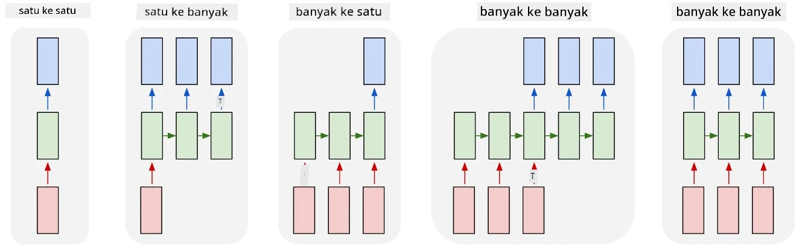
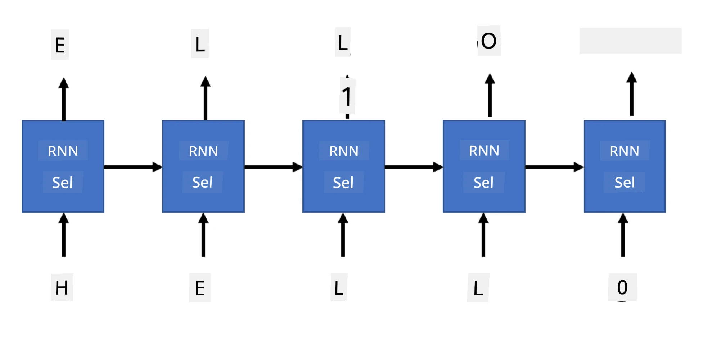

# Rangkaian Generatif

## [Kuiz Pra-Kuliah](https://ff-quizzes.netlify.app/en/ai/quiz/33)

Rangkaian Neural Berulang (RNN) dan varian sel berpintunya seperti Sel Memori Jangka Panjang (LSTM) dan Unit Berulang Berpintu (GRU) menyediakan mekanisme untuk pemodelan bahasa kerana ia dapat mempelajari susunan perkataan dan memberikan ramalan untuk perkataan seterusnya dalam satu urutan. Ini membolehkan kita menggunakan RNN untuk **tugas generatif**, seperti penjanaan teks biasa, terjemahan mesin, dan bahkan kapsyen imej.

> ✅ Fikirkan tentang semua masa anda mendapat manfaat daripada tugas generatif seperti pelengkapan teks semasa menaip. Lakukan penyelidikan tentang aplikasi kegemaran anda untuk melihat sama ada ia menggunakan RNN.

Dalam seni bina RNN yang kita bincangkan dalam unit sebelumnya, setiap unit RNN menghasilkan keadaan tersembunyi seterusnya sebagai output. Walau bagaimanapun, kita juga boleh menambah output lain kepada setiap unit berulang, yang membolehkan kita menghasilkan **urutan** (yang sama panjang dengan urutan asal). Selain itu, kita boleh menggunakan unit RNN yang tidak menerima input pada setiap langkah, dan hanya mengambil beberapa vektor keadaan awal, dan kemudian menghasilkan urutan output.

Ini membolehkan pelbagai seni bina neural yang ditunjukkan dalam gambar di bawah:



> Imej daripada blog post [Unreasonable Effectiveness of Recurrent Neural Networks](http://karpathy.github.io/2015/05/21/rnn-effectiveness/) oleh [Andrej Karpaty](http://karpathy.github.io/)

* **Satu-ke-satu** ialah rangkaian neural tradisional dengan satu input dan satu output
* **Satu-ke-banyak** ialah seni bina generatif yang menerima satu nilai input, dan menghasilkan urutan nilai output. Sebagai contoh, jika kita ingin melatih rangkaian **kapsyen imej** yang akan menghasilkan penerangan teks untuk gambar, kita boleh mengambil gambar sebagai input, melaluinya melalui CNN untuk mendapatkan keadaan tersembunyinya, dan kemudian mempunyai rantai berulang menghasilkan kapsyen perkataan demi perkataan
* **Banyak-ke-satu** sepadan dengan seni bina RNN yang kita terangkan dalam unit sebelumnya, seperti klasifikasi teks
* **Banyak-ke-banyak**, atau **urutan-ke-urutan** sepadan dengan tugas seperti **terjemahan mesin**, di mana kita mempunyai RNN pertama mengumpulkan semua maklumat daripada urutan input ke dalam keadaan tersembunyi, dan rantai RNN lain mengembangkan keadaan ini ke dalam urutan output.

Dalam unit ini, kita akan memberi tumpuan kepada model generatif mudah yang membantu kita menjana teks. Untuk kesederhanaan, kita akan menggunakan tokenisasi peringkat aksara.

Kita akan melatih RNN ini untuk menjana teks langkah demi langkah. Pada setiap langkah, kita akan mengambil urutan aksara sepanjang `nchars`, dan meminta rangkaian untuk menghasilkan aksara output seterusnya untuk setiap aksara input:



Semasa menjana teks (semasa inferens), kita bermula dengan beberapa **prompt**, yang dilalui melalui sel RNN untuk menghasilkan keadaan perantaraannya, dan kemudian daripada keadaan ini penjanaan bermula. Kita menjana satu aksara pada satu masa, dan menghantar keadaan dan aksara yang dijana kepada sel RNN lain untuk menjana aksara seterusnya, sehingga kita menjana aksara yang mencukupi.


> Imej oleh penulis

## ✍️ Latihan: Rangkaian Generatif

Teruskan pembelajaran anda dalam buku nota berikut:

* [Rangkaian Generatif dengan PyTorch](GenerativePyTorch.ipynb)
* [Rangkaian Generatif dengan TensorFlow](GenerativeTF.ipynb)

## Penjanaan Teks Lembut dan Suhu

Output setiap sel RNN ialah taburan kebarangkalian aksara. Jika kita sentiasa mengambil aksara dengan kebarangkalian tertinggi sebagai aksara seterusnya dalam teks yang dijana, teks sering boleh menjadi "berulang" antara urutan aksara yang sama berulang kali, seperti dalam contoh ini:

```
today of the second the company and a second the company ...
```

Walau bagaimanapun, jika kita melihat taburan kebarangkalian untuk aksara seterusnya, mungkin perbezaan antara beberapa kebarangkalian tertinggi tidak besar, contohnya satu aksara boleh mempunyai kebarangkalian 0.2, yang lain - 0.19, dll. Sebagai contoh, apabila mencari aksara seterusnya dalam urutan '*play*', aksara seterusnya boleh sama ada ruang, atau **e** (seperti dalam perkataan *player*).

Ini membawa kita kepada kesimpulan bahawa tidak selalu "adil" untuk memilih aksara dengan kebarangkalian lebih tinggi, kerana memilih yang kedua tertinggi masih boleh membawa kita kepada teks yang bermakna. Lebih bijak untuk **sampel** aksara daripada taburan kebarangkalian yang diberikan oleh output rangkaian. Kita juga boleh menggunakan parameter, **suhu**, yang akan meratakan taburan kebarangkalian, jika kita ingin menambah lebih banyak keacakan, atau menjadikannya lebih curam, jika kita ingin lebih berpegang kepada aksara kebarangkalian tertinggi.

Terokai bagaimana penjanaan teks lembut ini dilaksanakan dalam buku nota yang dipautkan di atas.

## Kesimpulan

Walaupun penjanaan teks mungkin berguna dengan sendirinya, manfaat utama datang daripada keupayaan untuk menjana teks menggunakan RNN daripada beberapa vektor ciri awal. Sebagai contoh, penjanaan teks digunakan sebagai sebahagian daripada terjemahan mesin (urutan-ke-urutan, dalam kes ini vektor keadaan daripada *penyandi* digunakan untuk menjana atau *menyahkod* mesej yang diterjemahkan), atau menjana penerangan teks untuk imej (dalam kes ini vektor ciri akan datang daripada pengekstrak CNN).

## 🚀 Cabaran

Ambil beberapa pelajaran di Microsoft Learn mengenai topik ini

* Penjanaan Teks dengan [PyTorch](https://docs.microsoft.com/learn/modules/intro-natural-language-processing-pytorch/6-generative-networks/?WT.mc_id=academic-77998-cacaste)/[TensorFlow](https://docs.microsoft.com/learn/modules/intro-natural-language-processing-tensorflow/5-generative-networks/?WT.mc_id=academic-77998-cacaste)

## [Kuiz Pasca-Kuliah](https://ff-quizzes.netlify.app/en/ai/quiz/34)

## Ulasan & Kajian Kendiri

Berikut adalah beberapa artikel untuk mengembangkan pengetahuan anda

* Pendekatan berbeza untuk penjanaan teks dengan Rantaian Markov, LSTM dan GPT-2: [blog post](https://towardsdatascience.com/text-generation-gpt-2-lstm-markov-chain-9ea371820e1e)
* Contoh penjanaan teks dalam [dokumentasi Keras](https://keras.io/examples/generative/lstm_character_level_text_generation/)

## [Tugasan](lab/README.md)

Kita telah melihat bagaimana untuk menjana teks aksara demi aksara. Dalam makmal, anda akan meneroka penjanaan teks peringkat perkataan.

---

