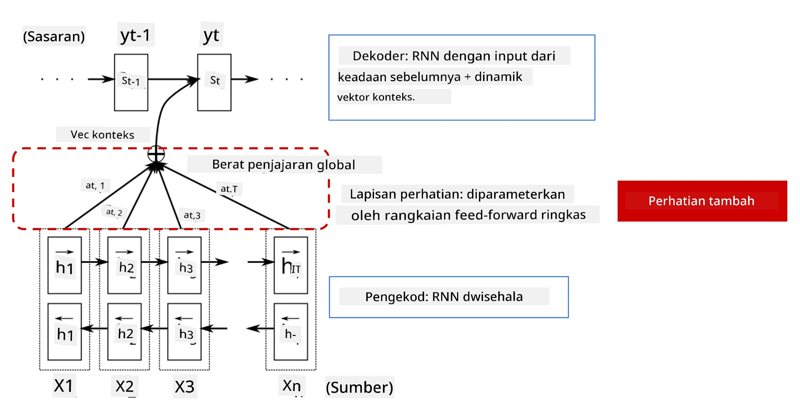
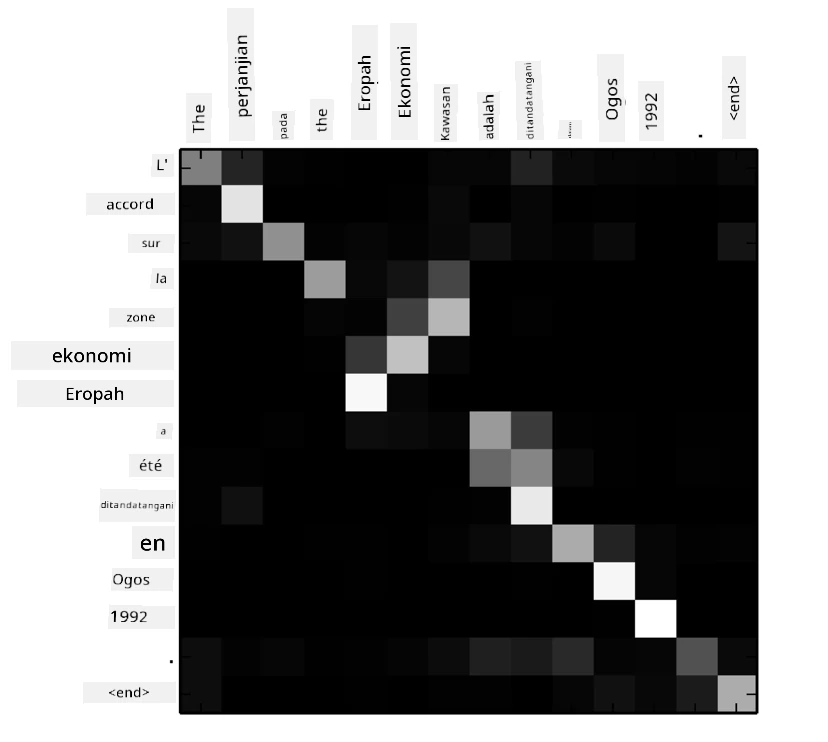
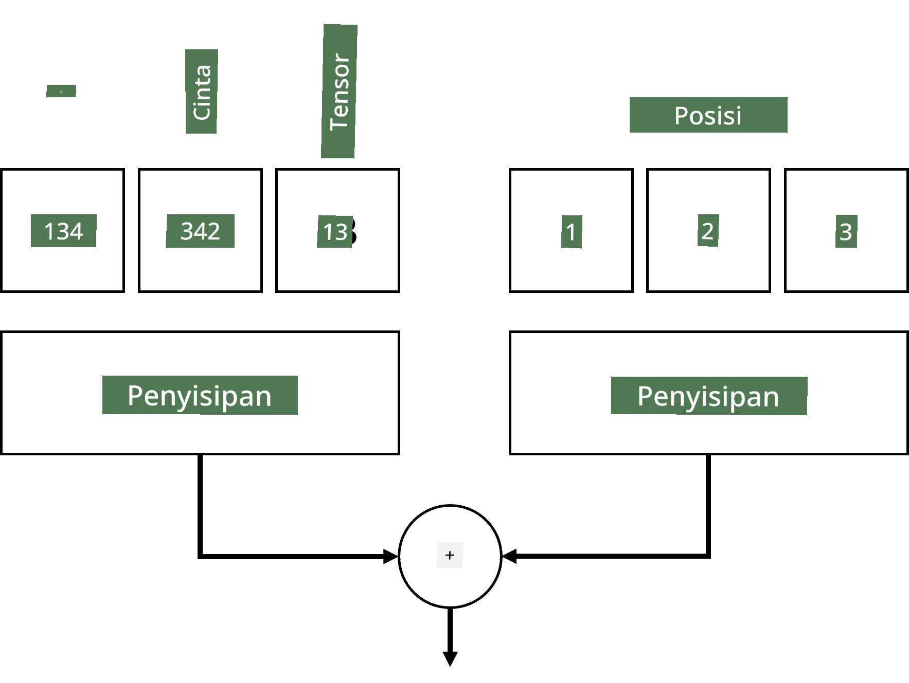
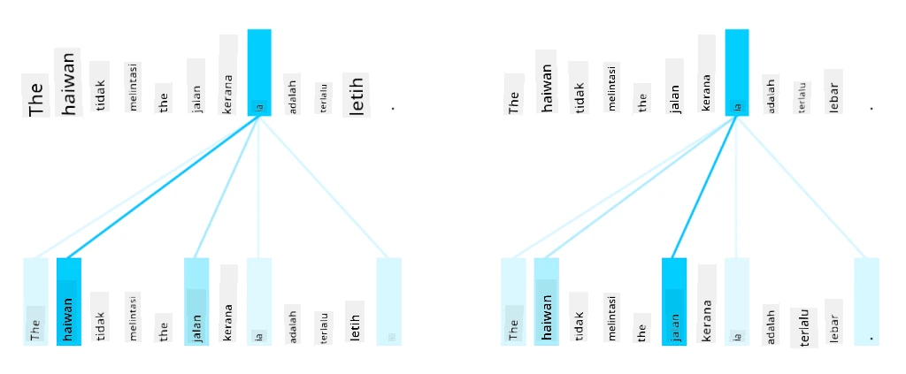
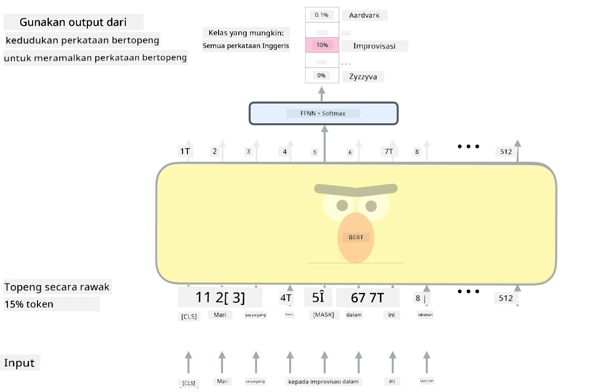

# Mekanisme Perhatian dan Transformer

## [Kuiz pra-kuliah](https://ff-quizzes.netlify.app/en/ai/quiz/35)

Salah satu masalah paling penting dalam domain NLP ialah **terjemahan mesin**, satu tugas penting yang menjadi asas kepada alat seperti Google Translate. Dalam bahagian ini, kita akan memberi tumpuan kepada terjemahan mesin, atau secara lebih umum, kepada sebarang tugas *urutan-ke-urutan* (yang juga dipanggil **transduksi ayat**).

Dengan RNN, urutan-ke-urutan dilaksanakan oleh dua rangkaian berulang, di mana satu rangkaian, iaitu **encoder**, memampatkan urutan input ke dalam keadaan tersembunyi, manakala rangkaian lain, iaitu **decoder**, mengembangkan keadaan tersembunyi ini menjadi hasil terjemahan. Terdapat beberapa masalah dengan pendekatan ini:

* Keadaan akhir rangkaian encoder sukar untuk mengingati permulaan ayat, menyebabkan kualiti model yang rendah untuk ayat yang panjang.
* Semua perkataan dalam satu urutan mempunyai kesan yang sama terhadap hasil. Walau bagaimanapun, dalam realiti, perkataan tertentu dalam urutan input sering mempunyai kesan yang lebih besar terhadap output berbanding yang lain.

**Mekanisme Perhatian** menyediakan cara untuk memberi berat kepada kesan kontekstual setiap vektor input terhadap setiap ramalan output RNN. Cara ia dilaksanakan adalah dengan mencipta pintasan antara keadaan perantaraan RNN input dan RNN output. Dengan cara ini, apabila menghasilkan simbol output yt, kita akan mengambil kira semua keadaan tersembunyi input hi, dengan pekali berat yang berbeza &alpha;t,i.

> Model encoder-decoder dengan mekanisme perhatian tambahan dalam [Bahdanau et al., 2015](https://arxiv.org/pdf/1409.0473.pdf), dipetik daripada [blog post ini](https://lilianweng.github.io/lil-log/2018/06/24/attention-attention.html)

Matriks perhatian {&alpha;i,j} akan mewakili tahap di mana perkataan input tertentu memainkan peranan dalam penjanaan perkataan tertentu dalam urutan output. Berikut adalah contoh matriks sedemikian:

> Rajah daripada [Bahdanau et al., 2015](https://arxiv.org/pdf/1409.0473.pdf) (Rajah 3)

Mekanisme perhatian bertanggungjawab untuk sebahagian besar kemajuan terkini atau hampir terkini dalam NLP. Walau bagaimanapun, menambah perhatian secara ketara meningkatkan bilangan parameter model yang membawa kepada isu penskalaan dengan RNN. Satu kekangan utama dalam penskalaan RNN ialah sifat berulang model yang menjadikannya mencabar untuk melatih secara batch dan selari. Dalam RNN, setiap elemen urutan perlu diproses secara berurutan, yang bermaksud ia tidak boleh diselaraskan dengan mudah.

> Rajah daripada [Blog Google](https://research.googleblog.com/2016/09/a-neural-network-for-machine.html)

Penggunaan mekanisme perhatian digabungkan dengan kekangan ini membawa kepada penciptaan Model Transformer yang kini menjadi standard seperti BERT hingga Open-GPT3.

## Model Transformer

Salah satu idea utama di sebalik transformer ialah untuk mengelakkan sifat berurutan RNN dan mencipta model yang boleh dilatih secara selari. Ini dicapai dengan melaksanakan dua idea:

* pengekodan kedudukan
* menggunakan mekanisme perhatian kendiri untuk menangkap corak dan bukannya RNN (atau CNN) (itulah sebabnya kertas yang memperkenalkan transformer dipanggil *[Attention is all you need](https://arxiv.org/abs/1706.03762)*)

### Pengekodan/Pemadanan Kedudukan

Idea pengekodan kedudukan adalah seperti berikut. 
1. Apabila menggunakan RNN, kedudukan relatif token diwakili oleh bilangan langkah, dan oleh itu tidak perlu diwakili secara eksplisit. 
2. Walau bagaimanapun, apabila kita beralih kepada perhatian, kita perlu mengetahui kedudukan relatif token dalam urutan. 
3. Untuk mendapatkan pengekodan kedudukan, kita menambah urutan token dengan urutan kedudukan token dalam urutan (iaitu, urutan nombor 0,1, ...).
4. Kita kemudian mencampurkan kedudukan token dengan vektor pemadanan token. Untuk mengubah kedudukan (integer) menjadi vektor, kita boleh menggunakan pendekatan yang berbeza:

* Pemadanan yang boleh dilatih, serupa dengan pemadanan token. Ini adalah pendekatan yang kita pertimbangkan di sini. Kita menggunakan lapisan pemadanan di atas kedua-dua token dan kedudukan mereka, menghasilkan vektor pemadanan dengan dimensi yang sama, yang kemudian kita tambahkan bersama.
* Fungsi pengekodan kedudukan tetap, seperti yang dicadangkan dalam kertas asal.

> Imej oleh penulis

Hasil yang kita peroleh dengan pemadanan kedudukan menggabungkan kedua-dua token asal dan kedudukannya dalam urutan.

### Perhatian Kendiri Multi-Kepala

Seterusnya, kita perlu menangkap beberapa corak dalam urutan kita. Untuk melakukan ini, transformer menggunakan mekanisme **perhatian kendiri**, yang pada dasarnya adalah perhatian yang diterapkan pada urutan yang sama sebagai input dan output. Menerapkan perhatian kendiri membolehkan kita mengambil kira **konteks** dalam ayat, dan melihat perkataan mana yang saling berkaitan. Sebagai contoh, ia membolehkan kita melihat perkataan mana yang dirujuk oleh koreferensi, seperti *ia*, dan juga mengambil kira konteks:

> Imej daripada [Blog Google](https://research.googleblog.com/2017/08/transformer-novel-neural-network.html)

Dalam transformer, kita menggunakan **Perhatian Multi-Kepala** untuk memberikan kuasa kepada rangkaian untuk menangkap beberapa jenis kebergantungan yang berbeza, contohnya hubungan perkataan jangka panjang vs. jangka pendek, koreferensi vs. sesuatu yang lain, dsb.

[Notebook TensorFlow](TransformersTF.ipynb) mengandungi lebih banyak butiran tentang pelaksanaan lapisan transformer.

### Perhatian Encoder-Decoder

Dalam transformer, perhatian digunakan di dua tempat:

* Untuk menangkap corak dalam teks input menggunakan perhatian kendiri
* Untuk melaksanakan terjemahan urutan - iaitu lapisan perhatian antara encoder dan decoder.

Perhatian encoder-decoder sangat mirip dengan mekanisme perhatian yang digunakan dalam RNN, seperti yang diterangkan pada permulaan bahagian ini. Diagram animasi ini menerangkan peranan perhatian encoder-decoder.

Oleh kerana setiap kedudukan input dipetakan secara bebas ke setiap kedudukan output, transformer boleh diselaraskan dengan lebih baik berbanding RNN, yang membolehkan model bahasa yang lebih besar dan lebih ekspresif. Setiap kepala perhatian boleh digunakan untuk mempelajari hubungan yang berbeza antara perkataan yang meningkatkan tugas Pemprosesan Bahasa Semula Jadi.

## BERT

**BERT** (Bidirectional Encoder Representations from Transformers) ialah rangkaian transformer berlapis besar dengan 12 lapisan untuk *BERT-base*, dan 24 untuk *BERT-large*. Model ini mula-mula dilatih awal pada korpus teks yang besar (WikiPedia + buku) menggunakan latihan tanpa pengawasan (meramalkan perkataan yang disembunyikan dalam ayat). Semasa latihan awal, model menyerap tahap pemahaman bahasa yang ketara yang kemudiannya boleh dimanfaatkan dengan set data lain menggunakan penalaan halus. Proses ini dipanggil **pembelajaran pemindahan**.

> Sumber imej [di sini](http://jalammar.github.io/illustrated-bert/)

## ✍️ Latihan: Transformer

Teruskan pembelajaran anda dalam notebook berikut:

* [Transformer dalam PyTorch](TransformersPyTorch.ipynb)
* [Transformer dalam TensorFlow](TransformersTF.ipynb)

## Kesimpulan

Dalam pelajaran ini, anda telah mempelajari tentang Transformer dan Mekanisme Perhatian, semua alat penting dalam kotak alat NLP. Terdapat banyak variasi seni bina Transformer termasuk BERT, DistilBERT, BigBird, OpenGPT3 dan banyak lagi yang boleh disesuaikan. Pakej [HuggingFace](https://github.com/huggingface/) menyediakan repositori untuk melatih banyak seni bina ini dengan PyTorch dan TensorFlow.

## 🚀 Cabaran

## [Kuiz pasca-kuliah](https://ff-quizzes.netlify.app/en/ai/quiz/36)

## Kajian & Pembelajaran Kendiri

* [Blog post](https://mchromiak.github.io/articles/2017/Sep/12/Transformer-Attention-is-all-you-need/), menerangkan kertas klasik [Attention is all you need](https://arxiv.org/abs/1706.03762) tentang transformer.
* [Siri blog post](https://towardsdatascience.com/transformers-explained-visually-part-1-overview-of-functionality-95a6dd460452) tentang transformer, menerangkan seni bina secara terperinci.

## [Tugasan](assignment.md)

---

