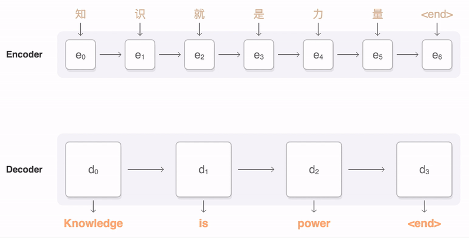
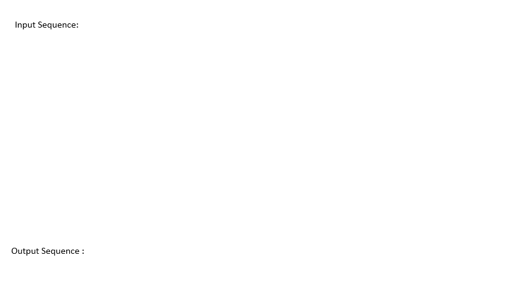

# Mekanisme Perhatian dan Transformer

## [Kuiz pra-kuliah](https://red-field-0a6ddfd03.1.azurestaticapps.net/quiz/118)

Salah satu masalah terpenting dalam domain NLP adalah **penerjemahan mesin**, sebuah tugas penting yang menjadi dasar alat seperti Google Translate. Di bagian ini, kita akan fokus pada penerjemahan mesin, atau, lebih umum, pada setiap tugas *urutan-ke-urutan* (yang juga disebut **transduksi kalimat**).

Dengan RNN, urutan-ke-urutan diimplementasikan oleh dua jaringan berulang, di mana satu jaringan, **encoder**, mengompresi urutan masukan menjadi keadaan tersembunyi, sementara jaringan lainnya, **decoder**, mengubah keadaan tersembunyi ini menjadi hasil terjemahan. Ada beberapa masalah dengan pendekatan ini:

* Keadaan akhir dari jaringan encoder kesulitan mengingat awal kalimat, sehingga menyebabkan kualitas model yang buruk untuk kalimat panjang.
* Semua kata dalam urutan memiliki dampak yang sama pada hasil. Namun, dalam kenyataannya, kata-kata tertentu dalam urutan masukan seringkali memiliki dampak yang lebih besar pada keluaran urutan daripada yang lain.

**Mekanisme Perhatian** menyediakan cara untuk memberikan bobot pada dampak kontekstual dari setiap vektor masukan terhadap setiap prediksi keluaran dari RNN. Cara ini diimplementasikan dengan membuat jalur pendek antara keadaan sementara dari RNN masukan dan RNN keluaran. Dengan cara ini, saat menghasilkan simbol keluaran yt, kita akan mempertimbangkan semua keadaan tersembunyi masukan hi, dengan koefisien bobot yang berbeda αt,i.

> Model encoder-decoder dengan mekanisme perhatian aditif dalam [Bahdanau et al., 2015](https://arxiv.org/pdf/1409.0473.pdf), dikutip dari [posting blog ini](https://lilianweng.github.io/lil-log/2018/06/24/attention-attention.html)

Matriks perhatian {αi,j} akan mewakili sejauh mana kata-kata masukan tertentu berperan dalam penghasilan kata tertentu dalam urutan keluaran. Di bawah ini adalah contoh matriks semacam itu:

> Gambar dari [Bahdanau et al., 2015](https://arxiv.org/pdf/1409.0473.pdf) (Fig.3)

Mekanisme perhatian bertanggung jawab atas banyak keadaan terkini atau hampir terkini dalam NLP. Namun, menambahkan perhatian sangat meningkatkan jumlah parameter model yang menyebabkan masalah skala dengan RNN. Salah satu batasan utama dalam menskalakan RNN adalah bahwa sifat berulang dari model membuatnya sulit untuk melakukan pelatihan secara batch dan paralel. Dalam RNN, setiap elemen dari urutan perlu diproses dalam urutan sekuensial yang berarti tidak dapat dengan mudah diparalelkan.

> Gambar dari [Blog Google](https://research.googleblog.com/2016/09/a-neural-network-for-machine.html)

Adopsi mekanisme perhatian yang dikombinasikan dengan batasan ini menyebabkan penciptaan Model Transformer yang kini menjadi Standar Terkini yang kita kenal dan gunakan saat ini seperti BERT hingga Open-GPT3.

## Model Transformer

Salah satu ide utama di balik transformer adalah menghindari sifat sekuensial dari RNN dan menciptakan model yang dapat diparalelkan selama pelatihan. Ini dicapai dengan menerapkan dua ide:

* pengkodean posisi
* menggunakan mekanisme perhatian diri untuk menangkap pola alih-alih RNN (atau CNN) (itulah sebabnya makalah yang memperkenalkan transformer disebut *[Attention is all you need](https://arxiv.org/abs/1706.03762)*)

### Pengkodean/Embedding Posisi

Ide pengkodean posisi adalah sebagai berikut. 
1. Ketika menggunakan RNN, posisi relatif dari token diwakili oleh jumlah langkah, dan oleh karena itu tidak perlu diwakili secara eksplisit. 
2. Namun, setelah kita beralih ke perhatian, kita perlu mengetahui posisi relatif dari token dalam urutan. 
3. Untuk mendapatkan pengkodean posisi, kita menambah urutan token kita dengan urutan posisi token dalam urutan (yaitu, urutan angka 0,1, ...).
4. Kita kemudian mencampurkan posisi token dengan vektor embedding token. Untuk mengubah posisi (bilangan bulat) menjadi vektor, kita dapat menggunakan berbagai pendekatan:

* Embedding yang dapat dilatih, mirip dengan embedding token. Ini adalah pendekatan yang kita pertimbangkan di sini. Kita menerapkan lapisan embedding di atas baik token maupun posisi mereka, menghasilkan vektor embedding dengan dimensi yang sama, yang kemudian kita tambahkan bersama.
* Fungsi pengkodean posisi tetap, seperti yang diusulkan dalam makalah asli.

> Gambar oleh penulis

Hasil yang kita dapatkan dengan embedding posisi menggabungkan baik token asli maupun posisinya dalam urutan.

### Perhatian Diri Multi-Kepala

Selanjutnya, kita perlu menangkap beberapa pola dalam urutan kita. Untuk melakukan ini, transformer menggunakan mekanisme **perhatian diri**, yang pada dasarnya adalah perhatian yang diterapkan pada urutan yang sama sebagai masukan dan keluaran. Menerapkan perhatian diri memungkinkan kita untuk mempertimbangkan **konteks** dalam kalimat, dan melihat kata-kata mana yang saling terkait. Misalnya, ini memungkinkan kita untuk melihat kata-kata mana yang dirujuk oleh ko-referensi, seperti *itu*, dan juga mempertimbangkan konteks:

> Gambar dari [Blog Google](https://research.googleblog.com/2017/08/transformer-novel-neural-network.html)

Dalam transformer, kita menggunakan **Multi-Head Attention** untuk memberikan kekuatan kepada jaringan untuk menangkap berbagai jenis ketergantungan, misalnya hubungan kata jangka panjang vs. jangka pendek, ko-referensi vs. hal lain, dll.

[Notebook TensorFlow](../../../../../lessons/5-NLP/18-Transformers/TransformersTF.ipynb) berisi lebih banyak rincian tentang implementasi lapisan transformer.

### Perhatian Encoder-Decoder

Dalam transformer, perhatian digunakan di dua tempat:

* Untuk menangkap pola dalam teks masukan menggunakan perhatian diri
* Untuk melakukan penerjemahan urutan - ini adalah lapisan perhatian antara encoder dan decoder.

Perhatian encoder-decoder sangat mirip dengan mekanisme perhatian yang digunakan dalam RNN, seperti yang dijelaskan di awal bagian ini. Diagram animasi ini menjelaskan peran perhatian encoder-decoder.

Karena setiap posisi masukan dipetakan secara independen ke setiap posisi keluaran, transformer dapat melakukan paralelisasi lebih baik daripada RNN, yang memungkinkan model bahasa yang jauh lebih besar dan lebih ekspresif. Setiap kepala perhatian dapat digunakan untuk mempelajari berbagai hubungan antara kata yang meningkatkan tugas Pemrosesan Bahasa Alami yang lebih lanjut.

## BERT

**BERT** (Bidirectional Encoder Representations from Transformers) adalah jaringan transformer multi-layer yang sangat besar dengan 12 lapisan untuk *BERT-base*, dan 24 untuk *BERT-large*. Model ini pertama kali dilatih pada korpus data teks yang besar (WikiPedia + buku) menggunakan pelatihan tanpa pengawasan (memprediksi kata-kata yang disembunyikan dalam kalimat). Selama pelatihan awal, model menyerap tingkat pemahaman bahasa yang signifikan yang kemudian dapat dimanfaatkan dengan dataset lain menggunakan penyempurnaan. Proses ini disebut **transfer learning**.

> Gambar [sumber](http://jalammar.github.io/illustrated-bert/)

## ✍️ Latihan: Transformers

Lanjutkan pembelajaran Anda di notebook berikut:

* [Transformers di PyTorch](../../../../../lessons/5-NLP/18-Transformers/TransformersPyTorch.ipynb)
* [Transformers di TensorFlow](../../../../../lessons/5-NLP/18-Transformers/TransformersTF.ipynb)

## Kesimpulan

Dalam pelajaran ini, Anda belajar tentang Transformers dan Mekanisme Perhatian, semua alat penting dalam kotak alat NLP. Ada banyak variasi arsitektur Transformer termasuk BERT, DistilBERT, BigBird, OpenGPT3, dan lebih banyak lagi yang dapat disempurnakan. Paket [HuggingFace](https://github.com/huggingface/) menyediakan repositori untuk melatih banyak arsitektur ini dengan PyTorch dan TensorFlow.

## 🚀 Tantangan

## [Kuiz pasca-kuliah](https://red-field-0a6ddfd03.1.azurestaticapps.net/quiz/218)

## Tinjauan & Studi Mandiri

* [Posting blog](https://mchromiak.github.io/articles/2017/Sep/12/Transformer-Attention-is-all-you-need/), menjelaskan makalah klasik [Attention is all you need](https://arxiv.org/abs/1706.03762) tentang transformer.
* [Seri posting blog](https://towardsdatascience.com/transformers-explained-visually-part-1-overview-of-functionality-95a6dd460452) tentang transformer, menjelaskan arsitektur secara rinci.

## [Tugas](assignment.md)

**Penafian**:  
Dokumen ini telah diterjemahkan menggunakan perkhidmatan terjemahan berasaskan AI. Walaupun kami berusaha untuk ketepatan, sila ambil perhatian bahawa terjemahan automatik mungkin mengandungi kesilapan atau ketidaktepatan. Dokumen asal dalam bahasa ibunda harus dianggap sebagai sumber yang berautoriti. Untuk maklumat penting, terjemahan manusia yang profesional adalah disyorkan. Kami tidak bertanggungjawab atas sebarang salah faham atau salah tafsir yang timbul daripada penggunaan terjemahan ini.