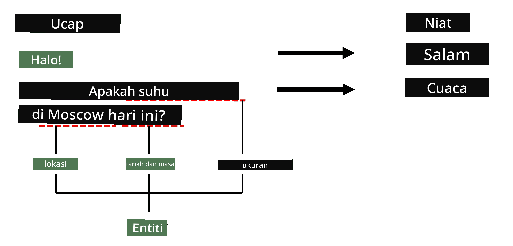

# Pengenalan Entiti Bernama

Sehingga kini, kita kebanyakannya menumpukan pada satu tugas NLP - klasifikasi. Walau bagaimanapun, terdapat juga tugas NLP lain yang boleh diselesaikan dengan rangkaian neural. Salah satu tugas tersebut ialah **[Pengenalan Entiti Bernama](https://wikipedia.org/wiki/Named-entity_recognition)** (NER), yang berkaitan dengan mengenal pasti entiti tertentu dalam teks, seperti tempat, nama orang, selang masa, formula kimia, dan sebagainya.

## [Kuiz Pra-Kuliah](https://ff-quizzes.netlify.app/en/ai/quiz/37)

## Contoh Penggunaan NER

Bayangkan anda ingin membangunkan bot sembang bahasa semula jadi, seperti Amazon Alexa atau Google Assistant. Cara bot sembang pintar berfungsi adalah dengan *memahami* apa yang pengguna mahukan melalui klasifikasi teks pada ayat input. Hasil klasifikasi ini dikenali sebagai **niat**, yang menentukan apa yang bot sembang perlu lakukan.

> Imej oleh penulis

Walau bagaimanapun, pengguna mungkin memberikan beberapa parameter sebagai sebahagian daripada frasa. Sebagai contoh, apabila bertanya tentang cuaca, dia mungkin menentukan lokasi atau tarikh. Bot perlu memahami entiti tersebut dan mengisi slot parameter dengan sewajarnya sebelum melaksanakan tindakan. Inilah tepatnya di mana NER memainkan peranan.

> ✅ Contoh lain ialah [menganalisis kertas kerja perubatan saintifik](https://soshnikov.com/science/analyzing-medical-papers-with-azure-and-text-analytics-for-health/). Salah satu perkara utama yang perlu dicari ialah istilah perubatan tertentu, seperti penyakit dan bahan perubatan. Walaupun sebilangan kecil penyakit mungkin boleh diekstrak menggunakan carian substring, entiti yang lebih kompleks, seperti sebatian kimia dan nama ubat, memerlukan pendekatan yang lebih kompleks.

## NER sebagai Klasifikasi Token

Model NER pada dasarnya adalah **model klasifikasi token**, kerana untuk setiap token input kita perlu menentukan sama ada ia tergolong dalam entiti atau tidak, dan jika ya - kepada kelas entiti mana.

Pertimbangkan tajuk kertas kerja berikut:

**Tricuspid valve regurgitation** dan **lithium carbonate** **toxicity** dalam bayi baru lahir.

Entiti di sini adalah:

* Tricuspid valve regurgitation ialah penyakit (`DIS`)
* Lithium carbonate ialah bahan kimia (`CHEM`)
* Toxicity juga merupakan penyakit (`DIS`)

Perhatikan bahawa satu entiti boleh merangkumi beberapa token. Dan, seperti dalam kes ini, kita perlu membezakan antara dua entiti berturutan. Oleh itu, adalah biasa menggunakan dua kelas untuk setiap entiti - satu menentukan token pertama entiti (sering menggunakan awalan `B-` untuk **permulaan**), dan satu lagi - sambungan entiti (`I-`, untuk token **dalaman**). Kita juga menggunakan `O` sebagai kelas untuk mewakili semua token **lain**. Penandaan token seperti ini dipanggil [penandaan BIO](https://en.wikipedia.org/wiki/Inside%E2%80%93outside%E2%80%93beginning_(tagging)) (atau IOB). Apabila ditandakan, tajuk kita akan kelihatan seperti ini:

Token | Tag
------|-----
Tricuspid | B-DIS
valve | I-DIS
regurgitation | I-DIS
and | O
lithium | B-CHEM
carbonate | I-CHEM
toxicity | B-DIS
in | O
a | O
newborn | O
infant | O
. | O

Oleh kerana kita perlu membina korespondensi satu-ke-satu antara token dan kelas, kita boleh melatih model rangkaian neural **banyak-ke-banyak** paling kanan daripada gambar ini:

> *Imej daripada [blog post ini](http://karpathy.github.io/2015/05/21/rnn-effectiveness/) oleh [Andrej Karpathy](http://karpathy.github.io/). Model klasifikasi token NER sepadan dengan seni bina rangkaian paling kanan dalam gambar ini.*

## Melatih Model NER

Oleh kerana model NER pada dasarnya adalah model klasifikasi token, kita boleh menggunakan RNN yang telah kita kenali untuk tugas ini. Dalam kes ini, setiap blok rangkaian berulang akan mengembalikan ID token. Notebook contoh berikut menunjukkan cara melatih LSTM untuk klasifikasi token.

## ✍️ Notebook Contoh: NER

Teruskan pembelajaran anda dalam notebook berikut:

* [NER dengan TensorFlow](NER-TF.ipynb)

## Kesimpulan

Model NER ialah **model klasifikasi token**, yang bermaksud ia boleh digunakan untuk melaksanakan klasifikasi token. Ini adalah tugas yang sangat biasa dalam NLP, membantu mengenal pasti entiti tertentu dalam teks termasuk tempat, nama, tarikh, dan banyak lagi.

## 🚀 Cabaran

Lengkapkan tugasan yang dipautkan di bawah untuk melatih model pengenalan entiti bernama bagi istilah perubatan, kemudian cuba pada dataset yang berbeza.

## [Kuiz Pasca-Kuliah](https://ff-quizzes.netlify.app/en/ai/quiz/38)

## Ulasan & Kajian Kendiri

Baca blog [The Unreasonable Effectiveness of Recurrent Neural Networks](http://karpathy.github.io/2015/05/21/rnn-effectiveness/) dan ikuti bahagian Bacaan Lanjut dalam artikel tersebut untuk mendalami pengetahuan anda.

## [Tugasan](lab/README.md)

Dalam tugasan untuk pelajaran ini, anda perlu melatih model pengenalan entiti perubatan. Anda boleh bermula dengan melatih model LSTM seperti yang diterangkan dalam pelajaran ini, dan teruskan dengan menggunakan model transformer BERT. Baca [arahan](lab/README.md) untuk mendapatkan semua butiran.

---

