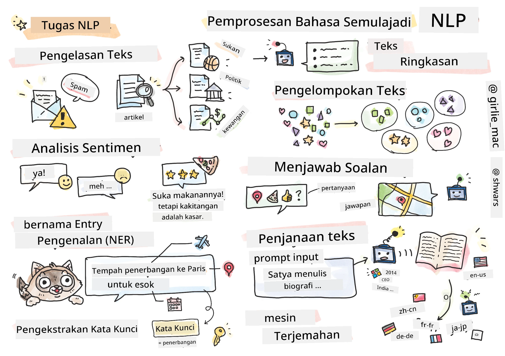

# Pemprosesan Bahasa Semula Jadi



Dalam bahagian ini, kita akan memberi tumpuan kepada penggunaan Rangkaian Neural untuk menangani tugas-tugas berkaitan dengan **Pemprosesan Bahasa Semula Jadi (NLP)**. Terdapat banyak masalah NLP yang kita mahu komputer dapat selesaikan:

* **Klasifikasi teks** adalah masalah klasifikasi biasa yang melibatkan urutan teks. Contohnya termasuk mengklasifikasikan e-mel sebagai spam atau bukan spam, atau mengkategorikan artikel kepada sukan, perniagaan, politik, dan sebagainya. Selain itu, semasa membangunkan bot sembang, kita sering perlu memahami apa yang pengguna ingin sampaikan -- dalam kes ini kita berurusan dengan **klasifikasi niat**. Selalunya, dalam klasifikasi niat, kita perlu menangani banyak kategori.
* **Analisis sentimen** adalah masalah regresi biasa, di mana kita perlu memberikan nombor (sentimen) yang menunjukkan sejauh mana positif/negatif makna sesuatu ayat. Versi yang lebih maju daripada analisis sentimen ialah **analisis sentimen berasaskan aspek** (ABSA), di mana kita memberikan sentimen bukan kepada keseluruhan ayat, tetapi kepada bahagian-bahagian tertentu daripadanya (aspek), contohnya *Di restoran ini, saya suka masakannya, tetapi suasananya sangat teruk*.
* **Pengecaman Entiti Bernama** (NER) merujuk kepada masalah mengekstrak entiti tertentu daripada teks. Sebagai contoh, kita mungkin perlu memahami bahawa dalam frasa *Saya perlu terbang ke Paris esok* perkataan *esok* merujuk kepada TARIKH, dan *Paris* adalah LOKASI.  
* **Pengekstrakan kata kunci** adalah serupa dengan NER, tetapi kita perlu mengekstrak perkataan yang penting kepada makna ayat secara automatik, tanpa latihan awal untuk jenis entiti tertentu.
* **Pengelompokan teks** boleh berguna apabila kita mahu mengumpulkan ayat-ayat yang serupa, contohnya, permintaan yang serupa dalam perbualan sokongan teknikal.
* **Menjawab soalan** merujuk kepada keupayaan model untuk menjawab soalan tertentu. Model menerima petikan teks dan soalan sebagai input, dan ia perlu memberikan tempat dalam teks di mana jawapan kepada soalan itu terkandung (atau, kadangkala, menjana teks jawapan).
* **Penjanaan teks** adalah keupayaan model untuk menjana teks baharu. Ia boleh dianggap sebagai tugas klasifikasi yang meramalkan huruf/perkataan seterusnya berdasarkan beberapa *teks permulaan*. Model penjanaan teks yang maju, seperti GPT-3, mampu menyelesaikan tugas NLP lain seperti klasifikasi menggunakan teknik yang dipanggil [prompt programming](https://towardsdatascience.com/software-3-0-how-prompting-will-change-the-rules-of-the-game-a982fbfe1e0) atau [prompt engineering](https://medium.com/swlh/openai-gpt-3-and-prompt-engineering-dcdc2c5fcd29).
* **Peringkasan teks** adalah teknik apabila kita mahu komputer "membaca" teks panjang dan meringkaskannya dalam beberapa ayat.
* **Terjemahan mesin** boleh dilihat sebagai gabungan pemahaman teks dalam satu bahasa, dan penjanaan teks dalam bahasa lain.

Pada mulanya, kebanyakan tugas NLP diselesaikan menggunakan kaedah tradisional seperti tatabahasa. Sebagai contoh, dalam terjemahan mesin, penghurai digunakan untuk mengubah ayat asal kepada pokok sintaks, kemudian struktur semantik tahap tinggi diekstrak untuk mewakili makna ayat, dan berdasarkan makna ini serta tatabahasa bahasa sasaran, hasilnya dijana. Kini, banyak tugas NLP lebih berkesan diselesaikan menggunakan rangkaian neural.

> Banyak kaedah NLP klasik dilaksanakan dalam perpustakaan Python [Natural Language Processing Toolkit (NLTK)](https://www.nltk.org). Terdapat [Buku NLTK](https://www.nltk.org/book/) yang hebat tersedia dalam talian yang merangkumi cara pelbagai tugas NLP boleh diselesaikan menggunakan NLTK.

Dalam kursus ini, kita akan memberi tumpuan kepada penggunaan Rangkaian Neural untuk NLP, dan kita akan menggunakan NLTK jika diperlukan.

Kita telah mempelajari tentang penggunaan rangkaian neural untuk menangani data tabular dan imej. Perbezaan utama antara jenis data tersebut dan teks ialah teks adalah urutan dengan panjang berubah-ubah, manakala saiz input dalam kes imej diketahui terlebih dahulu. Walaupun rangkaian konvolusi boleh mengekstrak corak daripada data input, corak dalam teks lebih kompleks. Contohnya, kita boleh mempunyai penafian yang dipisahkan daripada subjek oleh banyak perkataan (contohnya, *Saya tidak suka oren*, berbanding *Saya tidak suka oren besar yang berwarna-warni dan sedap*), dan itu masih perlu ditafsirkan sebagai satu corak. Oleh itu, untuk menangani bahasa, kita perlu memperkenalkan jenis rangkaian neural baharu, seperti *rangkaian berulang* dan *transformer*.

## Pasang Perpustakaan

Jika anda menggunakan pemasangan Python tempatan untuk menjalankan kursus ini, anda mungkin perlu memasang semua perpustakaan yang diperlukan untuk NLP menggunakan arahan berikut:

**Untuk PyTorch**
```bash
pip install -r requirements-torch.txt
```
**Untuk TensorFlow**
```bash
pip install -r requirements-tf.txt
```

> Anda boleh mencuba NLP dengan TensorFlow di [Microsoft Learn](https://docs.microsoft.com/learn/modules/intro-natural-language-processing-tensorflow/?WT.mc_id=academic-77998-cacaste)

## Amaran GPU

Dalam bahagian ini, dalam beberapa contoh kita akan melatih model yang agak besar.
* **Gunakan Komputer Berkemampuan GPU**: Adalah disarankan untuk menjalankan buku nota anda pada komputer yang dilengkapi GPU untuk mengurangkan masa menunggu semasa bekerja dengan model besar.
* **Kekangan Memori GPU**: Menjalankan pada GPU mungkin menyebabkan situasi di mana anda kehabisan memori GPU, terutamanya semasa melatih model besar.
* **Penggunaan Memori GPU**: Jumlah memori GPU yang digunakan semasa latihan bergantung pada pelbagai faktor, termasuk saiz minibatch.
* **Kurangkan Saiz Minibatch**: Jika anda menghadapi masalah memori GPU, pertimbangkan untuk mengurangkan saiz minibatch dalam kod anda sebagai penyelesaian yang mungkin.
* **Pelepasan Memori GPU TensorFlow**: Versi lama TensorFlow mungkin tidak melepaskan memori GPU dengan betul semasa melatih beberapa model dalam satu kernel Python. Untuk mengurus penggunaan memori GPU dengan berkesan, anda boleh mengkonfigurasi TensorFlow untuk memperuntukkan memori GPU hanya apabila diperlukan.
* **Penyertaan Kod**: Untuk menetapkan TensorFlow supaya memperuntukkan memori GPU hanya apabila diperlukan, sertakan kod berikut dalam buku nota anda:

```python
physical_devices = tf.config.list_physical_devices('GPU') 
if len(physical_devices)>0:
    tf.config.experimental.set_memory_growth(physical_devices[0], True) 
```

Jika anda berminat untuk mempelajari NLP dari perspektif ML klasik, lawati [siri pelajaran ini](https://github.com/microsoft/ML-For-Beginners/tree/main/6-NLP)

## Dalam Bahagian Ini
Dalam bahagian ini kita akan mempelajari tentang:

* [Mewakili teks sebagai tensor](13-TextRep/README.md)
* [Perwakilan Perkataan](14-Emdeddings/README.md)
* [Pemodelan Bahasa](15-LanguageModeling/README.md)
* [Rangkaian Neural Berulang](16-RNN/README.md)
* [Rangkaian Generatif](17-GenerativeNetworks/README.md)
* [Transformer](18-Transformers/README.md)

---

**Penafian**:  
Dokumen ini telah diterjemahkan menggunakan perkhidmatan terjemahan AI [Co-op Translator](https://github.com/Azure/co-op-translator). Walaupun kami berusaha untuk memastikan ketepatan, sila ambil maklum bahawa terjemahan automatik mungkin mengandungi kesilapan atau ketidaktepatan. Dokumen asal dalam bahasa asalnya harus dianggap sebagai sumber yang berwibawa. Untuk maklumat yang kritikal, terjemahan manusia profesional adalah disyorkan. Kami tidak bertanggungjawab atas sebarang salah faham atau salah tafsir yang timbul daripada penggunaan terjemahan ini.