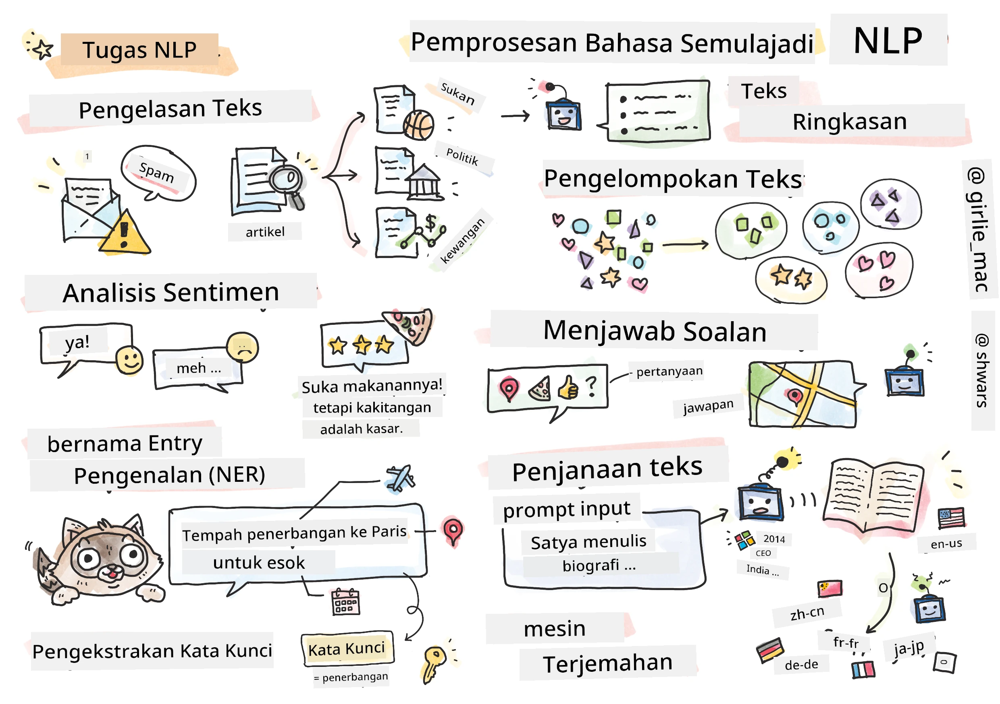

# Pemprosesan Bahasa Semulajadi



Dalam bahagian ini, kita akan menumpukan pada penggunaan Rangkaian Neural untuk mengendalikan tugas berkaitan dengan **Pemprosesan Bahasa Semulajadi (NLP)**. Terdapat banyak masalah NLP yang kita mahu komputer dapat selesaikan:

* **Pengelasan teks** adalah masalah pengelasan tipikal berkaitan urutan teks. Contohnya termasuk mengklasifikasikan mesej e-mel sebagai spam vs. bukan spam, atau mengkategorikan artikel sebagai sukan, perniagaan, politik, dll. Juga, apabila membangunkan bot sembang, kita sering perlu memahami apa yang pengguna ingin sampaikan -- dalam kes ini kita mengendalikan **pengelasan niat**. Sering kali, dalam pengelasan niat kita perlu menangani banyak kategori.
* **Analisis sentimen** adalah masalah regresi tipikal, di mana kita perlu memberikan nombor (sentimen) yang sesuai dengan betapa positif/negatif makna sesuatu ayat. Versi analisis sentimen yang lebih maju ialah **analisis sentimen berasaskan aspek** (ABSA), di mana kita memberikan sentimen bukan kepada keseluruhan ayat, tetapi kepada bahagian-bahagiannya yang berbeza (aspek), contohnya *Di restoran ini, saya suka masakan, tetapi suasananya teruk*.
* **Pengenalan Entiti Bernama** (NER) merujuk kepada masalah mengekstrak entiti tertentu dari teks. Contohnya, kita mungkin perlu memahami bahawa dalam frasa *Saya perlu terbang ke Paris esok* perkataan *esok* merujuk kepada TARIKH, dan *Paris* adalah LOKASI.  
* **Pengekstrakan kata kunci** adalah serupa dengan NER, tetapi kita perlu mengekstrak perkataan penting kepada makna ayat secara automatik, tanpa latihan awal untuk jenis entiti tertentu.
* **Pengkelasan teks** boleh berguna apabila kita mahu mengelompokkan ayat-ayat yang serupa, contohnya, permintaan serupa dalam perbualan sokongan teknikal.
* **Menjawab soalan** merujuk kepada keupayaan model untuk menjawab soalan tertentu. Model menerima petikan teks dan soalan sebagai input, dan ia perlu menyediakan tempat dalam teks di mana jawapan kepada soalan itu terkandung (atau, kadang-kadang, menjana teks jawapan).
* **Penjanaan teks** ialah keupayaan model untuk menghasilkan teks baru. Ia boleh dianggap sebagai tugas pengelasan yang meramalkan huruf/kata seterusnya berdasarkan *prompt teks*. Model penjanaan teks canggih, seperti GPT-3, mampu menyelesaikan tugas NLP lain seperti pengelasan menggunakan teknik yang dipanggil [programming prompt](https://towardsdatascience.com/software-3-0-how-prompting-will-change-the-rules-of-the-game-a982fbfe1e0) atau [kejuruteraan prompt](https://medium.com/swlh/openai-gpt-3-and-prompt-engineering-dcdc2c5fcd29)
* **Rumusan teks** ialah teknik apabila kita mahu komputer "membaca" teks panjang dan merumuskannya dalam beberapa ayat.
* **Terjemahan mesin** boleh dilihat sebagai gabungan pemahaman teks dalam satu bahasa, dan penjanaan teks dalam bahasa lain.

Pada mulanya, kebanyakan tugas NLP diselesaikan menggunakan kaedah tradisional seperti tatabahasa. Contohnya, dalam terjemahan mesin parser digunakan untuk menukar ayat awal menjadi pokok sintaksis, kemudian struktur semantik tahap tinggi diekstrak untuk mewakili makna ayat, dan berdasarkan makna ini dan tatabahasa bahasa sasaran hasil dijana. Kini, banyak tugas NLP diselesaikan dengan lebih berkesan menggunakan rangkaian neural.

> Banyak kaedah NLP klasik dilaksanakan dalam perpustakaan Python [Natural Language Processing Toolkit (NLTK)](https://www.nltk.org). Terdapat [Buku NLTK](https://www.nltk.org/book/) hebat yang tersedia dalam talian yang merangkumi bagaimana tugas NLP yang berbeza boleh diselesaikan menggunakan NLTK.

Dalam kursus kami, kami akan lebih menumpukan pada penggunaan Rangkaian Neural untuk NLP, dan kami akan menggunakan NLTK apabila perlu.

Kami sudah belajar tentang penggunaan rangkaian neural untuk mengendalikan data tabular dan imej. Perbezaan utama antara jenis data tersebut dan teks ialah teks adalah urutan dengan panjang berubah-ubah, manakala saiz input dalam kes imej diketahui terlebih dahulu. Walaupun rangkaian konvolusi boleh mengekstrak corak daripada data input, corak dalam teks adalah lebih kompleks. Contohnya, kita boleh mempunyai penafian yang dipisahkan dari subjek dengan kata-kata sewenang-wenangnya (contoh *Saya tidak suka oren*, berbanding *Saya tidak suka oren besar berwarna-warni yang sedap itu*), dan itu harus tetap ditafsirkan sebagai satu corak. Oleh itu, untuk mengendalikan bahasa kita perlu memperkenalkan jenis rangkaian neural baru, seperti *rangkaian berulang* dan *transformer*.

## Pasang Perpustakaan

Jika anda menggunakan pemasangan Python tempatan untuk menjalankan kursus ini, anda mungkin perlu memasang semua perpustakaan yang diperlukan untuk NLP menggunakan arahan berikut:

**Untuk PyTorch**
```bash
pip install -r requirements-pytorch.txt
```
**Untuk TensorFlow**
```bash
pip install -r requirements-tf.txt
```

> Anda boleh mencuba NLP dengan TensorFlow di [Microsoft Learn](https://docs.microsoft.com/learn/modules/intro-natural-language-processing-tensorflow/?WT.mc_id=academic-77998-cacaste)

## Amaran GPU

Dalam bahagian ini, dalam beberapa contoh kita akan melatih model yang agak besar.
* **Gunakan Komputer yang Mempunyai GPU**: Adalah disyorkan untuk menjalankan notebook anda pada komputer yang dilengkapi GPU untuk mengurangkan masa menunggu apabila bekerja dengan model besar.
* **Keterbatasan Memori GPU**: Menjalankan pada GPU mungkin membawa kepada situasi di mana anda kehabisan memori GPU, terutamanya apabila melatih model besar.
* **Penggunaan Memori GPU**: Jumlah memori GPU yang digunakan semasa latihan bergantung kepada pelbagai faktor, termasuk saiz minibatch.
* **Minimakan Saiz Minibatch**: Jika anda menghadapi masalah memori GPU, pertimbangkan untuk mengurangkan saiz minibatch dalam kod anda sebagai penyelesaian potensi.
* **Pelepasan Memori GPU oleh TensorFlow**: Versi lama TensorFlow mungkin tidak melepaskan memori GPU dengan betul apabila melatih beberapa model dalam satu kernel Python. Untuk menguruskan penggunaan memori GPU dengan berkesan, anda boleh mengkonfigurasi TensorFlow untuk mengalokasikan memori GPU hanya apabila perlu.
* **Penyertaan Kod**: Untuk menetapkan TensorFlow agar memanjangkan pengalokasian memori GPU hanya apabila diperlukan, sertakan kod berikut dalam notebook anda:

```python
physical_devices = tf.config.list_physical_devices('GPU') 
if len(physical_devices)>0:
    tf.config.experimental.set_memory_growth(physical_devices[0], True) 
```

Jika anda berminat untuk belajar tentang NLP dari perspektif ML klasik, lawati [suite pelajaran ini](https://github.com/microsoft/ML-For-Beginners/tree/main/6-NLP)

## Dalam Bahagian Ini
Dalam bahagian ini kita akan belajar tentang:

* [Mewakili teks sebagai tensor](13-TextRep/README.md)
* [Penggantungan Perkataan](14-Embeddings/README.md)
* [Pemodelan Bahasa](15-LanguageModeling/README.md)
* [Rangkaian Neural Berulang](16-RNN/README.md)
* [Rangkaian Generatif](17-GenerativeNetworks/README.md)
* [Transformer](18-Transformers/README.md)

---

<!-- CO-OP TRANSLATOR DISCLAIMER START -->
**Penafian**:
Dokumen ini telah diterjemahkan menggunakan perkhidmatan terjemahan AI [Co-op Translator](https://github.com/Azure/co-op-translator). Walaupun kami berusaha untuk ketepatan, sila ambil maklum bahawa terjemahan automatik mungkin mengandungi kesilapan atau ketidaktepatan. Dokumen asal dalam bahasa asalnya harus dianggap sebagai sumber yang sahih. Untuk maklumat penting, terjemahan oleh manusia profesional adalah disyorkan. Kami tidak bertanggungjawab terhadap sebarang salah faham atau salah tafsir yang timbul daripada penggunaan terjemahan ini.
<!-- CO-OP TRANSLATOR DISCLAIMER END -->