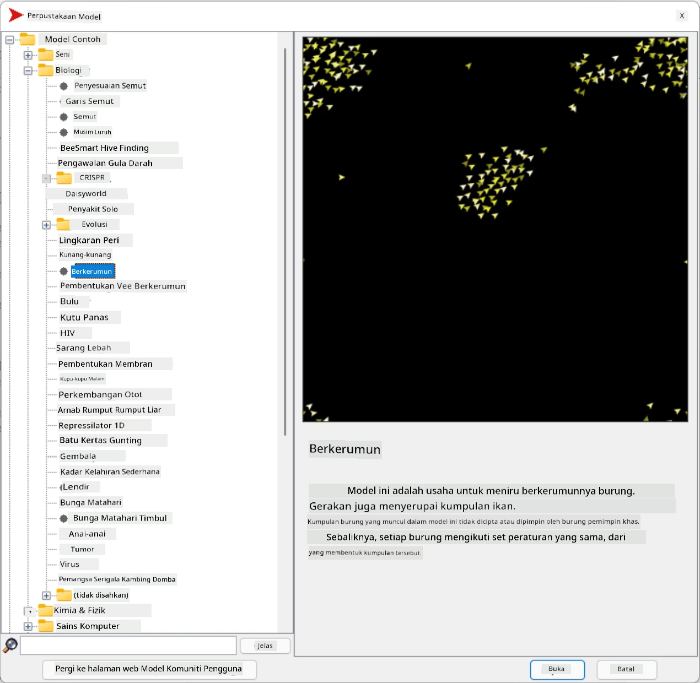
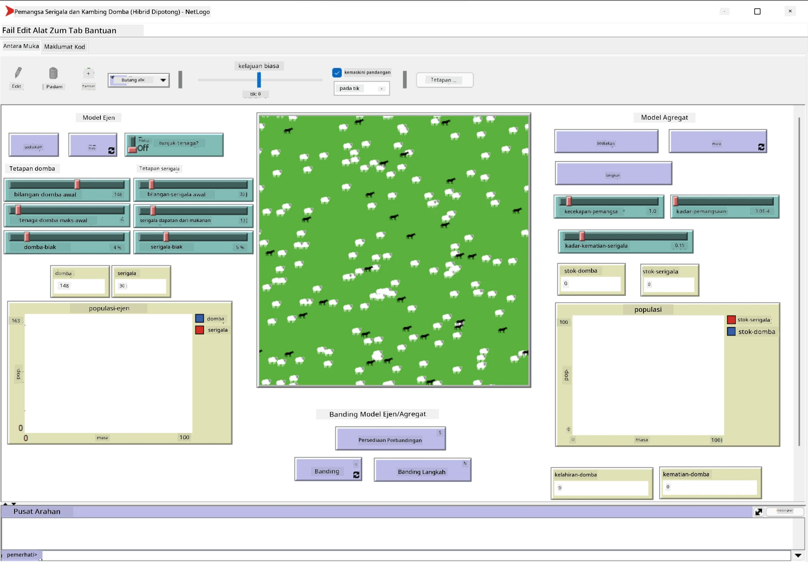

# Sistem Multi-Ejen

Salah satu cara untuk mencapai kecerdasan adalah melalui pendekatan **emergent** (atau **sinergi**), yang berdasarkan fakta bahawa gabungan tingkah laku banyak ejen yang agak mudah boleh menghasilkan tingkah laku sistem keseluruhan yang lebih kompleks (atau pintar). Secara teori, ini berdasarkan prinsip [Kecerdasan Kolektif](https://en.wikipedia.org/wiki/Collective_intelligence), [Emergentisme](https://en.wikipedia.org/wiki/Global_brain) dan [Sibernetik Evolusi](https://en.wikipedia.org/wiki/Global_brain), yang menyatakan bahawa sistem tahap tinggi memperoleh nilai tambah apabila digabungkan dengan betul daripada sistem tahap rendah (dikenali sebagai *prinsip peralihan metasistem*).

## [Kuiz Pra-Kuliah](https://ff-quizzes.netlify.app/en/ai/quiz/45)

Arah **Sistem Multi-Ejen** muncul dalam AI pada tahun 1990-an sebagai tindak balas kepada pertumbuhan Internet dan sistem teragih. Salah satu buku teks AI klasik, [Artificial Intelligence: A Modern Approach](https://en.wikipedia.org/wiki/Artificial_Intelligence:_A_Modern_Approach), memberi tumpuan kepada pandangan AI klasik dari sudut pandangan sistem multi-ejen.

Konsep utama dalam pendekatan Multi-ejen adalah **Ejen** - entiti yang hidup dalam **persekitaran** tertentu, yang boleh diperhatikan dan bertindak ke atasnya. Ini adalah definisi yang sangat luas, dan terdapat pelbagai jenis dan klasifikasi ejen:

* Berdasarkan keupayaan mereka untuk berfikir:
   - **Ejen Reaktif** biasanya mempunyai tingkah laku jenis permintaan-tindak balas yang mudah
   - **Ejen Deliberatif** menggunakan beberapa jenis penaakulan logik dan/atau keupayaan perancangan
* Berdasarkan tempat ejen melaksanakan kodnya:
   - **Ejen Statik** berfungsi pada nod rangkaian yang khusus
   - **Ejen Mudah Alih** boleh memindahkan kod mereka antara nod rangkaian
* Berdasarkan tingkah laku mereka:
   - **Ejen Pasif** tidak mempunyai matlamat tertentu. Ejen seperti ini boleh bertindak balas terhadap rangsangan luaran, tetapi tidak akan memulakan sebarang tindakan sendiri.
   - **Ejen Aktif** mempunyai beberapa matlamat yang mereka kejar
   - **Ejen Kognitif** melibatkan perancangan dan penaakulan yang kompleks

Sistem multi-ejen kini digunakan dalam pelbagai aplikasi:

* Dalam permainan, banyak watak bukan pemain menggunakan beberapa jenis AI, dan boleh dianggap sebagai ejen pintar
* Dalam penghasilan video, pemaparan adegan 3D kompleks yang melibatkan orang ramai biasanya dilakukan menggunakan simulasi multi-ejen
* Dalam pemodelan sistem, pendekatan multi-ejen digunakan untuk mensimulasikan tingkah laku model yang kompleks. Sebagai contoh, pendekatan multi-ejen telah berjaya digunakan untuk meramalkan penyebaran penyakit COVID-19 di seluruh dunia. Pendekatan serupa boleh digunakan untuk memodelkan trafik di bandar, dan melihat bagaimana ia bertindak balas terhadap perubahan peraturan trafik.
* Dalam sistem automasi kompleks, setiap peranti boleh bertindak sebagai ejen bebas, yang menjadikan keseluruhan sistem kurang monolitik dan lebih kukuh.

Kita tidak akan menghabiskan banyak masa untuk mendalami sistem multi-ejen, tetapi akan mempertimbangkan satu contoh **Pemodelan Multi-Ejen**.

## NetLogo

[NetLogo](https://ccl.northwestern.edu/netlogo/) adalah persekitaran pemodelan multi-ejen berdasarkan versi yang diubah suai daripada bahasa pengaturcaraan [Logo](https://en.wikipedia.org/wiki/Logo_(programming_language)). Bahasa ini dibangunkan untuk mengajar konsep pengaturcaraan kepada kanak-kanak, dan ia membolehkan anda mengawal ejen yang dipanggil **turtle**, yang boleh bergerak dan meninggalkan jejak di belakangnya. Ini membolehkan penciptaan bentuk geometri yang kompleks, yang merupakan cara yang sangat visual untuk memahami tingkah laku ejen.

Dalam NetLogo, kita boleh mencipta banyak turtle menggunakan arahan `create-turtles`. Kita kemudian boleh mengarahkan semua turtle untuk melakukan beberapa tindakan (dalam contoh di bawah - bergerak 10 titik ke hadapan):

```
create-turtles 10
ask turtles [
  forward 10
]
```

Sudah tentu, ia tidak menarik apabila semua turtle melakukan perkara yang sama, jadi kita boleh `ask` kumpulan turtle, contohnya mereka yang berada di sekitar titik tertentu. Kita juga boleh mencipta turtle daripada *jenis* yang berbeza menggunakan arahan `breed [cats cat]`. Di sini `cat` adalah nama jenis, dan kita perlu menentukan kedua-dua perkataan tunggal dan jamak, kerana arahan yang berbeza menggunakan bentuk yang berbeza untuk kejelasan.

> ✅ Kita tidak akan mempelajari bahasa NetLogo itu sendiri - anda boleh melawat sumber yang hebat [Beginner's Interactive NetLogo Dictionary](https://ccl.northwestern.edu/netlogo/bind/) jika anda berminat untuk belajar lebih lanjut.

Anda boleh [muat turun](https://ccl.northwestern.edu/netlogo/download.shtml) dan pasang NetLogo untuk mencubanya.

### Perpustakaan Model

Satu perkara hebat tentang NetLogo ialah ia mengandungi perpustakaan model yang berfungsi yang boleh anda cuba. Pergi ke **File &rightarrow; Models Library**, dan anda mempunyai banyak kategori model untuk dipilih.



> Tangkapan skrin perpustakaan model oleh Dmitry Soshnikov

Anda boleh membuka salah satu model, contohnya **Biology &rightarrow; Flocking**.

### Prinsip Utama

Selepas membuka model, anda akan dibawa ke skrin utama NetLogo. Berikut adalah contoh model yang menerangkan populasi serigala dan kambing, dengan sumber yang terhad (rumput).



> Tangkapan skrin oleh Dmitry Soshnikov

Pada skrin ini, anda boleh melihat:

* Bahagian **Interface** yang mengandungi:
  - Medan utama, tempat semua ejen tinggal
  - Kawalan yang berbeza: butang, slider, dll.
  - Graf yang boleh anda gunakan untuk memaparkan parameter simulasi
* Tab **Code** yang mengandungi editor, tempat anda boleh menaip program NetLogo

Dalam kebanyakan kes, antara muka akan mempunyai butang **Setup**, yang memulakan keadaan simulasi, dan butang **Go** yang memulakan pelaksanaan. Kedua-duanya dikendalikan oleh pengendali yang sepadan dalam kod yang kelihatan seperti ini:

```
to go [
...
]
```

Dunia NetLogo terdiri daripada objek berikut:

* **Ejen** (turtle) yang boleh bergerak di seluruh medan dan melakukan sesuatu. Anda mengarahkan ejen menggunakan sintaks `ask turtles [...]`, dan kod dalam kurungan dilaksanakan oleh semua ejen dalam *mod turtle*.
* **Patch** adalah kawasan segi empat medan, tempat ejen tinggal. Anda boleh merujuk kepada semua ejen pada patch yang sama, atau anda boleh menukar warna patch dan beberapa sifat lain. Anda juga boleh `ask patches` untuk melakukan sesuatu.
* **Pemerhati** adalah ejen unik yang mengawal dunia. Semua pengendali butang dilaksanakan dalam *mod pemerhati*.

> ✅ Keindahan persekitaran multi-ejen ialah kod yang berjalan dalam mod turtle atau mod patch dilaksanakan pada masa yang sama oleh semua ejen secara selari. Oleh itu, dengan menulis sedikit kod dan memprogramkan tingkah laku ejen individu, anda boleh mencipta tingkah laku kompleks sistem simulasi secara keseluruhan.

### Flocking

Sebagai contoh tingkah laku multi-ejen, mari kita pertimbangkan **[Flocking](https://en.wikipedia.org/wiki/Flocking_(behavior))**. Flocking adalah corak kompleks yang sangat mirip dengan cara sekumpulan burung terbang. Melihat mereka terbang, anda mungkin berfikir bahawa mereka mengikuti sejenis algoritma kolektif, atau bahawa mereka memiliki beberapa bentuk *kecerdasan kolektif*. Walau bagaimanapun, tingkah laku kompleks ini timbul apabila setiap ejen individu (dalam kes ini, seekor *burung*) hanya memerhatikan beberapa ejen lain dalam jarak dekat daripadanya, dan mengikuti tiga peraturan mudah:

* **Penyelarasan** - ia mengarah ke arah purata hala tuju ejen jiran
* **Kohesi** - ia cuba mengarah ke arah purata kedudukan jiran (*tarikan jarak jauh*)
* **Pemisahan** - apabila terlalu dekat dengan burung lain, ia cuba menjauhkan diri (*penolakan jarak dekat*)

Anda boleh menjalankan contoh flocking dan memerhatikan tingkah laku. Anda juga boleh melaraskan parameter, seperti *darjah pemisahan*, atau *jarak penglihatan*, yang menentukan sejauh mana setiap burung boleh melihat. Perhatikan bahawa jika anda mengurangkan jarak penglihatan kepada 0, semua burung menjadi buta, dan flocking berhenti. Jika anda mengurangkan pemisahan kepada 0, semua burung berkumpul dalam satu barisan lurus.

> ✅ Beralih ke tab **Code** dan lihat di mana tiga peraturan flocking (penyelarasan, kohesi dan pemisahan) dilaksanakan dalam kod. Perhatikan bagaimana kita hanya merujuk kepada ejen yang berada dalam jarak penglihatan.

### Model Lain untuk Dilihat

Terdapat beberapa model menarik lagi yang boleh anda cuba:

* **Art &rightarrow; Fireworks** menunjukkan bagaimana bunga api boleh dianggap sebagai tingkah laku kolektif aliran api individu
* **Social Science &rightarrow; Traffic Basic** dan **Social Science &rightarrow; Traffic Grid** menunjukkan model trafik bandar dalam Grid 1D dan 2D dengan atau tanpa lampu isyarat. Setiap kereta dalam simulasi mengikuti peraturan berikut:
   - Jika ruang di hadapannya kosong - mempercepatkan (sehingga kelajuan maksimum tertentu)
   - Jika ia melihat halangan di hadapan - brek (dan anda boleh melaraskan sejauh mana pemandu boleh melihat)
* **Social Science &rightarrow; Party** menunjukkan bagaimana orang berkumpul semasa pesta koktel. Anda boleh mencari kombinasi parameter yang membawa kepada peningkatan kebahagiaan kumpulan yang paling cepat.

Seperti yang anda lihat daripada contoh-contoh ini, simulasi multi-ejen boleh menjadi cara yang sangat berguna untuk memahami tingkah laku sistem kompleks yang terdiri daripada individu yang mengikuti logik yang sama atau serupa. Ia juga boleh digunakan untuk mengawal ejen maya, seperti [NPC](https://en.wikipedia.org/wiki/NPC) dalam permainan komputer, atau ejen dalam dunia animasi 3D.

## Ejen Deliberatif

Ejen yang diterangkan di atas sangat mudah, bertindak balas terhadap perubahan dalam persekitaran menggunakan beberapa jenis algoritma. Oleh itu, mereka adalah **ejen reaktif**. Walau bagaimanapun, kadangkala ejen boleh berfikir dan merancang tindakan mereka, dalam hal ini mereka dipanggil **deliberatif**.

Contoh biasa ialah ejen peribadi yang menerima arahan daripada manusia untuk menempah pakej percutian. Katakan terdapat banyak ejen yang tinggal di internet, yang boleh membantunya. Ia kemudian harus menghubungi ejen lain untuk melihat penerbangan yang tersedia, harga hotel untuk tarikh yang berbeza, dan cuba merundingkan harga terbaik. Apabila rancangan percutian selesai dan disahkan oleh pemiliknya, ia boleh meneruskan tempahan.

Untuk melakukan itu, ejen perlu **berkomunikasi**. Untuk komunikasi yang berjaya, mereka memerlukan:

* Beberapa **bahasa standard untuk bertukar pengetahuan**, seperti [Knowledge Interchange Format](https://en.wikipedia.org/wiki/Knowledge_Interchange_Format) (KIF) dan [Knowledge Query and Manipulation Language](https://en.wikipedia.org/wiki/Knowledge_Query_and_Manipulation_Language) (KQML). Bahasa-bahasa ini direka berdasarkan [Teori Tindakan Ucapan](https://en.wikipedia.org/wiki/Speech_act).
* Bahasa-bahasa tersebut juga harus merangkumi beberapa **protokol untuk rundingan**, berdasarkan pelbagai **jenis lelongan**.
* **Ontologi bersama** untuk digunakan, supaya mereka merujuk kepada konsep yang sama dengan mengetahui semantik mereka
* Cara untuk **menemui** apa yang boleh dilakukan oleh ejen yang berbeza, juga berdasarkan beberapa jenis ontologi

Ejen deliberatif jauh lebih kompleks daripada ejen reaktif, kerana mereka bukan sahaja bertindak balas terhadap perubahan dalam persekitaran, mereka juga harus dapat *memulakan* tindakan. Salah satu seni bina yang dicadangkan untuk ejen deliberatif ialah ejen Belief-Desire-Intention (BDI):

* **Kepercayaan** membentuk satu set pengetahuan tentang persekitaran ejen. Ia boleh disusun sebagai pangkalan pengetahuan atau set peraturan yang boleh digunakan oleh ejen untuk situasi tertentu dalam persekitaran.
* **Keinginan** menentukan apa yang ejen ingin lakukan, iaitu matlamatnya. Sebagai contoh, matlamat ejen pembantu peribadi di atas adalah untuk menempah pakej percutian, dan matlamat ejen hotel adalah untuk memaksimumkan keuntungan.
* **Niat** adalah tindakan khusus yang dirancang oleh ejen untuk mencapai matlamatnya. Tindakan biasanya mengubah persekitaran dan menyebabkan komunikasi dengan ejen lain.

Terdapat beberapa platform yang tersedia untuk membina sistem multi-ejen, seperti [JADE](https://jade.tilab.com/). [Makalah ini](https://arxiv.org/ftp/arxiv/papers/2007/2007.08961.pdf) mengandungi ulasan tentang platform multi-ejen, bersama-sama dengan sejarah ringkas sistem multi-ejen dan senario penggunaannya yang berbeza.

## Kesimpulan

Sistem Multi-Ejen boleh mengambil pelbagai bentuk dan digunakan dalam banyak aplikasi yang berbeza. 
Kesemuanya cenderung memberi tumpuan kepada tingkah laku individu ejen yang lebih mudah, dan mencapai tingkah laku sistem keseluruhan yang lebih kompleks disebabkan oleh **kesan sinergi**.

## 🚀 Cabaran

Bawa pelajaran ini ke dunia nyata dan cuba konseptualisasikan sistem multi-ejen yang boleh menyelesaikan masalah. Apa, sebagai contoh, yang perlu dilakukan oleh sistem multi-ejen untuk mengoptimumkan laluan bas sekolah? Bagaimana ia boleh berfungsi di sebuah kedai roti?

## [Kuiz Pasca-Kuliah](https://ff-quizzes.netlify.app/en/ai/quiz/46)

## Kajian & Pembelajaran Kendiri

Kajian penggunaan jenis sistem ini dalam industri. Pilih satu domain seperti pembuatan atau industri permainan video dan temui bagaimana sistem multi-ejen boleh digunakan untuk menyelesaikan masalah unik.

## [Tugasan NetLogo](assignment.md)

---

