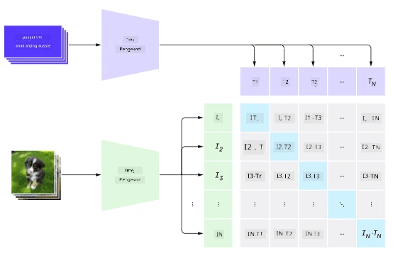
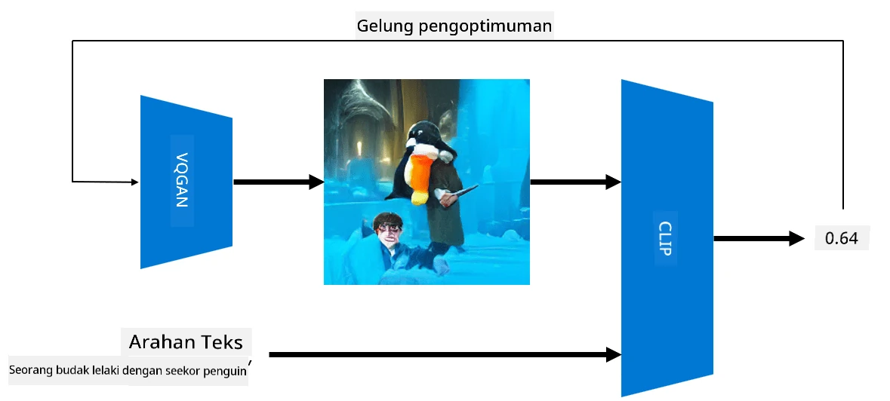

# Rangkaian Multi-Mod

Selepas kejayaan model transformer dalam menyelesaikan tugas NLP, seni bina yang sama atau serupa telah digunakan untuk tugas penglihatan komputer. Terdapat minat yang semakin meningkat untuk membina model yang dapat *menggabungkan* keupayaan penglihatan dan bahasa semula jadi. Salah satu usaha tersebut dilakukan oleh OpenAI, dan ia dikenali sebagai CLIP dan DALL.E.

## Latihan Awal Imej Kontrastif (CLIP)

Idea utama CLIP adalah untuk membandingkan arahan teks dengan imej dan menentukan sejauh mana imej tersebut sesuai dengan arahan.

> *Gambar dari [catatan blog ini](https://openai.com/blog/clip/)*

Model ini dilatih menggunakan imej yang diperoleh dari Internet dan kapsyen mereka. Untuk setiap kumpulan, kita mengambil N pasangan (imej, teks), dan menukarkannya kepada beberapa representasi vektor I, ..., I / T, ..., T. Representasi tersebut kemudian dipadankan bersama. Fungsi kehilangan ditakrifkan untuk memaksimumkan keserupaan kosinus antara vektor yang sepadan dengan satu pasangan (contohnya I dan T), dan meminimumkan keserupaan kosinus antara semua pasangan lain. Itulah sebabnya pendekatan ini dipanggil **kontrastif**.

Model/pustaka CLIP tersedia dari [GitHub OpenAI](https://github.com/openai/CLIP). Pendekatan ini diterangkan dalam [catatan blog ini](https://openai.com/blog/clip/), dan dengan lebih terperinci dalam [kertas ini](https://arxiv.org/pdf/2103.00020.pdf).

Setelah model ini dilatih awal, kita boleh memberikannya sekumpulan imej dan sekumpulan arahan teks, dan ia akan mengembalikan tensor dengan kebarangkalian. CLIP boleh digunakan untuk beberapa tugas:

**Klasifikasi Imej**

Katakan kita perlu mengklasifikasikan imej antara, contohnya, kucing, anjing dan manusia. Dalam kes ini, kita boleh memberikan model imej, dan satu siri arahan teks: "*gambar seekor kucing*", "*gambar seekor anjing*", "*gambar seorang manusia*". Dalam vektor kebarangkalian yang dihasilkan, kita hanya perlu memilih indeks dengan nilai tertinggi.

> *Gambar dari [catatan blog ini](https://openai.com/blog/clip/)*

**Carian Imej Berdasarkan Teks**

Kita juga boleh melakukan sebaliknya. Jika kita mempunyai koleksi imej, kita boleh memberikan koleksi ini kepada model, dan satu arahan teks - ini akan memberikan kita imej yang paling serupa dengan arahan yang diberikan.

## ✍️ Contoh: [Menggunakan CLIP untuk Klasifikasi Imej dan Carian Imej](Clip.ipynb)

Buka buku nota [Clip.ipynb](Clip.ipynb) untuk melihat CLIP beraksi.

## Penjanaan Imej dengan VQGAN+CLIP

CLIP juga boleh digunakan untuk **penjanaan imej** daripada arahan teks. Untuk melakukan ini, kita memerlukan **model penjana** yang dapat menghasilkan imej berdasarkan input vektor tertentu. Salah satu model tersebut dipanggil [VQGAN](https://compvis.github.io/taming-transformers/) (Vector-Quantized GAN).

Idea utama VQGAN yang membezakannya daripada [GAN](../../4-ComputerVision/10-GANs/README.md) biasa adalah seperti berikut:
* Menggunakan seni bina transformer autoregresif untuk menghasilkan urutan bahagian visual yang kaya konteks yang membentuk imej. Bahagian visual tersebut dipelajari oleh [CNN](../../4-ComputerVision/07-ConvNets/README.md).
* Menggunakan diskriminator sub-imej yang mengesan sama ada bahagian imej adalah "nyata" atau "palsu" (berbeza dengan pendekatan "semua atau tiada" dalam GAN tradisional).

Ketahui lebih lanjut tentang VQGAN di laman web [Taming Transformers](https://compvis.github.io/taming-transformers/).

Salah satu perbezaan penting antara VQGAN dan GAN tradisional ialah yang terakhir boleh menghasilkan imej yang baik daripada sebarang vektor input, manakala VQGAN cenderung menghasilkan imej yang tidak koheren. Oleh itu, kita perlu membimbing proses penciptaan imej dengan lebih lanjut, dan itu boleh dilakukan menggunakan CLIP.

Untuk menghasilkan imej yang sepadan dengan arahan teks, kita bermula dengan beberapa vektor pengekodan rawak yang dihantar melalui VQGAN untuk menghasilkan imej. Kemudian CLIP digunakan untuk menghasilkan fungsi kehilangan yang menunjukkan sejauh mana imej tersebut sesuai dengan arahan teks. Matlamatnya kemudian adalah untuk meminimumkan kehilangan ini, menggunakan propagasi balik untuk menyesuaikan parameter vektor input.

Pustaka hebat yang melaksanakan VQGAN+CLIP ialah [Pixray](http://github.com/pixray/pixray).

 |   | 
----|----|----
Gambar yang dihasilkan daripada arahan *potret closeup cat air guru lelaki muda dalam bidang kesusasteraan dengan sebuah buku* | Gambar yang dihasilkan daripada arahan *potret closeup minyak guru wanita muda dalam bidang sains komputer dengan sebuah komputer* | Gambar yang dihasilkan daripada arahan *potret closeup minyak guru lelaki tua dalam bidang matematik di hadapan papan hitam*

> Gambar dari koleksi **Artificial Teachers** oleh [Dmitry Soshnikov](http://soshnikov.com)

## DALL-E
### [DALL-E 1](https://openai.com/research/dall-e)
DALL-E ialah versi GPT-3 yang dilatih untuk menghasilkan imej daripada arahan. Ia telah dilatih dengan 12 bilion parameter.

Berbeza dengan CLIP, DALL-E menerima kedua-dua teks dan imej sebagai satu aliran token untuk kedua-dua imej dan teks. Oleh itu, daripada pelbagai arahan, anda boleh menghasilkan imej berdasarkan teks.

### [DALL-E 2](https://openai.com/dall-e-2)
Perbezaan utama antara DALL.E 1 dan 2 ialah ia menghasilkan imej dan seni yang lebih realistik.

Contoh penjanaan imej dengan DALL-E:
 |   | 
----|----|----
Gambar yang dihasilkan daripada arahan *potret closeup cat air guru lelaki muda dalam bidang kesusasteraan dengan sebuah buku* | Gambar yang dihasilkan daripada arahan *potret closeup minyak guru wanita muda dalam bidang sains komputer dengan sebuah komputer* | Gambar yang dihasilkan daripada arahan *potret closeup minyak guru lelaki tua dalam bidang matematik di hadapan papan hitam*

## Rujukan

* Kertas VQGAN: [Taming Transformers for High-Resolution Image Synthesis](https://compvis.github.io/taming-transformers/paper/paper.pdf)
* Kertas CLIP: [Learning Transferable Visual Models From Natural Language Supervision](https://arxiv.org/pdf/2103.00020.pdf)

---

**Penafian**:  
Dokumen ini telah diterjemahkan menggunakan perkhidmatan terjemahan AI [Co-op Translator](https://github.com/Azure/co-op-translator). Walaupun kami berusaha untuk memastikan ketepatan, sila ambil perhatian bahawa terjemahan automatik mungkin mengandungi kesilapan atau ketidaktepatan. Dokumen asal dalam bahasa asalnya harus dianggap sebagai sumber yang berwibawa. Untuk maklumat penting, terjemahan manusia profesional adalah disyorkan. Kami tidak bertanggungjawab atas sebarang salah faham atau salah tafsir yang timbul daripada penggunaan terjemahan ini.