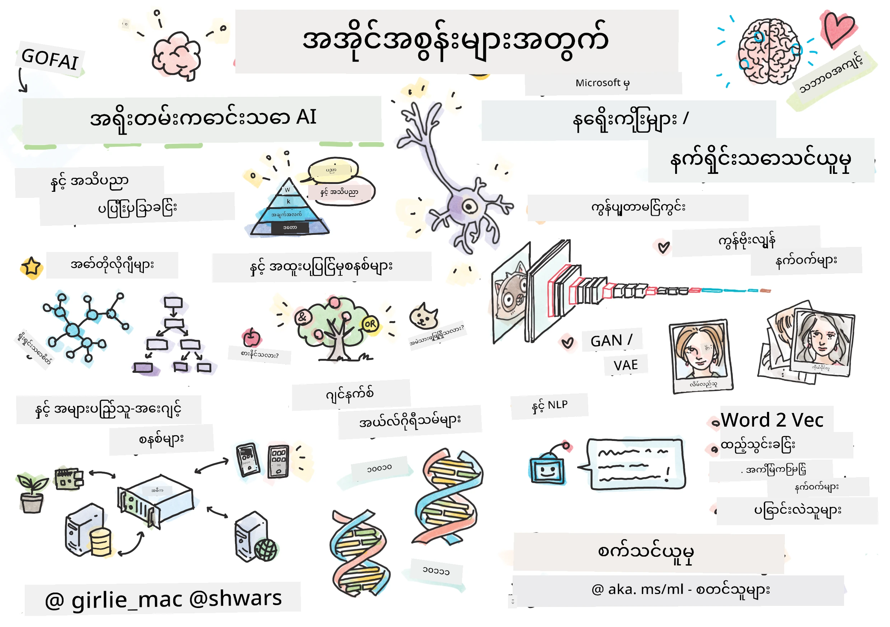

[](https://github.com/microsoft/AI-For-Beginners/blob/main/LICENSE)
[](https://GitHub.com/microsoft/AI-For-Beginners/graphs/contributors/)
[](https://GitHub.com/microsoft/AI-For-Beginners/issues/)
[](https://GitHub.com/microsoft/AI-For-Beginners/pulls/)
[](http://makeapullrequest.com)

[](https://GitHub.com/microsoft/AI-For-Beginners/watchers/)
[](https://GitHub.com/microsoft/AI-For-Beginners/network/)
[](https://GitHub.com/microsoft/AI-For-Beginners/stargazers/)
[](https://mybinder.org/v2/gh/microsoft/ai-for-beginners/HEAD)
[](https://gitter.im/Microsoft/ai-for-beginners?utm_source=badge&utm_medium=badge&utm_campaign=pr-badge)

[](https://discord.gg/nTYy5BXMWG)

# ကလေ့လာသူများအတွက် အနှစ်သာရ ဒစ်ဂျစ်တယ် ဉာဏ်ရည်

||
|:---:|
| ကလေ့လာသူများအတွက် အနှစ်သာရ ဒစ်ဂျစ်တယ် ဉာဏ်ရည် - _Sketchnote by [@girlie_mac](https://twitter.com/girlie_mac)_ |

**အတတ်ပညာရေး သင်တန်း၊ စကယ်တင် ၂၄ ခန်းခွဲ၊ ၁၂ ပတ်ကြာသည့် အစီအစဉ်**ဖြင့် **အတုယူသော ဉာဏ်ရည်** (AI) ၏ ကမ္ဘာကြီးကို ရှာဖွေလေ့လာပါ! ၎င်းတွင် လက်တွေ့သင်ခန်းစာများ၊ စစ်ဆေးမှုများ နှင့် လက်တွေ့လေ့ကျင့်ခန်းများ ပါဝင်ပါသည်။ သင်တန်းအစီအစဉ်သည် စတင်သူများအတွက် သင့်လျော်ပြီး TensorFlow နှင့် PyTorch ကဲ့သို့သော တူတူ ပရိုဂရမ်များကိုပါ ပါဝင်သည်၊ ထို့အပြင် AI အတွင်း ပြည့်ပေးသည့် တရားထောင်ရေးကဏ္ဍများပါ ပါဝင်သည်။


### 🌐 ဘာသာစကားစုံထောက်ပံ့မှု

#### GitHub Action ဖြင့် ထောက်ပံ့ထားသည် ( အလိုအလျောက် နှင့် အမြဲ အသစ်)

<!-- CO-OP TRANSLATOR LANGUAGES TABLE START -->
[အာရဗီ](../ar/README.md) | [ဘင်္ဂလီ](../bn/README.md) | [ဘူလ်ဂေးရီးယား](../bg/README.md) | [မြန်မာ (Myanmar)](./README.md) | [တရုတ် (ရိုးရှင်း)](../zh-CN/README.md) | [တရုတ် (ရိုးရာ၊ ဟောင်ကောင်)](../zh-HK/README.md) | [တရုတ် (ရိုးရာ၊ မာကောင်)](../zh-MO/README.md) | [တရုတ် (ရိုးရာ၊ ထိုင်ဝမ်)](../zh-TW/README.md) | [ခရိုအေးရှီးယား](../hr/README.md) | [ချက်](../cs/README.md) | [ဒိန်မတ်](../da/README.md) | [ဒတ်ချ်](../nl/README.md) | [အက်စတိုးနီးယား](../et/README.md) | [ဖင်နီရှ်](../fi/README.md) | [ပြင်သစ်](../fr/README.md) | [ဂျာမန်](../de/README.md) | [ဂရိ](../el/README.md) | [ဟီဘရူး](../he/README.md) | [ဟိंदी](../hi/README.md) | [ဟန်ဂါရီ](../hu/README.md) | [အင်ဒိုနီးရှား](../id/README.md) | [အီတလီ](../it/README.md) | [ဂျပန်](../ja/README.md) | [ကန်နာဒါ](../kn/README.md) | [ကိုရီးယား](../ko/README.md) | [လီကျူၤနီးယား](../lt/README.md) | [မလေး](../ms/README.md) | [မလေးလမ်](../ml/README.md) | [မရာသီး](../mr/README.md) | [နီပေါလိ](../ne/README.md) | [နိုင်းဂျီးရီးယား ပစ်ဂင်](../pcm/README.md) | [နော်ဝေး](../no/README.md) | [ပါရှင်း (ဖာစီ)](../fa/README.md) | [ပိုလန်](../pl/README.md) | [ပေါ်တူဂီ (ဘရာဇီးလ်)](../pt-BR/README.md) | [ပေါ်တူဂီ (ပေါ်တူဂီ)](../pt-PT/README.md) | [ပန်ဂျာဘီ (ဂူရ်မူခီ)](../pa/README.md) | [ဆိုမေးနီးယား](../ro/README.md) | [ရုရှား](../ru/README.md) | [ဆာဘီးယား (စိရီလစ်)](../sr/README.md) | [ဆိုဗက်](../sk/README.md) | [ဆိုဗေးနီးယား](../sl/README.md) | [စပိန်](../es/README.md) | [ဆွာဟီလီ](../sw/README.md) | [ဆွီဒင်](../sv/README.md) | [တဂါလို (ဖီလစ်ပိုင်)](../tl/README.md) | [တမီး](../ta/README.md) | [တယ်လူဂူ](../te/README.md) | [ထိုင်း](../th/README.md) | [တာကီး](../tr/README.md) | [ယူကရိန်း](../uk/README.md) | [ဥရဒူး](../ur/README.md) | [ဗီယက်နမ်](../vi/README.md)

> **ဒေသန္တရ အဖြစ် တိုက်ရိုက် Clone လုပ်ရန် မျှော်လင့်ပါသလား?**

> ဒီ repository တွင်ဘာသာစကား ၅၀ ကျော် ပါဝင်ပြီး ဒေါင်းလုပ် အရွယ်အစားကို များစေသည်။ ဘာသာပြန်ချက်များ မပါဝင်ဘဲ မတင်ချင်လျှင် sparse checkout ကို သုံးပါ:
> ```bash
> git clone --filter=blob:none --sparse https://github.com/microsoft/AI-For-Beginners.git
> cd AI-For-Beginners
> git sparse-checkout set --no-cone '/*' '!translations' '!translated_images'
> ```
> သင့်အား သင်တန်းကုတ်ကို အချိန်အတိုင်းအတာမှန်ကန်စွာ ပြီးမြောက်မှုမှာ အလျင်မြန်စေပါသည်။
<!-- CO-OP TRANSLATOR LANGUAGES TABLE END -->

**ထပ်မံလိုအပ်သော ဘာသာစကားများထောက်ပံ့နိုင်ရန် ကြိုးစားသင့်ပါက [ဒီနေရာမှာ](https://github.com/Azure/co-op-translator/blob/main/getting_started/supported-languages.md) ကြည့်ရှုနိုင်ပါသည်။**

## အသိုင်းအဝိုင်း၌ ပါဝင်ရန်
[](https://discord.gg/nTYy5BXMWG)

## သင်ယူလေ့လာရမည့်အရာများ

**[သင်တန်း၏ စိတ်ဓာတ်မြေပုံ](http://soshnikov.com/courses/ai-for-beginners/mindmap.html)**

ဤသင်တန်းအစီအစဉ်တွင် သင်လေ့လာမည့်အရာများမှာ-

* အတုယူသော ဉာဏ်ရည်၏ အမျိုးမျိုးနည်းလမ်းများ၊ အထူးသဖြင့် **နေရာထားမှုအသိပညာ** (Knowledge Representation) နှင့် သဘောတရားစဉ်းစားခြင်း ပါဝင်သော ရိုးရာ သင်္ကေတနည်းလမ်း ([GOFAI](https://en.wikipedia.org/wiki/Symbolic_artificial_intelligence))။
* ခေတ်မှီ AI ၏ အခြေခံဖြစ်သည့် **အကြောင်းအရာကွန်ရက်များ**နှင့် **နက်ရှိုင်းသင်ကြားခြင်း**။ TensorFlow နှင့် PyTorch တို့ဖြင့် အဓိကသဘောများကို ကုဒ်ဖြင့် ဖော်ပြပါမည်။
* ပုံရိပ်များနှင့် စာသားများနှင့် လုပ်ကိုင်နိုင်သော **နက်ရှိုင်းဖွဲ့စည်းတည်ဆောက်ပုံများ**။ နောက်ဆုံးပေါ် ပုံစံများကို အကျဉ်းတင်ဖြစ်စေသော်လည်း နည်းနည်း အားနည်းနိုင်ပါသည်။
* နည်းနည်း နာမည်မကြီးသော AI နည်းလမ်းများ၊ ဥပမာ **ဂျီနက်ဆစ် အယ်လဂို့ရီသမ်များ**နှင့် **အများ Agent System များ**။

ဤသင်တန်းနောက် ထည့်မည်မဟုတ်သော အရာများ-

> [Microsoft Learn တွင် ဤသင်တန်း၏ ထပ်ဆောင်းအရင်းအမြစ်များအားလုံးကို ရှာဖွေပါ](https://learn.microsoft.com/en-us/collections/7w28iy2xrqzdj0?WT.mc_id=academic-77998-bethanycheum)

* **စီးပွားရေးလုပ်ငန်းတွင် AI အသုံးပြုမှု** ၏ စီးပွားရေးကိစ္စများ။ Microsoft Learn တွင် [စီးပွားရေးအသုံးပြုသူများအတွက် AI မိတ်ဆက်](https://docs.microsoft.com/learn/paths/introduction-ai-for-business-users/?WT.mc_id=academic-77998-bethanycheum) သင်တန်းလမ်းကြောင်း သို့မဟုတ် [AI စီးပွားရေးသင်တန်းခန်းမ](https://www.microsoft.com/ai/ai-business-school/?WT.mc_id=academic-77998-bethanycheum) ကို ကြည့်ရှုပါ။
* **နာမည်အများဆုံး စက်သင်ယူမှု**၊ ၎င်းအား [Machine Learning for Beginners Curriculum](http://github.com/Microsoft/ML-for-Beginners) တွင် ပြည့်စုံစွာ ဖော်ပြထားသည်။
* Practical AI အကောင်အထည်ဖော်မှုများတည်ဆောက်ရာတွင် **[Cognitive Services](https://azure.microsoft.com/services/cognitive-services/?WT.mc_id=academic-77998-bethanycheum)** အသုံးပြုခြင်း။ ဤအတွက် vision, natural language processing နှင့် **[Azure OpenAI Service နှင့် Generative AI](https://learn.microsoft.com/en-us/training/paths/develop-ai-solutions-azure-openai/?WT.mc_id=academic-77998-bethanycheum)** တို့အတွက် Microsoft Learn ၏ modules များထဲမှ စတင်သင့်သည်။
* အထူးပြု ML **Cloud Frameworks** များ၊ ဥပမာ [Azure Machine Learning](https://azure.microsoft.com/services/machine-learning/?WT.mc_id=academic-77998-bethanycheum), [Microsoft Fabric](https://learn.microsoft.com/en-us/training/paths/get-started-fabric/?WT.mc_id=academic-77998-bethanycheum) သို့မဟုတ် [Azure Databricks](https://docs.microsoft.com/learn/paths/data-engineer-azure-databricks?WT.mc_id=academic-77998-bethanycheum) များ။ [Build and operate machine learning solutions with Azure Machine Learning](https://docs.microsoft.com/learn/paths/build-ai-solutions-with-azure-ml-service/?WT.mc_id=academic-77998-bethanycheum) နှင့် [Build and Operate Machine Learning Solutions with Azure Databricks](https://docs.microsoft.com/learn/paths/build-operate-machine-learning-solutions-azure-databricks/?WT.mc_id=academic-77998-bethanycheum) သင်တန်းလမ်းကြောင်းများကို အသုံးပြုရန် အကြံပြုသည်။
* **စကားပြော AI** နှင့် **Chat Bot** များ။ ဆွေးနွေးစကားပုံ AI ဖြေရှင်းချက်ဖန်တီးခြင်းအတွက် သီးသန့် [Create conversational AI solutions](https://docs.microsoft.com/learn/paths/create-conversational-ai-solutions/?WT.mc_id=academic-77998-bethanycheum) သင်တန်းလမ်းကြောင်းရှိပြီး၊ အသေးစိတ် သိရှိလိုလျှင် [ဒီ ဘလော့ဂ်](https://soshnikov.com/azure/hello-bot-conversational-ai-on-microsoft-platform/) ကိုလည်း ဖတ်ရှုနိုင်ပါသည်။
* နက်ရှိုင်းသင်ကြားမှုအတွက် အခြေခံ **ဂဏန်းသိပ္ပံ**။ ဤအတွက် Ian Goodfellow, Yoshua Bengio နှင့် Aaron Courville ရေးသားသော [Deep Learning](https://www.amazon.com/Deep-Learning-Adaptive-Computation-Machine/dp/0262035618) စာအုပ်ကို အကြံပြုလိုက်ပါသည်၊ အွန်လိုင်းတွင်လည်း [https://www.deeplearningbook.org/](https://www.deeplearningbook.org/) မှာ ရရှိနိုင်ပါသည်။

_Cloud အတွင်း AI_ ကို ချိုချိုမြိန်မြိန် နားလည်ချင်သူများအတွက် [Azure တွင် artificial intelligence ကို စတင်လေ့လာရန်](https://docs.microsoft.com/learn/paths/get-started-with-artificial-intelligence-on-azure/?WT.mc_id=academic-77998-bethanycheum) သင်တန်းလမ်းကြောင်းကို သီးသန့်သုံးသင့်ပါသည်။

# အကြောင်းအရာ

|     |                                                                 သင်ခန်းစာ ချိတ်ဆက်မှု                                                                  |                                           PyTorch/Keras/TensorFlow                                          | လက်တွေ့လေ့ကျင့်ခန်း                                                            |
| :-: | :------------------------------------------------------------------------------------------------------------------------------------------: | :---------------------------------------------------------------------------------------------: | ------------------------------------------------------------------------------ |
| 0  |                                 [သင်တန်း စတင်မည့် နည်းလမ်း](./lessons/0-course-setup/setup.md)                                 |                      [သင့် ရေးရာ ဖွံ့ဖြိုးရေးပတ်ဝန်းကျင် ကို စတင်ဖွင့်ပါ](./lessons/0-course-setup/how-to-run.md)                       |   |
| I  |               [**AI မိတ်ဆက်ခြင်း**](./lessons/1-Intro/README.md)      | | |
| 01  |       [AI မိတ်ဆက်ခြင်းနှင့် သမိုင်း](./lessons/1-Intro/README.md)       |           -                            | -  |
| II |              **သင်္ကေတအခြေခံ AI**              |
| 02  |       [အတွေ့အကြုံ စနစ်များနှင့် သိခြင်း ကိုယ်စားပြုခြင်း](./lessons/2-Symbolic/README.md)       |            [အတွေ့အကြုံ စနစ်များ](./lessons/2-Symbolic/Animals.ipynb) /  [Ontology](./lessons/2-Symbolic/FamilyOntology.ipynb) /[Concept Graph](./lessons/2-Symbolic/MSConceptGraph.ipynb)                             |  |
| III |                        [**နျူရယ်ကွန်ရက်များအကြောင်းမိတ်ဆက်**](./lessons/3-NeuralNetworks/README.md) |||
| 03  |                [Perceptron](./lessons/3-NeuralNetworks/03-Perceptron/README.md)                 |                       [Notebook](./lessons/3-NeuralNetworks/03-Perceptron/Perceptron.ipynb)                      | [Lab](./lessons/3-NeuralNetworks/03-Perceptron/lab/README.md) |
| 04  |                   [Multi-Layered Perceptron နှင့် ကိုယ်ပိုင် Framework ဖန်တီးခြင်း](./lessons/3-NeuralNetworks/04-OwnFramework/README.md)                   |        [Notebook](./lessons/3-NeuralNetworks/04-OwnFramework/OwnFramework.ipynb)        | [Lab](./lessons/3-NeuralNetworks/04-OwnFramework/lab/README.md) |
| 05  |            [Framework များ (PyTorch/TensorFlow) နှင့် Overfitting အကြောင်းမိတ်ဆက်](./lessons/3-NeuralNetworks/05-Frameworks/README.md)             |           [PyTorch](./lessons/3-NeuralNetworks/05-Frameworks/IntroPyTorch.ipynb) / [Keras](./lessons/3-NeuralNetworks/05-Frameworks/IntroKeras.ipynb) / [TensorFlow](./lessons/3-NeuralNetworks/05-Frameworks/IntroKerasTF.ipynb)             | [Lab](./lessons/3-NeuralNetworks/05-Frameworks/lab/README.md) |
| IV  |            [**ကွန်ပျူတာမြင်ကွင်း**](./lessons/4-ComputerVision/README.md)             | [PyTorch](https://docs.microsoft.com/learn/modules/intro-computer-vision-pytorch/?WT.mc_id=academic-77998-cacaste) / [TensorFlow](https://docs.microsoft.com/learn/modules/intro-computer-vision-TensorFlow/?WT.mc_id=academic-77998-cacaste)| [Microsoft Azure ပေါ်တွင် ကွန်ပျူတာမြင်ကွင်းကို စူးစမ်းရန်](https://learn.microsoft.com/en-us/collections/7w28iy2xrqzdj0?WT.mc_id=academic-77998-bethanycheum) |
| 06  |            [ကွန်ပျူတာမြင်ကွင်းမိတ်ဆက်။ OpenCV](./lessons/4-ComputerVision/06-IntroCV/README.md)             |           [Notebook](./lessons/4-ComputerVision/06-IntroCV/OpenCV.ipynb)         | [Lab](./lessons/4-ComputerVision/06-IntroCV/lab/README.md) |
| 07  |            [Convolutional Neural Networks](./lessons/4-ComputerVision/07-ConvNets/README.md) &  [CNN အဆောက်အအုံများ](./lessons/4-ComputerVision/07-ConvNets/CNN_Architectures.md)             |           [PyTorch](./lessons/4-ComputerVision/07-ConvNets/ConvNetsPyTorch.ipynb) /[TensorFlow](./lessons/4-ComputerVision/07-ConvNets/ConvNetsTF.ipynb)             | [Lab](./lessons/4-ComputerVision/07-ConvNets/lab/README.md) |
| 08  |            [အရင်တင်ထားပြီးသောကွန်ရက်များနှင့် ကူးပြောင်းသင်ယူခြင်း](./lessons/4-ComputerVision/08-TransferLearning/README.md) နှင့် [သင်ကြားမှုနည်းလမ်းများ](./lessons/4-ComputerVision/08-TransferLearning/TrainingTricks.md)             |           [PyTorch](./lessons/4-ComputerVision/08-TransferLearning/TransferLearningPyTorch.ipynb) / [TensorFlow](./lessons/3-NeuralNetworks/05-Frameworks/IntroKerasTF.ipynb)             | [Lab](./lessons/4-ComputerVision/08-TransferLearning/lab/README.md) |
| 09  |            [Autoencoders နှင့် VAEs](./lessons/4-ComputerVision/09-Autoencoders/README.md)             |           [PyTorch](./lessons/4-ComputerVision/09-Autoencoders/AutoEncodersPyTorch.ipynb) / [TensorFlow](./lessons/4-ComputerVision/09-Autoencoders/AutoencodersTF.ipynb)             |  |
| 10  |            [Generative Adversarial Networks နှင့် အနုပညာစတိုင် ကူးပြောင်းခြင်း](./lessons/4-ComputerVision/10-GANs/README.md)             |           [PyTorch](./lessons/4-ComputerVision/10-GANs/GANPyTorch.ipynb) / [TensorFlow](./lessons/4-ComputerVision/10-GANs/GANTF.ipynb)             |  |
| 11  |            [အရာဝတ္ထုရှာဖွေရေး](./lessons/4-ComputerVision/11-ObjectDetection/README.md)             |         [TensorFlow](./lessons/4-ComputerVision/11-ObjectDetection/ObjectDetection.ipynb)             | [Lab](./lessons/4-ComputerVision/11-ObjectDetection/lab/README.md) |
| 12  |            [ဘာသာခြားခြားနားနားရေးခြင်း။ U-Net](./lessons/4-ComputerVision/12-Segmentation/README.md)             |           [PyTorch](./lessons/4-ComputerVision/12-Segmentation/SemanticSegmentationPytorch.ipynb) / [TensorFlow](./lessons/4-ComputerVision/12-Segmentation/SemanticSegmentationTF.ipynb)             |  |
| V  |            [**သဘာဝဘာသာစကား ကိုင်တွယ်ခြင်း**](./lessons/5-NLP/README.md)             | [PyTorch](https://docs.microsoft.com/learn/modules/intro-natural-language-processing-pytorch/?WT.mc_id=academic-77998-cacaste) /[TensorFlow](https://docs.microsoft.com/learn/modules/intro-natural-language-processing-TensorFlow/?WT.mc_id=academic-77998-cacaste) | [Microsoft Azure ပေါ်တွင် သဘာဝဘာသာစကား ကိုင်တွယ်ခြင်း ကို စူးစမ်းရန်](https://learn.microsoft.com/en-us/collections/7w28iy2xrqzdj0?WT.mc_id=academic-77998-bethanycheum)|
| 13  |            [စာသားကိုယ်စားပြုမှု။ Bow/TF-IDF](./lessons/5-NLP/13-TextRep/README.md)             |           [PyTorch](https://github.com/microsoft/AI-For-Beginners/blob/main/lessons/5-NLP/13-TextRep/TextRepresentationPyTorch.ipynb) / [TensorFlow](https://github.com/microsoft/AI-For-Beginners/blob/main/lessons/5-NLP/13-TextRep/TextRepresentationTF.ipynb)             | |
| 14  |            [ဘာသာစကားရေးစဉ်အဓိပ္ပါယ် သွင်းယူခြင်း။ Word2Vec နှင့် GloVe](./lessons/5-NLP/14-Embeddings/README.md)             |           [PyTorch](https://github.com/microsoft/AI-For-Beginners/blob/main/lessons/5-NLP/14-Embeddings/EmbeddingsPyTorch.ipynb) / [TensorFlow](https://github.com/microsoft/AI-For-Beginners/blob/main/lessons/5-NLP/14-Embeddings/EmbeddingsTF.ipynb)             |  |
| 15  |            [ဘာသာစကား မော်ဒယ်ဆွဲခြင်း။ ကိုယ်ပိုင် အဓိပ္ပါယ် သွင်းယူမှုများ သင်ကြားခြင်း](./lessons/5-NLP/15-LanguageModeling/README.md)             |           [PyTorch](https://github.com/microsoft/AI-For-Beginners/blob/main/lessons/5-NLP/15-LanguageModeling/CBoW-PyTorch.ipynb) / [TensorFlow](https://github.com/microsoft/AI-For-Beginners/blob/main/lessons/5-NLP/15-LanguageModeling/CBoW-TF.ipynb)             | [Lab](./lessons/5-NLP/15-LanguageModeling/lab/README.md) |
| 16  |            [Recurrent Neural Networks](./lessons/5-NLP/16-RNN/README.md)             |           [PyTorch](https://github.com/microsoft/AI-For-Beginners/blob/main/lessons/5-NLP/16-RNN/RNNPyTorch.ipynb) / [TensorFlow](https://github.com/microsoft/AI-For-Beginners/blob/main/lessons/5-NLP/16-RNN/RNNTF.ipynb)             |  |
| 17  |            [Generative Recurrent Networks](./lessons/5-NLP/17-GenerativeNetworks/README.md)             |           [PyTorch](https://github.com/microsoft/AI-For-Beginners/blob/main/lessons/5-NLP/17-GenerativeNetworks/GenerativePyTorch.ipynb) / [TensorFlow](https://github.com/microsoft/AI-For-Beginners/blob/main/lessons/5-NLP/17-GenerativeNetworks/GenerativeTF.ipynb)             | [Lab](./lessons/5-NLP/17-GenerativeNetworks/lab/README.md) |
| 18  |            [Transformers. BERT.](./lessons/5-NLP/18-Transformers/README.md)             |           [PyTorch](https://github.com/microsoft/AI-For-Beginners/blob/main/lessons/5-NLP/18-Transformers/TransformersPyTorch.ipynb) /[TensorFlow](https://github.com/microsoft/AI-For-Beginners/blob/main/lessons/5-NLP/18-Transformers/TransformersTF.ipynb)             |  |
| 19  |            [အမည်ရ ကဏ္ဍ သတ်မှတ်ခြင်း](./lessons/5-NLP/19-NER/README.md)             |           [TensorFlow](https://microsoft.github.io/AI-For-Beginners/lessons/5-NLP/19-NER/NER-TF.ipynb)             | [Lab](./lessons/5-NLP/19-NER/lab/README.md) |
| 20  |            [ကြီးမားသော ဘာသာစကား မော်ဒယ်များ၊ Prompt Programming နှင့် Few-Shot အလုပ်များ](./lessons/5-NLP/20-LangModels/README.md)             |           [PyTorch](https://microsoft.github.io/AI-For-Beginners/lessons/5-NLP/20-LangModels/GPT-PyTorch.ipynb) | |
| VI |            **အခြား AI နည်းပညာများ** || |
| 21  |            [ဂျီနက်တစ် အယ်လ်ဂိုရစ်သမ်များ](./lessons/6-Other/21-GeneticAlgorithms/README.md)             |           [Notebook](./lessons/6-Other/21-GeneticAlgorithms/Genetic.ipynb) | |
| 22  |            [နက်ရှိုင်းသော အားပေးသင်ကြားမှု](./lessons/6-Other/22-DeepRL/README.md)             |           [PyTorch](./lessons/6-Other/22-DeepRL/CartPole-RL-PyTorch.ipynb) /[TensorFlow](./lessons/6-Other/22-DeepRL/CartPole-RL-TF.ipynb)             | [Lab](./lessons/6-Other/22-DeepRL/lab/README.md) |
| 23  |            [Multi-Agent Systems](./lessons/6-Other/23-MultiagentSystems/README.md)             |  | |
| VII |            **AI သဘာဝရွေးချယ်မှုများ** | | |
| 24  |            [AI သဘာဝရွေးချယ်မှုများနှင့် တာဝန်ယူနိုင်သော AI](./lessons/7-Ethics/README.md)             |           [Microsoft Learn: တာဝန်ယူနိုင်သော AI စည်းကမ်းများ](https://docs.microsoft.com/learn/paths/responsible-ai-business-principles/?WT.mc_id=academic-77998-cacaste) | |
| IX  |            **ထပ်ဆောင်းများ** | | |
| 25  |            [Multi-Modal Networks, CLIP နှင့် VQGAN](./lessons/X-Extras/X1-MultiModal/README.md)             |           [Notebook](./lessons/X-Extras/X1-MultiModal/Clip.ipynb)    | |

## သင်ခန်းစာတိုင်းတွင် ပါဝင်သည့်အရာများ

* ရှေ့ဆက်အတတ်ပညာစာအုပ်များ
* framework အလိုက်ခွဲခြားထားသော Jupyter Notebooks အားလုံး (PyTorch သို့မဟုတ် TensorFlow) ပါဝင်သည်။ executable notebook တွင် သီအိုရီအရ အကြောင်းအရာများစွာပါရှိသောကြောင့် ချိတ်ဆက်သော Jupyter Notebook တစ်ခုကိုသာ (PyTorch သို့မဟုတ် TensorFlow) ကို ဖတ်ရှုနားလည်ရမည်။
* တချို့ခေါင်းစဉ်များအတွက် **Labs** ရရှိနိုင်ပြီး သင်လေ့လာထားသောအကြောင်းအရာများကို သက်ဆိုင်ရာ ပြဿနာအတွက် အသုံးပြုကြည့်နိုင်သည့် အခွင့်အရေးကို ပေးသည်။
* အချို့အပိုင်းများတွင် [**MS Learn**](https://learn.microsoft.com/en-us/collections/7w28iy2xrqzdj0?WT.mc_id=academic-77998-bethanycheum) သင်ခန်းစာများကို ချိတ်ဆက်ထားပြီး သက်ဆိုင်ရာခေါင်းစဉ်များကို ပါဝင်သည်။

## စတင်သင်ယူခြင်း

### 🎯 AI အသစ်လား? ဒီနေရာမှ စလိုက်ပါ!

AI ကို အသစ်စ entirely လုံးဝ မသိပါက၊ လျင်မြန်သွားနိုင်ရန် အတွေ့အကြုံရရှိစေမည့် [**အစ Beginner-Friendly ตัวอย่าง**](./examples/README.md) ကို ကြည့်ပါ! ၎င်းတို့သည် -

- 🌟 **Hello AI World** - သင့်အတွက် ပထမဆုံး AI ပရိုဂရမ် (ပုံစံသိရှိခြင်း)
- 🧠 **ရိုးရှင်းသော နျူရယ်ကွန်ရက်** - neural network ကို အစကနေတည်ဆောက်ခြင်း  

- 🖼️ **ရုပ်ပုံခွဲခြမ်းစစ်ဆေးသူ** - အကြောင်းအရာအသေးစိတ်မှတ်ချက်များနှင့် ရုပ်ပုံများကိုခွဲခြမ်းစစ်ဆေးခြင်း
- 💬 **စာသားခံစားချက်** - သဘောကျ/မကျ text ကိုခွဲခြမ်းစစ်ဆေးခြင်း

ဤဥပမာများသည် သင်အား AI အကြောင်းအရာများကို နားလည်ရန် ကူညီရန် ရည်ရွယ်ပါသည်၊ ပြီးနောက် လုံးဝသင်တန်းအစီအစဉ်ကို စတင်ပါ။

### 📚 လုံးဝသင်တန်းအစီအစဉ်တပ်ဆင်ခြင်း

- သင်၏ဖွံ့ဖြိုးတိုးတက်မှုပတ်ဝန်းကျင် တပ်ဆင်ရာတွင် ကူညီရန် [setup lesson](./lessons/0-course-setup/setup.md) တစ်ခုကို ဖန်တီးထားပါသည်။ - သင်ကြားပေးသူများအတွက်လည်း [curricula setup lesson](./lessons/0-course-setup/for-teachers.md) တစ်ခုကို ဖန်တီးထားပါသည်!
- [VSCode သို့မဟုတ် Codespace တွင် ကုဒ်ကို run ပြုလုပ်နည်း](./lessons/0-course-setup/how-to-run.md)

အောက်ပါအဆင့်များကို လိုက်နာပါ-

Repository ကို Fork လုပ်ပါ: ဤစာမျက်နှာ၏ အပေါ်ညာကွက်တွင်ရှိသည့် "Fork" ခလုတ်ကို နှိပ်ပါ။

Repository ကို Clone လုပ်ပါ: `git clone https://github.com/microsoft/AI-For-Beginners.git`

နောက်ပိုင်းတွင် ရှာဖွေရန် လွယ်ကူစေရန် ဤ repo ကို ကြယ်စင် (🌟) ချက်မမေ့ပါနဲ့။

## အခြားလေ့လာသူများနှင့် တွေ့ဆုံခြင်း

ဤသင်တန်းကို လေ့လာနေသည့် အခြားလေ့လာသူများနှင့် တွေ့ဆုံပြီး စကားပြောဆွေးနွေးရန်၊ ကူညီမှုရရှိရန် [တရားဝင် AI Discord server](https://aka.ms/genai-discord?WT.mc_id=academic-105485-bethanycheum) တွင် ပူးပေါင်းဆောင်ရွက်ပါ။

ထုတ်ကုန်ဆီမှာ သဘောတူညီချက်များ သို့မဟုတ် မေးခွန်းများရှိပါက[Azure AI Foundry Developer Forum](https://aka.ms/foundry/forum) မှာ တိုက်ရိုက်ဆက်သွယ်နိုင်ပါသည်။

## စစ်တမ်းများ 

> **စစ်တမ်းများအကြောင်း မှတ်ချက်**: စစ်တမ်းများအားလုံးသည် etc\quiz-app တွင်ရှိသည့် Quiz-app ဖိုလ်ဒါထဲတွင်၊ သို့မဟုတ် [အွန်လိုင်းမှာ](https://ff-quizzes.netlify.app/) ရှိသည်။ ၎င်းတို့ကို သင်ခန်းစာများမှ လင့်ခ်ထားပြီး စစ်တမ်း app ကို ဒေသတွင်း run ပြုလုပ်နိုင်သလို Azure သို့ deploy လုပ်နိုင်ပါသည်။ `quiz-app` ဖိုလ်ဒါအတွင်းရှိ အသုံးပြုနည်းများကို လိုက်နာပါ။ စတင်၍ ဒေသတြင်းဘာသာပြန်နေပါသည်။

## ကူညီလိုပါသည်

အကြံပြုချက်ရှိပြီး စာလုံးပေါင်းသွင်းမမှန်ခြင်း သို့မဟုတ် ကုဒ်အမှားတွေကိုတွေ့ရှိပါက ကိစ္စတင်သွင်းပါ သို့မဟုတ် Pull request တစ်ခု ဖန်တီးပါ။

## အထူးကျေးဇူးတင်ရှိပါသည်

* **✍️ အဓိကရေးသားသူ:** [Dmitry Soshnikov](http://soshnikov.com), PhD
* **🔥 တည်းဖြတ်သူ:** [Jen Looper](https://twitter.com/jenlooper), PhD
* **🎨 Sketchnote ပန်းချီဆွဲသူ:** [Tomomi Imura](https://twitter.com/girlie_mac)
* **✅ စစ်တမ်းဖန်တီးသူ:** [Lateefah Bello](https://github.com/CinnamonXI), [MLSA](https://studentambassadors.microsoft.com/)
* **🙏 အဓိကအဖွဲ့ဝင်များ:** [Evgenii Pishchik](https://github.com/Pe4enIks)

## အခြား သင်တန်းအစီအစဉ်များ

ကျွန်ုပ်တို့အသင်းသည် အခြား သင်တန်းအစီအစဉ်များကို ထုတ်လုပ်ပါသည်။ ကြည့်ပါ-

<!-- CO-OP TRANSLATOR OTHER COURSES START -->
### LangChain
[](https://aka.ms/langchain4j-for-beginners)
[](https://aka.ms/langchainjs-for-beginners?WT.mc_id=m365-94501-dwahlin)
[](https://github.com/microsoft/langchain-for-beginners?WT.mc_id=m365-94501-dwahlin)
---

### Azure / Edge / MCP / Agents
[](https://github.com/microsoft/AZD-for-beginners?WT.mc_id=academic-105485-koreyst)
[](https://github.com/microsoft/edgeai-for-beginners?WT.mc_id=academic-105485-koreyst)
[](https://github.com/microsoft/mcp-for-beginners?WT.mc_id=academic-105485-koreyst)
[](https://github.com/microsoft/ai-agents-for-beginners?WT.mc_id=academic-105485-koreyst)

---
 
### Generative AI Series
[](https://github.com/microsoft/generative-ai-for-beginners?WT.mc_id=academic-105485-koreyst)
[-9333EA?style=for-the-badge&labelColor=E5E7EB&color=9333EA)](https://github.com/microsoft/Generative-AI-for-beginners-dotnet?WT.mc_id=academic-105485-koreyst)
[-C084FC?style=for-the-badge&labelColor=E5E7EB&color=C084FC)](https://github.com/microsoft/generative-ai-for-beginners-java?WT.mc_id=academic-105485-koreyst)
[-E879F9?style=for-the-badge&labelColor=E5E7EB&color=E879F9)](https://github.com/microsoft/generative-ai-with-javascript?WT.mc_id=academic-105485-koreyst)

---
 
### Core Learning
[](https://aka.ms/ml-beginners?WT.mc_id=academic-105485-koreyst)
[](https://aka.ms/datascience-beginners?WT.mc_id=academic-105485-koreyst)
[](https://aka.ms/ai-beginners?WT.mc_id=academic-105485-koreyst)
[](https://github.com/microsoft/Security-101?WT.mc_id=academic-96948-sayoung)
[](https://aka.ms/webdev-beginners?WT.mc_id=academic-105485-koreyst)
[](https://aka.ms/iot-beginners?WT.mc_id=academic-105485-koreyst)
[](https://github.com/microsoft/xr-development-for-beginners?WT.mc_id=academic-105485-koreyst)

---
 
### Copilot Series
[](https://aka.ms/GitHubCopilotAI?WT.mc_id=academic-105485-koreyst)
[](https://github.com/microsoft/mastering-github-copilot-for-dotnet-csharp-developers?WT.mc_id=academic-105485-koreyst)
[](https://github.com/microsoft/CopilotAdventures?WT.mc_id=academic-105485-koreyst)
<!-- CO-OP TRANSLATOR OTHER COURSES END -->

## ကူညီမှုရယူရန်

AI apps ဖန်တီးရာတွင် အခင်အခဲတိုက်ရိုက်ကြုံတွေ့ပါက MCP သင်ယူနေသူများနှင့် အတွေ့အကြုံရှိ developer များ၏ ဆွေးနွေးကြမည့် ဖိုရမ်သို့ တက်ရောက်ပါ။ ၎င်းမှာ မေးခွန်းများကို လွတ်လပ်စွာမေးမြန်းနိုင်ပြီး သင်ကြားပေးမှုများကို မျှဝေကြတဲ့ ပံ့ပိုးမှုရှိသောအသင်းဝင်အဖွဲ့ပါ။

[](https://discord.gg/nTYy5BXMWG)

ထုတ်ကုန်ပေါ်တွင် တုံ့ပြန်ချက်များ သို့မဟုတ် အမှားများလည်းရှိပါက ဤနေရာသို့ သွားပါ-

[](https://aka.ms/foundry/forum)

---

<!-- CO-OP TRANSLATOR DISCLAIMER START -->
**အသိပေးချက်**  
ဤစာတမ်းကို AI ဘာသာပြန်ဝန်ဆောင်မှုဖြစ်သော [Co-op Translator](https://github.com/Azure/co-op-translator) ကိုအသုံးပြု၍ ဘာသာပြန်ထားပါသည်။ ကျွန်ုပ်တို့သည် မှန်ကန်မှုအတွက် ကြိုးပမ်းဆောင်ရွက်သော်လည်း အလိုအလျောက်ဘာသာပြန်မှုတွင် အမှားများ သို့မဟုတ် မမှန်ကန်မှုများ ပါရှိနိုင်ကြောင်း အသိပေးလိုပါသည်။ မူရင်းစာတမ်းကို မူလဘာသာဖြင့်သာ ယုံကြည်ရမည့် အချက်အလက်အရင်းအမြစ်အဖြစ် အလေးထားစဉ်းစားရမည်ဖြစ်သည်။ အရေးကြီးသော သတင်းအချက်အလက်များအတွက် မိမိသူတော်အဖြစ် လူသားဘာသာပြန်ကို အသုံးပြုရန် အကြံပြုပါသည်။ ဤဘာသာပြန်မှုကို အသုံးပြုမှုကြောင့် ဖြစ်ပေါ်လာနိုင်သည့် နားလည်မှားယွင်းမှုများ၊ မှားယွင်းဖော်ပြမှုများအတွက် ကျွန်ုပ်တို့သည် တာ၀န်မရှိပါ။
<!-- CO-OP TRANSLATOR DISCLAIMER END -->