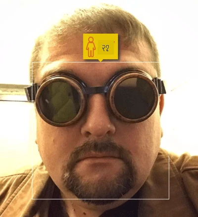

# AI အကြောင်းအကျဉ်း

> [Tomomi Imura](https://twitter.com/girlie_mac) မှ Sketchnote

## [သင်ခန်းစာမတိုင်မီ စမ်းမေးခွန်း](https://ff-quizzes.netlify.app/en/ai/quiz/1)

**Artificial Intelligence** ဆိုတာ လူသားတွေက လုပ်နိုင်တဲ့ အရာတွေကို ကွန်ပျူတာတွေက လုပ်နိုင်အောင် စမ်းသပ်လေ့လာတဲ့ သိပ္ပံနယ်ပယ်တစ်ခုဖြစ်ပါတယ်။

မူလကတော့ ကွန်ပျူတာတွေကို [Charles Babbage](https://en.wikipedia.org/wiki/Charles_Babbage) က အလွန်သေချာတဲ့ နည်းလမ်းတစ်ခုဖြင့် နံပါတ်တွေကို လုပ်ဆောင်နိုင်ဖို့ တီထွင်ခဲ့တာပါ။ ယနေ့ခေတ်ကွန်ပျူတာတွေဟာ ၁၉ ရာစုက မူလပုံစံထက် အလွန်တိုးတက်လာပြီးသားဖြစ်ပေမယ့်လည်း ထိန်းချုပ်ထားတဲ့တွက်ချက်မှုတွေကို အခြေခံထားတဲ့ အယူအဆကိုပဲ ဆက်လက်လိုက်နာနေပါတယ်။ ဒါကြောင့် ရည်မှန်းချက်ကို ရရှိဖို့ လိုအပ်တဲ့ အဆင့်ဆင့်လုပ်ဆောင်မှုတွေကို သိထားရင် ကွန်ပျူတာကို အစီအစဉ်ရေးသားပြီး လုပ်ဆောင်နိုင်ပါတယ်။

> [Vickie Soshnikova](http://twitter.com/vickievalerie) မှ ဓာတ်ပုံ

> ✅ လူတစ်ဦး၏ ဓာတ်ပုံမှ အသက်ကို သတ်မှတ်ဖို့ဆိုတာ အတိအကျအစီအစဉ်ရေးသားလို့မရတဲ့ အလုပ်တစ်ခုဖြစ်ပါတယ်၊ အကြောင်းကတော့ လူသားတွေဟာ အဲ့ဒီနည်းလမ်းကို သူတို့ရဲ့ ဦးနှောက်ထဲမှာ ဘယ်လိုထွက်လာတယ်ဆိုတာ မသိကြလို့ပါ။

---

သို့သော်လည်း အတိအကျ မသိတဲ့ အလုပ်တစ်ချို့လည်း ရှိပါတယ်။ လူတစ်ဦး၏ ဓာတ်ပုံမှ အသက်ကို သတ်မှတ်ဖို့ကို စဉ်းစားကြည့်ပါ။ လူသားတွေဟာ အသက်အရွယ်အမျိုးမျိုးရှိတဲ့ လူတွေကို အများကြီးတွေ့ဖူးလို့ အဲ့ဒီအလုပ်ကို လုပ်တတ်လာကြပေမယ့် ဘယ်လိုလုပ်တတ်လာတယ်ဆိုတာကို အတိအကျရှင်းပြလို့မရပါဘူး။ ဒါ့အပြင် ကွန်ပျူတာကိုလည်း အဲ့ဒီအလုပ်ကို အတိအကျအစီအစဉ်ရေးသားပေးလို့မရပါဘူး။ ဒီလိုအလုပ်တွေက **Artificial Intelligence** (AI) ရဲ့ စိတ်ဝင်စားစရာအလုပ်တွေဖြစ်ပါတယ်။

✅ AI က အကျိုးရှိမယ့် အလုပ်တွေကို ကွန်ပျူတာကို အပ်နှံနိုင်မယ့် အလုပ်တစ်ချို့ကို စဉ်းစားကြည့်ပါ။ ဘဏ္ဍာရေး၊ ဆေးဘက်ဆိုင်ရာနဲ့ အနုပညာနယ်ပယ်တွေမှာ AI က ဘယ်လိုအကျိုးရှိနေပြီလဲဆိုတာ တွေးကြည့်ပါ။

## အားနည်း AI နဲ့ အားကောင်း AI

အားနည်း AI | အားကောင်း AI
---------------------------------------|-------------------------------------
အားနည်း AI ဆိုတာ သီးသန့်အလုပ်တစ်ခု သို့မဟုတ် အလုပ်အနည်းငယ်အတွက် အထူးပြုပြီး ဒီဇိုင်းရေးဆွဲထားတဲ့ AI စနစ်တွေကို ဆိုလိုပါတယ်။ | အားကောင်း AI (သို့မဟုတ် Artificial General Intelligence - AGI) ဆိုတာ လူသားတွေရဲ့ ဉာဏ်ရည်နဲ့ နားလည်မှုအဆင့်ရှိတဲ့ AI စနစ်တွေကို ဆိုလိုပါတယ်။
ဒီ AI စနစ်တွေဟာ အထွေထွေဉာဏ်ရည်မရှိပါဘူး၊ သတ်မှတ်ထားတဲ့ အလုပ်တစ်ခုမှာသာ ထူးချွန်ပြီး အမှန်တကယ် နားလည်မှု သို့မဟုတ် သတိရှိမှုမရှိပါဘူး။ | ဒီ AI စနစ်တွေဟာ လူသားတွေလို အလုပ်တွေကို လုပ်ဆောင်နိုင်ပြီး၊ နယ်ပယ်အမျိုးမျိုးကို လိုက်လျောညီထွေဖြစ်နိုင်ပြီး သတိရှိမှု သို့မဟုတ် ကိုယ်ပိုင်သဘောထားရှိပါတယ်။
အားနည်း AI ရဲ့ ဥပမာတွေမှာ Siri သို့မဟုတ် Alexa လို အကူအညီပေးစနစ်တွေ၊ streaming service တွေမှာ သုံးတဲ့ အကြံပြု algorithm တွေ၊ သတ်မှတ်ထားတဲ့ ဖောက်သည်ဝန်ဆောင်မှုအတွက် chatbots တွေ ပါဝင်ပါတယ်။ | အားကောင်း AI ရရှိဖို့ဆိုတာ AI သုတေသနရဲ့ ရေရှည်ရည်မှန်းချက်ဖြစ်ပြီး၊ ဉာဏ်ရည်၊ သင်ယူမှု၊ နားလည်မှုနဲ့ အလုပ်အမျိုးမျိုးကို လိုက်လျောညီထွေဖြစ်စေဖို့လိုအပ်ပါတယ်။
အားနည်း AI ဟာ အထူးပြုထားပြီး လူသားတွေရဲ့ ဉာဏ်ရည်ဆိုင်ရာ အရည်အချင်း သို့မဟုတ် အထွေထွေပြဿနာဖြေရှင်းနိုင်စွမ်းမရှိပါဘူး။ | အားကောင်း AI ဟာ လက်ရှိအဆင့်မှာ သီအိုရီအဆင့်သာရှိပြီး၊ အဲ့ဒီအဆင့်ကို ရောက်ရှိထားတဲ့ AI စနစ်မရှိသေးပါဘူး။

ပိုမိုသိရှိလိုပါက **[Artificial General Intelligence](https://en.wikipedia.org/wiki/Artificial_general_intelligence)** (AGI) ကို ဖတ်ရှုပါ။

## ဉာဏ်ရည်ရဲ့ အဓိပ္ပါယ်နဲ့ Turing Test

**[Intelligence](https://en.wikipedia.org/wiki/Intelligence)** ဆိုတဲ့ စကားလုံးကို သုံးတဲ့အခါမှာ အဓိပ္ပါယ်ရှင်းလင်းမှုမရှိတာက ပြဿနာတစ်ခုဖြစ်ပါတယ်။ ဉာဏ်ရည်ဆိုတာ **အထွေထွေစဉ်းစားနိုင်စွမ်း** သို့မဟုတ် **ကိုယ့်ကိုယ်ကိုသိမြင်မှု** နဲ့ ဆက်စပ်နေတယ်လို့ ဆိုနိုင်ပေမယ့် အတိအကျ သတ်မှတ်လို့မရပါဘူး။

> [Amber Kipp](https://unsplash.com/@sadmax) မှ [ဓာတ်ပုံ](https://unsplash.com/photos/75715CVEJhI) (Unsplash မှ)

*ဉာဏ်ရည်* ဆိုတဲ့ စကားလုံးရဲ့ မရေရာမှုကို မြင်နိုင်ဖို့ "ကြောင်တစ်ကောင် ဉာဏ်ရည်ရှိလား?" ဆိုတဲ့ မေးခွန်းကို ဖြေကြည့်ပါ။ လူတွေက အမျိုးမျိုးအဖြေပြတတ်ကြပြီး၊ အဲ့ဒီအဆိုကို အမှန်တစ်ကယ် သက်သေပြနိုင်မယ့် စမ်းသပ်မှုတစ်ခုလည်း မရှိပါဘူး။ အဲ့ဒါရှိတယ်လို့ ထင်ရင်တော့ ကြောင်ကို IQ စမ်းသပ်မှုနဲ့ စမ်းကြည့်ပါ...

✅ ဉာဏ်ရည်ကို သင်ဘယ်လိုသတ်မှတ်တယ်ဆိုတာ တစ်မိနစ်လောက် စဉ်းစားကြည့်ပါ။ အစားအစာရဖို့ maze ဖြေရှင်းနိုင်တဲ့ ကြက်ငှက်တစ်ကောင် ဉာဏ်ရည်ရှိလား? ကလေးတစ်ယောက် ဉာဏ်ရည်ရှိလား?

---

AGI အကြောင်းပြောတဲ့အခါမှာ တကယ့်ဉာဏ်ရည်ရှိတဲ့ စနစ်တစ်ခုကို ဖန်တီးနိုင်ပြီလားဆိုတာ သတ်မှတ်ဖို့ နည်းလမ်းတစ်ခုလိုအပ်ပါတယ်။ [Alan Turing](https://en.wikipedia.org/wiki/Alan_Turing) က **[Turing Test](https://en.wikipedia.org/wiki/Turing_test)** ဆိုတဲ့ နည်းလမ်းတစ်ခုကို အကြံပြုခဲ့ပြီး၊ ဒါဟာ ဉာဏ်ရည်ရဲ့ သတ်မှတ်ချက်တစ်ခုအဖြစ်လည်း သုံးနိုင်ပါတယ်။ ဒီစမ်းသပ်မှုက တစ်စနစ်ကို လူသားတစ်ဦးနဲ့ နှိုင်းယှဉ်ပြီး၊ အလိုအလျောက်နှိုင်းယှဉ်မှုကို ကွန်ပျူတာအစီအစဉ်တစ်ခုက လွှဲချော်နိုင်တာကြောင့် လူသားစစ်ဆေးသူတစ်ဦးကို သုံးပါတယ်။ ဒါကြောင့် လူသားတစ်ဦးက စာသားအခြေပြု ဆွေးနွေးမှုမှာ တကယ့်လူနဲ့ ကွန်ပျူတာစနစ်ကို ခွဲခြားမရဘူးဆိုရင် - အဲ့ဒီစနစ်ကို ဉာဏ်ရည်ရှိတယ်လို့ သတ်မှတ်ပါတယ်။

> [Eugene Goostman](https://en.wikipedia.org/wiki/Eugene_Goostman) ဆိုတဲ့ chat-bot တစ်ခုဟာ ၂၀၁၄ ခုနှစ်မှာ Turing Test ကို အနီးကပ်ဖြေရှင်းနိုင်ခဲ့ပါတယ်။ အဲ့ဒီ bot ဟာ သူ့ကိုယ်သူ ၁၃ နှစ်အရွယ် ယူကရိန်းကလေးလို့ ပြောကြားပြီး၊ ဗဟုသုတနည်းနည်းနဲ့ စာသားထဲမှာ မတူညီမှုတွေရှိတာကို ရှင်းပြခဲ့ပါတယ်။ Bot ဟာ ၅ မိနစ်စာဆွေးနွေးမှုအတွင်းမှာ စီရင်သူတွေရဲ့ ၃၀% ကို လူသားဖြစ်တယ်လို့ ယုံကြည်စေခဲ့ပါတယ်။ ဒါပေမယ့် ဒီဟာက ဉာဏ်ရည်ရှိတဲ့စနစ်တစ်ခုကို ဖန်တီးနိုင်ပြီလို့ သက်သေပြတာမဟုတ်ပါဘူး၊ ဒါမှမဟုတ် ကွန်ပျူတာစနစ်က လူသားစစ်ဆေးသူကို လှည့်စားနိုင်တာလည်း မဟုတ်ပါဘူး - Bot ရဲ့ ဖန်တီးသူတွေက လူသားတွေကို လှည့်စားခဲ့တာပါ။

✅ Chat bot တစ်ခုက လူသားနဲ့ စကားပြောနေတာလို့ သင်ကိုယ်တိုင် ယုံကြည်ခဲ့ဖူးလား? ဘယ်လိုလှည့်စားနိုင်ခဲ့လဲ?
> ဓာတ်ပုံကို Dmitry Soshnikov မှ ရေးဆွဲထားပြီး [ဓာတ်ပုံ](https://unsplash.com/photos/r8LmVbUKgns) ကို [Marina Abrosimova](https://unsplash.com/@abrosimova_marina_foto) မှ ရိုက်ကူးထားသည်၊ Unsplash

## AI သုတေသန၏ နောက်ဆုံးရလေ့လာမှုများ

နယူးရယ်နက်ဝက်များ (Neural Networks) သုတေသန၏ အလွန်ကြီးမားသော တိုးတက်မှုသည် ၂၀၁၀ ခုနှစ်လောက်တွင် စတင်ခဲ့ပြီး အများပြည်သူအသုံးပြုနိုင်သော ဒေတာများ စတင်ရရှိလာခဲ့သည်။ [ImageNet](https://en.wikipedia.org/wiki/ImageNet) ဟုခေါ်သော ၁၄ သန်းကျော်သော အမှတ်အသားပြုထားသော ပုံများစုစည်းမှုကြီးသည် [ImageNet Large Scale Visual Recognition Challenge](https://image-net.org/challenges/LSVRC/) ကို မွေးဖွားပေးခဲ့သည်။

> ဓာတ်ပုံကို [Dmitry Soshnikov](http://soshnikov.com) မှ ရေးဆွဲထားသည်

၂၀၁၂ ခုနှစ်တွင် [Convolutional Neural Networks](../4-ComputerVision/07-ConvNets/README.md) ကို ပုံများအမျိုးအစားခွဲခြင်းတွင် ပထမဆုံးအသုံးပြုခဲ့ပြီး အမှားများကို အလွန်လျော့ချနိုင်ခဲ့သည် (၃၀% ခန့်မှ ၁၆.၄% အထိ လျော့ချနိုင်ခဲ့သည်)။ ၂၀၁၅ ခုနှစ်တွင် Microsoft Research မှ ResNet architecture သည် [လူ့အဆင့်တန်းမှန်ကန်မှု](https://doi.org/10.1109/ICCV.2015.123) ကို ရရှိခဲ့သည်။

ထိုအချိန်မှစ၍ နယူးရယ်နက်ဝက်များသည် အလုပ်များစွာတွင် အလွန်အောင်မြင်သော အပြုအမူများကို ပြသခဲ့သည်-

---

နှစ် | လူ့အဆင့်တန်းမှန်ကန်မှုရရှိမှု
-----|--------
၂၀၁၅ | [ပုံအမျိုးအစားခွဲခြင်း](https://doi.org/10.1109/ICCV.2015.123)
၂၀၁၆ | [စကားပြောအသံမှတ်တမ်းဖော်ခြင်း](https://arxiv.org/abs/1610.05256)
၂၀၁၈ | [အလိုအလျောက်ဘာသာပြန်ခြင်း](https://arxiv.org/abs/1803.05567) (တရုတ်-အင်္ဂလိပ်)
၂၀၂၀ | [ပုံအကြောင်းဖော်ပြခြင်း](https://arxiv.org/abs/2009.13682)

နောက်ဆုံးနှစ်များအတွင်း BERT နှင့် GPT-3 ကဲ့သို့သော စကားလုံးကြီးမားသော မော်ဒယ်များတွင် အလွန်အောင်မြင်မှုများကို တွေ့မြင်ခဲ့ရသည်။ ၎င်းသည် အများပြည်သူအသုံးပြုနိုင်သော စာသားဒေတာများစွာ ရရှိနိုင်မှုကြောင့် ဖြစ်လာခဲ့သည်။ ၎င်းတို့ကို စာသားများ၏ ဖွဲ့စည်းမှုနှင့် အဓိပ္ပာယ်ကို ဖမ်းဆီးနိုင်ရန် မော်ဒယ်များကို လေ့ကျင့်ပေးပြီး စာသားစုစည်းမှုများတွင် ပုံမှန်လေ့ကျင့်ပေးပြီး ထိုမော်ဒယ်များကို အထူးလုပ်ငန်းများအတွက် အထူးပြုစေသည်။ [Natural Language Processing](../5-NLP/README.md) အကြောင်းကို ဒီသင်ခန်းစာတွင် နောက်ပိုင်းတွင် ပိုမိုလေ့လာပါမည်။

## 🚀 စိန်ခေါ်မှု

အင်တာနက်ပတ်လည်လေ့လာပြီး AI ကို သင့်အမြင်အရ အကျိုးရှိဆုံးအသုံးပြုနေသောနေရာကို သတ်မှတ်ပါ။ ၎င်းသည် မြေပုံဆွဲခြင်း app တစ်ခုမှာလား၊ စကားပြောမှ စာသားပြောင်းခြင်းဝန်ဆောင်မှုတစ်ခုမှာလား၊ သို့မဟုတ် ဗီဒီယိုဂိမ်းတစ်ခုမှာလား။ စနစ်ကို ဘယ်လိုတည်ဆောက်ခဲ့သည်ကို လေ့လာပါ။

## [Post-lecture quiz](https://ff-quizzes.netlify.app/en/ai/quiz/2)

## ပြန်လည်သုံးသပ်ခြင်းနှင့် ကိုယ်တိုင်လေ့လာခြင်း

AI နှင့် ML ၏ သမိုင်းကြောင်းကို [ဒီသင်ခန်းစာ](https://github.com/microsoft/ML-For-Beginners/tree/main/1-Introduction/2-history-of-ML) မှတဆင့် ပြန်လည်သုံးသပ်ပါ။ အထက်ပါသင်ခန်းစာ၏ sketchnote မှတစ်ခု သို့မဟုတ် ဒီသင်ခန်းစာမှတစ်ခုကို ရွေးပြီး ၎င်း၏ တိုးတက်မှုကို သက်ဆိုင်ရာ ယဉ်ကျေးမှုအခြေအနေများကို နားလည်ရန် ပိုမိုနက်နက်ရှိုင်းရှိုင်းလေ့လာပါ။

**အလုပ်ပေးစာ**: [Game Jam](assignment.md)

---

<!-- CO-OP TRANSLATOR DISCLAIMER START -->
**အကြောင်းကြားချက်**:  
ဤစာရွက်စာတမ်းကို AI ဘာသာပြန်ဝန်ဆောင်မှု [Co-op Translator](https://github.com/Azure/co-op-translator) ကို အသုံးပြု၍ ဘာသာပြန်ထားပါသည်။ ကျွန်ုပ်တို့သည် တိကျမှုအတွက် ကြိုးစားနေသော်လည်း အလိုအလျောက် ဘာသာပြန်မှုများတွင် အမှားများ သို့မဟုတ် မတိကျမှုများ ပါဝင်နိုင်သည်ကို သတိပြုပါ။ မူရင်းဘာသာစကားဖြင့် ရေးသားထားသော စာရွက်စာတမ်းကို အာဏာတရ အရင်းအမြစ်အဖြစ် သတ်မှတ်သင့်ပါသည်။ အရေးကြီးသော အချက်အလက်များအတွက် လူ့ဘာသာပြန်ပညာရှင်များကို အသုံးပြုရန် အကြံပြုပါသည်။ ဤဘာသာပြန်မှုကို အသုံးပြုခြင်းမှ ဖြစ်ပေါ်လာသော အလွဲအမှားများ သို့မဟုတ် အနားလွဲမှုများအတွက် ကျွန်ုပ်တို့သည် တာဝန်မယူပါ။
<!-- CO-OP TRANSLATOR DISCLAIMER END -->