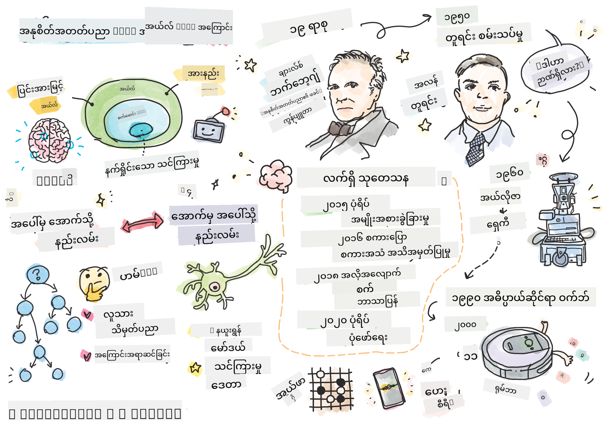

<!--
CO_OP_TRANSLATOR_METADATA:
{
  "original_hash": "06ca1b0138e65b964481ae83275b270e",
  "translation_date": "2025-10-03T09:05:05+00:00",
  "source_file": "lessons/1-Intro/README.md",
  "language_code": "my"
}
-->
# AI အကြောင်းအကျဉ်း

> Sketchnote by [Tomomi Imura](https://twitter.com/girlie_mac)

## [Pre-lecture quiz](https://ff-quizzes.netlify.app/en/ai/quiz/1)

**Artificial Intelligence** ဆိုတာ လူသားတွေကောင်းကောင်းလုပ်နိုင်တဲ့အရာတွေကို ကွန်ပျူတာတွေကလည်း လုပ်နိုင်အောင် စမ်းသပ်တဲ့ သိပ္ပံနယ်ပယ်တစ်ခုဖြစ်ပါတယ်။

မူလကတော့ ကွန်ပျူတာတွေကို [Charles Babbage](https://en.wikipedia.org/wiki/Charles_Babbage) က algorithm အတိုင်း နံပါတ်တွေကို လုပ်ဆောင်ဖို့ တီထွင်ခဲ့တာပါ။ ၁၉ ရာစုမှာ တီထွင်ခဲ့တဲ့ မူလပုံစံထက် အခုခေတ်ကွန်ပျူတာတွေက အဆင့်မြင့်လာခဲ့ပေမယ့် အခြေခံအယူအဆကတော့ အတိအကျ ထိန်းချုပ်ထားတဲ့ လုပ်ဆောင်မှုတွေကို ဆက်လက်လိုက်နာနေပါတယ်။ ဒါကြောင့် ရည်မှန်းချက်ကို ရောက်ရှိဖို့ လိုအပ်တဲ့ လုပ်ဆောင်မှုအဆင့်တွေကို သိထားရင် ကွန်ပျူတာကို အတိအကျ အစီအစဉ်ရေးဆွဲနိုင်ပါတယ်။

> Photo by [Vickie Soshnikova](http://twitter.com/vickievalerie)

> ✅ လူတစ်ဦးရဲ့ ဓာတ်ပုံကို ကြည့်ပြီး အသက်ကို သတ်မှတ်ဖို့ဆိုတာ အတိအကျ အစီအစဉ်ရေးဆွဲလို့ မရနိုင်တဲ့ အလုပ်တစ်ခုပါ။ ဘာကြောင့်လဲဆိုတော့ လူသားတွေက အဲဒီနည်းလမ်းကို အတိအကျ ရှင်းပြလို့ မရနိုင်လို့ပါ။

---

သို့သော် အတိအကျ ဖြေရှင်းနည်းကို မသိတဲ့ အလုပ်တစ်ချို့လည်း ရှိပါတယ်။ လူတစ်ဦးရဲ့ ဓာတ်ပုံကို ကြည့်ပြီး အသက်ကို သတ်မှတ်ဖို့ကို စဉ်းစားကြည့်ပါ။ လူသားတွေက အမျိုးမျိုးအသက်ရှိတဲ့ လူတွေကို များစွာတွေ့ဖူးလို့ အဲဒီအလုပ်ကို လေ့လာပြီး လုပ်နိုင်ပါတယ်။ ဒါပေမယ့် ဘယ်လိုလုပ်ရမယ်ဆိုတာကို အတိအကျ ရှင်းပြလို့ မရနိုင်သလို ကွန်ပျူတာကိုလည်း အတိအကျ အစီအစဉ်ရေးဆွဲလို့ မရနိုင်ပါဘူး။ ဒီလိုအလုပ်တွေက **Artificial Intelligence** (AI) ရဲ့ စိတ်ဝင်စားစရာ အလုပ်တွေဖြစ်ပါတယ်။

✅ AI က အကျိုးရှိမယ့် အလုပ်တွေကို ကွန်ပျူတာကို အပ်နှံနိုင်မယ့် အလုပ်တွေကို စဉ်းစားကြည့်ပါ။ ငွေကြေး၊ ဆေးဘက်ဆိုင်ရာနဲ့ အနုပညာနယ်ပယ်တွေမှာ AI က ဘယ်လို အကျိုးရှိနေပါသလဲ?

## အားနည်း AI နဲ့ အားကောင်း AI

အားနည်း AI | အားကောင်း AI
---------------------------------------|-------------------------------------
အားနည်း AI ဆိုတာ သတ်မှတ်ထားတဲ့ အလုပ်တစ်ခု သို့မဟုတ် အလုပ်အစုတစ်ခုအတွက် အထူးသင့်လျော်စွာ တီထွင်ပြီး လေ့ကျင့်ထားတဲ့ AI စနစ်တွေကို ဆိုလိုပါတယ်။ | အားကောင်း AI (Artificial General Intelligence - AGI) ဆိုတာ လူသားတွေရဲ့ ဉာဏ်ရည်နဲ့ နားလည်မှုအဆင့်ကို ရောက်ရှိထားတဲ့ AI စနစ်တွေကို ဆိုလိုပါတယ်။
AI စနစ်တွေဟာ အထူးသင့်လျော်တဲ့ အလုပ်တစ်ခုကို လုပ်ဆောင်နိုင်ပေမယ့် အမှန်တကယ် နားလည်မှု သို့မဟုတ် သတိရှိမှုမရှိပါ။ | AI စနစ်တွေဟာ လူသားတွေ လုပ်နိုင်တဲ့ ဉာဏ်ရည်အလုပ်တွေကို လုပ်ဆောင်နိုင်ပြီး နယ်ပယ်အမျိုးမျိုးကို လိုက်လျောညီထွေဖြစ်နိုင်တဲ့ စနစ်တွေဖြစ်ပါတယ်။
အားနည်း AI ရဲ့ ဥပမာတွေမှာ Siri, Alexa လို virtual assistant တွေ၊ streaming service တွေမှာ သုံးတဲ့ recommendation algorithm တွေ၊ သတ်မှတ်ထားတဲ့ customer service အလုပ်တွေအတွက် chatbots တွေ ပါဝင်ပါတယ်။ | အားကောင်း AI ကို ရှာဖွေတီထွင်ဖို့ဆိုတာ AI သုတေသနရဲ့ ရေရှည်ရည်မှန်းချက်ဖြစ်ပြီး reasoning, learning, understanding နဲ့ အလုပ်အမျိုးမျိုးကို လိုက်လျောညီထွေဖြစ်နိုင်တဲ့ AI စနစ်တွေကို တီထွင်ဖို့ လိုအပ်ပါတယ်။
အားနည်း AI ဟာ အထူးသင့်လျော်တဲ့ နယ်ပယ်မှာသာ အလုပ်လုပ်နိုင်ပြီး လူသားတွေရဲ့ ဉာဏ်ရည်ဆိုင်ရာ အရည်အချင်းတွေ သို့မဟုတ် general problem-solving အရည်အချင်းတွေ မရှိပါ။ | အားကောင်း AI ဟာ လက်ရှိမှာ သီအိုရီအဆင့်မှာသာ ရှိပြီး general intelligence အဆင့်ကို ရောက်ရှိထားတဲ့ AI စနစ်မရှိသေးပါ။

ပိုမိုသိရှိလိုပါက **[Artificial General Intelligence](https://en.wikipedia.org/wiki/Artificial_general_intelligence)** (AGI) ကို ဖတ်ရှုပါ။

## ဉာဏ်ရည်ရဲ့ အဓိပ္ပာယ်နဲ့ Turing Test

**[Intelligence](https://en.wikipedia.org/wiki/Intelligence)** ဆိုတဲ့ စကားလုံးကို သုံးတဲ့အခါမှာ အဓိပ္ပာယ်ကို အတိအကျ သတ်မှတ်လို့ မရနိုင်တာက ပြဿနာတစ်ခုဖြစ်ပါတယ်။ ဉာဏ်ရည်ဆိုတာ **abstract thinking** နဲ့ **self-awareness** တွေကို ဆက်စပ်နေတယ်လို့ ဆိုနိုင်ပေမယ့် အတိအကျ သတ်မှတ်လို့ မရနိုင်ပါ။

> [Photo](https://unsplash.com/photos/75715CVEJhI) by [Amber Kipp](https://unsplash.com/@sadmax) from Unsplash

*intelligence* ဆိုတဲ့ စကားလုံးရဲ့ မရေရာမှုကို မြင်နိုင်ဖို့ "ကြောင်တစ်ကောင်ဟာ ဉာဏ်ရည်ရှိလား?" ဆိုတဲ့ မေးခွန်းကို ဖြေကြည့်ပါ။ လူတွေက အမျိုးမျိုး အဖြေတွေ ပေးတတ်ပါတယ်။ ဘာကြောင့်လဲဆိုတော့ အဲဒီအဆိုကို အတိအကျ သက်သေပြနိုင်တဲ့ စမ်းသပ်မှုတစ်ခု မရှိလို့ပါ။ သင်ထင်တာက IQ စမ်းသပ်မှုကို ကြောင်ကို စမ်းကြည့်ရင် အဖြေကို ရနိုင်တယ်လို့ ထင်ပါသလား...

✅ ဉာဏ်ရည်ကို သင်ဘယ်လို သတ်မှတ်မလဲဆိုတာကို တစ်မိနစ် စဉ်းစားကြည့်ပါ။ maze ကို ဖြေရှင်းပြီး အစားအစာကို ရနိုင်တဲ့ crow ဟာ ဉာဏ်ရည်ရှိလား? ကလေးတစ်ဦးဟာ ဉာဏ်ရည်ရှိလား?

---

AGI အကြောင်း ပြောတဲ့အခါမှာ တကယ့် ဉာဏ်ရည်ရှိတဲ့ စနစ်ကို ဖန်တီးနိုင်ပြီလို့ ပြောနိုင်ဖို့ နည်းလမ်းတစ်ခု လိုအပ်ပါတယ်။ [Alan Turing](https://en.wikipedia.org/wiki/Alan_Turing) က **[Turing Test](https://en.wikipedia.org/wiki/Turing_test)** ဆိုတဲ့ နည်းလမ်းကို အကြံပေးခဲ့ပြီး ဉာဏ်ရည်ရဲ့ အဓိပ္ပာယ်အဖြစ်လည်း သတ်မှတ်နိုင်ပါတယ်။ ဒီစမ်းသပ်မှုက စနစ်တစ်ခုကို လူသားတစ်ဦးနဲ့ နှိုင်းယှဉ်ပြီး စမ်းသပ်ပါတယ်။ အလိုအလျောက် နှိုင်းယှဉ်မှုတွေကို ကွန်ပျူတာအစီအစဉ်က လွှဲချော်နိုင်တာကြောင့် လူသား interrogator ကို သုံးပါတယ်။ လူသားတစ်ဦးက text-based dialogue မှာ လူတစ်ဦးနဲ့ ကွန်ပျူတာစနစ်ကို ခွဲခြားမရနိုင်ရင် အဲဒီစနစ်ကို ဉာဏ်ရည်ရှိတယ်လို့ သတ်မှတ်နိုင်ပါတယ်။

> [Eugene Goostman](https://en.wikipedia.org/wiki/Eugene_Goostman) ဆိုတဲ့ chat-bot တစ်ခုကို St.Petersburg မှာ ဖန်တီးခဲ့ပြီး 2014 ခုနှစ်မှာ Turing Test ကို အနီးကပ် ဖြတ်နိုင်ခဲ့ပါတယ်။ အဲဒီ bot ဟာ 13 နှစ်အရွယ် ဥကရိန်းကလေးတစ်ဦးဖြစ်တယ်လို့ ကြိုတင်ပြောထားပြီး သိရှိမှုနဲ့ စာသားမှာ ရှိတဲ့ မတူညီမှုတွေကို ရှင်းပြခဲ့ပါတယ်။ Bot ဟာ 5 မိနစ်စာဆွေးနွေးမှုအတွင်းမှာ 30% ရှိတဲ့ စမ်းသပ်သူတွေကို လူသားဖြစ်တယ်လို့ ယုံကြည်စေခဲ့ပါတယ်။ Turing က 2000 ခုနှစ်မှာ စက်တစ်ခုက ဒီအဆင့်ကို ရောက်ရှိနိုင်မယ်လို့ ယုံကြည်ခဲ့ပါတယ်။ သို့သော် ဒီအဖြေက ဉာဏ်ရည်ရှိတဲ့ စနစ်ကို ဖန်တီးနိုင်ပြီလို့ သက်သေပြတာ မဟုတ်ပါဘူး။ Bot ဟာ လူတွေကို လှည့်စားတာ မဟုတ်ပါဘူး၊ Bot ဖန်တီးသူတွေက လှည့်စားတာပါ။

✅ Chat bot တစ်ခုက လူသားနဲ့ စကားပြောနေတယ်လို့ သင်ကို လှည့်စားနိုင်ဖူးလား? ဘယ်လို လှည့်စားနိုင်ခဲ့လဲ?

## AI ရဲ့ နည်းလမ်းအမျိုးမျိုး

ကွန်ပျူတာကို လူသားလို လုပ်ဆောင်စေချင်ရင် လူသားတွေရဲ့ စဉ်းစားနည်းကို ကွန်ပျူတာထဲမှာ မော်ဒယ်တစ်ခုအဖြစ် ဖန်တီးရပါမယ်။ ဒါကြောင့် လူသားတွေကို ဉာဏ်ရည်ရှိစေတဲ့ အရာကို နားလည်ဖို့ လိုအပ်ပါတယ်။

> စက်ရုပ်တစ်ခုကို ဉာဏ်ရည်ရှိအောင် အစီအစဉ်ရေးဖို့ဆိုရင် လူသားတွေရဲ့ ဆုံးဖြတ်ချက်လုပ်နည်းကို နားလည်ဖို့ လိုအပ်ပါတယ်။ သင်ကိုယ်တိုင်ကို စဉ်းစားကြည့်ပါ။ အချို့လုပ်ဆောင်မှုတွေဟာ သတိမရှိဘဲ ဖြစ်ပျက်တတ်ပါတယ် - ဥပမာ၊ ကြောင်နဲ့ ခွေးကို ခွဲခြားနိုင်ပေမယ့် အဲဒီလုပ်ဆောင်မှုကို စဉ်းစားရမယ်လို့ မထင်ပါဘူး။ အခြားလုပ်ဆောင်မှုတွေက reasoning ပါဝင်ပါတယ်။

ဒီပြဿနာကို ဖြေရှင်းဖို့ နည်းလမ်းနှစ်ခု ရှိပါတယ်။

Top-down Approach (Symbolic Reasoning) | Bottom-up Approach (Neural Networks)
---------------------------------------|-------------------------------------
Top-down approach က လူသားတွေက ပြဿနာကို ဖြေရှင်းတဲ့ နည်းလမ်းကို မော်ဒယ်တစ်ခုအဖြစ် ဖန်တီးပါတယ်။ လူသားတွေက **knowledge** ကို ရှာဖွေပြီး ကွန်ပျူတာနားလည်နိုင်တဲ့ ပုံစံအဖြစ် ဖော်ပြရပါတယ်။ reasoning ကိုလည်း ကွန်ပျူတာထဲမှာ မော်ဒယ်တစ်ခုအဖြစ် ဖန်တီးရပါတယ်။ | Bottom-up approach က လူသားတွေရဲ့ ဦးနှောက်ဖွဲ့စည်းပုံကို မော်ဒယ်တစ်ခုအဖြစ် ဖန်တီးပါတယ်။ ဦးနှောက်မှာ **neurons** လို့ခေါ်တဲ့ အရင်းအမြစ်များစွာ ပါဝင်ပါတယ်။ neuron တစ်ခုဟာ input တွေကို weighted average အဖြစ် လုပ်ဆောင်ပြီး **training data** ပေးခြင်းအားဖြင့် neurons network ကို ပြဿနာဖြေရှင်းနိုင်အောင် လေ့ကျင့်နိုင်ပါတယ်။

ဉာဏ်ရည်ရရှိဖို့ အခြားနည်းလမ်းတွေကလည်း ရှိပါတယ်။

* **Emergent**, **Synergetic** သို့မဟုတ် **multi-agent approach** ဆိုတာ အရင်းအမြစ်များစွာရဲ့ အပြန်အလှန် လုပ်ဆောင်မှုကနေ အဆင့်မြင့် ဉာဏ်ရည်ရှိတဲ့ အပြုအမူကို ရရှိနိုင်တယ်လို့ အခြေခံထားပါတယ်။ [evolutionary cybernetics](https://en.wikipedia.org/wiki/Global_brain#Evolutionary_cybernetics) အရ ဉာဏ်ရည်ဟာ *metasystem transition* လုပ်ဆောင်မှုမှာ *emerge* ဖြစ်လာနိုင်ပါတယ်။

* **Evolutionary approach** သို့မဟုတ် **genetic algorithm** ဆိုတာ evolution ရဲ့ အခြေခံအယူအဆကို အခြေခံထားတဲ့ optimization process ဖြစ်ပါတယ်။

ဒီနည်းလမ်းတွေကို နောက်ပိုင်းမှာ သင်ခန်းစာအဖြစ် လေ့လာမယ်၊ အခုတော့ top-down နဲ့ bottom-up ဆိုတဲ့ နည်းလမ်းနှစ်ခုကို အဓိကထားပါမယ်။

### Top-Down Approach

**Top-down approach** မှာ reasoning ကို မော်ဒယ်တစ်ခုအဖြစ် ဖန်တီးဖို့ ကြိုးစားပါတယ်။ လူသားတွေက reasoning လုပ်တဲ့အခါ သူတို့ရဲ့ စဉ်းစားနည်းကို လိုက်နာနိုင်ပါတယ်။ ဒီလုပ်ဆောင်မှုကို formalize လုပ်ပြီး ကွန်ပျူတာထဲမှာ အစီအစဉ်ရေးဆွဲနိုင်ပါတယ်။ ဒီနည်းလမ်းကို **symbolic reasoning** လို့ခေါ်ပါတယ်။

လူတွေဟာ သူတို့ရဲ့ ဆုံးဖြတ်ချက်လုပ်နည်းကို လမ်းညွှန်တဲ့ rule တွေကို သူတို့ရဲ့ ဦးနှောက်ထဲမှာ ထည့်ထားတတ်ပါတယ်။ ဥပမာ၊ ဆရာဝန်တစ်ဦးက လူနာတစ်ဦးကို ရောဂါရှာဖွေတဲ့အခါ လူနာမှာ ဖျားနာမှုရှိတယ်လို့ သိနိုင်ပြီး အတွင်းအာရုံမှာ inflammation ဖြစ်နေလို့ ဖြစ်နိုင်တယ်လို့ သတ်မှတ်နိုင်ပါတယ်။ rule အများကြီးကို သတ်မှတ်ထားတဲ့ ပြဿနာမှာ အသုံးပြုခြင်းအားဖြင့် ဆရာဝန်တစ်ဦးက နောက်ဆုံးရောဂါရှာဖွေမှုကို ရနိုင်ပါတယ်။

ဒီနည်းလမ်းဟာ **knowledge representation** နဲ့ **reasoning** ကို အခြေခံထားပါတယ်။ လူသားတွေထံက knowledge ကို ရယူဖို့က အခက်အခဲအများကြီး ရှိပါတယ်။ ဆရာဝန်တစ်ဦးက အချို့အခါမှာ သူ့ရဲ့ ရောဂါရှာဖွေမှုကို ဘာကြောင့် ရရှိတယ်ဆိုတာကို အတိအကျ မသိနိုင်ပါဘူး။ အချို့အခါမှာ ဖြေရှင်းနည်းဟာ သူ့ရဲ့ ဦးနှောက်ထဲမှာ အလိုအလျောက် ရှိလာတတ်ပါတယ်။ လူတစ်ဦးရဲ့ ဓာတ်ပုံကို ကြည့်ပြီး အသက်ကို သတ်မှတ်ဖို့လိုတဲ့ အလုပ်တွေက knowledge ကို manipulate လုပ်ခြင်းအားဖြင့် လုံးဝ ဖြေရှင်းလို့ မရနိုင်ပါ။

### Bottom-Up Approach

အခြားနည်းလမ်းတစ်ခုကတော့ လူသားတွေရဲ့ ဦးနှောက်ထဲမှာ ရှိတဲ့ အရင်းအမြစ်အနည်းဆုံးကို မော်ဒယ်တစ်ခုအဖြစ် ဖန်တီးဖို့ ကြိုးစားပါတယ် – neuron တစ်ခုကို ဖန်တီးဖို့ ကြိုးစားပါတယ်။ **Artificial neural network** ဆိုတဲ့ network ကို ကွန်ပျူတာထဲမှာ ဖန်တီးပြီး ပြဿနာတွေကို ဖြေရှင်းဖို့ လေ့ကျင့်ပေးနိုင်ပါတယ်။ ဒီလုပ်ဆောင်မှုဟာ မွေးကင်းစကလေးတစ်ဦးက သူ့ပတ်ဝန်းကျင်ကို လေ့လာပြီး နားလည်သလို ဖြစ်ပါတယ်။

✅ မွေးကင်းစကလေးတွေ ဘယ်လို လေ့လာတတ်တယ်ဆိုတာကို သုတေသန လုပ်ကြည့်ပါ။ မွေးကင်းစကလေးရဲ့ ဦးနှောက်ရဲ့ အခြေခံအရင်းအမြစ်တွေက ဘာတွေလဲ?

> | ML အကြောင်းရော?         |      |
> |--------------|-----------|
> | Artificial Intelligence ရဲ့ အစိတ်အပိုင်းတစ်ခုဖြစ်ပြီး အချို့ data အပေါ် အခြေခံပြီး ပြဿနာကို ဖြေရှင်းဖို့ လေ့လာတဲ့ computer learning ကို **Machine Learning** လ
> ဓာတ်ပုံကို Dmitry Soshnikov မှ ရိုက်ထားပြီး [ဓာတ်ပုံ](https://unsplash.com/photos/r8LmVbUKgns) ကို [Marina Abrosimova](https://unsplash.com/@abrosimova_marina_foto) မှ ရိုက်ထားသည်၊ Unsplash

## AI သုတေသန၏ နောက်ဆုံးပေါ်

နယူးရယ်နက်ဝက် (Neural Network) သုတေသနတွင် ၂၀၁၀ ဝန်းကျင်မှ စတင်၍ အလွန်အမင်း တိုးတက်မှုများ ဖြစ်ပေါ်လာခဲ့သည်။ အများပြည်သူအသုံးပြုနိုင်သော ဒေတာများ စတင်ရရှိလာသောအခါတွင် ဖြစ်ပါသည်။ [ImageNet](https://en.wikipedia.org/wiki/ImageNet) ဟုခေါ်သော ၁၄ သန်းကျော် အမှတ်အသားပြုထားသော ပုံများပါဝင်သော အကြီးမားဆုံး ပုံများစုစည်းမှုသည် [ImageNet Large Scale Visual Recognition Challenge](https://image-net.org/challenges/LSVRC/) ကို မွေးဖွားပေးခဲ့သည်။

> ဓာတ်ပုံကို [Dmitry Soshnikov](http://soshnikov.com) မှ ရိုက်ထားသည်

၂၀၁၂ ခုနှစ်တွင် [Convolutional Neural Networks](../4-ComputerVision/07-ConvNets/README.md) ကို ပုံများ အမျိုးအစားခွဲခြင်းတွင် ပထမဆုံး အသုံးပြုခဲ့ပြီး အမှားများကို အလွန်အမင်း လျှော့ချနိုင်ခဲ့သည် (၃၀% ခန့်မှ ၁၆.၄% အထိ လျှော့ချနိုင်ခဲ့သည်)။ ၂၀၁၅ ခုနှစ်တွင် Microsoft Research မှ ResNet architecture သည် [လူ့အဆင့်တန်းမှန်ကန်မှု](https://doi.org/10.1109/ICCV.2015.123) ကို ရရှိခဲ့သည်။

ထိုအချိန်မှစ၍ နယူးရယ်နက်ဝက်များသည် အလုပ်များစွာတွင် အလွန်အောင်မြင်သော အပြုအမူများကို ပြသခဲ့သည်-

---

နှစ် | လူ့အဆင့်တန်းမှန်ကန်မှု ရရှိခဲ့သောအချိန်
-----|--------
၂၀၁၅ | [ပုံအမျိုးအစားခွဲခြင်း](https://doi.org/10.1109/ICCV.2015.123)
၂၀၁၆ | [စကားပြောအသံ မှတ်တမ်းတင်ခြင်း](https://arxiv.org/abs/1610.05256)
၂၀၁၈ | [အလိုအလျောက် ဘာသာပြန်ခြင်း](https://arxiv.org/abs/1803.05567) (တရုတ်-အင်္ဂလိပ်)
၂၀၂၀ | [ပုံအကြောင်းဖော်ပြခြင်း](https://arxiv.org/abs/2009.13682)

နောက်ဆုံးနှစ်များအတွင်း BERT နှင့် GPT-3 ကဲ့သို့သော အကြီးမားသော ဘာသာစကားမော်ဒယ်များတွင် အလွန်အောင်မြင်မှုများကို တွေ့မြင်ခဲ့ရသည်။ ၎င်းသည် အများပြည်သူအသုံးပြုနိုင်သော စာသားဒေတာများ အလွန်များပြားသောကြောင့် ဖြစ်ပါသည်။ ၎င်းတို့ကို စာသားများ၏ ဖွဲ့စည်းမှုနှင့် အဓိပ္ပာယ်ကို ဖမ်းဆီးနိုင်ရန် မော်ဒယ်များကို လေ့ကျင့်ပေးပြီး၊ အထွေထွေစာသားစုစည်းမှုများတွင် ကြိုတင်လေ့ကျင့်ပေးပြီး၊ ထို့နောက် အထူးပြုလုပ်ငန်းများအတွက် မော်ဒယ်များကို အထူးပြုလုပ်နိုင်သည်။ [Natural Language Processing](../5-NLP/README.md) အကြောင်းကို ဒီသင်ခန်းစာတွင် နောက်ပိုင်းတွင် ပိုမိုလေ့လာမည်ဖြစ်သည်။

## 🚀 စိန်ခေါ်မှု

အင်တာနက်ပေါ်တွင် လှည့်လည်ပြီး AI ကို အကျိုးရှိဆုံး အသုံးပြုနေသောနေရာကို သင်၏အမြင်အရ သတ်မှတ်ပါ။ ၎င်းသည် မြေပုံဆွဲခြင်း app တစ်ခုဖြစ်ပါသလား၊ စကားပြောမှ စာသားပြောင်းခြင်းဝန်ဆောင်မှုတစ်ခုဖြစ်ပါသလား၊ သို့မဟုတ် ဗီဒီယိုဂိမ်းတစ်ခုဖြစ်ပါသလား။ စနစ်ကို ဘယ်လိုတည်ဆောက်ခဲ့သည်ကို သုတေသနလုပ်ပါ။

## [Post-lecture quiz](https://ff-quizzes.netlify.app/en/ai/quiz/2)

## ပြန်လည်သုံးသပ်ခြင်းနှင့် ကိုယ်တိုင်လေ့လာခြင်း

AI နှင့် ML ၏ သမိုင်းကြောင်းကို [ဒီသင်ခန်းစာ](https://github.com/microsoft/ML-For-Beginners/tree/main/1-Introduction/2-history-of-ML) ကို ဖတ်ရှုခြင်းဖြင့် ပြန်လည်သုံးသပ်ပါ။ ၎င်းသင်ခန်းစာ၏ အပေါ်ပိုင်းရှိ sketchnote သို့မဟုတ် ဒီသင်ခန်းစာမှ တစ်ခုခုကို ယူပြီး ၎င်း၏ ဖွံ့ဖြိုးတိုးတက်မှုကို သက်ဆိုင်ရာ ယဉ်ကျေးမှုအခြေခံအနေအထားကို ပိုမိုနားလည်ရန် သုတေသနလုပ်ပါ။

**အလုပ်ပေးစာ**: [Game Jam](assignment.md)

---

**အကြောင်းကြားချက်**:  
ဤစာရွက်စာတမ်းကို AI ဘာသာပြန်ဝန်ဆောင်မှု [Co-op Translator](https://github.com/Azure/co-op-translator) ကို အသုံးပြု၍ ဘာသာပြန်ထားပါသည်။ ကျွန်ုပ်တို့သည် တိကျမှန်ကန်မှုအတွက် ကြိုးစားနေသော်လည်း အလိုအလျောက် ဘာသာပြန်မှုများတွင် အမှားများ သို့မဟုတ် မမှန်ကန်မှုများ ပါဝင်နိုင်သည်ကို သတိပြုပါ။ မူရင်းဘာသာစကားဖြင့် ရေးသားထားသော စာရွက်စာတမ်းကို အာဏာတရားရှိသော ရင်းမြစ်အဖြစ် သတ်မှတ်သင့်ပါသည်။ အရေးကြီးသော အချက်အလက်များအတွက် လူ့ဘာသာပြန်ပညာရှင်များကို အသုံးပြု၍ ဘာသာပြန်ခြင်းကို အကြံပြုပါသည်။ ဤဘာသာပြန်မှုကို အသုံးပြုခြင်းမှ ဖြစ်ပေါ်လာသော အလွဲအမှားများ သို့မဟုတ် အနားယူမှုမှားများအတွက် ကျွန်ုပ်တို့သည် တာဝန်မယူပါ။