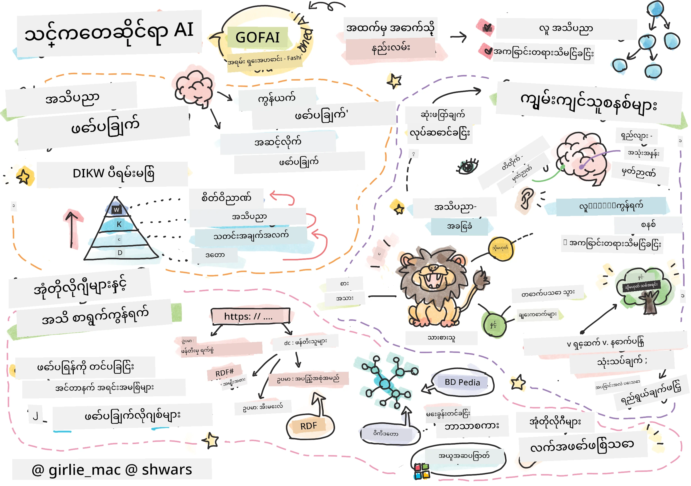
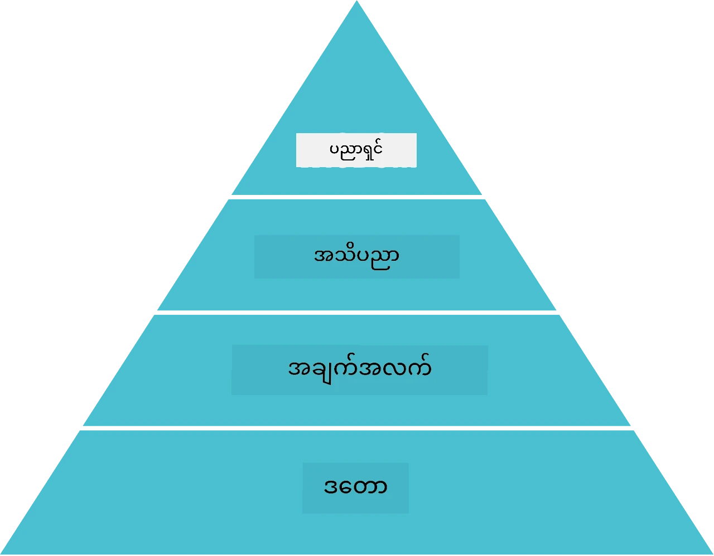
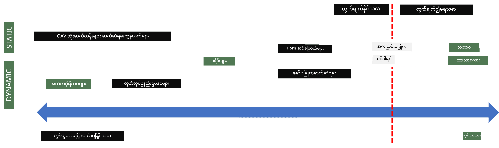
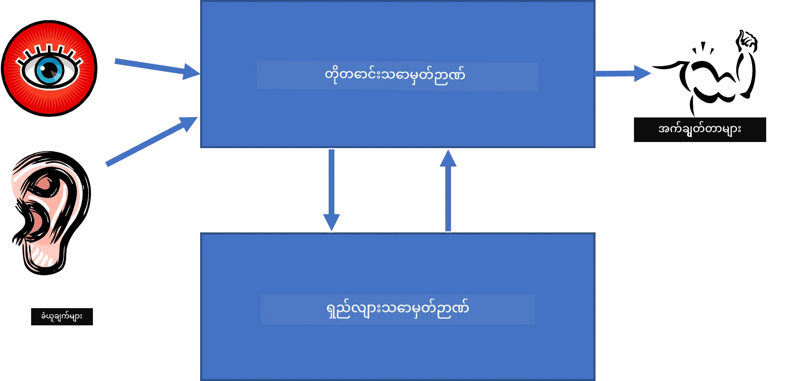
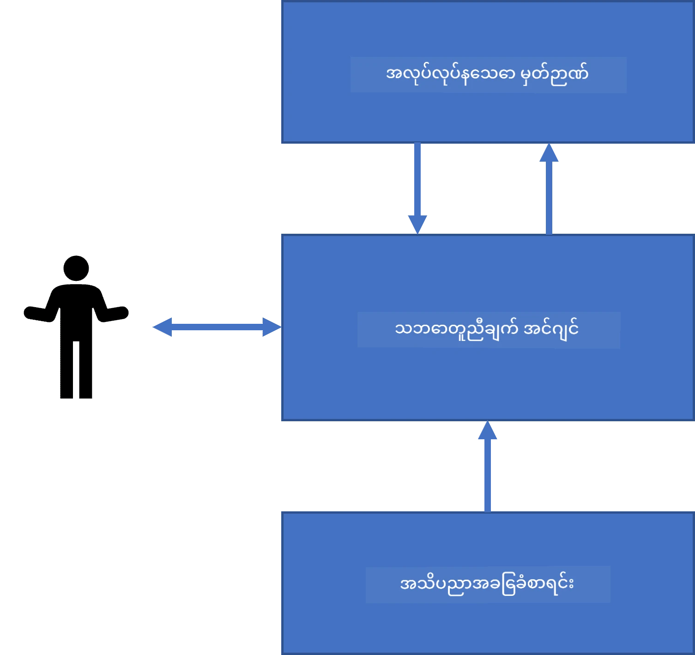
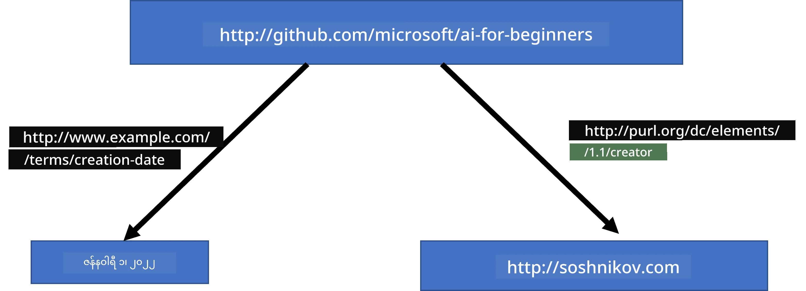
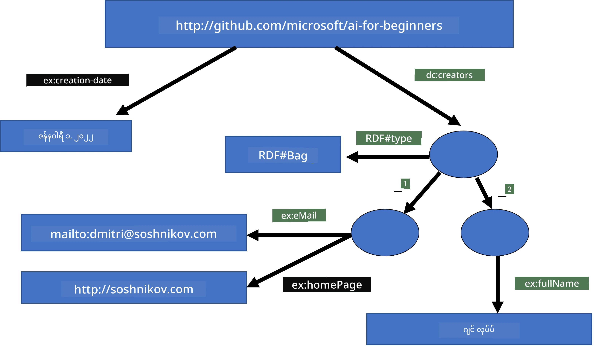

# အသိပညာ ကိုယ်စားပြုခြင်းနှင့် ကျွမ်းကျင်သူ စနစ်များ



> Sketchnote ကို [Tomomi Imura](https://twitter.com/girlie_mac) က ဖန်တီးထားသည်။

အတုအစား စွမ်းဆောင်ရည် ရရှိစေနိုင်ရန် လေ့လာသင်ယူမှုမှာ လူတို့ကဲ့သို့ ကမ္ဘာကို နားလည်နိုင်ရေးအတွက် အသိပညာကို ရှာဖွေခြင်းဖြစ်သည်။ သို့သော် ဤအရာကို မည်သို့ဆောင်ရွက်နိုင်မည်နည်း?

## [မည်သည့်အခန်းမဆို မတိုင်မီ စစ်ဆေးမှု](https://ff-quizzes.netlify.app/en/ai/quiz/3)

AI ရဲ့အစောပိုင်းကာလများတွင် ၎င်း၏အလုပ်လိုက် နည်းလမ်း (ယခင်သင်ခန်းစာတွင် ဆွေးနွေးခဲ့သည့်) လေ့လာရေး နည်းလမ်း ကျယ်ကျယ်ပြန့်ပြန့် အသုံးများခဲ့သည်။ ယင်း၏အကြံအတွေးမှာ လူများထံမှ အသိပညာကို မှန်ကန်စွာ ပုံဖော်၍ စက်က စီမံခန့်ခွဲနိုင်သော ပုံစံသို့ ပြောင်းလဲ၍ မူမမှန်သော ပြဿနာများကိုအလိုအလျောက် ဖြေရှင်းနိုင်စေရန်ဖြစ်သည်။ ယင်းနည်းလမ်းတွင် အကြီးမားဆုံး အယူအဆ နှစ်ခု ပါဝင်သည် -

* အသိပညာ ကိုယ်စားပြုခြင်း
* ထုတ်ဖော်စဉ်းစားမှု

## အသိပညာ ကိုယ်စားပြုခြင်း

Symbolic AI တွင် အရေးကြီးသော အယူအဆတစ်ခုမှာ **အသိပညာ** ဖြစ်သည်။ ဒီအသိပညာကို *အချက်အလက်* သို့မဟုတ် *ဒေတာ* ထက် ကွာခြားစွာ ထားရမည်ဖြစ်သည်။ ဥပမာအားဖြင့်၊ စာအုပ်များမှာ အသိပညာကို ထည့်ထားသည်ဟု ပြောနိုင်သည်၊ အကြောင်းမှာ စာအုပ်များကို လေ့လာခြင်းနှင့် ကျွမ်းကျင်သူဖြစ်လာနိုင်သည်။ သို့သော် စာအုပ်ထဲတွင် ရှိနေသည့် အရာသည် *ဒေတာ* ဟု မှတ်ယူရမည် ဖြစ်၍ စာအုပ်များကို ဖတ်ခြင်းဖြင့် ထိုဒေတာကို ကမ္ဘာ့မော်ဒယ်သို့ ပေါင်းစည်းခြင်းက ဒီဒေတာကို အသိပညာသို့ ပြောင်းလဲပေးသည်။

> ✅ **အသိပညာ** ဆိုသည်မှာ ကျွန်ုပ်တို့၏ ဦးနှောက် ထဲတွင်ပါဝင်ပြီး ကမ္ဘာအပေါ် ကျွန်ုပ်တို့၏ နားလည်မှုကို ကိုယ်စားပြုသည်။ ၎င်းမှာ ကျွန်ုပ်တို့ထံ ရှိသော အချက်အလက်စုစည်းမှုများကို ပေါင်းစည်းထားသည့် တက်ကြွ လေ့လာမှု ဖြစ်စဉ်ဖြစ်သည်။

ပုံမှန်အားဖြင့် ကျွန်ုပ်တို့ သေချာစွာ အသိပညာအား သတ်မှတ်ခြင်း မပြုဘဲ [DIKW Pyramid](https://en.wikipedia.org/wiki/DIKW_pyramid) အား အသုံးပြု၍ ပတ်သက်သော အယူအဆများနှင့် သွယ်ဝိုက်စေနိုင်သည်။ ထိုအတွင်း ပါဝင်သော အယူအဆများမှာ -

* **ဒေတာ** ဆိုသည်မှာ ရေးသားထားသော စာသား သို့မဟုတ် ပြောဆိုထားသော စကားလုံးများကဲ့သို့ စာသားပုံစံဖြင့် ဖော်ပြထားသောပစ္စည်းဖြစ်သည်။ ဒေတာမှာ လူသားများတွင် မပိုင်ဆိုင်ပဲ တစ်ဦးနှင့်တစ်ဦး ပြန်လည်လွှဲပြောင်းနိုင်သည်။
* **အချက်အလက်** ဆိုသည်မှာ ကျွန်ုပ်တို့၏ ဦးနှောက်တွင် ဒေတာကို ဘယ်လိုအဓိပ္ပါယ်သတ်မှတ်သည့် ပုံစံဖြစ်သည်။ ဥပမာအားဖြင့် *ကွန်ပျူတာ* ဟု ကြားရင် ၎င်းသည် မည်သည့်အရာဖြစ်ကြောင်း နားလည်မှု ရှိသည်။
* **အသိပညာ** ဆိုသည်မှာ တစ်ခုခုအချက်အလက်ကို ကမ္ဘာ့မော်ဒယ်ထဲ ပေါင်းစည်းထားခြင်းဖြစ်သည်။ ဥပမာအားဖြင့် ကွန်ပျူတာ ဆိုတာ ဘာလဲဆိုတာကို လေ့လာပြီးနောက်၎င်းသည် မည်သို့ လုပ်ဆောင်သည်၊ ကျသင့်ငွေဘယ်လောက်ရှိကြောင်း၊ မည်သို့ အသုံးပြုနိုင်သည်ဆိုသည့် အကြံကို သဘောပေါက်လာသည်။ ၎င်း။

* **အမြတ်ပညာ (Wisdom)** သည် ကမ္ဘာကို နားလည်မှု့ အဆင့်မြင့်တစ်ခုဖြစ်ပြီး *meta-knowledge* ဖြစ်ပြီး အသိပညာကို မည်သည့်အချိန်တွင် ဟီးပြီး မည်သည့်နည်းလမ်းဖြင့် အသုံးပြုရမည်ကို ကိုယ်စားပြုသည်။



*ပုံ [Wikipedia မှ](https://commons.wikimedia.org/w/index.php?curid=37705247), Longlivetheux - အပါတ်သားကိုယ်တိုင်၊ CC BY-SA 4.0*

ထို့ကြောင့် **အသိပညာ ကိုယ်စားပြုခြင်း** ပြဿနာမှာ ကွန်ပျူတာထဲတွင် ဒေတာ ပုံစံဖြင့် အသိပညာကို ထိရောက်စွာ ကိုယ်စားပြုနိုင်ရန် နည်းလမ်းတစ်ခု ရှာဖွေခြင်း ဖြစ်သည်။ ၎င်းကို အောက်ပါအတိုင်း အမျိုးအစားများဖြင့် ဖော်ပြနိုင်သည် -



> ပုံကို [Dmitry Soshnikov](http://soshnikov.com) ဖန်တီးသည်

* ဘောင်ဘက်ဘယ် (left) တွင် ကွန်ပျူတာများက ထိရောက်စွာ အသုံးပြုနိုင်သော အသိပညာ ကိုယ်စားပြုမှု အလွန်ရိုးရှင်းသော အမျိုးအစားတွေ ရှိသည်။ အခြေခံဆုံးမှာ အယ်လဂိုရီသမ်ဖြစ်ပြီး ကွန်ပျူတာပရိုဂရမ်းဖြင့် ကိုယ်စားပြုသည်။ သို့သော် ၎င်းက အသိပညာကို ကိုယ်စားပြုရာ၌ မလွယ်ကူပေ။ ဦးနှောက်ထဲရှိ အသိပညာသည် မအယ်လဂိုရီသမ်ဖြစ်ပုံပိုဆိုင်သည်။
* ဘောင်ဘက်ညာ (right) တွင် သဘာဝစာသားမှ ပုံစံများ စုစည်းထားသည်။ ၎င်းသည် အင်မတန် အင်အားကြီးပေမယ့် အလိုအလျောက် ထုတ်ဖော်စဉ်းစားမှုတွင် အသုံးမပြုနိုင်။

> ✅ သင့်ဦးနှောက်အတွင်း အသိပညာကို မည်သို့ ကိုယ်စားပြုထားသည်နှင့် မှတ်ချက်များသို့ ပြောင်းလဲမှုအတွက် ဤပုံစံများထဲတွင် ထူးထူးခြားခြား ဖြစ်သောပုံစံတစ်ခု ရှိပါသလား?

## ကွန်ပျူတာ အသိပညာ ကိုယ်စားပြုမှု အမျိုးအစား ခွဲခြားခြင်း

ကွန်ပျူတာ အသိပညာ ကိုယ်စားပြုမှု နည်းလမ်းအမျိုးမျိုးကို အောက်ပါအမျိုးအစားများဖြင့် ခွဲခြားနိုင်သည်-

* **ကွန်ရက် ကိုယ်စားပြုမှုများ** ဆိုသည်မှာ ဦးနှောက်ထဲရှိ အကြောင်းအရာများကွန်ရက်ကို အခြေခံ၍ ဖြစ်သည်။ ပုံမှန်အတိုင်း ကွန်ပျူတာအတွင်း ဂရပ် (graph) အဖြစ် ပြန်ဖော်နိုင်ပြီး၊ ဒါကို **semantic network** လို့ ခေါ်သည်။

1. **Object-Attribute-Value (OAV) သုံးယူနစ်များ** သို့မဟုတ် **attribute-value စုံများ**။ ဂရပ်မှာ ကွန်ပျူတာအတွင်း များစွာရှိသော နုတ်များနှင့် အဆက်အစပ်များ အဖြစ် ဖော်ပြထားနိုင်မှုကြောင့် semantic network ကို triplets စာရင်းဖြစ်စေ ဖြင့် ကိုယ်စားပြုနိုင်သည်။ ဥပမာ အောက်ပါ programming language များနှင့် ဆက်စပ် သုံးယူနစ်များ ရှိသည် -

Object | Attribute | Value
-------|-----------|------
Python | ပုံသွင်း | အမျိုးမသတ်မှတ်ထားသော ဘာသာစကား
Python | တီထွင်သူ | Guido van Rossum
Python | Block သဘောအခြေအနေ | Indentation
အမျိုးမသတ်မှတ်ထားသော ဘာသာစကား | မပါဝင် | type definitions

> ✅ သုံးယူနစ်များကို အသုံးပြုပြီး အခြားအသိပညာအမျိုးမျိုးကို မည်သို့ ကိုယ်စားပြုနိုင်သနည်း လေ့လာကြည့်ပါ။

2. **အဆင့်လိုက် ကိုယ်စားပြုမှုများ** ဆိုသည်မှာ ဦးနှောက်ထဲမှာ အရာဝတ္ထုများ၏ အဆင့်လိုက် စဉ်ဆက်ဖြစ်ပေါ်မှု့ကို တောက်ပြောင်စွာ ဖော်ပြခြင်းဖြစ်သည်။ ဥပမာ၊ canary သည် ငှက်တစ်မျိုးဖြစ်ပြီး ငှက်တို့မှာပင်ပိုင်း ရှိကြောင်းနှင့် canary သည် ဘယ်အရောင်များနှင့် ဘယ်လို ကပ်ပျံကွာမြန်သော အတိုင်းသည်။
   - **Frame ကိုယ်စားပြုမှု** သည် အရာဝတ္ထုတစ်ခုနှင့် သို့မဟုတ် အရာဝတ္ထုအုပ်စုတစ်ခုအား **frame** အဖြစ် ကိုယ်စားပြုပြီး ထို frame တွင် **slots** ပါဝင်သည်။ Slot များတွင် နမူနာတန်ဖိုးများ၊ တန်ဖိုးကန့်သတ်ချက်များ သို့မဟုတ် တန်ဖိုးကိုရယူနိုင်ရန် ဖြောင့်ဖြူးထားသော လုပ်ထုံးလုပ်နည်းများ ပါဝင်သည်။ ၎င်း frame များအားလုံးသည် အရာဝတ္ထုအုပ်စု အဆင့်လိုက်အတိုင်း ဆက်သွယ်ထားသည်။
   - **Scenario များ** သည် အချိန်ကြာမြင့်သည့် ရုပ်သိမ်းခက်ခဲသော အခြေအနေတွေကို ကိုယ်စားပြုသည့် frames အထူးအမျိုးအစားဖြစ်သည်။

**Python**

Slot | Value | Default value | Interval |
-----|-------|---------------|----------|
အမည် | Python | | |
အမျိုးအစား | အမျိုးမသတ်မှတ်ထားသော ဘာသာစကား | | |
အပြောင်းအလဲ စံအမည် | | CamelCase | |
ပရိုဂရမ် အရှည် | | | ၅-၅၀၀၀ ဖတ်ရှုလိုင်း |
Block သဘောစနစ် | Indent | | |

3. **လုပ်ထုံးလုပ်နည်း ကိုယ်စားပြုမှုများ** ဆိုသည်မှာ အခြေအနေတစ်ခု ဖြစ်လာသောအခါ အချက်အလက်များကို လုပ်ဆောင်ရန် လုပ်ငန်းများ စာရင်းအဖြစ် ကိုယ်စားပြုခြင်း ဖြစ်သည်။
   - ထုတ်လုပ်မှုဆိုင်ရာ စည်းမျဉ်းများမှာ if-then ပုံစံဖြင့်ဖြစ်ပြီး ဆုံးဖြတ်ချက်ရရန် အခြေအနေများကို ဖော်ပြသည်။ ဥပမာ ဆရာဝန်တစ်ယောက်မှာ If မိမိရဲ့ လူနာတွင် အပူချိန်မြင့်သော စောင့်ကြည့်မှုရှိပါက **သို့မဟုတ်** C-reactive protein အဆင့်မြင့်ကဲ့သို့ တွေ့ရှိပါက ** THEN** ရောင်ရမ်းမှု တက်နေကြောင်း သတ်မှတ်ထားသည်။ ယင်း ဥပဒေများနှင့် သက်ဆိုင်သော အခြေအနေများတစ်ခုခု တွေ့ရှိသည်နှင့်အမျှ ဆုံးဖြတ်ချက်ရရန် အသုံးပြုသည်။
   - Algorithm များကို procedural representation ၏ တစ်မျိုးအဖြစ် သတ်မှတ်နိုင်သော်လည်း သိပ္ပံဆိုင်ရာစနစ်များတွင် တိုက်ရိုက် မသုံးသော်လည်း ဖြစ်နိုင်သည်။

4. **Logic** ကို အစပိုင်းတွင် Aristotle မှ လူသားအသိပညာတရားလုံးကို ကိုယ်စားပြုရန် အကြံပေးခဲ့သည်။

   - Predicate Logic သည် သင်္ချာဆိုင်ရာ ပညာရပ်တစ်ခုသို့မဟုတ် မှတ်ချက်တွေပါဝင်သည့် သဘောတရား အဖြစ် အလယ်အလတ်အထိ ဖြန့်ဝေထားသော်လည်း အကောင်အထည်မဖော်နိုင်သော အချို့ အပိုင်းများ အဖြစ် ယခုမှာ Horn clauses (Prolog တွင် သုံးသော) ကို ဆောင်ရွက်လျက် ရှိသည်။
   - Descriptive Logic သည် object hierarchy များနှင့် knowledge representation တွေကို ကိုယ်စားပြုရန် အသုံးပြုသော logic မျိုးစားတစ်ရပ်ဖြစ်ပြီး semantic web ကဲ့သို့ တည်ဆောက်မှုများတွင် အသုံးပြုသည်။

## ကျွမ်းကျင်သူ စနစ်များ

Symbolic AI ၏ အစောပိုင်း အောင်မြင်မှုတစ်ခုမှာ **ကျွမ်းကျင်သူစနစ်များ** ဖြစ်သည် - အခြေအနေ တစ်ခုပေါ်တွင် ကျွမ်းကျင်သူတစ်ယောက်ကဲ့သို့ အလုပ်လုပ်နိုင်သော ကွန်ပျူတာစနစ်များ ဖြစ်သည်။ ၎င်းတို့သည် လူကြီးကျွမ်းကျင်သူတစ်ဦး သို့မဟုတ် ရှုပ်ထွေးမှုတစ်ခုပေါ်အခြေခံ၍ နှစ်ဆစ်စုထားခြင်းဖြစ်သော **သိမြင်မှု ဘဏ် (knowledge base)** ပါဝင်ပြီး၊ ၎င်း အပေါ်တွင် အချို့ ထုတ်ဖော်စဉ်းစားမှု လုပ်ဆောင်သော **inference engine** ပါဝင်သည်။

 | 
---------------------------------------------|------------------------------------------------
လူမျိုးနာရးစနစ်၏ ရိုးရှင်းသည့် ဖွဲ့စည်းမှု | အသိပညာ အခြေပြုစနစ်၏ ဖွဲ့စည်းမှု

ကျွမ်းကျင်သူစနစ်များသည် လူ၏ ထုတ်လွှင့်စိတ်ဓာတ်စနစ်ကဲ့သို့ **တိုတောင်းသော မေမရီ** နှင့် **ရှည်လျားသော မေမရီ** ပါဝင်သည်။ သဘောတူ အဖြစ် knowledge-based system များတွင် အောက်ပါ အစိတ်အပိုင်းများကို ခွဲခြားစဉ်းစားသည် -

* **ပြဿနာ မေမရီ** - ယခု ဆောင်ရွက်နေသော ပြဿနာနှင့် များစွာစပ်ဆိုင်သော အသိပညာ ပါဝင်သည်၊ ဥပမာ လူနာ၏ အပူချိန် သို့မဟုတ် သွေးဖိအား၊ ရောင်ရမ်းမှုရှိသည် ဒါမှ မဟုတ် ဒါမဟုတ် ဆိုတာ။ ဤအသိပညာကို **static knowledge** ဟုလည်း ခေါ်ပြီး၊ ယခုစဉ်ဆက်တွင် ပြဿနာဖြေရှင်းနေ စဉ်အခြေအနေ၏ တစ်စိတ်တစ်ပိုင်းကို ကိုယ်စားပြုသည်။
* **သိမြင်မှု ဘဏ်** - ပြဿနာအကွက်ဆိုင်ရာ ရှေ့ရာနှင့် ပတ်သက်ပြီး ရှည်လျားစွာ သိရှိထားသောအသိပညာဖြစ်သည်။ လူမှုကျွမ်းကျင်သူများထံမှ လက်ဖြင့် ဆွဲထုတ်ထားပြီး အကြံဥာဏ်အသစ် မပါဝင်ပါ။ ၎င်းကို **dynamic knowledge** လည်း ခေါ်သည်၊ ဘာကြောင့်ဆိုသော် ပြဿနာအခြေအနေတစ်ခုမှ နောက်တစ်ခုသို့ သွားနိုင်စေသည်။
* **inference engine** - ပြဿနာအခြေအနေတစ်ခု အတွင်း ရှာဖွေရေးလုပ်ငန်းကို ဦးဆောင် တာဝန်ယူသည်၊ အရေးကြီးသောအခါ အသုံးပြုသူထံ မေးခွန်းများ မေးသည်။ ထိုအပြင် အသုံးပြုရန် ဥပဒေများကိုရှာဖွေသည်။

ဥပမာ အဖြစ်၊ တိရစ္ဆာန်ကို ထူးခြားသော ရုပ်ပိုင်းဆိုင်ရာလက္ခဏာများအရ သတ်မှတ်ရန် ဤအောက်ပါ ကျွမ်းကျင်သူစနစ်ကို တွေးကြည့်ပါ -


> ပုံကို [Dmitry Soshnikov](http://soshnikov.com) ဖန်တီးသည်

ဒီပုံသည် **AND-OR tree** ဟုခေါ်ပြီး ထုတ်လုပ်မှု ဆိုင်ရာ စည်းကမ်းများ စုစည်းမှု တစ်ခုကို ဂရပ်ပုံစံဖြင့် ဖော်ပြသည်။ သိမြင်မှု ရယူလိုစဉ် ဒီအပေါ်မှာ သစ်ငယ်ဆွဲခြင်းက အထောက်အကူဖြစ်သည်။ ကွန်ပျူတာထဲ တွင် အသိပညာ ကိုယ်စားပြုရာတွင် အသုံးပြုရန် ဥပဒေများကို ဆွဲထားသည့် ပုံစံ ပိုလွယ်ကူစေသည်။

```
IF the animal eats meat
OR (animal has sharp teeth
    AND animal has claws
    AND animal has forward-looking eyes
) 
THEN the animal is a carnivore
```


ဥပဒေ၏ ဘယ်ဖက်ဘက်က အခြေအနေများရှိပြီး လက်ရှိ လုပ်ဆောင်ချက်သည် သုံးယူနစ် (OAV) ထပ်များဖြစ်ကြသည်ကို တွေ့ရမည်။ **အလုပ်လုပ်နေသော မေမရီ** ထဲတွင် လုပ်ဆောင်နေသည့် ပြဿနာနှင့်သက်ဆိုင်သော OAV စုစည်းမှု ရှိသည်။ **rules engine** သည် အခြေအနေ သိသာသော ဥပဒေများကို ရှာဖွေ၍ လုပ်ဆောင်ပြီး အသစ်သော OAV ကို အလုပ်လုပ်နေသော မေမရီအတွင်းထည့်သည်။

> ✅ မိမိနှစ်သက်သော အကြောင်းအရာအပေါ် သင်၏ ကိုယ်ပိုင် AND-OR tree ကို ရေးကြည့်ပါ။

### ရှေ့ဆက် နှင့် နောက်ပြန် ထုတ်ဖော်စဉ်းစားမှု

အထက်ဖော်ပြခဲ့သည့် လုပ်ငန်းစဉ်ကို **ရှေ့ဆက် ထုတ်ဖော်စဉ်းစားမှု** ဟု ခေါ်သည်။ ယာယီ မေမျာတွင် ပြဿနာဆိုင်ရာ မူလဒေတာအချို့ ရှိပြီး ထို့နောက် အောက်ပါ ထုတ်ဖော်စဉ်းစားမှု လည်ပတ်မှု လုပ်ဆောင်သည်-

1. ရည်မှန်းသော attribute များသည် အလုပ်လုပ်နေသော မေမရီတွင် ရှိပါက ပြီးမြောက်ပါ။
2. လက်ရှိ ထိမိသော အခြေအနေရှိသည့် ဥပဒေများအားလုံး ရှာဖွေပြီး **ယှဉ်ပြိုင်ရေးတန်း** (conflict set) ဖြစ်စေသည်။
3. **ယှဉ်ပြိုင်ရေး ဖြေရှင်းမှု** စဉ်အတွင်း တစ်ကြောင်းကို ရွေးချယ်သည်။ ရွေးချယ်မှုလုပ်နည်းများမှာ -
   - အသိပညာ ဘဏ်တွင် ပထမ ဥပဒေကို ရွေးချယ်ခြင်း။
   - မျှမှန်ရမည့် ဥပဒေတစ်ခုကို ရွေးချယ်ခြင်း။
   - ပိုမိုသတ်မှတ်သော ဥပဒေကို ရွေးချယ်ခြင်း၊ ဥပမာ LHS ၌ အခြေအနေများ အများဆုံးကို ဖြည့်ဆည်းနိုင်သော ဥပဒေ။
4. ရွေးချယ်သော ဥပဒေကို လုပ်ဆောင်ပြီး ပြဿနာအခြေအနေသို့ အသစ်သော အသိပညာ တစ်စိတ်တစ်ပိုင်း ထည့်သည်။
5. အဆင့် 1 ထံ ပြန်သွားခြင်း

သို့သော် တခါတလေ ကျွန်ုပ်တို့သည် ပြဿနာအကြောင်း ရှင်းလင်းသော အသိပညာ မရှိဘဲ စတင်လိုလျှင် မေးခွန်းများ မေးကာ ဆုံးဖြတ်ချက် ရရန် ကြိုးစားနိုင်သည်။ ဥပမာ ဆေးဘက်ဆိုင်ရာ ချို့ယွင်းချက် သပ်ရပ် ရှာဖွေရေးတွင် လူနာ စောင်စေ့လိုပြုမှုများကို အစဉ်မပြုလုပ်ဘဲ လိုအပ်သည့်အချိန်တွင် ဆန်းစစ်စစ်ဆေးသည်။

ဤစဉ်းစားမှုကို **နောက်ပြန် ထုတ်ဖော်စဉ်းစားမှု** ဟုခေါ်ပြီး ရည်ရွယ်ချက် **goal** အား အခြေခံကာ အောက်ပါအတိုင်း ဆောင်ရွက်သည် -

1. ရည်ရွယ်ချက်၏ တန်ဖိုးကို ပေးနိုင်သော ဥပဒေများအားလုံး ရွေးချယ်ခြင်း (RHS တွင် ရည်ရွယ်ချက်ပါဝင်သော) - conflict set
2. အဆိုပါ attribute အတွက် ဥပဒေမရှိပါက သို့မဟုတ် အသုံးပြုသူထံမေးရန် ဥပဒေရှိပါက တောင်းဆိုသည်။
3. ယှဉ်ပြိုင်မှု ဖြေရှင်းနည်းဖြင့် စဉ်းစားမှု့ အကြံပြုချက် (hypothesis) အဖြစ် သုံးမည့် ဥပဒေကို ရွေးချယ်သည်။
4. ဥပဒေ LHS တွင် ပါသော attribute များကို ရည်ရွယ်ချက် (goal) အဖြစ် ထပ်မံစမ်းသပ်သည်။
5. တစ်နေရာစီတွင် မအောင်မြင်လျှင် အဆင့် 3 သို့ ပြန်သွားပြီး အခြားဥပဒေကို အသုံးပြုသည်။

> ✅ တချို့အခြေအနေများတွင် ရှေ့ဆက် ထုတ်ဖော်စဉ်းစားမှု ထိုက်သင့်မှုမည်သနည်း? နောက်ပြန် ထုတ်ဖော်စဉ်းစားမှုအတွက် သင့်မြတ်မှု မည်သနည်း?

### ကျွမ်းကျင်သူစနစ်များ ထုတ်လုပ်ခြင်း

ကျွမ်းကျင်သူစနစ်များ ကို အမျိုးမျိုးသော ကိရိယာဖြင့် ဖန်တီးနိုင်သည် -

* အဆင့်မြင့် programming language တစ်ခုကိုတိုက်ရိုက် အသုံးပြု၍ ပရိုဂရမ်းချခြင်း။ ဒါကတော့ အကောင်းဆုံးနည်းမဟုတ်ပါ၊ ဒါကြောင့် အသိပညာ အခြေပြုစနစ်မှာ အသိပညာနှင့် ထုတ်ဖော်စဉ်းစားမှုကို ခွဲခြားထားပြီး အတွင်းလူနာနယ်ပယ် ကျွမ်းကျင်သူက အသုံးပြုနိုင်ရန် ဖြစ်သည်။
* **expert systems shell** အသုံးပြုခြင်း။ ၎င်းသည် အသိပညာ ကိုယ်စားပြုမှု ဘာသာစကားဖြင့် အသိပညာ ထည့်သွင်းသည့် ထူးခြားခန်းမတစ်ခု ဖြစ်သည်။

## ✍️ လေ့ကျင့်ခန်း: တိရစ္ဆာန် ထုတ်ဖော်စဉ်းစားမှု

ရှေ့ဆက် နှင့် နောက်ပြန် ထုတ်ဖော်စဉ်းစားမှု expert system တည်ဆောက်ခြင်းအတွက် [Animals.ipynb](https://github.com/microsoft/AI-For-Beginners/blob/main/lessons/2-Symbolic/Animals.ipynb) ကို ကြည့်ရှုပါ။

> **မှတ်ချက်** - ဤနမူနာသည် ရိုးရှင်းပြီး ဤအတိုင်း expert system က ပုံစံရနိုင်သည်ကို လက်တွေ့ဖော်ပြသည်။ ယင်းလိုစနစ်တစ်ခုကို ဖန်တီးခြင်းအခါတွင် ၂၀၀ ကျော် တည်းဖြတ်ခြင်းများ ရောက်ဆုံးသောအချိန်မှ စ၍ သိပ္ပံရည်မြှင့်သောပြုမှုကို တွေ့ကြုံရမည်။ စည်းကမ်းများမှာ စနစ်တကျမှုခက်ခဲလာသည်၊ သိပ္ပံဆိုင်ရာ အသိပညာအခြေပြုစနစ်များ၏ အဓိကအချက်မှာ ဆုံးဖြတ်ချက်တစ်ခုစီကို ရှင်းလင်းတတ်စေရန် အဆင်ပြေလျက်ရှိသည်။

## Ontologies နှင့် Semantic Web

20 ရာစု အဆုံးပိုင်းတွင် Knowledge representation ကို Internet ရင်းမြစ်များတွင် မှတ်တမ်းတင်ရန် အစီအစဉ်တစ်ခု ရှိခဲ့သည်၊ ထိုကဲ့သို့ အမိန့်များအား အသေးစိတ် ရှာဖွေ၍ ရမည့် အချိန်။ ၎င်းအတွက် မူကြမ်းဟုခေါ်သည့် နေရာမှာ **Semantic Web** ဖြစ်ပြီး အောက်ပါ အယူအဆများ များစွာ အပေါ် အခြေခံသည်။

- **[description logics](https://en.wikipedia.org/wiki/Description_logic)** (DL) ကို အခြေခံထားသော အထူးသိမြင်မှု ကိုယ်စားပြုမှု။ ၎င်းသည် frame ကိုယ်စားပြုမှုနှင့် ဆင်တူသည်၊ အရာဝတ္ထုဟိုက်ယားကီနှင့်ပိုင်ဆိုင်သော်လည်း တူညီသော သဘောတရား နှင့်ထုတ်ဖော်စဉ်းစားမှုလည်း ပါဝင်သည်။ DL မျိုးစုံရှိပြီး ထုတ်ဖော်စဉ်းစားမှု၏ ပြည့်စုံမှုနှင့် algorithmic ပြဿနာ အဆင့်ကို ညှိနှိုင်းထားသည်။
- မျှဝေထားသည့် အသိပညာ ကိုယ်စားပြုမှု၊ ဤအတွင်းမှာ အစဉ်ဆက် မပြတ်ဖြစ်သော ကွန်တစ်ကြားကွန်ရက်များအတွက် အရာဝတ္ထုတွေကို ဘာသာရပ်တစ်ခုတည်းဖြင့်ယူနစ်တစ်ခု (global URI) ဖြင့်ဖော်ပြထားသည်။
- သိပ္ပံအခြေခံခြင်း XML အခြေပြုဘာသာစကားများ မျိုးဆက်တစ်ခု - RDF (Resource Description Framework), RDFS (RDF Schema), OWL (Ontology Web Language)။

Semantic Web ၏ အဓိကအယူအဆတစ်ခုမှာ **Ontology** ဖြစ်သည်။ ၎င်းသည် ပြဿနာဧရိယာကို တိကျအတိအကျ သတ်မှတ်ထားသည့် ပုံမှန်အသိပညာကိုယ်စားပြုမှုဖြင့် ရည်ညွှန်းသည်။ မူလ ontologies သည် ပြဿနာဧရိယာရှိ အရာဝတ္ထုများ၏ အဆင့်လိုက် ဖြစ်နိုင်သော်လည်း, ပိုမိုရှုပ်ထွေးသော ontologies များတွင် အနိမ့်ဆုံးနည်းလမ်းများအဖြစ် အသုံးပြုနိုင်သော စည်းမျဉ်းများလည်း ပါဝင်နိုင်သည်။

Semantic web တွင် တင်ဆက်မှုအားလုံးကို triplets များအား အခြေခံသည်။ အရာဝတ္ထုအချင်းချင်းနှင့် ဆက်နွယ်မှုတိုင်းကို URI ဖြင့် တစ်ကိုယ်ရည် ဖော်ပြသည်။ ဥပမာအားဖြင့်၊ ဒီ AI အတန်းတနိုင်ငံသည် Dmitry Soshnikov မှ သိမ်းဆည်းပြီး ဖြစ်သည်ဟု ဖော်ပြလိုပါက - အသုံးပြုနိုင်သည့် triplets များမှာ အောက်ပါအတိုင်းဖြစ်သည်-



```
http://github.com/microsoft/ai-for-beginners http://www.example.com/terms/creation-date “Jan 1, 2022”
http://github.com/microsoft/ai-for-beginners http://purl.org/dc/elements/1.1/creator http://soshnikov.com
```

> ✅ ဒီမှာ `http://www.example.com/terms/creation-date` နှင့် `http://purl.org/dc/elements/1.1/creator` သည် *creator* နှင့် *creation date* သိပ္ပံအယူအဆများကို ဖော်ပြရာတွင် ကျော်ကြားပြီး စံလမ်းညွှန် URIs ဖြစ်သည်။

ပိုမိုရှုပ်ထွေးသောအခြေအနေနှင့်၎င်း, ဖန်တီးသူများစာရင်းတစ်ခုသတ်မှတ်လိုပါက RDF တွင်သတ်မှတ်ထားသော ဒေတာဖွဲ့စည်းမှုများကို အသုံးပြုနိုင်သည်။



> အထက်ပါ ပုံနှိပ်များကို [Dmitry Soshnikov](http://soshnikov.com) မှ ရေးဆွဲထားသည်။

Semantic Web ကို တည်ဆောက်ရာတွင် တိုးတက်မှုတချို့ကို ရှာဖွေမှုအင်ဂျင်များနှင့် သဘာဝဘာသာစကား ဆန်းစစ်နည်းများအောင်မြင်မှုကြောင့် နည်းနည်းကျဆင်းခဲ့သည်။ သို့သော် အချို့ နယ်ပယ်များတွင် သတင်းအချက်အလက် အခြေခံ Ontologies နှင့် အသိပညာ အခြေများကို ထိန်းသိမ်းရန် ကြိုးပမ်းမှုများ ရှိနေဆဲဖြစ်သည်။ တချို့ စီမံကိန်းများမှာ-

* [WikiData](https://wikidata.org/) သည် Wikipedia နှင့် ဆက်စပ်သော စက်မှတ်နိုင်သော အသိပညာအခြေများ စုစုပေါင်းဖြစ်သည်။ အလွန်မကြာခဏ Wikipedia *InfoBoxes* တွင် ရှာဖွေတွေ့ရှိသော ဒေတာများအများဆုံးဖြစ်သည်။ SPARQL ဆိုသည့် Semantic Web အတွက် ကွဲပြားသော မေးခြင်းဘာသာစကားဖြင့် [စစ်တမ်းခြင်းလုပ်](https://query.wikidata.org/) နိုင်သည်။ ဤနေရာတွင် လူ့မျက်လုံးအရောင်များထဲမှ လူကြိုက် အများဆုံးကို ဖော်ပြသည့် နမူနာမေးခွန်းတစ်ခုရှိသည်။

```sparql
#defaultView:BubbleChart
SELECT ?eyeColorLabel (COUNT(?human) AS ?count)
WHERE
{
  ?human wdt:P31 wd:Q5.       # human instance-of homo sapiens
  ?human wdt:P1340 ?eyeColor. # human eye-color ?eyeColor
  SERVICE wikibase:label { bd:serviceParam wikibase:language "en". }
}
GROUP BY ?eyeColorLabel
```

* [DBpedia](https://www.dbpedia.org/) သည် WikiData နှင့် ဆင်တူကြိုးပမ်းမှု တစ်ခု ဖြစ်သည်။

> ✅ မိမိကိုယ်တိုင် ontologies များ တည်ဆောက် လေ့လာလိုသောလူများအတွက် [Protégé](https://protege.stanford.edu/) ဟုခေါ်သော သွယ်ဝိုက် အွန်တိုလို့ဂျီ တည်းဖြတ်ကိရိယာ ထူးကဲကောင်းမြဲသောကြီးပါသည်။ ဒေါင်းလုပ်ရယူပါ၊ ဒါမှမဟုတ် အွန်လိုင်းမှ အသုံးပြုပါ။


*Web Protégé တည်းဖြတ်ကိရိယာမှာ Romanov မျိုးဆက်အွန်တိုလို့ဂျီကို ဖွင့်ထားသည်။ Screenshots ကို Dmitry Soshnikov ပေးပို့သည်။*

## ✍️ လေ့ကျင့်ခန်း - မျိုးဆက်အွန်တိုလို့ဂျီ

Semantic Web နည်းပညာများဖြင့် မျိုးဆက် ဆက်နွယ်မှုများကို အတွေးရေးရာ သရုပ်ခေါ်ဖော်ပြပုံ နမူနာအတွက် [FamilyOntology.ipynb](https://github.com/Ezana135/AI-For-Beginners/blob/main/lessons/2-Symbolic/FamilyOntology.ipynb) ကို ကြည့်ရှုပါ။ ကျွန်ုပ်တို့သည် GEDCOM ပွဲစဉ်ပုံစံတွင် ဖော်ပြထားသော မျိုးဆက်သမိုင်းဇယားနှင့် မျိုးဆက်ဆက်နွယ်မှု ontologies တစ်ခုကို အသုံးပြု၍ ပုံမှန် လူပုဂ္ဂိုလ်များအတွက် မျိုးဆက်ဆက်နွယ်မှု အားလုံး၏ ဂရပ် ဖန်တီးပါမည်။

## Microsoft Concept Graph

အများအားဖြင့် ontologies များကို လက်ဖြင့် စနစ်ကျစွာဖန်တီးသည်။ သို့သော် မတော်တဆ အဆင်မပြေ ဒေတာများ (ဥပမာသဘာဝဘာသာစကား စာသားများ) မှ ontologies များ **တူးဖော်** လုပ်နိုင်သည်။  

Microsoft Research မှ စမ်းသပ်မှုတစ်ခု [Microsoft Concept Graph](https://blogs.microsoft.com/ai/microsoft-researchers-release-graph-that-helps-machines-conceptualize/?WT.mc_id=academic-77998-cacaste) ကို ထုတ်လုပ်ခဲ့သည်။

အဓိက စုစည်းမှုမှာ `is-a` အမွေပုံသွား ဆက်နွယ်မှု အား အသုံးပြု၍ အဖွဲ့စည်းထားသော အရာဝတ္ထုများ ကြီးမားသော စုစည်းမှု ဖြစ်သည်။ ဥပမာ "What is Microsoft?" ဆိုသော မေးခွန်းမျိုးကို "ကုမ္ပဏီ probability 0.87 နဲ့ brand probability 0.75" ဆိုသလို ဖြေရှင်းနိုင်စေသည်။

Graph သည် REST API အဖြစ် သို့မဟုတ် အကြီးစား ดาวน์โหลด ခွင့်ရှိသော စာသားဖိုင် အဖြစ် ရနိုင်သည်။

## ✍️ လေ့ကျင့်ခန်း - Concept Graph

Microsoft Concept Graph ကို သုံး၍ သတင်းဆောင်းပါးများကို အမျိုးအစားတချို့ အဖြစ်စုစုပေါင်းရန် သုံးကြည့်ရန် [MSConceptGraph.ipynb](https://github.com/microsoft/AI-For-Beginners/blob/main/lessons/2-Symbolic/MSConceptGraph.ipynb) notebook ကို စမ်းကြည့်ပါ။

## နိဂုံးချုပ်

ယနေ့ခေတ်တွင် AI ကို *Machine Learning* သို့မဟုတ် *Neural Networks* နှင့် ညီပေါ်စွာ ထင်မြင်ကြသည်။ သို့သော် လူသားများတွင် ရှေ့ကြည့်ထင်မြင်နိုင်မှု ထင်ရှားစွာ ရှိပြီး ၎င်းကို neural networks မည်သည့်ပုံစံဖြင့်မကာကွယ်နိုင်သေးပါ။ လက်တွေ့လုပ်ငန်းများတွင် ရှေ့ကြည့်အတည်ပြုချက်များကို အထောက်အပံ့ပြုရန် သို့မဟုတ် စနစ်၏ လုပ်ဆောင်မှုကို ထိန်းချုပ်ထားနိုင်စေရန် အသုံးပြုနေဆဲဖြစ်သည်။

## 🚀 စိန်ခေါ်မှု

ဒီသင်ခန်းစာနှင့်ပတ်သက်သော Family Ontology notebook တွင် မျိုးဆက်ဆက်နွယ်မှု အခြားအမျိုးအစားများအား လေ့လာရန် အခွင့်အလမ်း ရှိပါသည်။ မျိုးဆက်ဇယားထဲရှိ လူများအကြား ချိတ်ဆက်မှုအသစ်များ ရှာဖွေကြည့်ပါ။

## [သင်ခန်းစာပြီးနောက် စမ်းသပ်မှု](https://ff-quizzes.netlify.app/en/ai/quiz/4)

## ပြန်လည်သုံးသပ်ခြင်းနှင့် ကိုယ်တိုင်လေ့လာခြင်း

လူသားများ သင်၏အသိပညာကို အရေအတွက် ချမှတ်ခြင်းနှင့် စနစ်တကျသိမ်းဆည်းခြင်း ပြုလုပ်ခဲ့သော နယ်ပယ်များကို အင်တာနက်တွင် ရှာဖွေကြည့်ပါ။ Bloom's Taxonomy ကို ကြည့်ရှုပြီး လူသားများသည် စကလုံးတွင် မည်သို့ ကမ္ဘာအကြောင်း သိမြင်ခဲ့ကြသည်ကို သမိုင်းအရ ပြန်လည်လေ့လာပါ။ Linnaeus ၏ အသက်ဝင်ပုံစံများ သိပ္ပံအမျိုးအစား စနစ်တကျ ဖန်တီးမှုအလုပ်ကို ရှာဖွေကြည့်ပါ၊ Dmitri Mendeleev က ဓာတု အစိတ်အပိုင်းများကို ဖော်ပြခြင်းနှင့် အုပ်စုဖွဲ့ခြင်းပုံစံများကို မည်သို့ တီထွင်ခဲ့သည်ကို လေ့လာပါ။ အခြား စိတ်ဝင်စားဖွယ် ဥပမာများကို မည်သို့ ရှာတွေ့နိုင်ပါသလဲ?

**တာဝန်**: [Ontology တည်ဆောက်ခြင်း](assignment.md)

---

<!-- CO-OP TRANSLATOR DISCLAIMER START -->
**သတိပြုချက်**  
ဤစာတမ်းကို AI ဘာသာပြန်မှု ဝန်ဆောင်မှုဖြစ်သည့် [Co-op Translator](https://github.com/Azure/co-op-translator) ကို အသုံးပြု၍ ဘာသာပြန်ထားပါသည်။ တိကျမှုကို သေချာစေရန် ကြိုးစားသော်လည်း၊ စက်ပစ္စည်းအလိုအလျောက် ဘာသာပြန်မှုတွင် အမှားများ သို့မဟုတ် အတိအကျမရှိမှုများ ပါဝင်နိုင်ပါသည်။ မူရင်းစာတမ်းကို မိမိဘာသာစကားဖြင့်သာ ယုံကြည်သင့်သော မူရင်းအချက်အလက် အနေဖြင့် သတ်မှတ်သင့်ပါသည်။ အရေးကြီးသောအချက်အလက်များအတွက် လူ့လက်တွင် ရရှိနိုင်သော ကျွမ်းကျင်သူမှ ဘာသာပြန်မှုကို ထောက်ပြောအတွက် အကြံပြုပါသည်။ ဤဘာသာပြန်မှုကို အသုံးပြုခြင်းမှ ဖြစ်ပေါ်သော မတိကျမှုများ သို့မဟုတ် ဖွင့်ဆိုချက်မှားယွင်းမှုများအတွက် ကျွန်ုပ်တို့အကြောင်းပြချက်မရှိပါ။
<!-- CO-OP TRANSLATOR DISCLAIMER END -->