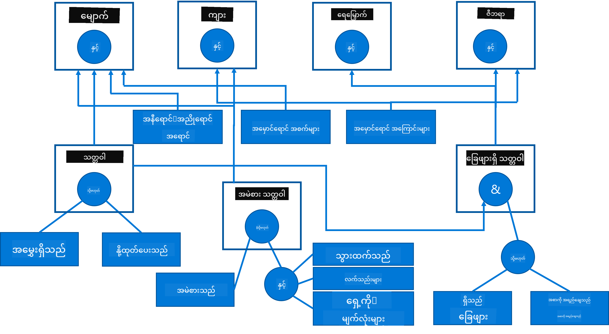

<!--
CO_OP_TRANSLATOR_METADATA:
{
  "original_hash": "7d097f7fda9166ead615e4c34552381b",
  "translation_date": "2025-09-23T15:19:58+00:00",
  "source_file": "lessons/2-Symbolic/README.md",
  "language_code": "my"
}
-->
# Knowledge Representation and Expert Systems


> Sketchnote by [Tomomi Imura](https://twitter.com/girlie_mac)

အတုအကျင့်တုရရှိရန် လူသားများကဲ့သို့ ကမ္ဘာကြီးကို နားလည်နိုင်ရန် အသိပညာကို ရှာဖွေခြင်းအပေါ် အခြေခံထားသည်။ ဒါပေမယ့် ဒါကို ဘယ်လိုလုပ်နိုင်မလဲ?

## [Pre-lecture quiz](https://ff-quizzes.netlify.app/en/ai/quiz/3)

AI ရဲ့အစောပိုင်းကာလတွေမှာ အတုအကျင့်တုစနစ်တွေကို ဖန်တီးဖို့အတွက် အပေါ်မှအောက်သို့သွားတဲ့နည်းလမ်း (ယခင်သင်ခန်းစာမှာ ဆွေးနွေးခဲ့တဲ့) အလွန်လူကြိုက်များခဲ့တယ်။ ဒီအယူအဆက လူတွေကနေ အသိပညာကို စက်နည်းနည်းဖြင့် ဖော်ပြနိုင်တဲ့ပုံစံတစ်ခုအဖြစ် ထုတ်ယူပြီး ပြဿနာတွေကို အလိုအလျောက် ဖြေရှင်းဖို့ အသုံးပြုတာဖြစ်တယ်။ ဒီနည်းလမ်းက အဓိကအယူအဆနှစ်ခုအပေါ် အခြေခံထားပါတယ်-

* Knowledge Representation (အသိပညာကိုဖော်ပြခြင်း)
* Reasoning (အကြောင်းအရာဆင်ခြင်း)

## Knowledge Representation

Symbolic AI ရဲ့ အရေးကြီးတဲ့အယူအဆတစ်ခုက **အသိပညာ** ဖြစ်ပါတယ်။ အသိပညာကို *အချက်အလက်* သို့မဟုတ် *ဒေတာ* နဲ့ ကွဲပြားစွာ သတ်မှတ်ဖို့ အရေးကြီးပါတယ်။ ဥပမာအားဖြင့် စာအုပ်တွေက အသိပညာကို ပါဝင်တယ်လို့ ပြောနိုင်တယ်၊ အကြောင်းက စာအုပ်တွေကို လေ့လာပြီး ကျွမ်းကျင်သူဖြစ်နိုင်တယ်။ ဒါပေမယ့် စာအုပ်တွေမှာ ပါဝင်တာက *ဒေတာ* လို့ခေါ်ပြီး စာအုပ်တွေကို ဖတ်ပြီး ဒီဒေတာကို ကမ္ဘာကြီးရဲ့ မော်ဒယ်ထဲမှာ ပေါင်းစည်းခြင်းအားဖြင့် ဒေတာကို အသိပညာအဖြစ် ပြောင်းလဲပါတယ်။

> ✅ **အသိပညာ** ဆိုတာ ကျွန်တော်တို့ရဲ့ ဦးနှောက်ထဲမှာ ပါဝင်ပြီး ကမ္ဘာကြီးကို နားလည်မှုကို ကိုယ်စားပြုပါတယ်။ ဒါကို **လေ့လာမှု** လုပ်ငန်းစဉ်တစ်ခုအားဖြင့် ရရှိပြီး ကျွန်တော်တို့ရဲ့ ကမ္ဘာကြီးရဲ့ မော်ဒယ်ထဲမှာ ရရှိတဲ့ အချက်အလက်တွေကို ပေါင်းစည်းခြင်းဖြင့် ရရှိပါတယ်။

အများအားဖြင့် အသိပညာကို တိတိကျကျ သတ်မှတ်မထားပေမယ့် [DIKW Pyramid](https://en.wikipedia.org/wiki/DIKW_pyramid) ကို အသုံးပြုပြီး အခြားဆက်စပ်အယူအဆတွေနဲ့ ကိုက်ညီစေပါတယ်။ ဒီမှာ အောက်ပါအယူအဆတွေ ပါဝင်ပါတယ်-

* **ဒေတာ** ဆိုတာ ရုပ်ပိုင်းဆိုင်ရာမီဒီယာမှာ ဖော်ပြထားတဲ့ အရာဖြစ်ပြီး စာသားရေးခြင်း သို့မဟုတ် စကားပြောခြင်းလိုမျိုးဖြစ်ပါတယ်။ ဒေတာက လူသားတွေကို မူတည်မထားဘဲ အပြန်အလှန် ပေးပို့နိုင်ပါတယ်။
* **အချက်အလက်** ဆိုတာ ကျွန်တော်တို့ရဲ့ ဦးနှောက်ထဲမှာ ဒေတာကို အဓိပ္ပါယ်ဖွင့်ခြင်းဖြစ်ပါတယ်။ ဥပမာအားဖြင့် *ကွန်ပျူတာ* ဆိုတဲ့ စကားလုံးကို ကြားရင် ကျွန်တော်တို့မှာ အဲဒီအရာက ဘာလဲဆိုတာ နားလည်မှုတစ်ခု ရှိပါတယ်။
* **အသိပညာ** ဆိုတာ အချက်အလက်ကို ကျွန်တော်တို့ရဲ့ ကမ္ဘာကြီးရဲ့ မော်ဒယ်ထဲမှာ ပေါင်းစည်းခြင်းဖြစ်ပါတယ်။ ဥပမာအားဖြင့် ကွန်ပျူတာက ဘာလဲဆိုတာ လေ့လာပြီးရင် အဲဒါ ဘယ်လိုအလုပ်လုပ်လဲ၊ ဘယ်လောက်ကုန်ကျလဲ၊ ဘာအတွက် အသုံးပြုနိုင်လဲဆိုတာ အကြောင်းအရာတွေကို သိလာပါတယ်။ ဒီဆက်စပ်အကြောင်းအရာတွေက ကျွန်တော်တို့ရဲ့ အသိပညာကို ဖွဲ့စည်းပါတယ်။
* **ပညာ** ဆိုတာ ကမ္ဘာကြီးကို နားလည်မှုရဲ့ တစ်ဆင့်ပိုမိုမြင့်မားတဲ့အဆင့်ဖြစ်ပြီး *meta-knowledge* ကို ကိုယ်စားပြုပါတယ်၊ ဥပမာအားဖြင့် အသိပညာကို ဘယ်လို သုံးရမလဲ၊ ဘယ်အချိန်မှာ သုံးရမလဲဆိုတဲ့ အယူအဆတွေပါဝင်ပါတယ်။


*Image [from Wikipedia](https://commons.wikimedia.org/w/index.php?curid=37705247), By Longlivetheux - Own work, CC BY-SA 4.0*

ဒါကြောင့် **အသိပညာကိုဖော်ပြခြင်း** ဆိုတာ စက်ထဲမှာ ဒေတာအဖြစ် အသိပညာကို ထိရောက်စွာ ဖော်ပြနိုင်တဲ့ နည်းလမ်းတစ်ခုကို ရှာဖွေဖို့ ပြဿနာဖြစ်ပါတယ်၊ အလိုအလျောက် အသုံးပြုနိုင်စေဖို့ပါ။ ဒါကို အောက်ပါအတိုင်း စက်ရုပ်နည်းလမ်းအဖြစ် မြင်နိုင်ပါတယ်-


> Image by [Dmitry Soshnikov](http://soshnikov.com)

* ဘယ်ဘက်မှာတော့ စက်ရုပ်တွေက ထိရောက်စွာ အသုံးပြုနိုင်တဲ့ အသိပညာကို ဖော်ပြတဲ့ အလွန်ရိုးရှင်းတဲ့ပုံစံတွေ ရှိပါတယ်။ အလွန်ရိုးရှင်းတဲ့ပုံစံက algorithmic ဖြစ်ပြီး အသိပညာကို ကွန်ပျူတာပရိုဂရမ်အဖြစ် ဖော်ပြပါတယ်။ ဒါပေမယ့် ဒါက အသိပညာကို ဖော်ပြဖို့ အကောင်းဆုံးနည်းလမ်းမဟုတ်ပါဘူး၊ အကြောင်းက ဒါက အလွန်တင်းကြပ်ပါတယ်။ ကျွန်တော်တို့ရဲ့ ဦးနှောက်ထဲမှာ ရှိတဲ့ အသိပညာက algorithmic မဟုတ်ပါဘူး။
* ညာဘက်မှာတော့ သဘာဝစာသားလိုမျိုး ဖော်ပြချက်တွေ ရှိပါတယ်။ ဒါက အလွန်အစွမ်းထက်ပေမယ့် အလိုအလျောက် reasoning အတွက် အသုံးမပြုနိုင်ပါဘူး။

> ✅ သင့်ရဲ့ ဦးနှောက်ထဲမှာ အသိပညာကို ဘယ်လို ဖော်ပြပြီး မှတ်စုအဖြစ် ပြောင်းလဲတယ်ဆိုတာ တစ်မိနစ်လောက် စဉ်းစားပါ။ retention ကို အကောင်းဆုံး အထောက်အကူဖြစ်စေတဲ့ ပုံစံတစ်ခု ရှိပါသလား?

## Classifying Computer Knowledge Representations

ကွန်ပျူတာအသိပညာကို ဖော်ပြတဲ့ နည်းလမ်းတွေကို အောက်ပါအမျိုးအစားတွေမှာ ခွဲခြားနိုင်ပါတယ်-

* **Network representations** ဆိုတာ ကျွန်တော်တို့ရဲ့ ဦးနှောက်ထဲမှာ ဆက်စပ်အကြောင်းအရာတွေ ရှိတဲ့ network ကို အခြေခံထားပါတယ်။ ဒီ network တွေကို ကွန်ပျူတာထဲမှာ graph အဖြစ် ပြန်ဖန်တီးနိုင်ပါတယ် - **semantic network** လို့ခေါ်ပါတယ်။

1. **Object-Attribute-Value triplets** သို့မဟုတ် **attribute-value pairs**. Graph ကို ကွန်ပျူတာထဲမှာ nodes နဲ့ edges ရဲ့ စာရင်းအဖြစ် ဖော်ပြနိုင်တဲ့အတွက် semantic network ကို objects, attributes, နဲ့ values ပါဝင်တဲ့ triplets စာရင်းအဖြစ် ဖော်ပြနိုင်ပါတယ်။ ဥပမာအားဖြင့် programming languages အကြောင်း triplets တွေကို ဖန်တီးနိုင်ပါတယ်-

Object | Attribute | Value
-------|-----------|------
Python | is | Untyped-Language
Python | invented-by | Guido van Rossum
Python | block-syntax | indentation
Untyped-Language | doesn't have | type definitions

> ✅ Triplets တွေကို အသိပညာအခြားအမျိုးအစားတွေကို ဖော်ပြဖို့ ဘယ်လို အသုံးပြုနိုင်မလဲဆိုတာ စဉ်းစားပါ။

2. **Hierarchical representations** ဆိုတာ ကျွန်တော်တို့ရဲ့ ဦးနှောက်ထဲမှာ objects တွေကို hierarchy အဖြစ် ဖန်တီးတယ်ဆိုတဲ့ အချက်ကို အလေးပေးပါတယ်။ ဥပမာအားဖြင့် canary က ငှက်တစ်မျိုးဖြစ်ပြီး ငှက်အားလုံးမှာ တောင်ပံရှိတယ်ဆိုတာ ကျွန်တော်တို့သိပါတယ်။ ကျွန်တော်တို့မှာ canary ရဲ့ အရောင်၊ ပျံသန်းမှုအမြန်နှုန်းအကြောင်း အယူအဆတွေ ရှိပါတယ်။

   - **Frame representation** ဆိုတာ object တစ်ခု သို့မဟုတ် object အမျိုးအစားတစ်ခုကို **frame** အဖြစ် ဖော်ပြပြီး **slots** ပါဝင်ပါတယ်။ Slots တွေမှာ default values, value restrictions, သို့မဟုတ် value ကို ရရှိဖို့ stored procedures တွေ ပါဝင်နိုင်ပါတယ်။ Frame အားလုံးက object hierarchy နဲ့ တူတဲ့ hierarchy ကို ဖွဲ့စည်းပါတယ်။
   - **Scenarios** ဆိုတာ အချိန်အတွင်း ဖွင့်လှစ်နိုင်တဲ့ အခွအေနေတွေကို ကိုယ်စားပြုတဲ့ frame အမျိုးအစားတစ်ခုဖြစ်ပါတယ်။

**Python**

Slot | Value | Default value | Interval |
-----|-------|---------------|----------|
Name | Python | | |
Is-A | Untyped-Language | | |
Variable Case | | CamelCase | |
Program Length | | | 5-5000 lines |
Block Syntax | Indent | | |

3. **Procedural representations** ဆိုတာ အခြေအနေတစ်ခု ဖြစ်ပေါ်တဲ့အခါ အကောင်အထည်ဖော်နိုင်တဲ့ လုပ်ဆောင်မှုစာရင်းတစ်ခုအားဖြင့် အသိပညာကို ဖော်ပြခြင်းဖြစ်ပါတယ်။
   - Production rules ဆိုတာ if-then စကားပြောချက်တွေဖြစ်ပြီး ကျွန်တော်တို့ကို အကြောင်းအရာဆင်နိုင်စေပါတယ်။ ဥပမာအားဖြင့် ဆရာဝန်တစ်ဦးမှာ **IF** လူနာမှာ အဖျားအလွန်မြင့် **OR** သွေးစမ်းသပ်မှုမှာ C-reactive protein အဆင့်မြင့် **THEN** သူမှာ အရောင်ရောင်ခြင်းရှိတယ်ဆိုတဲ့ rule ရှိနိုင်ပါတယ်။ အခြေအနေတစ်ခုကို တွေ့ရင် အရောင်ရောင်ခြင်းအကြောင်းအရာကို ဆင်နိုင်ပြီး နောက်ထပ် reasoning အတွက် အသုံးပြုနိုင်ပါတယ်။
   - Algorithms တွေကို knowledge-based systems တွေမှာ တိုက်ရိုက် အသုံးမပြုသော်လည်း procedural representation အမျိုးအစားတစ်ခုအဖြစ် သတ်မှတ်နိုင်ပါတယ်။

4. **Logic** ကို Aristotle က လူသားရဲ့ အထူးသဖြင့် universal အသိပညာကို ဖော်ပြဖို့ နည်းလမ်းတစ်ခုအဖြစ် အစဉ်အလာအဖြစ် အကြံပြုခဲ့ပါတယ်။
   - Predicate Logic ကို mathematical theory အဖြစ် သတ်မှတ်နိုင်ပေမယ့် computable မဖြစ်နိုင်လို့ Prolog မှာ အသုံးပြုတဲ့ Horn clauses လိုမျိုး subset တစ်ခုကို အသုံးပြုပါတယ်။
   - Descriptive Logic ဆိုတာ object hierarchy တွေကို ဖော်ပြပြီး semantic web လိုမျိုး knowledge representations တွေကို reasoning လုပ်ဖို့ အသုံးပြုတဲ့ logical systems မျိုးရိုးတစ်ခုဖြစ်ပါတယ်။

## Expert Systems

Symbolic AI ရဲ့ အစောပိုင်းအောင်မြင်မှုတွေထဲမှာ **expert systems** လို့ခေါ်တဲ့ စနစ်တွေ ပါဝင်ပါတယ်။ ဒီစနစ်တွေက အကန့်အသတ်ရှိတဲ့ ပြဿနာဒေသတစ်ခုမှာ ကျွမ်းကျင်သူတစ်ဦးအဖြစ် လုပ်ဆောင်ဖို့ ဖန်တီးထားတဲ့ computer systems တွေဖြစ်ပါတယ်။ ဒီစနစ်တွေမှာ **knowledge base** ကို လူသားကျွမ်းကျင်သူတစ်ဦး သို့မဟုတ် အများအပြားကနေ ထုတ်ယူပြီး **inference engine** ကို အသုံးပြုပြီး reasoning လုပ်ပါတယ်။

 | 
---------------------------------------------|------------------------------------------------
လူသားရဲ့ ဦးနှောက်စနစ်ရဲ့ ရိုးရှင်းတဲ့ဖွဲ့စည်းမှု | အသိပညာအခြေခံစနစ်ရဲ့ ဖွဲ့စည်းမှု

Expert systems တွေကို လူသားရဲ့ reasoning စနစ်လိုမျိုး ဖွဲ့စည်းထားပြီး **short-term memory** နဲ့ **long-term memory** ပါဝင်ပါတယ်။ အတူတူပဲ knowledge-based systems တွေမှာ အောက်ပါ components တွေကို ခွဲခြားထားပါတယ်-

* **Problem memory**: လက်ရှိဖြေရှင်းနေတဲ့ ပြဿနာအကြောင်း အသိပညာကို ပါဝင်ပါတယ်၊ ဥပမာအားဖြင့် လူနာရဲ့ အပူချိန် သို့မဟုတ် သွေးပေါင်ချိန်၊ သူမှာ အရောင်ရောင်ခြင်းရှိ/မရှိ စသည်တို့ပါဝင်ပါတယ်။ ဒီအသိပညာကို **static knowledge** လို့လည်း ခေါ်ပြီး လက်ရှိပြဿနာအခြေအနေကို snapshot အဖြစ် ဖော်ပြပါတယ်။
* **Knowledge base**: ပြဿနာဒေသအကြောင်း ရေရှည်အသိပညာကို ကိုယ်စားပြုပါတယ်။ ဒါကို လူသားကျွမ်းကျင်သူတွေကနေ လက်နက်ဖြင့် ထုတ်ယူပြီး consultation တစ်ခုမှ consultation တစ်ခုအထိ မပြောင်းလဲပါဘူး။ ဒါက ပြဿနာအခြေအနေတစ်ခုမှ တစ်ခုကို navigation လုပ်နိုင်စေတဲ့အတွက် **dynamic knowledge** လို့လည်း ခေါ်ပါတယ်။
* **Inference engine**: ပြဿနာအခြေအနေ space ထဲမှာ ရှာဖွေမှုလုပ်ငန်းစဉ်ကို စီမံခန့်ခွဲပြီး လိုအပ်တဲ့အခါ user ကို မေးခွန်းများမေးခြင်းကို လုပ်ဆောင်ပါတယ်။ ဒါကလည်း state တစ်ခုစီမှာ အသုံးပြုဖို့ rule တွေကို ရှာဖွေဖို့ တာဝန်ရှိပါတယ်။

ဥပမာအားဖြင့် အောက်ပါ expert system ကို သက်ရှိတစ်ခုရဲ့ ရုပ်ပိုင်းဆိုင်ရာလက္ခဏာအပေါ် အခြေခံပြီး သတ်မှတ်ခြင်းလုပ်ငန်းစဉ်အဖြစ် တွေးဆနိုင်ပါတယ်-



> Image by [Dmitry Soshnikov](http://soshnikov.com)

ဒီ diagram ကို **AND-OR tree** လို့ခေါ်ပြီး production rules တွေကို ကိုယ်စားပြုတဲ့ ဂရပ်ဖစ် representation ဖြစ်ပါတယ်။ Expert က knowledge ကို ထုတ်ယူတဲ့အစမှာ tree ကို ရေးဆွဲတာ အကျိုးရှိပါတယ်။ Knowledge ကို ကွန်ပျူတာထဲမှာ ဖော်ပြဖို့ rule တွေကို အသုံးပြုတာ ပိုအဆင်ပြေပါတယ်-

```
IF the animal eats meat
OR (animal has sharp teeth
    AND animal has claws
    AND animal has forward-looking eyes
) 
THEN the animal is a carnivore
```

သင်တွေ့ရတဲ့ rule ရဲ့ left-hand-side (LHS) conditions နဲ့ action တွေဟာ အခြေခံအားဖြင့် object-attribute-value (OAV) triplets တွေဖြစ်ပါတယ်။ **Working memory** က လက်ရှိဖြေရှင်းနေတဲ့ ပြဿနာကို ကိုယ်စားပြုတဲ့ OAV triplets တွေကို ပါဝင်ပါတယ်။ **Rules engine** က condition ကို ဖြည့်ဆည်းတဲ့ rule တွေကို ရှာပြီး အသုံးပြုပြီး working memory ထဲမှာ triplet အသစ်တစ်ခုကို ထည့်သွင်းပါတယ်။

> ✅ သင်နှစ်သက်တဲ့ အကြောင်းအရာတစ်ခုအပေါ် AND-OR tree ကို ကိုယ်တိုင်ရေးဆွဲပါ!

### Forward vs. Backward Inference

အထက်မှာ ဖော်ပြထားတဲ့လုပ်ငန်းစဉ်ကို **forward inference** လို့ခေါ်ပါတယ်။ ဒါက working memory ထဲမှာ ပြဿနာအကြောင်း အချက်အလက်အစောပိုင်းနဲ့ စတင်ပြီး reasoning loop ကို အောက်ပါအတိုင်း လုပ်ဆောင်ပါတယ်-

1. Target attribute ကို working memory ထဲမှာ တွေ့ရင် - ရပ်ပြီး ရလဒ်ကို ပေးပါ
2. လက်ရှိ condition ကို ဖြည့်ဆည်းတဲ့ rule တွေကို ရှာပါ - **conflict set** ကို ရယူပါ။
3. **Conflict resolution** လုပ်ပါ - ဒီအဆင့်မှာ အကောင်အထည်ဖော်မယ့် rule တစ်ခုကို ရွေးပါ။ Conflict resolution strategy တွေက အမျိုးမျိုးရှိနိုင်ပါတယ်-
   - Knowledge base ထဲမှာ အသုံးပြုနိုင်တဲ့ ပထမ rule ကို ရွေးပါ
   - Random rule ကို ရွေးပါ
   - *ပိုသေ
- XML အခြေခံထားသော ဘာသာစကားများ၏ မိသားစု - RDF (Resource Description Framework), RDFS (RDF Schema), OWL (Ontology Web Language)။

Semantic Web တွင် အဓိကအကြောင်းအရာတစ်ခုမှာ **Ontology** ဖြစ်သည်။ ၎င်းသည် တိကျသော နယ်ပယ်တစ်ခုကို တိကျသော အသိပညာကိုယ်စားပြုမှုဖြင့် ဖော်ပြခြင်းကို ဆိုလိုသည်။ အလွယ်ဆုံး Ontology သည် နယ်ပယ်အတွင်းရှိ အရာဝတ္ထုများ၏ အဆင့်ဆင့်အဆောက်အအုံဖြစ်နိုင်သော်လည်း၊ ပိုမိုရှုပ်ထွေးသော Ontology များတွင် သုံးနိုင်သော သတ်မှတ်ချက်များပါဝင်မည်ဖြစ်သည်။

Semantic Web တွင် အားလုံးကို triplets အခြေခံ၍ ကိုယ်စားပြုထားသည်။ အရာဝတ္ထုနှင့် ဆက်နွယ်မှုတိုင်းကို URI ဖြင့် တစ်ခုတည်းသာ သတ်မှတ်ထားသည်။ ဥပမာအားဖြင့် ဒီ AI Curriculum ကို Dmitry Soshnikov က ဇန်နဝါရီ ၁ ရက်၊ ၂၀၂၂ တွင် ဖန်တီးခဲ့သည်ဟု ပြောလိုပါက - သုံးနိုင်သော triplets များမှာ အောက်ပါအတိုင်းဖြစ်သည်။


```
http://github.com/microsoft/ai-for-beginners http://www.example.com/terms/creation-date “Jan 13, 2007”
http://github.com/microsoft/ai-for-beginners http://purl.org/dc/elements/1.1/creator http://soshnikov.com
```

> ✅ ဒီမှာ `http://www.example.com/terms/creation-date` နှင့် `http://purl.org/dc/elements/1.1/creator` သည် *creator* နှင့် *creation date* ကို ကိုယ်စားပြုရန် အသိအမှတ်ပြုထားသော URI များဖြစ်သည်။

ပိုမိုရှုပ်ထွေးသော အခြေအနေတွင်၊ ဖန်တီးသူများ၏ စာရင်းကို သတ်မှတ်လိုပါက RDF တွင် သတ်မှတ်ထားသော ဒေတာဖွဲ့စည်းမှုများကို အသုံးပြုနိုင်သည်။


> အထက်ပါ အကြမ်းဖျင်းပုံများကို [Dmitry Soshnikov](http://soshnikov.com) မှ ဖန်တီးထားသည်။

Semantic Web တည်ဆောက်မှု၏ တိုးတက်မှုသည် ရှာဖွေမှုအင်ဂျင်များနှင့် သဘာဝဘာသာစကားကို ကိုင်တွယ်နိုင်သော နည်းပညာများ၏ အောင်မြင်မှုကြောင့် တစ်စိတ်တစ်ပိုင်းနှေးကွေးခဲ့သည်။ သို့သော် အချို့နယ်ပယ်များတွင် Ontology များနှင့် အသိပညာအခြေခံများကို ထိန်းသိမ်းရန် အရေးကြီးသော ကြိုးပမ်းမှုများရှိနေဆဲဖြစ်သည်။ အောက်ပါစီမံကိန်းများသည် အရေးပါသည် -

* [WikiData](https://wikidata.org/) သည် Wikipedia နှင့် ဆက်စပ်ထားသော စက်ဖြင့်ဖတ်နိုင်သော အသိပညာအခြေခံများ၏ စုစည်းမှုဖြစ်သည်။ ဒေတာအများစုကို Wikipedia *InfoBoxes* (Wikipedia စာမျက်နှာများအတွင်းရှိ ဖွဲ့စည်းထားသော အကြောင်းအရာများ) မှ ထုတ်ယူထားသည်။ SPARQL ဆိုသော Semantic Web အတွက် အထူး query ဘာသာစကားဖြင့် [query](https://query.wikidata.org/) Wikidata ကို ရှာဖွေနိုင်သည်။ လူများအကြား အများဆုံးတွေ့ရသော မျက်လုံးအရောင်များကို ပြသသည့် query တစ်ခုမှာ -

```sparql
#defaultView:BubbleChart
SELECT ?eyeColorLabel (COUNT(?human) AS ?count)
WHERE
{
  ?human wdt:P31 wd:Q5.       # human instance-of homo sapiens
  ?human wdt:P1340 ?eyeColor. # human eye-color ?eyeColor
  SERVICE wikibase:label { bd:serviceParam wikibase:language "en". }
}
GROUP BY ?eyeColorLabel
```

* [DBpedia](https://www.dbpedia.org/) သည် WikiData နှင့် ဆင်တူသော ကြိုးပမ်းမှုတစ်ခုဖြစ်သည်။

> ✅ သင်၏ကိုယ်ပိုင် Ontology များကို တည်ဆောက်ရန် သို့မဟုတ် ရှိပြီးသား Ontology များကို ဖွင့်ရန် စမ်းသပ်လိုပါက [Protégé](https://protege.stanford.edu/) ဟုခေါ်သော အလွန်ကောင်းမွန်သော Ontology တည်းဖြတ်ရေးကိရိယာတစ်ခုရှိသည်။ ဒေါင်းလုဒ်လုပ်ပါ၊ သို့မဟုတ် အွန်လိုင်းတွင် အသုံးပြုပါ။


*Web Protégé editor သည် Romanov Family Ontology ဖြင့် ဖွင့်ထားသည်။ Dmitry Soshnikov မှ Screenshot*

## ✍️ လေ့ကျင့်မှု - မိသားစု Ontology

Semantic Web နည်းပညာများကို အသုံးပြု၍ မိသားစုဆက်နွယ်မှုများကို Reasoning လုပ်ပုံကို [FamilyOntology.ipynb](https://github.com/Ezana135/AI-For-Beginners/blob/main/lessons/2-Symbolic/FamilyOntology.ipynb) တွင် ကြည့်ပါ။ GEDCOM ဖော်ပြချက်ပုံစံဖြင့် ကိုယ်စားပြုထားသော မိသားစုသစ်တစ်ခုနှင့် မိသားစုဆက်နွယ်မှု Ontology တစ်ခုကို အသုံးပြု၍ သတ်မှတ်ထားသော လူများအတွက် မိသားစုဆက်နွယ်မှုများ၏ ဂရပ်ဖွဲ့စည်းမှုကို တည်ဆောက်ပါ။

## Microsoft Concept Graph

အများဆုံးအခြေအနေများတွင် Ontology များကို လက်ဖြင့်သေချာစွာ ဖန်တီးထားသည်။ သို့သော် Unstructured Data (ဥပမာ - သဘာဝဘာသာစကားစာသားများ) မှ Ontology များကို **ထုတ်ယူ**နိုင်သည်။

Microsoft Research မှ ကြိုးပမ်းမှုတစ်ခုဖြစ်ပြီး [Microsoft Concept Graph](https://blogs.microsoft.com/ai/microsoft-researchers-release-graph-that-helps-machines-conceptualize/?WT.mc_id=academic-77998-cacaste) ကို ရလဒ်အဖြစ်ရရှိခဲ့သည်။

၎င်းသည် `is-a` အဆင့်ဆင့်ဆက်နွယ်မှုကို အသုံးပြု၍ အဖွဲ့ဖွဲ့စည်းထားသော အရာဝတ္ထုများ၏ စုစည်းမှုကြီးတစ်ခုဖြစ်သည်။ "Microsoft ဆိုတာဘာလဲ?" ဆိုသည့်မေးခွန်းကို "ကုမ္ပဏီ (0.87) နှင့် အမှတ်တံဆိပ် (0.75)" ဟုဖြေဆိုနိုင်သည်။

Graph ကို REST API အဖြစ် သို့မဟုတ် အဖွဲ့စည်းထားသော အရာဝတ္ထုများကို ဖော်ပြထားသော စာသားဖိုင်ကြီးအဖြစ် ရရှိနိုင်သည်။

## ✍️ လေ့ကျင့်မှု - Concept Graph

Microsoft Concept Graph ကို အသုံးပြု၍ သတင်းဆောင်းပါးများကို အမျိုးအစားအတန်းများသို့ အုပ်စုဖွဲ့ပုံကို ကြည့်ရန် [MSConceptGraph.ipynb](https://github.com/microsoft/AI-For-Beginners/blob/main/lessons/2-Symbolic/MSConceptGraph.ipynb) notebook ကို စမ်းသပ်ပါ။

## နိဂုံး

ယနေ့ခေတ်တွင် AI ကို *Machine Learning* သို့မဟုတ် *Neural Networks* နှင့် အတူတူဖြစ်သည်ဟု ယူဆကြသည်။ သို့သော် လူသားတစ်ဦးသည် Neural Networks များက ကိုင်တွယ်နိုင်ခြင်းမရှိသေးသော တိကျသော Reasoning ကိုလည်း ပြသသည်။ အမှန်တကယ်သော စီမံကိန်းများတွင် တိကျသော Reasoning ကို ရှင်းလင်းချက်များလိုအပ်သော အလုပ်များကို ဆောင်ရွက်ရန် သို့မဟုတ် စနစ်၏ အပြုအမူကို ထိန်းချုပ်နိုင်သော နည်းလမ်းဖြင့် ပြောင်းလဲရန် အသုံးပြုနေဆဲဖြစ်သည်။

## 🚀 စိန်ခေါ်မှု

ဒီသင်ခန်းစာနှင့် ဆက်စပ်ထားသော Family Ontology notebook တွင် မိသားစုသစ်များ၏ ဆက်နွယ်မှုများကို စမ်းသပ်နိုင်ရန် အခွင့်အလမ်းရှိသည်။ မိသားစုသစ်တွင် လူများအကြား ဆက်နွယ်မှုအသစ်များကို ရှာဖွေကြည့်ပါ။

## [Post-lecture quiz](https://ff-quizzes.netlify.app/en/ai/quiz/4)

## ပြန်လည်သုံးသပ်ခြင်းနှင့် ကိုယ်တိုင်လေ့လာခြင်း

လူသားများသည် အသိပညာကို အရေအတွက်သတ်မှတ်၍ စနစ်တကျဖော်ပြရန် ကြိုးပမ်းခဲ့သော နယ်ပယ်များကို ရှာဖွေပါ။ Bloom's Taxonomy ကို ကြည့်ရှုပါ၊ လူသားများသည် ၎င်းတို့၏ ကမ္ဘာကို နားလည်ရန် ကြိုးပမ်းခဲ့ပုံကို သမိုင်းကြောင်းအရ ပြန်လည်လေ့လာပါ။ Linnaeus ၏ အလုပ်ကို ကြည့်ရှု၍ အဖွဲ့ဖွဲ့စည်းမှုတစ်ခုကို ဖန်တီးပုံနှင့် Dmitri Mendeleev ၏ ဓာတုဒြပ်စင်များကို ဖော်ပြ၍ အုပ်စုဖွဲ့ပုံကို လေ့လာပါ။ သင်ရှာဖွေနိုင်သော အခြားစိတ်ဝင်စားဖွယ် ဥပမာများကို ရှာဖွေပါ။

**Assignment**: [Build an Ontology](assignment.md)

---

