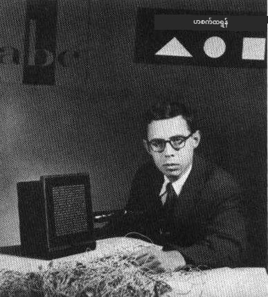
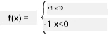

# နယူးရယ်နက်ဝက်များအကြောင်း: Perceptron

## [Pre-lecture quiz](https://ff-quizzes.netlify.app/en/ai/quiz/5)

နယူးရယ်နက်ဝက်တစ်ခုကို အခေတ်သစ်နည်းပညာနဲ့ဆင်တူအောင် ဖန်တီးဖို့အတွက် ပထမဆုံးကြိုးစားမှုတစ်ခုကို 1957 ခုနှစ်မှာ Cornell Aeronautical Laboratory မှ Frank Rosenblatt ကလုပ်ခဲ့ပါတယ်။ ဒါဟာ "Mark-1" လို့ခေါ်တဲ့ hardware implementation ဖြစ်ပြီး တြိဂံ၊ စတုရန်း၊ ရှိုင်းကယ်လ်လိုက်စတဲ့ ရုပ်ပုံအခြေခံဂျီဩမေထရိကပုံများကို မှတ်မိစေဖို့ ဒီဇိုင်းထုတ်ထားတာပါ။

|      |      |
|--------------|-----------|
| | |

> ပုံများ [Wikipedia မှ](https://en.wikipedia.org/wiki/Perceptron)

input image ကို 20x20 photocell array နဲ့ဖော်ပြထားပြီး နယူးရယ်နက်ဝက်မှာ input 400 ခုနဲ့ binary output တစ်ခုရှိပါတယ်။ ရိုးရှင်းတဲ့ network တစ်ခုမှာ neuron တစ်ခုသာပါဝင်ပြီး **threshold logic unit** လို့လည်းခေါ်ပါတယ်။ နယူးရယ်နက်ဝက်ရဲ့ weight တွေဟာ training အဆင့်မှာ လက်ဖြင့်ချိန်ညှိရတဲ့ potentiometer အဖြစ်လုပ်ဆောင်ပါတယ်။

> ✅ Potentiometer ဆိုတာ circuit ရဲ့ resistance ကို user ကချိန်ညှိနိုင်စေတဲ့ device တစ်ခုပါ။

> အဲဒီအချိန်မှာ The New York Times က perceptron အကြောင်းရေးသားခဲ့တာက: *[Navy] က မျှော်လင့်ထားတဲ့ အီလက်ထရွန်နစ်ကွန်ပျူတာရဲ့ embryo ဖြစ်ပြီး လမ်းလျှောက်နိုင်၊ စကားပြောနိုင်၊ မြင်နိုင်၊ ရေးနိုင်၊ ကိုယ်တိုင်ထုတ်လုပ်နိုင်၊ ကိုယ်တိုင်ရဲ့တည်ရှိမှုကို သိနိုင်မယ်လို့ဆိုထားပါတယ်။*

## Perceptron Model

Suppose ကျွန်တော်တို့ရဲ့ model မှာ N features ရှိတယ်လို့ဆိုရင်၊ input vector ဟာ N အရွယ်အစားရှိတဲ့ vector ဖြစ်ပါမယ်။ Perceptron ဟာ **binary classification** model ဖြစ်ပြီး input data ရဲ့ class နှစ်ခုကို ခွဲခြားနိုင်ပါတယ်။ input vector x တစ်ခုစီအတွက် perceptron ရဲ့ output ဟာ +1 ဒါမှမဟုတ် -1 ဖြစ်မယ်လို့ assumption လုပ်ထားပါတယ်။ Output ကို အောက်ပါ formula ကိုသုံးပြီးတွက်ချက်ပါမယ်-

y(x) = f(w<sup>T</sup>x)

f ဟာ step activation function ဖြစ်ပါတယ်။

<!-- img src="http://www.sciweavers.org/tex2img.php?eq=f%28x%29%20%3D%20%5Cbegin%7Bcases%7D%0A%20%20%20%20%20%20%20%20%20%2B1%20%26%20x%20%5Cgeq%200%20%5C%5C%0A%20%20%20%20%20%20%20%20%20-1%20%26%20x%20%3C%200%0A%20%20%20%20%20%20%20%5Cend%7Bcases%7D%20%5C%5C%0A&bc=White&fc=Black&im=jpg&fs=12&ff=arev&edit=0" align="center" border="0" alt="f(x) = \begin{cases} +1 & x \geq 0 \\ -1 & x < 0 \end{cases} \\" width="154" height="50" / -->


## Perceptron ကို Training လုပ်ခြင်း

Perceptron ကို training လုပ်ဖို့အတွက် အများဆုံး data တွေကို မှန်ကန်စွာခွဲခြားနိုင်တဲ့ weight vector w ကိုရှာဖွေရပါမယ်။ ဒါဟာ **error** အနည်းဆုံးဖြစ်စေဖို့လိုပါတယ်။ Error E ကို **perceptron criterion** အတိုင်းအောက်ပါအနည်းအကျဉ်းနည်းဖြင့်ဖော်ပြထားပါတယ်-

E(w) = -&sum;w<sup>T</sup>x<sub>i</sub>t<sub>i</sub>

ဒီမှာ:

* စုစုပေါင်းဟာ training data points i တွေထဲမှ wrong classification ဖြစ်တဲ့ data point တွေမှာသာယူထားပါတယ်။
* x<sub>i</sub> ဟာ input data ဖြစ်ပြီး t<sub>i</sub> ဟာ negative နဲ့ positive ตัวอย่างအတွက် -1 ဒါမှမဟုတ် +1 ဖြစ်ပါတယ်။

ဒီ criteria ကို weight w ရဲ့ function အနေနဲ့ယူထားပြီး minimize လုပ်ဖို့လိုပါတယ်။ အများအားဖြင့် **gradient descent** လို့ခေါ်တဲ့နည်းကိုသုံးပြီး w<sup>(0)</sup> ဆိုတဲ့ initial weight တွေကိုစပြီး၊ နောက်တစ်ဆင့်မှာ weight တွေကို အောက်ပါ formula အတိုင်း update လုပ်ပါတယ်-

w<sup>(t+1)</sup> = w<sup>(t)</sup> - &eta;&nabla;E(w)

ဒီမှာ &eta; ဟာ **learning rate** ဖြစ်ပြီး &nabla;E(w) ဟာ E ရဲ့ **gradient** ဖြစ်ပါတယ်။ Gradient ကိုတွက်ပြီးရင်-

w<sup>(t+1)</sup> = w<sup>(t)</sup> + &sum;&eta;x<sub>i</sub>t<sub>i</sub>

Python code အနေနဲ့ algorithm ဟာ အောက်ပါအတိုင်းဖြစ်ပါတယ်-

```python
def train(positive_examples, negative_examples, num_iterations = 100, eta = 1):

    weights = [0,0,0] # Initialize weights (almost randomly :)
        
    for i in range(num_iterations):
        pos = random.choice(positive_examples)
        neg = random.choice(negative_examples)

        z = np.dot(pos, weights) # compute perceptron output
        if z < 0: # positive example classified as negative
            weights = weights + eta*weights.shape

        z  = np.dot(neg, weights)
        if z >= 0: # negative example classified as positive
            weights = weights - eta*weights.shape

    return weights
```

## နိဂုံး

ဒီသင်ခန်းစာမှာ binary classification model ဖြစ်တဲ့ perceptron နဲ့ weight vector ကိုသုံးပြီး training လုပ်ပုံကိုလေ့လာခဲ့ပါတယ်။

## 🚀 စိန်ခေါ်မှု

သင့်ကိုယ်တိုင် perceptron တစ်ခုကိုတည်ဆောက်ချင်ရင် [Microsoft Learn မှ lab](https://docs.microsoft.com/en-us/azure/machine-learning/component-reference/two-class-averaged-perceptron?WT.mc_id=academic-77998-cacaste) ကိုစမ်းကြည့်ပါ။ ဒီမှာ [Azure ML designer](https://docs.microsoft.com/en-us/azure/machine-learning/concept-designer?WT.mc_id=academic-77998-cacaste) ကိုသုံးထားပါတယ်။

## [Post-lecture quiz](https://ff-quizzes.netlify.app/en/ai/quiz/6)

## ပြန်လည်သုံးသပ်ခြင်းနှင့် ကိုယ်တိုင်လေ့လာခြင်း

Perceptron ကို toy problem နဲ့ အမှန်တကယ်ဖြစ်ရပ်များကို ဖြေရှင်းဖို့ဘယ်လိုအသုံးပြုနိုင်တယ်ဆိုတာကိုလေ့လာဖို့ [Perceptron](Perceptron.ipynb) notebook ကိုသွားပါ။

Perceptron အကြောင်း [စိတ်ဝင်စားဖွယ်ဆောင်းပါး](https://towardsdatascience.com/what-is-a-perceptron-basics-of-neural-networks-c4cfea20c590) တစ်ခုလည်းရှိပါတယ်။

## [Assignment](lab/README.md)

ဒီသင်ခန်းစာမှာ binary classification task အတွက် perceptron တစ်ခုကိုတည်ဆောက်ပြီး handwritten digits နှစ်ခုကိုခွဲခြားဖို့အသုံးပြုခဲ့ပါတယ်။ ဒီ lab မှာတော့ digit classification ကိုအပြည့်အစုံဖြေရှင်းဖို့အလုပ်လုပ်ရမှာဖြစ်ပြီး ပုံတစ်ခုကိုအခြေခံပြီး digit ဘယ်ဟာဖြစ်နိုင်မလဲဆိုတာကိုဆုံးဖြတ်ရပါမယ်။

* [အညွှန်း](lab/README.md)
* [Notebook](lab/PerceptronMultiClass.ipynb)

---

