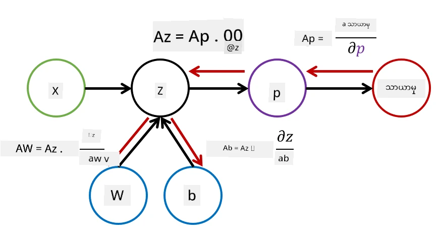

# နယူးရယ်နက်ဝါ့ခ်များကို မိတ်ဆက်ခြင်း။ Multi-Layered Perceptron

ယခင်အပိုင်းတွင် သင်သည် အလွယ်ဆုံး နယူးရယ်နက်ဝါ့ခ် မော်ဒယ် - တစ်လွှာတည်းရှိသော perceptron, linear two-class classification မော်ဒယ်ကို လေ့လာခဲ့ပါသည်။

ဤအပိုင်းတွင် ကျွန်ုပ်တို့သည် ဤမော်ဒယ်ကို ပိုမိုကျယ်ပြန့်သော framework အဖြစ် တိုးချဲ့မည်ဖြစ်ပြီး၊ အောက်ပါအရာများကို ပြုလုပ်နိုင်စေမည်ဖြစ်သည်-

* **multi-class classification** ကို two-class classification အပြင် ပြုလုပ်နိုင်ခြင်း
* classification အပြင် **regression problems** ကို ဖြေရှင်းနိုင်ခြင်း
* linear မဟုတ်သော classes များကို ခွဲခြားနိုင်ခြင်း

ထို့အပြင် Python တွင် မိမိကိုယ်တိုင် modular framework တစ်ခုကို ဖွံ့ဖြိုးတိုးတက်စေပြီး နယူးရယ်နက်ဝါ့ခ် architecture များကို တည်ဆောက်နိုင်စေမည်ဖြစ်သည်။

## [Pre-lecture quiz](https://ff-quizzes.netlify.app/en/ai/quiz/7)

## Machine Learning ကို တိကျစွာ ဖော်ပြခြင်း

Machine Learning ပြဿနာကို တိကျစွာ ဖော်ပြခြင်းဖြင့် စတင်ပါစို့။ **X** training dataset နှင့် **Y** labels ရှိသည်ဟု ယူဆပါ။ ထို့နောက် အတိအကျဆုံး ခန့်မှန်းချက်များ ပြုလုပ်နိုင်မည့် မော်ဒယ် *f* ကို တည်ဆောက်ရန် လိုအပ်ပါသည်။ ခန့်မှန်းချက်များ၏ အရည်အသွေးကို **Loss function** &lagran; ဖြင့် တိုင်းတာပါသည်။ အောက်ပါ loss functions များကို မကြာခဏ အသုံးပြုကြသည်-

* **Regression problem** အတွက်၊ နံပါတ်တစ်ခုကို ခန့်မှန်းရန် လိုအပ်သောအခါ **absolute error** &sum;i|f(x(i))-y(i)| သို့မဟုတ် **squared error** &sum;i(f(x(i))-y(i))2 ကို အသုံးပြုနိုင်သည်။
* **Classification** အတွက် **0-1 loss** (မော်ဒယ်၏ **accuracy** နှင့် အခြေခံအားဖြင့် တူညီသည်) သို့မဟုတ် **logistic loss** ကို အသုံးပြုသည်။

တစ်လွှာတည်းရှိသော perceptron အတွက် *f* function ကို *f(x)=wx+b* ဟု သတ်မှတ်ခဲ့သည် (ဤနေရာတွင် *w* သည် weight matrix, *x* သည် input features vector, *b* သည် bias vector ဖြစ်သည်။) နယူးရယ်နက်ဝါ့ခ် architecture များအတွက် ဤ function သည် ပိုမိုရှုပ်ထွေးသော ပုံစံကို ရရှိနိုင်သည်။

> Classification အတွက် class များ၏ probability များကို network output အဖြစ် ရရှိရန် မကြာခဏလိုအပ်သည်။ အကြောင်းအရာများကို probability များသို့ ပြောင်းရန် (ဥပမာ output ကို normalize ပြုလုပ်ရန်) **softmax** function &sigma; ကို အသုံးပြုကြသည်။ ထို့ကြောင့် *f* function သည် *f(x)=&sigma;(wx+b)* ဖြစ်လာသည်။

*F* ကို အထက်တွင် သတ်မှတ်ထားသောအတိုင်း *w* နှင့် *b* ကို **parameters** &theta;=⟨*w,b*⟩ ဟု ခေါ်သည်။ Dataset ⟨**X**,**Y**⟩ ကို ရရှိထားသောအခါ parameters &theta; အပေါ် dataset တစ်ခုလုံး၏ error ကို function အဖြစ်တွက်ချက်နိုင်သည်။

> ✅ **နယူးရယ်နက်ဝါ့ခ် training ၏ ရည်မှန်းချက်မှာ parameters &theta; ကို ပြောင်းလဲခြင်းဖြင့် error ကို လျှော့ချရန် ဖြစ်သည်**

## Gradient Descent Optimization

**Gradient descent** ဟုခေါ်သော function optimization နည်းလမ်းတစ်ခု ရှိသည်။ အဆိုပါ idea သည် loss function ၏ derivative (multi-dimensional အတွက် **gradient** ဟုခေါ်သည်) ကို parameters အပေါ်တွက်ချက်ပြီး error ကို လျှော့ချနိုင်စေရန် parameters များကို ပြောင်းလဲနိုင်သည်။ ဤနည်းလမ်းကို အောက်ပါအတိုင်း formalize ပြုလုပ်နိုင်သည်-

* Parameters များကို w(0), b(0) အဖြစ် random value များဖြင့် initialize ပြုလုပ်ပါ။
* အောက်ပါအဆင့်ကို မကြာခဏ ထပ်လုပ်ပါ-
    - w(i+1) = w(i)-&eta;&part;&lagran;/&part;w
    - b(i+1) = b(i)-&eta;&part;&lagran;/&part;b

Training အတွင်း optimization steps များကို dataset တစ်ခုလုံးကို အခြေခံ၍ တွက်ချက်ရန် ရည်ရွယ်ထားသည် (loss သည် training samples အားလုံးကို စုစုပေါင်းတွက်ချက်ထားသည်ကို မှတ်ထားပါ။) သို့သော် အမှန်တကယ်တွင် dataset ၏ အပိုင်းငယ်များကို **minibatches** ဟုခေါ်သည်။ ထို့နောက် data subset အပေါ် gradient များကို တွက်ချက်သည်။ Subset ကို တစ်ခါတစ်လေ random ရွေးချယ်သောကြောင့် ဤနည်းလမ်းကို **stochastic gradient descent** (SGD) ဟုခေါ်သည်။

## Multi-Layered Perceptrons နှင့် Backpropagation

တစ်လွှာတည်းရှိသော network သည် အထက်တွင် မြင်ခဲ့သည့်အတိုင်း linear separable classes များကို ခွဲခြားနိုင်သည်။ ပိုမိုချောမွေ့သော မော်ဒယ်တစ်ခုကို တည်ဆောက်ရန် network ၏ layers များကို ပေါင်းစပ်နိုင်သည်။ သင်္ချာအရ *f* function သည် ပိုမိုရှုပ်ထွေးသော ပုံစံကို ရရှိမည်ဖြစ်ပြီး အဆင့်များစွာတွင် တွက်ချက်မည်ဖြစ်သည်-

* z1=w1x+b1
* z2=w2&alpha;(z1)+b2
* f = &sigma;(z2)

ဤနေရာတွင် &alpha; သည် **non-linear activation function**, &sigma; သည် softmax function, parameters &theta;=<*w1,b1,w2,b2*> ဖြစ်သည်။

Gradient descent algorithm သည် အတူတူပင်ဖြစ်သော်လည်း gradient များကို တွက်ချက်ရန် ပိုမိုခက်ခဲလာမည်။ Chain differentiation rule ကို အသုံးပြု၍ derivatives များကို အောက်ပါအတိုင်း တွက်ချက်နိုင်သည်-

* &part;&lagran;/&part;w2 = (&part;&lagran;/&part;&sigma;)(&part;&sigma;/&part;z2)(&part;z2/&part;w2)
* &part;&lagran;/&part;w1 = (&part;&lagran;/&part;&sigma;)(&part;&sigma;/&part;z2)(&part;z2/&part;&alpha;)(&part;&alpha;/&part;z1)(&part;z1/&part;w1)

> ✅ Chain differentiation rule ကို loss function ၏ parameters အပေါ် derivatives တွက်ချက်ရန် အသုံးပြုသည်။

ဤ expression များ၏ ဘယ်ဘက်ဆုံးအပိုင်းသည် အတူတူဖြစ်ပြီး loss function မှ စတင်၍ computational graph ကို "နောက်ပြန်" သွားသောအတိုင်း derivatives တွက်ချက်နိုင်သည်။ ထို့ကြောင့် multi-layered perceptron training နည်းလမ်းကို **backpropagation** သို့မဟုတ် 'backprop' ဟုခေါ်သည်။

> TODO: image citation

> ✅ Backprop ကို notebook example တွင် ပိုမိုအသေးစိတ်ဖော်ပြမည်။

## နိဂုံး

ဤသင်ခန်းစာတွင် ကျွန်ုပ်တို့သည် မိမိကိုယ်တိုင် neural network library တစ်ခုကို တည်ဆောက်ခဲ့ပြီး၊ simple two-dimensional classification task အတွက် အသုံးပြုခဲ့သည်။

## 🚀 စိန်ခေါ်မှု

အတူတကွပါဝင်သော notebook တွင် သင်သည် multi-layered perceptrons တည်ဆောက်ခြင်းနှင့် training ပြုလုပ်ခြင်းအတွက် မိမိကိုယ်တိုင် framework တစ်ခုကို တည်ဆောက်မည်ဖြစ်သည်။ ယခင်နောက်ခံတွင် modern neural networks မည်သို့ လုပ်ဆောင်သည်ကို အသေးစိတ်ကြည့်ရှုနိုင်မည်။

[OwnFramework](OwnFramework.ipynb) notebook သို့ သွားပြီး အလုပ်လုပ်ပါ။

## [Post-lecture quiz](https://ff-quizzes.netlify.app/en/ai/quiz/8)

## ပြန်လည်သုံးသပ်ခြင်းနှင့် ကိုယ်တိုင်လေ့လာခြင်း

Backpropagation သည် AI နှင့် ML တွင် အသုံးပြုသော algorithm တစ်ခုဖြစ်ပြီး [ပိုမိုအသေးစိတ်](https://wikipedia.org/wiki/Backpropagation) လေ့လာရန် တန်ဖိုးရှိသည်။

## [Assignment](lab/README.md)

ဤ lab တွင် သင်သည် ဤသင်ခန်းစာတွင် တည်ဆောက်ထားသော framework ကို အသုံးပြု၍ MNIST handwritten digit classification ကို ဖြေရှင်းရန် တိုက်တွန်းထားသည်။

* [Instructions](lab/README.md)
* [Notebook](lab/MyFW_MNIST.ipynb)

---

