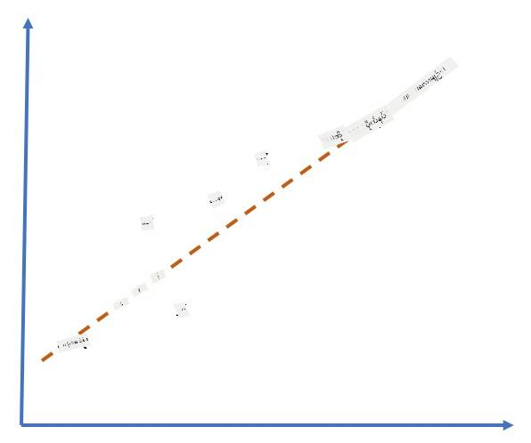
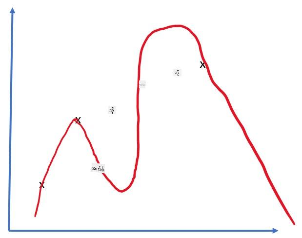

<!--
CO_OP_TRANSLATOR_METADATA:
{
  "original_hash": "2b544f20b796402507fb05a0df893323",
  "translation_date": "2025-08-25T23:54:18+00:00",
  "source_file": "lessons/3-NeuralNetworks/05-Frameworks/README.md",
  "language_code": "my"
}
-->
# နယူးရယ်နက်ဝက်ဖရိမ်းဝက်များ

ကျွန်တော်တို့လေ့လာပြီးသားအတိုင်း နယူးရယ်နက်ဝက်များကို ထိရောက်စွာလေ့ကျင့်နိုင်ရန်အတွက် အရေးကြီးသောအချက်နှစ်ချက်ရှိပါတယ်-

* Tensor များပေါ်တွင် လုပ်ဆောင်ရန်၊ ဥပမာ- တိုးမြှင့်ခြင်း၊ ပေါင်းခြင်း၊ sigmoid သို့မဟုတ် softmax ကဲ့သို့သော အချို့သော function များကိုတွက်ချက်ရန်
* Gradient descent optimization ကိုလုပ်ဆောင်ရန်အတွက် expression အားလုံး၏ gradient များကိုတွက်ချက်ရန်

## [Pre-lecture quiz](https://red-field-0a6ddfd03.1.azurestaticapps.net/quiz/105)

`numpy` library သည် ပထမအချက်ကိုလုပ်ဆောင်နိုင်သော်လည်း gradient များကိုတွက်ချက်ရန်အတွက် mechanism တစ်ခုလိုအပ်ပါတယ်။ [ကျွန်တော်တို့ဖရိမ်းဝက်](../../../../../lessons/3-NeuralNetworks/04-OwnFramework/OwnFramework.ipynb) တွင် ကျွန်တော်တို့သည် `backward` method အတွင်း derivative function အားလုံးကို လက်ဖြင့်ရေးသားရပြီး backpropagation ကိုလုပ်ဆောင်ခဲ့ရပါတယ်။ အကောင်းဆုံးအားဖြင့် ဖရိမ်းဝက်သည် ကျွန်တော်တို့သတ်မှတ်နိုင်သည့် *မည်သည့် expression* ၏ gradient များကိုမဆိုတွက်ချက်နိုင်စေရန် အခွင့်အလမ်းပေးသင့်ပါတယ်။

နောက်ထပ်အရေးကြီးသောအချက်တစ်ချက်မှာ GPU သို့မဟုတ် [TPU](https://en.wikipedia.org/wiki/Tensor_Processing_Unit) ကဲ့သို့သော အထူးပြု compute unit များပေါ်တွင်တွက်ချက်မှုများကိုလုပ်ဆောင်နိုင်ရမည်ဖြစ်သည်။ နက်ရှိုင်းသောနယူးရယ်နက်လေ့ကျင့်မှုသည် *အလွန်များသော* တိုင်းတာမှုများကိုလိုအပ်ပြီး GPU များပေါ်တွင် computation များကို parallelize လုပ်နိုင်ရန်အရေးကြီးပါတယ်။

> ✅ 'parallelize' ဆိုသည်မှာ တိုင်းတာမှုများကို စက်ပစ္စည်းများစွာပေါ်တွင် ဖြန့်ဝေခြင်းကိုဆိုလိုသည်။

လက်ရှိတွင် နယူးရယ်ဖရိမ်းဝက်များအနက် အများဆုံးလူကြိုက်များသောနှစ်ခုမှာ [TensorFlow](http://TensorFlow.org) နှင့် [PyTorch](https://pytorch.org/) တို့ဖြစ်သည်။ နှစ်ခုစလုံးသည် CPU နှင့် GPU နှစ်ခုစလုံးပေါ်တွင် tensor များနှင့်အလုပ်လုပ်ရန်အတွက် low-level API ကိုပေးသည်။ Low-level API အပေါ်တွင် [Keras](https://keras.io/) နှင့် [PyTorch Lightning](https://pytorchlightning.ai/) ဟုခေါ်သော high-level API ကိုလည်းပေးထားသည်။

Low-Level API | [TensorFlow](http://TensorFlow.org) | [PyTorch](https://pytorch.org/)
--------------|-------------------------------------|--------------------------------
High-level API| [Keras](https://keras.io/) | [PyTorch Lightning](https://pytorchlightning.ai/)

**Low-level APIs** တွင် **computational graphs** ဟုခေါ်သောအရာကိုတည်ဆောက်နိုင်သည်။ ဤ graph သည် input parameters များဖြင့် output (အများအားဖြင့် loss function) ကိုတွက်ချက်ရန်အတွက် သတ်မှတ်ထားပြီး GPU ပေါ်တွင်တွက်ချက်ရန်ပို့နိုင်သည်။ ဤ computational graph ကို differentiate လုပ်ပြီး gradient များကိုတွက်ချက်နိုင်သော function များလည်းရှိပြီး model parameters များကို optimize လုပ်ရန်အသုံးပြုနိုင်သည်။

**High-level APIs** တွင် နယူးရယ်နက်များကို **အလွှာများ၏အဆက်အစပ်** အဖြစ်သတ်မှတ်ပြီး နယူးရယ်နက်များကိုတည်ဆောက်ရန်ပိုမိုလွယ်ကူစေသည်။ Model ကိုလေ့ကျင့်ရန်အတွက် အချက်အလက်များကိုပြင်ဆင်ပြီး `fit` function ကိုခေါ်ရန်သာလိုအပ်သည်။

High-level API သည် နယူးရယ်နက်များကို အလွယ်တကူတည်ဆောက်နိုင်စေသော်လည်း Low-level API သည် လေ့ကျင့်မှုလုပ်ငန်းစဉ်ကိုပိုမိုထိန်းချုပ်နိုင်စေပြီး နယူးရယ်နက် architecture အသစ်များနှင့်အလုပ်လုပ်သောအခါတွင် အထူးအသုံးဝင်သည်။

Low-level API နှင့် High-level API ကိုအတူတူအသုံးပြုနိုင်သည်ကိုလည်းနားလည်ရမည်။ ဥပမာ- Low-level API ကိုအသုံးပြု၍ သင့်ကိုယ်ပိုင် network layer architecture တစ်ခုတည်ဆောက်ပြီး High-level API ဖြင့်တည်ဆောက်ထားသော network အတွင်း၌အသုံးပြုနိုင်သည်။ ဒါမှမဟုတ် High-level API ကိုအသုံးပြု၍ အလွှာများ၏အဆက်အစပ်အဖြစ် network တစ်ခုကိုသတ်မှတ်ပြီး သင့်ကိုယ်ပိုင် Low-level training loop ကိုအသုံးပြု၍ optimization လုပ်နိုင်သည်။ API နှစ်ခုစလုံးသည် အခြေခံအယူအဆတူညီပြီး အတူတူအလုပ်လုပ်ရန်အတွက်ဒီဇိုင်းထုတ်ထားသည်။

## လေ့လာမှု

ဤသင်တန်းတွင် PyTorch နှင့် TensorFlow နှစ်ခုစလုံးအတွက် အကြောင်းအရာများကိုပေးထားသည်။ သင့်နှစ်သက်သောဖရိမ်းဝက်ကိုရွေးချယ်ပြီး သက်ဆိုင်ရာ notebook များကိုသာလေ့လာနိုင်သည်။ မည်သည့်ဖရိမ်းဝက်ကိုရွေးချယ်ရမည်ဆိုသည်ကိုမသေချာပါက **PyTorch vs. TensorFlow** အကြောင်းအင်တာနက်တွင်ဆွေးနွေးချက်များကိုဖတ်ရှုပါ။ ဖရိမ်းဝက်နှစ်ခုစလုံးကိုကြည့်ရှု၍ ပိုမိုနားလည်နိုင်ပါသည်။

အခွင့်အလမ်းရှိသလောက် High-Level APIs ကိုရိုးရှင်းစွာအသုံးပြုမည်ဖြစ်သည်။ သို့သော် နယူးရယ်နက်များသည် အခြေခံမှစ၍ မည်သို့အလုပ်လုပ်သည်ကိုနားလည်ရန်အရေးကြီးသည်ဟုကျွန်တော်တို့ယုံကြည်ပါသည်။ ထို့ကြောင့် စတင်ရာတွင် Low-level API နှင့် tensor များဖြင့်အလုပ်လုပ်ခြင်းမှစတင်ပါမည်။ သို့သော် သင်အမြန်စတင်လိုပြီး ဤအသေးစိတ်အချက်များကိုလေ့လာရန်အချိန်မကုန်ချင်ပါက High-level API notebook များသို့တိုက်ရိုက်သွားနိုင်ပါသည်။

## ✍️ လေ့ကျင့်မှု: ဖရိမ်းဝက်များ

အောက်ပါ notebook များတွင် သင်ကြားမှုကိုဆက်လက်လုပ်ဆောင်ပါ-

Low-Level API | [TensorFlow+Keras Notebook](../../../../../lessons/3-NeuralNetworks/05-Frameworks/IntroKerasTF.ipynb) | [PyTorch](../../../../../lessons/3-NeuralNetworks/05-Frameworks/IntroPyTorch.ipynb)
--------------|-------------------------------------|--------------------------------
High-level API| [Keras](../../../../../lessons/3-NeuralNetworks/05-Frameworks/IntroKeras.ipynb) | *PyTorch Lightning*

ဖရိမ်းဝက်များကိုကျွမ်းကျင်ပြီးပါက overfitting ၏အယူအဆကိုပြန်လည်သုံးသပ်ပါ။

# Overfitting

Overfitting သည် စက်လေ့ကျင့်မှုတွင် အလွန်အရေးကြီးသောအယူအဆတစ်ခုဖြစ်ပြီး မှန်ကန်စွာနားလည်ရမည်ဖြစ်သည်။

အောက်ပါ ၅ ခုသောအမှတ်များကို (graph များပေါ်တွင် `x` ဖြင့်ဖော်ပြထားသည်) approximation ပြုလုပ်ရန်ပြဿနာကိုစဉ်းစားကြည့်ပါ-

 | 
-------------------------|--------------------------
**Linear model, 2 parameters** | **Non-linear model, 7 parameters**
Training error = 5.3 | Training error = 0
Validation error = 5.1 | Validation error = 20

* ဘယ်ဘက်တွင် parameters အရေအတွက်သင့်တော်သောကြောင့် model သည် point distribution ၏အဓိပ္ပာယ်ကိုမှန်ကန်စွာနားလည်သည်။
* ညာဘက်တွင် model သည် အလွန်အစွမ်းထက်သည်။ ၅ ခုသောအမှတ်များသာရှိပြီး model တွင် parameters ၇ ခုရှိသောကြောင့် အမှတ်အားလုံးကိုဖြတ်သွားရန်အလွယ်တကူညှိနိုင်သည်။ ထို့ကြောင့် training error သည် 0 ဖြစ်သော်လည်း data ၏မှန်ကန်သော pattern ကိုနားလည်ရန်မအောင်မြင်သဖြင့် validation error သည်အလွန်မြင့်မားသည်။

Model ၏အစွမ်းအင် (parameters အရေအတွက်) နှင့် training samples အရေအတွက်အကြားမှန်ကန်သောချိန်ခွင့်ကိုရရှိရန်အရေးကြီးသည်။

## Overfitting ဖြစ်ပေါ်ရခြင်း၏အကြောင်းရင်းများ

  * Training data မလုံလောက်ခြင်း
  * Model အလွန်အစွမ်းထက်ခြင်း
  * Input data တွင်ဆူညံသံများအလွန်များခြင်း

## Overfitting ကိုမည်သို့သိရှိရမည်

အထက်ပါ graph မှကြည့်နိုင်သည့်အတိုင်း Overfitting ကို training error အလွန်နိမ့်ပြီး validation error အလွန်မြင့်ခြင်းဖြင့်သိနိုင်သည်။ Training အတွင်း training နှင့် validation error နှစ်ခုစလုံးလျော့နည်းလာပြီး တစ်ချိန်တွင် validation error သည်လျော့နည်းမှုရပ်ပြီး တက်လာနိုင်သည်။ ဤသည်မှာ Overfitting ဖြစ်ပေါ်နေကြောင်းပြသပြီး training ကိုရပ်ရန်သင့်တော်သောအချိန်ဖြစ်သည် (သို့မဟုတ် model ၏ snapshot တစ်ခုကိုယူထားရန်လိုအပ်သည်)။

## Overfitting ကိုမည်သို့ကာကွယ်ရမည်

Overfitting ဖြစ်ပေါ်နေကြောင်းမြင်နိုင်ပါက အောက်ပါအရာများကိုလုပ်ဆောင်နိုင်သည်-

 * Training data အရေအတွက်ကိုတိုးမြှင့်ပါ
 * Model ၏စိုက်ထုတ်မှုကိုလျော့ချပါ
 * [Dropout](../../4-ComputerVision/08-TransferLearning/TrainingTricks.md#Dropout) ကဲ့သို့သော [regularization technique](../../4-ComputerVision/08-TransferLearning/TrainingTricks.md) တစ်ခုကိုအသုံးပြုပါ၊ ဤအကြောင်းကိုနောက်ပိုင်းတွင်ဆွေးနွေးမည်။

## Overfitting နှင့် Bias-Variance Tradeoff

Overfitting သည် စာရင်းအင်းသိပ္ပံတွင် [Bias-Variance Tradeoff](https://en.wikipedia.org/wiki/Bias%E2%80%93variance_tradeoff) ဟုခေါ်သော ပိုမိုအထွေထွေပြဿနာတစ်ခု၏အခြေအနေတစ်ခုဖြစ်သည်။ Model ၏ error ရင်းမြစ်များကိုစဉ်းစားပါက error နှစ်မျိုးကိုတွေ့နိုင်သည်-

* **Bias errors** သည် training data နှင့် model ၏ဆက်ဆံရေးကိုမှန်ကန်စွာဖမ်းမိနိုင်ခြင်းမရှိခြင်းကြောင့်ဖြစ်ပေါ်သည်။ Model ၏အစွမ်းအင်မလုံလောက်ခြင်း (**underfitting**) ကြောင့်ဖြစ်နိုင်သည်။
* **Variance errors** သည် input data တွင်ဆူညံသံကိုမှန်ကန်သောဆက်ဆံရေးအစား approximation ပြုလုပ်ခြင်းကြောင့်ဖြစ်ပေါ်သည် (**overfitting**)။

Training အတွင်း bias error သည်လျော့နည်းလာပြီး (model သည် data ကို approximation ပြုလုပ်သည့်အခါ) variance error သည်တိုးလာသည်။ Overfitting ကိုကာကွယ်ရန် training ကိုလက်ဖြင့် (သို့မဟုတ် regularization ကိုအသုံးပြု၍ အလိုအလျောက်) ရပ်တန့်ရန်အရေးကြီးသည်။

## နိဂုံးချုပ်

ဤသင်ခန်းစာတွင် AI ဖရိမ်းဝက်နှစ်ခုဖြစ်သည့် TensorFlow နှင့် PyTorch ၏ API များအကြားကွာခြားချက်များကိုလေ့လာခဲ့ပါသည်။ ထို့အပြင် Overfitting ဟုခေါ်သောအရေးကြီးသောအကြောင်းအရာတစ်ခုကိုလည်းလေ့လာခဲ့ပါသည်။

## 🚀 စိန်ခေါ်မှု

အတူတူပါဝင်သော notebook များတွင် 'tasks' များကိုအောက်ဆုံးတွင်တွေ့နိုင်ပါသည်။ Notebook များကိုလုပ်ဆောင်ပြီး tasks များကိုပြီးမြောက်ပါ။

## [Post-lecture quiz](https://red-field-0a6ddfd03.1.azurestaticapps.net/quiz/205)

## ပြန်လည်သုံးသပ်ခြင်းနှင့် ကိုယ်တိုင်လေ့လာခြင်း

အောက်ပါအကြောင်းအရာများကိုလေ့လာပါ-

- TensorFlow
- PyTorch
- Overfitting

ကိုယ်တိုင်ကိုယ်တိုင်အောက်ပါမေးခွန်းများကိုမေးပါ-

- TensorFlow နှင့် PyTorch အကြားကွာခြားချက်ကဘာလဲ?
- Overfitting နှင့် Underfitting အကြားကွာခြားချက်ကဘာလဲ?

## [Assignment](lab/README.md)

ဤ lab တွင် PyTorch သို့မဟုတ် TensorFlow ကိုအသုံးပြု၍ single-layer နှင့် multi-layered fully-connected networks နှစ်မျိုးစလုံးဖြင့် classification ပြဿနာနှစ်ခုကိုဖြေရှင်းရန်လိုအပ်သည်။

* [ညွှန်ကြားချက်များ](lab/README.md)
* [Notebook](../../../../../lessons/3-NeuralNetworks/05-Frameworks/lab/LabFrameworks.ipynb)

**အကြောင်းကြားချက်**:  
ဤစာရွက်စာတမ်းကို AI ဘာသာပြန်ဝန်ဆောင်မှု [Co-op Translator](https://github.com/Azure/co-op-translator) ကို အသုံးပြု၍ ဘာသာပြန်ထားပါသည်။ ကျွန်ုပ်တို့သည် တိကျမှုအတွက် ကြိုးစားနေသော်လည်း၊ အလိုအလျောက် ဘာသာပြန်မှုများတွင် အမှားများ သို့မဟုတ် မမှန်ကန်မှုများ ပါဝင်နိုင်သည်ကို သတိပြုပါ။ မူရင်းစာရွက်စာတမ်းကို ၎င်း၏ မူရင်းဘာသာစကားဖြင့် အာဏာတရားရှိသော အရင်းအမြစ်အဖြစ် သတ်မှတ်သင့်ပါသည်။ အရေးကြီးသော အချက်အလက်များအတွက် လူ့ဘာသာပြန်ပညာရှင်များမှ ပရော်ဖက်ရှင်နယ် ဘာသာပြန်မှုကို အကြံပြုပါသည်။ ဤဘာသာပြန်မှုကို အသုံးပြုခြင်းမှ ဖြစ်ပေါ်လာသော အလွဲအလွတ်များ သို့မဟုတ် အနားလွဲမှုများအတွက် ကျွန်ုပ်တို့သည် တာဝန်မယူပါ။