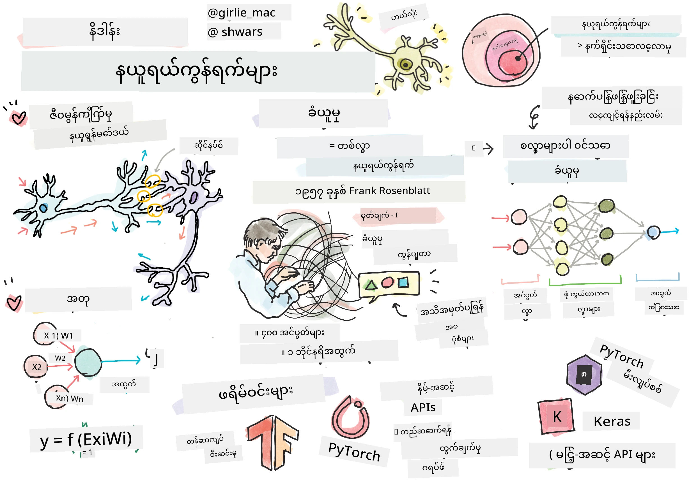
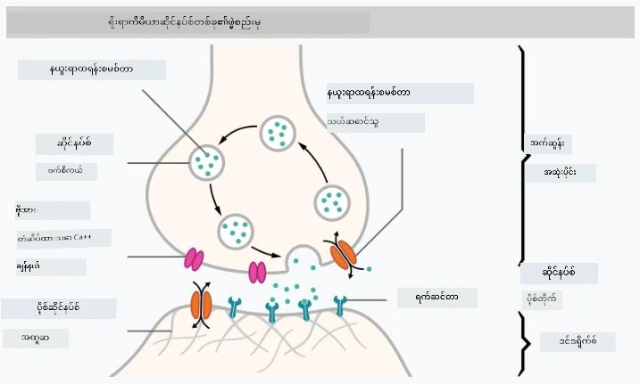
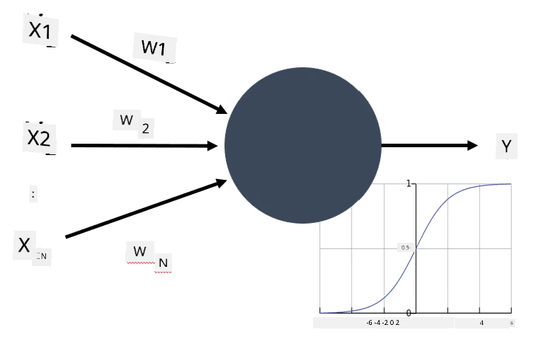

# နယူးရယ်နက်ဝါ့ခ်များအကြောင်း အကျဉ်းချုပ်

ကျွန်ုပ်တို့ အကျဉ်းချုပ်တွင် ဆွေးနွေးခဲ့သည့်အတိုင်း၊ ဉာဏ်ရည်ကို ရရှိစေရန် နည်းလမ်းတစ်ခုမှာ **ကွန်ပျူတာမော်ဒယ်** သို့မဟုတ် **အတုဉာဏ်ရည်** တစ်ခုကို လေ့ကျင့်ခြင်းဖြစ်သည်။ ၂၀ ရာစု အလယ်ပိုင်းမှစ၍ သုတေသနပြုသူများသည် သင်္ချာမော်ဒယ်အမျိုးမျိုးကို စမ်းသပ်ခဲ့ကြပြီး၊ မကြာသေးမီနှစ်များတွင် ဤလမ်းကြောင်းသည် အလွန်အောင်မြင်ကြောင်း သက်သေပြခဲ့သည်။ ဉာဏ်ရည်၏ သင်္ချာမော်ဒယ်များကို **နယူးရယ်နက်ဝါ့ခ်များ** ဟု ခေါ်သည်။

> တခါတရံတွင် နယူးရယ်နက်ဝါ့ခ်များကို *Artificial Neural Networks* (ANNs) ဟု ခေါ်ကြပြီး၊ ၎င်းသည် အမှန်တကယ်သော နယူးရွန်များ၏ နက်ဝါ့ခ်မဟုတ်ဘဲ မော်ဒယ်များသာဖြစ်ကြောင်း ဖော်ပြရန်ဖြစ်သည်။

## မက်ရှင်းလေန်နင်း

နယူးရယ်နက်ဝါ့ခ်များသည် **မက်ရှင်းလေန်နင်း** ဟုခေါ်သော အကြီးမားဆုံးဘာသာရပ်တစ်ခု၏ အစိတ်အပိုင်းတစ်ခုဖြစ်ပြီး၊ ၎င်း၏ရည်မှန်းချက်မှာ ဒေတာကို အသုံးပြု၍ ပြဿနာများကို ဖြေရှင်းနိုင်သော ကွန်ပျူတာမော်ဒယ်များကို လေ့ကျင့်ခြင်းဖြစ်သည်။ မက်ရှင်းလေန်နင်းသည် အတုဉာဏ်ရည်၏ အကြီးမားဆုံးအစိတ်အပိုင်းတစ်ခုဖြစ်သော်လည်း၊ ဤသင်ရိုး၌ ရိုးရာမက်ရှင်းလေန်နင်းကို မဖော်ပြပါ။

> ရိုးရာမက်ရှင်းလေန်နင်းအကြောင်း ပိုမိုလေ့လာရန် ကျွန်ုပ်တို့၏ **[Machine Learning for Beginners](http://github.com/microsoft/ml-for-beginners)** သင်ရိုးကို ကြည့်ပါ။

မက်ရှင်းလေန်နင်းတွင်၊ ကျွန်ုပ်တို့တွင် **X** ဟုခေါ်သော ဥပမာဒေတာစနစ်တစ်ခုနှင့် **Y** ဟုခေါ်သော ဆက်စပ်ထွက်ရှိမှုတန်ဖိုးများရှိသည်ဟု သတ်မှတ်သည်။ ဥပမာများသည် အများအားဖြင့် **အင်္ဂါရပ်များ** ပါဝင်သော N-အတိုင်းအတာဗက်တာများဖြစ်ပြီး၊ ထွက်ရှိမှုများကို **တံဆိပ်များ** ဟုခေါ်သည်။

ကျွန်ုပ်တို့သည် မက်ရှင်းလေန်နင်းပြဿနာများအနက် အများဆုံးတွေ့ရသော နှစ်ခုကို စဉ်းစားပါမည်-

* **ခွဲခြားခြင်း** (Classification) - ထည့်သွင်းထားသော အရာဝတ္ထုကို အတန်းနှစ်ခု သို့မဟုတ် အတန်းများစွာအတွင်း ခွဲခြားရမည်။
* **ပြန်လည်ခန့်မှန်းခြင်း** (Regression) - ထည့်သွင်းထားသော ဥပမာတစ်ခုစီအတွက် ကိန်းဂဏန်းတစ်ခုကို ခန့်မှန်းရမည်။

> ထည့်သွင်းမှုများနှင့် ထွက်ရှိမှုများကို တန်ဆာများအဖြစ် ကိုယ်စားပြုသောအခါ၊ ထည့်သွင်းဒေတာစနစ်သည် M&times;N အရွယ်အစားရှိသော မက်ထရစ်ဖြစ်ပြီး၊ M သည် ဥပမာအရေအတွက်ဖြစ်ကာ N သည် အင်္ဂါရပ်အရေအတွက်ဖြစ်သည်။ ထွက်ရှိမှုတံဆိပ်များ Y သည် M အရွယ်အစားရှိသော ဗက်တာဖြစ်သည်။

ဤသင်ရိုး၌၊ ကျွန်ုပ်တို့သည် နယူးရယ်နက်ဝါ့ခ်မော်ဒယ်များကိုသာ အာရုံစိုက်ပါမည်။

## နယူးရွန်၏ မော်ဒယ်

ဇီဝဗေဒမှ ကျွန်ုပ်တို့သိရှိထားသည်မှာ၊ ကျွန်ုပ်တို့၏ ဦးနှောက်သည် နယူးရွန်ဆဲလ်များ (neurons) ဖြင့် ဖွဲ့စည်းထားပြီး၊ ၎င်းတို့တွင် "ထည့်သွင်းမှုများ" (dendrites) အများအပြားနှင့် "ထွက်ရှိမှု" (axon) တစ်ခုရှိသည်။ Dendrites နှင့် Axons နှစ်ခုစလုံးသည် လျှပ်စစ်သံကို သယ်ဆောင်နိုင်ပြီး၊ ၎င်းတို့အကြားရှိ ဆက်သွယ်မှုများ — synapses ဟုခေါ်သည် — သည် လျှပ်စစ်သံသယ်ဆောင်နိုင်စွမ်းအမျိုးမျိုးကို ပြသနိုင်ပြီး၊ ၎င်းတို့ကို neurotransmitters များက ထိန်းညှိသည်။

 | 
----|----
အမှန်တကယ် နယူးရွန် *([ပုံ](https://en.wikipedia.org/wiki/Synapse#/media/File:SynapseSchematic_lines.svg) Wikipedia မှ)* | အတုနယူးရွန် *(ရေးသားသူမှ ပုံဆွဲသည်)*

ထို့ကြောင့်၊ နယူးရွန်၏ အလွယ်ဆုံး သင်္ချာမော်ဒယ်တွင် ထည့်သွင်းမှုများ X1, ..., XN နှင့် ထွက်ရှိမှု Y တို့နှင့် အလေးချိန်များ W1, ..., WN တို့ပါဝင်သည်။ ထွက်ရှိမှုကို အောက်ပါအတိုင်းတွက်ချက်သည်-

ဤတွင် f သည် အချို့သော မလိုက်လျောသော **activation function** ဖြစ်သည်။

> နယူးရွန်၏ စောင့်ရှောက်မော်ဒယ်များကို 1943 ခုနှစ်တွင် Warren McCullock နှင့် Walter Pitts တို့၏ [A logical calculus of the ideas immanent in nervous activity](https://www.cs.cmu.edu/~./epxing/Class/10715/reading/McCulloch.and.Pitts.pdf) ဟုခေါ်သော ရှေးဟောင်းစာတမ်းတွင် ဖော်ပြခဲ့သည်။ Donald Hebb သည် ၎င်း၏စာအုပ် "[The Organization of Behavior: A Neuropsychological Theory](https://books.google.com/books?id=VNetYrB8EBoC)" တွင် ဤနက်ဝါ့ခ်များကို လေ့ကျင့်နိုင်သော နည်းလမ်းကို အကြံပြုခဲ့သည်။

## ဤအပိုင်းတွင်

ဤအပိုင်းတွင် ကျွန်ုပ်တို့သည် အောက်ပါအကြောင်းအရာများကို လေ့လာမည်-

* [Perceptron](03-Perceptron/README.md) - နှစ်တန်းခွဲခြားမှုအတွက် အစောဆုံးနယူးရယ်နက်ဝါ့ခ်မော်ဒယ်များထဲမှ တစ်ခု
* [Multi-layered networks](04-OwnFramework/README.md) နှင့် [ကျွန်ုပ်တို့၏ကိုယ်ပိုင် framework တည်ဆောက်နည်း](04-OwnFramework/OwnFramework.ipynb) အတွက် notebook တစ်ခု
* [Neural Network Frameworks](05-Frameworks/README.md) - [PyTorch](05-Frameworks/IntroPyTorch.ipynb) နှင့် [Keras/Tensorflow](05-Frameworks/IntroKerasTF.ipynb) အတွက် notebooks များ
* [Overfitting](../../../../lessons/3-NeuralNetworks/05-Frameworks)

---

**အကြောင်းကြားချက်**:  
ဤစာရွက်စာတမ်းကို AI ဘာသာပြန်ဝန်ဆောင်မှု [Co-op Translator](https://github.com/Azure/co-op-translator) ကို အသုံးပြု၍ ဘာသာပြန်ထားပါသည်။ ကျွန်ုပ်တို့သည် တိကျမှုအတွက် ကြိုးစားနေသော်လည်း အလိုအလျောက် ဘာသာပြန်မှုများတွင် အမှားများ သို့မဟုတ် မတိကျမှုများ ပါရှိနိုင်သည်ကို သတိပြုပါ။ မူရင်းဘာသာစကားဖြင့် ရေးသားထားသော စာရွက်စာတမ်းကို အာဏာတရ အရင်းအမြစ်အဖြစ် သတ်မှတ်သင့်ပါသည်။ အရေးကြီးသော အချက်အလက်များအတွက် လူ့ဘာသာပြန်ပညာရှင်များမှ ဘာသာပြန်မှုကို အကြံပြုပါသည်။ ဤဘာသာပြန်မှုကို အသုံးပြုခြင်းမှ ဖြစ်ပေါ်လာသော အလွဲသုံးစားမှု သို့မဟုတ် အနားလွဲမှုများအတွက် ကျွန်ုပ်တို့သည် တာဝန်မယူပါ။